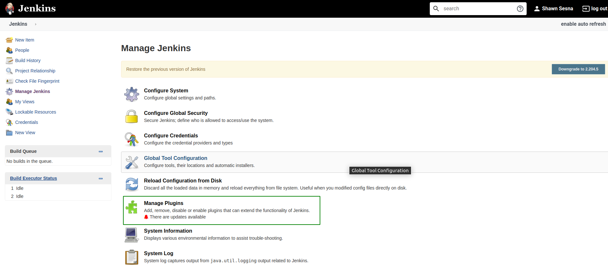
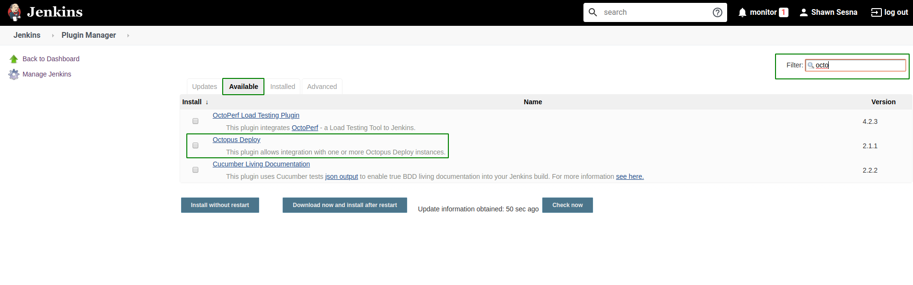
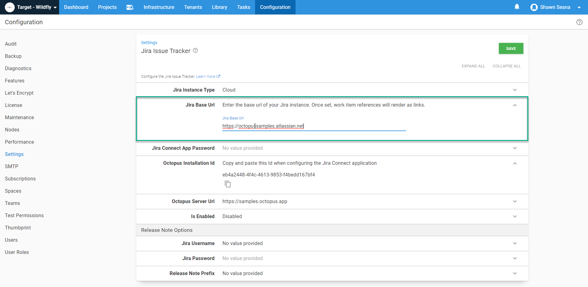
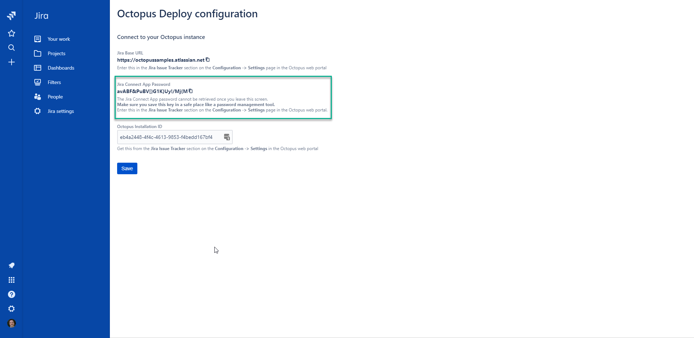
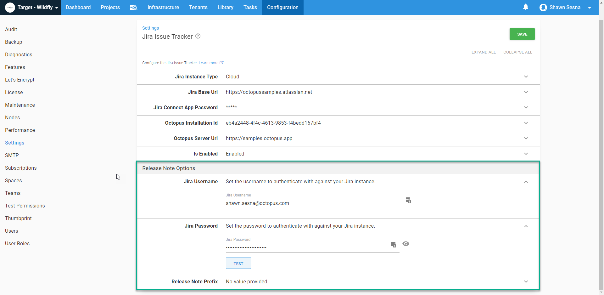
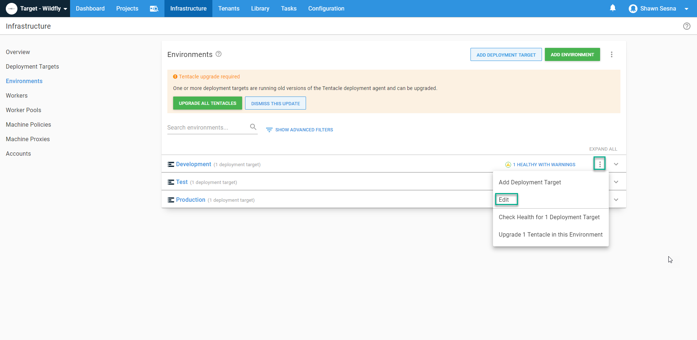
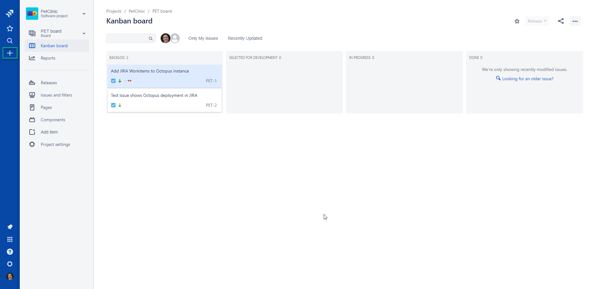
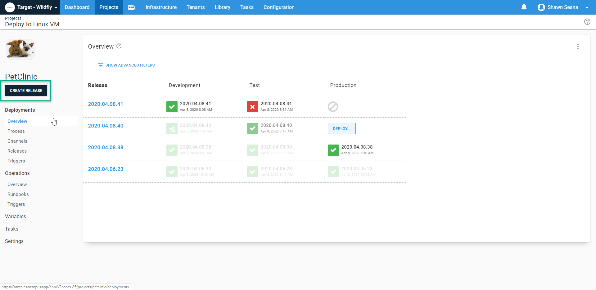
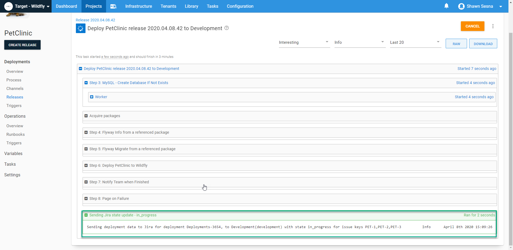

DevOps adoption has dramatically increased in recent years as people recognize the benefits it offers.  Integration of Continuous Integration (CI) solutions with Continuous Delivery (CD) solutions are now commonplace, though few provide any input to the continuous feedback loop of DevOps.  In this post, I will show you how to integrate Jenkins, Octopus Deploy, and Jira to provide a solution that will hook into the continuous feedback loop.

## Jenkins Octopus Deploy plugin
An Octopus Deploy plugin for Jenkins has existed for a number of years, however, this plugin was developed by the Jenkins community and not by Octopus Deploy.  In 2019, Octopus Deploy officially took over development and maintenance of the Jenkins plugin, implementing the same features that are avialable on other build platforms.

:::hint
Prior to Octopus Deploy taking ownership of the plugin, there was a security issue where passwords were stored in plain text.  This is no longer the case and the warning that Jenkins would display has since been removed.
:::

### Installation of the Octopus Deploy plugin
Installation of the Octopus Deploy plugin is no different than installing any other plugin for Jenkins.  From the landing page in Jenkins, click Manage Jenkins


From here, click on Manage Plugins



Click on the `Available` tab, then filter by Octo.  Tick the box next to Octopus Deploy and then choose either `Install without restart` or `Download now and install after restart`.



Once the plugin has been installed, you will have access to the following build tasks
- Octopus Deploy: Package application
- Octopus Deploy: Push packages
- Octopus Deploy: Push build information

Along with those build tasks, you will also have the following Post Build tasks
- Octopus Deploy: Create Release
- Octopus Deploy: Deploy Release

:::hint
The Jenkins plugin differs from Azure DevOps, TeamCity, and Bamboo in that Create Release and Deploy Release are only available as Post build actions.  Jenkins only allows one of each type of Post build action type, meaning you cannot have more than one Create Release action per build definition.  
:::

#### Configure Octopus Deploy Server connection
A number of the Octopus Deploy steps require a connection to be configured.  To configure a connection, click on `Manage Jenkins`, then `Configure System`


Scroll down to the `Octopus Deploy Plugin` and click `Add Octopus Deploy Server`


Add your Octopus Server details and click Save.


#### Octopus Deploy CLI
The Octopus Deploy plugin contains all of the commands necessary to perform the actions, but it still relies on the [Octopus Deploy CLI](https://octopus.com/downloads) being present on the build agent.  Once you've downloaded the CLI and extracted it to a folder, we'll need to configure Jenkins so that it knows it's there.

Click on Manage Jenkins, then Global Tool Configuration


Scroll to the Octopus Deploy CLI section and click on Add Octopus Tool


Fill in where the cli is located and give the tool a name


### Example build
For this post, I'm building the PetClinic application which is a Java application using MySQL as a backend.  

#### Build setup
To start, we'll select a New Item from the Jenkins menu


Give your project a name and slect `Maven project`


Once you click `OK` you will be brought to the configuration screen for your build definition.

:::hint
I've configured my build to create a unique version number based on some parameters.  This version number will be stamped on the artifacts of the build that are later pushed to Octopus Deploy.  I've installed a couple of Jenkins plugins to make this work
- Build Name and Description Setter
- Date Parameter Plugin
:::

Under the `General Tab`, check the box `This project is parameterized`.


The required parameters of our build are (all `String` parameters):
- DatabaseName: #{Project.MySql.Database.Name}
- DatabaseServerName: #{MySql.Database.Server.Name}
- DatabaseUserName: #{Project.MySql.Database.User.Name}
- DatabaseUserPassword: #{Project.MySql.Database.User.Password}

Optional parameters are (these are used to construct the version number, ie: 1.0.2098.101603):
- Major (String): 1
- Minor (String): 0
- Year (Date):
  - Date Format: yy
  - Default Value: LocalDate.now();
- DayOfYear (Date):
  - Date Format: D
  - Default Value: LocalDate.now();
- Time (Date):
  - Date Format: HHmmss
  - LocalDate.now();


With our parameters defined, let's hook the build into source control.  I'll be using the PetClinic public Bitbucket repo for this build:
https://twerthi@bitbucket.org/octopussamples/petclinic.git.  Click on or scroll to `Source Code Management`.  Choose Git and enter the url to the repo.


Under the `Build Environment` tab, check the box `Set Build Name`.  This feature allows us to configure the build name to be the version number that we've configured with our parmaters (if you used the optional ones).  Set the `Build Name` to `${MAJOR}.${MINOR}.${YEAR}${DAYOFYEAR}.${TIME}`


#### Build steps
Since we chose a Maven build, Jenkins creates the build step for us.  All we need to do is fill in the Goals and options:
```
clean package -Dproject.versionNumber=${BUILD_DISPLAY_NAME} -DdatabaseServerName=${DatabaseServerName} -DdatabaseName=${DatabaseName} -DskipTests -DdatabaseUserName=${DatabaseUserName} -DdatabaseUserPassword=${DatabaseUserPassword}
```

Breakdown of command:
- clean: clean the project and remove all files generated by the previous build
- package: package compiled source code into the distributable format (jar, war, …)
- -D: parameters passed into the build


This step builds a .war file with the name petclinic.web.Version.war.  The package ID in this case is `petclinic.web`.

#### Post Steps
The remainder of our steps will be in the Post steps section of our build definition.  Here is where we're going to package up the Flyway project for the MySQL database backend, push the packages and build information to Octopus Deploy, then create our Release.

In the Post Steps tab, click on Add post-build step and select `Octopus: package application`


Fill in the details of the task: 
 - Package ID: petclinic.mysql.flyway
 - Version number: ${BUILD_DISPLAY_NAME} (this is the version number we configured through Parameters and set via the Set Build Name option from above)
 - Package format: zip|nuget
 - Package base folder: ${WORKSPACE}\flyway (ignore the warning, it works fine)
 - Package include paths:  Nothing here for this project
 - Package output folder: ${WORKSPACE}

 

 Next up is the Push step!  Just like the previous step, click on `Add post-build step` and chose `Octopus Deploy: push packages`

 

Choose the Octopus Deploy Server connection we created during configuration, then the Space you'd like to push to (if no Space is specified, the default Space will be used).  Lastly, add the paths to the packages to be pushed.  This step accepts wildcard formats.  The starting folder for the path is ${WORKSPACE} so there's no reason to specify that (in fact it'll fail if you do)

In the `Octopus Deploy: package application` step for Flyway we defined above, we told the step to place the package in the ${WORKSPACE} folder.  The Maven build places the built .war file in `/target/` folder, so our Package Paths folder values are

```
/*.nupkg
/target/*.war
```


That takes are of pushing the packages, let's push some build information!  Just like before, click on `Add post-build step` and choose `Octopus Deploy: Push build information`.  This step is where release notes from Jira would show up.


Fill in the following details
- Octopus Server: Server connection defined previously
- Space: The space you've pushed the packages
- Package IDs
  - petclinic.web
  - petclinic.mysql.flyway
- Version Number: ${BUILD_DISPLAY_NAME}


#### Build definition complete
In this build defintion, we've integrated Jenkins with Octopus Deploy.  Not only that, we've configured the Jenkins build to retrieve the release notes from Bitbucket so they'll appear in Octopus Deploy!  Let's head over to Jira and get that integration configured.

## Jira Integration with Octopus Deploy
Octopus Deploy has developed an integration with Jira Software so that as deployments occur, any issues referenced by the commit messages can call back to Jira and provide updates to as to where in the pipeline the fix for the issue has been deployed.

### Add the Octopus Deploy app in Jira
Octopus Deploy has created an app in the Jara Marketplace for ease of integration.  From the landing page of Jira Software, click on `Jira Settings`


Click `Apps`


Click `Find new apps`


Filter by Octo and choose Octopus Deploy for Jira


Click on `Get app`


Click `Get it now`


Once you receive the message that it has been successfully installed, click on `Get started`


### Configure Jira and Octopus Deploy integration
On this screen, we're going to need to bounce back and forth between Octopus Deploy and Jira.  

Before moving forward, let's bring up Octopus Deploy and get to the right screen to complete this integration.  From within Octopus Deploy, click on `Configuration`


Next, click on `Settings`


Click on `Jira Issue Tracker`


Copy the Octopus Installation Id


Paste that value into the Octopus Installation ID in Jira **Do not click Save yet**


Copy the Jira Base URL and paste that into the `Jira Base Url` field in Octopus Deploy




Now flip back to Jira and copy the `Jira Connect App password` and paste it into the `Jira Connect App Password` field in Octopus Deploy.




**Note** the `Test` button in Octopus Deploy will not work *until* you click `Save` in Jira first.


Now, let's go back to Octopus Deploy and test to make sure the connection works


At this point, we're done in Jira, but we have a couple more things to do in Octopus Deploy.  First, let's enable the integration in Octopus Deploy


Now lets configure Release Notes

Enter a Jira Username and password

:::hint
The `Jira Username` is your email address and the `Jira Password` is your API key
:::


Be sure to click Test to make sure the credentials are valid

### Environment mapping
As part of the integration with Jira, you have the ability to map Octopus Deploy Environments to Jira Environment Types.  To do this, click on the `Infrastructure` tab


Click on `Environments`


Edit the environment by clicking on the `elipses` for that envrionment and click `Edit`



Use the drop-down in the Jira Environment Type section to associate the Octopus Deploy environmen to the Jire Environmen type


Repeat this process for any other environments that you want mapped.

## Octopus Deploy project automatic release note creation
One of my colleagues showed me a neat trick for automation release note creation.  From within your Octopus project, click on Settings


Enter the following for the Release Notes Template

```
#{each package in Octopus.Release.Package}
- #{package.PackageId} #{package.Version}
#{each workItem in package.WorkItems}
    - [#{workItem.Id}](#{workItem.LinkUrl}) - #{workItem.Description}
#{/each}
#{/each}
```

Optionally you can enter the following for the Deployment Changes Template

```
#{each release in Octopus.Deployment.Changes}
**Release #{release.Version}**
#{release.ReleaseNotes}
#{/each}
```


## The feedback loop
With our integrations complete, it's time to see all of this working together!

### Create an issue in Jira Software
Let's create an issue in Jira, click on the `+` on the left hand side



Fill in the form for the issue and click `Create`


Take note of the ID that is created for the issue, we'll need this later.  For this post, it's `PET-3`.


### Create some commits
Commits show up in Octopus Deploy as Release Notes so you can see what's being deployed.  In addition, if you reference a Jira issue within the commit message, the commit will be logged to the issue within Jira.  When a deployment occurs, Octopus will update Jira as to the status.

Apply some commits to your repo, for this post I'll be adding the following:
- Updated pom.xml to use SSL version of https://repo.spring.io/milestone repo
- PET-3 - Updated datasource bean properties to prevent database connection timeouts
- Added bin folder to Flyway project to include built-in version of JRE


### Build the project
With the commits done, we can build the project. The Push Build Information step in our build definition will contain our commit messages.  Let's pop over to Jenkins and queue a build.

Click on `Build with Parameters`


Click `Build`


### Review Build Information in Octopus Deploy
When the build is complete, the information should now be in Octopus Deploy.  Click on `Library`


Click `Build Information`


Click on the `Highest version` link to view the Commits and Work Items (clicking on the package name also works, but there's an extra click in that you have to select the version afterwards).


Here we can see that the build came from a Jenkins build server, we can see the three commits that we did as well as the associated Work Item (PET-3).  Clicking on thet PET-3 link takes us to our Jira Issue.  As you can see, a few other commits came along for the ride :)


### Deploy the release
So far this integration is looking pretty sweet!  Deploying a release makes it even sweeter in that it will update Jira with the status!  Let's get a deployment to Development underway.  This post assumes you already know how to create a project, so we'll skip the project creation and deployment process steps

From within your Octopus Deploy project, click `CREATE RELEASE`.



After you click Save on the next screen, it will show the Release details.  On this screen we can see our Release notes and associated Build Information


When the release begins deploying, we can see it sent information to Jira



In Jira, we can see that the issue is currently being deployed to Development!


## Conclusion
Jenkins, Jira, and Octopus Depoloy are all powerful DevOps tools.  When you integrate the three together, you get a powerful DevOps solution that provides continuious feedback bo developers, operations, and business alike!