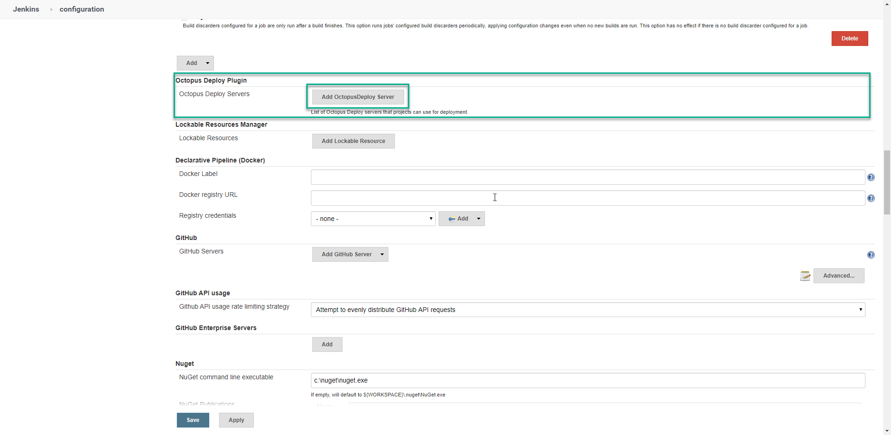
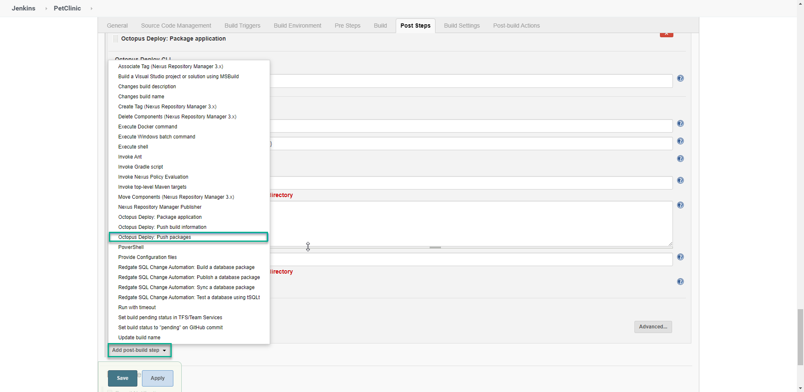
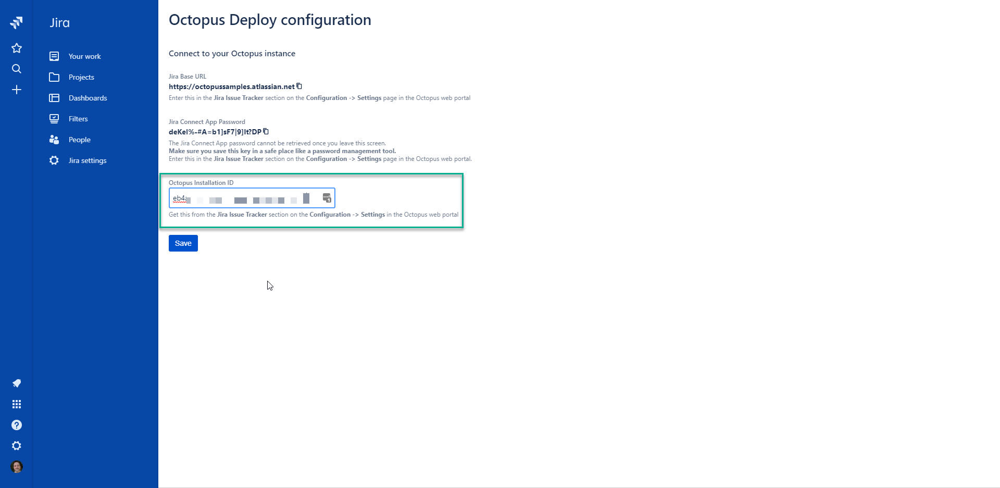
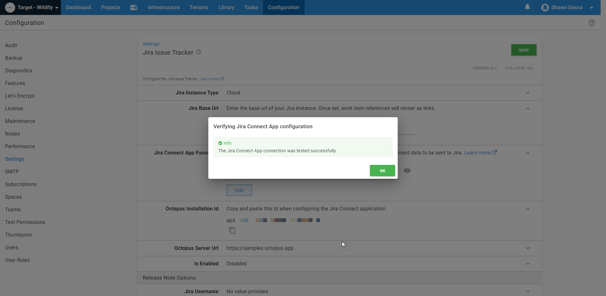
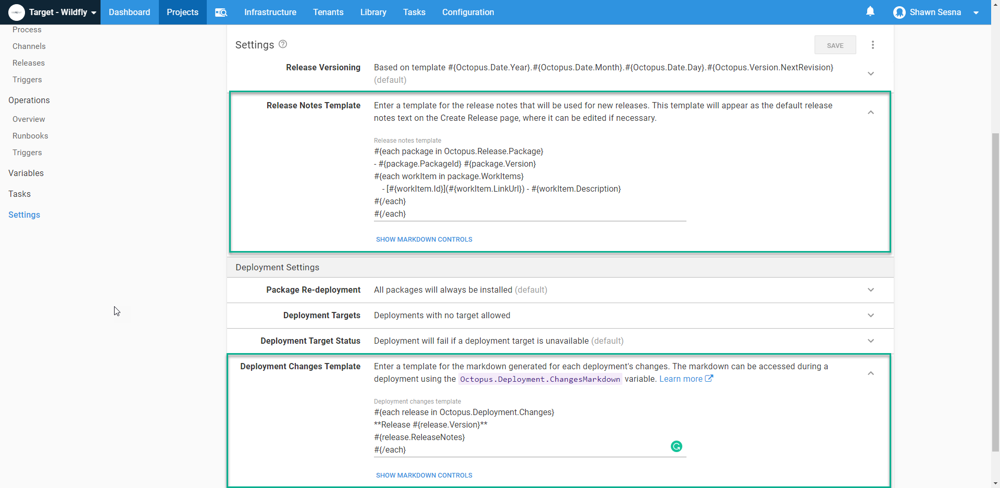
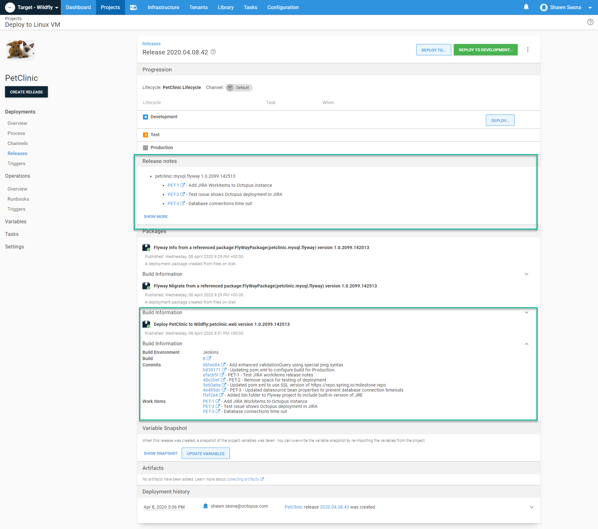
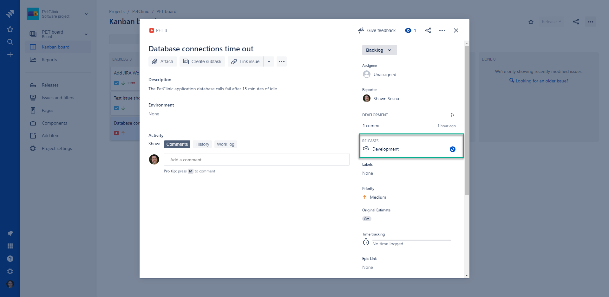

DevOps adoption has dramatically increased in recent years as people recognize the benefits it offers. Many solutions offer Continuous Integration and Continuous Delivery (CI/CD) integrated together, we’ve previously discussed the [differences between CI and CD](blog/2022-01/difference-between-ci-and-cd/index.md), but these solutions rarely make the most of the continuous feedback loop that is critical in DevOps. In this post, I show you how to integrate Jenkins, Octopus Deploy, and Jira to provide a solution that makes it easy to track issues across your CI/CD pipeline.

## Install the Jenkins Octopus Deploy plugin

Octopus Deploy provides a plugin for Jenkins that implements the same features available on other build platforms.

Installing the Octopus Deploy plugin is the same as installing any other plugin for Jenkins.  When you open Jenkins, from the landing page, click **Manage Jenkins**, and then **Manage Plugins**:


Click the **Available** tab and filter by `Octo`.  Tick the box next to Octopus Deploy and choose either **Install without restart** or **Download now and install after restart**.

After the plugin has been installed, you will have access to the following build tasks:
- Octopus Deploy: Package application
- Octopus Deploy: Push packages
- Octopus Deploy: Push build information

In addition to the build tasks, you will also have the following post build tasks:
- Octopus Deploy: Create Release
- Octopus Deploy: Deploy Release

:::hint
The Jenkins plugin differs from Azure DevOps, TeamCity, and Bamboo in that *create release* and *deploy release* are only available as post build actions.  Jenkins only allows one of each post build action type, meaning you cannot have more than one *create release* action per build definition.  
:::

### Configure the Octopus Server connection
A number of the Octopus Deploy steps require a connection to the Octopus Server.  To configure the connection, click **Manage Jenkins**, then **Configure System**, then scroll down to the **Octopus Deploy Plugin**, and click **Add Octopus Deploy Server**:



Add your Octopus Server details and click **Save**.

### Octopus Deploy CLI

The Octopus Deploy plugin contains all of the commands necessary to perform the actions, but it still relies on the [Octopus Deploy CLI](https://octopus.com/downloads/octopuscli) being present on the build agent. Download the Octopus CLI and extract it to a folder, then configure Jenkins to know it’s there.

Click **Manage Jenkins**, then **Global Tool Configuration**. Scroll to the **Octopus Deploy CLI** section and click **Add Octopus Tool**. Add a name for the tool and the path to the Octopus CLI, for instance, `c:\octopuscli\octo.exe`.

## Example build

For this post, I build the PetClinic application, which is a Java application that uses MySQL as a backend.  

### Build setup
To start, select a **New Item** from the Jenkins menu:


Give your project a name and select **Maven project**. Click **OK**, and you will see the configuration screen for your build definition.

:::hint
I configured my build to create a unique version number based on the parameters I define below.  This version number will be stamped on the artifacts of the build that are later pushed to Octopus Deploy.  I’ve installed a couple of Jenkins plugins to make this work:
- Build Name and Description Setter
- Date Parameter Plugin
:::

Under the **General Tab**, check the box **This project is parameterized**.

The required parameters of our build are (all `String` parameters):
- DatabaseName: `#{Project.MySql.Database.Name}`
- DatabaseServerName: `#{MySql.Database.Server.Name}`
- DatabaseUserName: `#{Project.MySql.Database.User.Name}`
- DatabaseUserPassword: `#{Project.MySql.Database.User.Password}`

I added some optional parameters to construct version numbers with the following format: `1.0.2098.101603`.

Optional parameters:
- Major (String): 1
- Minor (String): 0
- Year (Date):
  - Date Format: yy
  - Default Value: LocalDate.now();
- DayOfYear (Date):
  - Date Format: D
  - Default Value: LocalDate.now();
- Time (Date):
  - Date Format: HHmmss
  - LocalDate.now();

With our parameters defined, let’s hook the build into source control.  I’m using the PetClinic public Bitbucket repo for this build:
`https://twerthi@bitbucket.org/octopussamples/petclinic.git`.  Click **Source Code Management**, choose Git, and enter the URL to the repo.

If you used the optional parameters above, click the **Build Environment** tab, check the box **Set Build Name**, and enter `${MAJOR}.${MINOR}.${YEAR}${DAYOFYEAR}.${TIME}` as the build name to set the build name as the version number we configured earlier.

### Build steps

Since we chose a Maven build, Jenkins creates the build step for us.  All we need to do is navigate to the build tab and enter the following for the **Goals and options**:
```
clean package -Dproject.versionNumber=${BUILD_DISPLAY_NAME} -DdatabaseServerName=${DatabaseServerName} -DdatabaseName=${DatabaseName} -DskipTests -DdatabaseUserName=${DatabaseUserName} -DdatabaseUserPassword=${DatabaseUserPassword}
```

Breakdown of the command:
- clean: clean the project and remove all files generated by the previous build.
- package: package compiled source code into the distributable format (jar, war, …).
- -D: parameters passed into the build.

This step builds a .war file with the name `petclinic.web.Version.war`.  The package ID in this case, is `petclinic.web`.

### Post steps

The remainder of our steps are in the post steps section of our build definition.  This is where we package the Flyway project for the MySQL database backend, push the packages and build information to Octopus Deploy, then create our release.

In the **Post Steps** tab, click **Add post-build step**, select **Octopus: package application**, and enter the details for the task:

 - Package ID: `petclinic.mysql.flyway`
 - Version number: `${BUILD_DISPLAY_NAME}` This is the version number we configured through parameters and set via the set build name option above.
 - Package format: `zip|nuget`
 - Package base folder: `${WORKSPACE}\flyway`. Ignore the warning, it works fine.
 - Package include paths:  Nothing here for this project.
 - Package output folder: `${WORKSPACE}`

 Next we define the push step.  Click the **Post Steps** tab, click the **Add post-build step** drop-down menu, and choose **Octopus Deploy: push packages**:

 

Choose the Octopus Deploy Server connection we configured earlier, then the space you’d like to push to (if no space is specified, the default space will be used).  Lastly, add the paths to the packages to be pushed.  This step accepts wildcard formats.  The starting folder for the path is `${WORKSPACE}` so there’s no reason to specify that (in fact, it will fail if you do).

In the **Octopus Deploy: package application** step we defined for Flyway above, we told the step to place the package in the `${WORKSPACE}` folder.  The Maven build places the built .war file in `/target/` folder, so our package paths folder values are:

```
/*.nupkg
/target/*.war
```

That takes care of pushing the packages. Next, we’ll push some build information.  Click **Add post-build step** and choose **Octopus Deploy: Push build information**.  This step is where release notes from Jira show up.

Fill in the following details:
- Octopus Server: Server connection defined earlier.
- Space: The space where you pushed the packages.
- Package IDs:
  - `petclinic.web`
  - `petclinic.mysql.flyway`
- Version Number: `${BUILD_DISPLAY_NAME}`

### Build definition complete

In this build definition, we integrated Jenkins with Octopus Deploy and configured the Jenkins build to retrieve the release notes from Bitbucket, so they appear in Octopus Deploy.  Let’s head over to Jira and get that integration configured.

## Jira integration with Octopus Deploy

Octopus Deploy has developed an integration with Jira Software so that as deployments occur, any issues referenced by the commit messages can call back to Jira and provide updates about where in the pipeline the fix for the issue has been deployed.

### Add the Octopus Deploy app in Jira

Octopus Deploy has created an app in the Jira Marketplace for easy integration.  From the landing page of Jira Software, click **Jira Settings**, **Apps**, click **Find new apps**, and filter by `Octo` and choose **Octopus Deploy for Jira**:


Click **Get app**, and click **Get it now**.

After you see the message that the app has been successfully installed, click **Get started**.

### Configure Jira and Octopus Deploy integration

In this section, we need to move between Octopus Deploy and Jira.  

Before moving forward, let’s bring up Octopus Deploy and get to the right screen to complete this integration.  From within Octopus Deploy, click **Configuration**, then **Settings**, and **Jira Issue Tracker**.

Copy the Octopus Installation ID and paste that value into the Octopus Installation ID in Jira (but do not click save yet):



Copy the Jira Base URL and paste that value into the **Jira Base Url** field in Octopus Deploy and on the **Jira Issue Tracker** screen.

Now, back in Jira and copy the **Jira Connect App password** and paste it into the **Jira Connect App Password** field in Octopus Deploy.

**Note** the **Test** button in Octopus Deploy will not work *until* you click **Save** in Jira first:

Now, let’s go back to Octopus Deploy and test the connection works by clicking the **Test** button. It the connection is working you will see the following screen:



At this point, we’re done in Jira, but we have a couple more things to do in Octopus Deploy.  First, let’s enable the integration in Octopus Deploy by clicking the **Is enabled** checkbox.

To configure the release notes, scroll down and enter a Jira username and password.

:::hint
The `Jira Username` is your email address, and the `Jira Password` is your API key.
:::

Be sure to click Test to make sure the credentials are valid.

### Environment mapping

As part of the integration with Jira, you need to map Octopus Deploy environments to Jira environment types.  This is required so Jira can understand Octopus environments and track issue progress. Note that the Jira environment types are a fixed list that cannot be edited. To do this, click the **Infrastructure** tab, then **Environments**, and click the ellipses for that environment and **Edit**:


Use the drop-down in the **Jira Environment Type** section to associate the Octopus Deploy environment to the Jira environment type.

Repeat this process for any other environments you want mapped.

## Octopus Deploy project automatic release note creation

To configure automatic release note creation, from within your Octopus project, click **Settings**, and enter the following for the release notes template:

```
#{each package in Octopus.Release.Package}
- #{package.PackageId} #{package.Version}
#{each workItem in package.WorkItems}
    - [#{workItem.Id}](#{workItem.LinkUrl}) - #{workItem.Description}
#{/each}
#{/each}
```

Optionally, you can enter the following for the deployment changes template:

```
#{each release in Octopus.Deployment.Changes}
**Release #{release.Version}**
#{release.ReleaseNotes}
#{/each}
```



## The feedback loop
With our integrations complete, it’s time to see all of this working together.

### Create an issue in Jira Software

Let’s create an issue in Jira, click the **+** on the left-hand side:


Fill in the form for the issue, and click **Create**.

Take note of the ID that is created for the issue, as you need this later.  For this post, it’s `PET-3`.

### Commit to the repo
Commits show up in Octopus Deploy as release notes so you can see what’s being deployed.  In addition, if you reference a Jira issue within the commit message, the commit will be associated with the issue within Jira.  When a deployment occurs, Octopus will update Jira with the status.

Add some commits to your repo; for this post I added the following:
- Updated pom.xml to use SSL version of https://repo.spring.io/milestone repo
- PET-3 - Updated datasource bean properties to prevent database connection timeouts
- Added bin folder to Flyway project to include built-in version of JRE

### Build the project

With the commits done, we can build the project. The push build information step in our build definition will contain our commit messages.  Let’s queue a build in Jenkins.

In Jenkins, click **Build with Parameters**, click **Build**.

### Review the build information in Octopus Deploy

When the build is complete, the information should be available in Octopus Deploy.  Navigate to the **Library** tab, click **Build Information**, and click the **Highest version** link to view the commits and work items.

Here we see the build came from a Jenkins build server and includes the three commits we made with the associated work item (PET-3).  Clicking on the PET-3 link takes us to our Jira issue.

### Deploy the release

So far, this integration is looking pretty sweet!  Deploying a release updates Jira with the status.  Let’s start a deployment to development.  This post assumes you already know how to create a project, so we’ll skip the project creation and deployment process steps.

From within your Octopus Deploy project, click **CREATE RELEASE**, and after you click **Save** on the next screen, you will see the release details.  On this screen, we can see our release notes and associated build information:



When the release begins to deploy, it will send information to Jira. In Jira, we can see the issue is currently being deployed to development.



## Conclusion
Jenkins, Jira, and Octopus Deploy are all powerful DevOps tools.  When you integrate the three together, you get a powerful DevOps solution that provides continuous feedback to developers, operations, and business teams alike.

Watch our recent webinar to learn how to integrate your Atlassian Cloud Pipeline with Octopus Deploy. We cover a lot of the concepts from this post so check it out:

<iframe width="560" height="315" src="https://www.youtube.com/embed/yPjooXDJUA0" frameborder="0" allowfullscreen></iframe>

