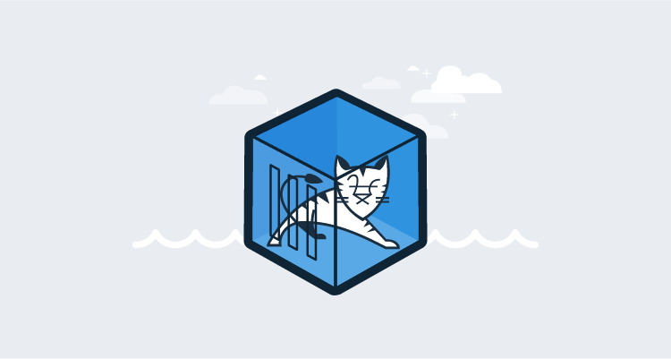

Continuous integration and delivery (CI/CD) is a common goal for DevOps teams to reduce costs and increase the agility of software teams. But the CI/CD pipeline is far more than simply testing, compiling, and deploying applications. A robust CI/CD pipeline addresses a number of concerns such as:

* High availability (HA)
* Multiple environments
* Zero downtime deployments
* Database migrations
* Load balancers
* HTTPS and certificate management
* Feature branch deployments
* Smoke testing
* Rollback strategies

How these goals are implemented depends on the type of software being deployed. In this post, I look at how to create the continuous delivery (or deployment) half of the CI/CD pipeline by deploying Java applications to Tomcat. I then build a supporting infrastructure stack that includes the Apache web server for load balancing, PostgreSQL for the database, Keepalived for highly available load balancers, and Octopus for orchestrating the deployments.

## A note on the PostgreSQL server

This post assumes that the PostgreSQL database is already deployed in a highly available configuration. For more information on how to deploy PostgreSQL, refer to the [documentation](https://www.postgresql.org/docs/current/high-availability.html).

The instructions in this post can be followed with a single PostgreSQL instance, with the understanding that the database represents a single point of failure.

## How to implement HA in Tomcat

When talking about HA, it is important to understand exactly which components of a platform need to be managed to address the unavailability of an individual Tomcat instance, for example, when an instance is unavailable due to routine maintenance or a hardware failure.

For the purpose of this post, I created infrastructure that allows a traditional stateful Java servlet application to continue operating when an individual Tomcat server is no longer available. In practical terms, this means the application session state will persist and be distributed to other Tomcat instances in the cluster when the server that originally hosted the session is no longer available.

As a brief recap, Java servlet applications can save data against a `HttpSession` instance, which is then available across requests. In the (naïve, as it does not deal with race conditions) example below, we have a simple counter variable that is incremented with each request to the page. This demonstrates how information can be persisted across individual requests made by a web browser:

```Java
@RequestMapping("/pageCount")
public String index(final HttpSession httpSession) {
    httpSession.setAttribute("pageCount", ObjectUtils.defaultIfNull((Integer)httpSession.getAttribute("pageCount"), 0) + 1);
    return (Integer)httpSession.getAttribute("pageCount");
}
```

The session state is held in memory on an individual server. By default, if that server is no longer available, the session data is also lost. For a trivial example like a page count, this is not important, but it is not uncommon for more critical functionality to rely on the session state. For example, a shopping cart may hold the list of items for purchase in session state, and losing that information may result in a lost sale.

To maintain high availability, the session state needs to be duplicated so it can be shared if a server goes offline.

Tomcat offers three solutions to enable session replication:

1. Using session persistence and saving the session to a shared file system (PersistenceManager + FileStore).
2. Using session persistence and saving the session to a shared database (PersistenceManager + JDBCStore).
3. Using in-memory-replication, and using the SimpleTcpCluster that ships with Tomcat (`lib/catalina-tribes.jar` + `lib/catalina-ha.jar`).

Because our infrastructure stack already assumes a highly available database, I’ll implement option two. This is arguably the simplest solution for us, as we do not have to implement any special networking, and we can reuse an existing database. However, this solution does introduce a delay between when the session state is modified and when it is persisted to the database. This delay introduces a window during which data may be lost in the case of hardware or network failure. Scheduled maintenance tasks are supported though, as any session data will be written to the database when Tomcat is shutdown, allowing us to patch the operating system or update Tomcat itself safely.

We noted the example code above is naïve as it doesn’t deal with the fact the session cache is not thread safe. Even this simple example is subject to race conditions that may result in the page count being incorrect. The solution to this problem is to use the traditional thread locks and synchronization features available in Java, but these features are only valid within a single JVM. This means we must ensure that client requests are always directed to a single Tomcat instance, which in turn means that only one Tomcat instance contains the single, authoritative copy of the session state, which can then ensure consistency via thread locks and synchronization. This is achieved with sticky sessions.

Sticky sessions provide a way for client requests to be inspected by a load balancer and then directed to one web server in a cluster. By default, in a Java servlet application a client is identified by a `JSESSIONID` cookie that is sent by the web browser and inspected by the load balancer to identify the Tomcat instance that holds the session, and then by the Tomcat server to associate a request with an existing session.

In summary, our HA Tomcat solution:

* Persists session state to a shared database.
* Relies on sticky sessions to direct client requests to a single Tomcat instance.
* Supports routine maintenance by persisting session state when Tomcat is shutdown.
* Has a small window during which a hardware or network failure may result in lost data.

## Keepalived for HA load balancers

To ensure that network requests are distributed among multiple Tomcat instances and not directed to an offline instance, we need to implement a load balancing solution. These load balancers sit in front of the Tomcat instances and direct network requests to those instances that are available.

Many load balancing solutions exist that can perform this role, but for this post, we use the Apache web server with the mod_jk plugin. Apache will provide the networking functionality, while mod_jk will distribute traffic to multiple Tomcat instances, implementing sticky sessions to direct a client to the same backend server for each request.

In order to maintain high availability, we need at least two load balancers. But how do we split a single incoming network connection across two load balancers in a reliable manner? This is where Keepalived comes in.

Keepalived is a Linux service run across multiple instances and picks a single master instance from the pool of healthy instances. Keepalived is quite flexible when it comes to determining what that master instance does, but in our scenario, we will use Keepalived to assign a virtual, floating IP address to the instance that assumes the master role. This means our incoming network traffic will be sent to a floating IP address that is assigned to a healthy load balancer, and the load balancer then forwards the traffic to the Tomcat instances. Should one of the load balancers be taken offline, Keepalived will ensure the remaining load balancer is assigned the floating IP address.

In summary, our HA load balancing solution:

* Implements Apache with the mod_jk plugin to direct traffic to the Tomcat instances.
* Implements Keepalived to ensure one load balancer has a virtual IP address assigned to it.

## The network diagram

Here is the diagram of the network that we will create:

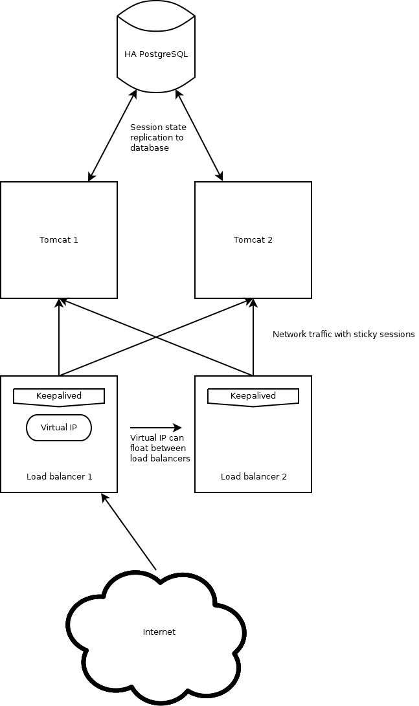

## Zero downtime deployments and rollbacks

A goal of continuous delivery is to always be in a state where you can deploy (even if you choose not to). This means moving away from schedules that require people to be awake at midnight to perform a deployment when your customers are asleep.

Zero downtime deployments require reaching a point where deployments can be done at any time without disruption. In our example infrastructure, there are two points that we need to consider in order to achieve zero downtime deployments:

* The ability for customers to use the existing version of the application to complete their session even after a newer version of the application has been deployed.
* Forward and backward compatibility of any database changes.

Ensuring database changes are backward and forward compatible requires some design work and discipline when pushing new application versions. Fortunately, there are tools available, including [Flyway](https://flywaydb.org/) and [Liquidbase](https://www.liquibase.org/), that provide a way to roll out database changes with the applications themselves, taking care of versioning the changes and wrapping any migrations in the required transactions. We’ll see Flyway implemented in a sample application later in the post.

As long as the shared database remains compatible between the current and the new version of the application, Tomcat provides a feature called [parallel deployments](https://tomcat.apache.org/tomcat-9.0-doc/config/context.html#Parallel_deployment) that allows clients to continue to access the previous version of the application until their session expires, while new sessions are created against the new version of the application. Parallel deployments allow a new version of the application to be deployed without disrupting any existing clients.

:::hint
Tomcat has the ability to automatically clean up old versions that no longer have any sessions. We will not enable this feature though, as it may prevent a session for an old version from being migrated to another Tomcat instance.
:::

Ensuring database changes are compatible between the current and new version of the application means we can easily roll back the application deployment. Redeploying the previous version of the application provides a quick fallback in case the new version introduced any errors.

In summary, our zero downtime deployments solution:

* Relies on database changes being forward and backward compatible (at least between the new and current versions of the application).
* Uses parallel deployments to allow existing sessions to complete uninterrupted.
* Provides application rollbacks by reverting to the previously installed application version.

## Build the infrastructure

The example infrastructure shown here is deployed to Ubuntu 18.04 virtual machines. Most of the instructions will be distribution agnostic, although some of the package names and file locations may change.

### Configure the Tomcat instances

#### Install the packages

We start by installing Tomcat and the Manager application:

```
apt-get install tomcat tomcat-admin
```

#### Add the AJP connector

Communication between the Apache web server and Tomcat is performed with an AJP connector. AJP is an optimized binary HTTP protocol that the mod_jk plugin for Apache and Tomcat both understand. The connector is added to the `Service` element in the `/etc/tomcat9/server.xml` file:

```xml
<Server>
  <!-- ... -->
  <Service name="Catalina">
    <!-- ... -->
    <Connector port="8009" protocol="AJP/1.3" redirectPort="8443"></Connector>
  </Service>
</Server>
```

#### Define the Tomcat instance names

Each Tomcat instance needs a unique name added to the `Engine` element in the `/etc/tomcat9/server.xml` file. The default `Engine` element looks like this:

```xml
<Engine name="Catalina" defaultHost="localhost">
```

The name of the Tomcat instance is defined in the `jvmRoute` attribute. I’ll call the first Tomcat instance `worker1`:

```xml
<Engine defaultHost="localhost" name="Catalina" jvmRoute="worker1">
```

The second Tomcat instance is called `worker2`:

```xml
<Engine defaultHost="localhost" name="Catalina" jvmRoute="worker2">
```

#### Add a manager user

Octopus performs deployments to Tomcat via the Manager application. This is what we installed with the `tomcat-admin` package earlier.

In order to authenticate with the Manager application, a new user needs to be defined in the `/etc/tomcat9/tomcat-users.xml` file. I’ll call this user `tomcat` with the password `Password01!`, and it will belong to the `manager-script` and `manager-gui` roles.

The `manager-script` role grants access to the Manager API, and the `manager-gui` role grants access to the Manager web console.

Here is a copy of the `/etc/tomcat9/tomcat-users.xml` file with the `tomcat` user defined:

```xml
<tomcat-users xmlns="http://tomcat.apache.org/xml"
              xmlns:xsi="http://www.w3.org/2001/XMLSchema-instance"
              xsi:schemaLocation="http://tomcat.apache.org/xml tomcat-users.xsd"
              version="1.0">
  <role rolename="manager-gui"/>
  <role rolename="manager-script"/>
  <user username="tomcat" password="Password01!" roles="manager-script,manager-gui"/>
</tomcat-users>
```

#### Add the PostgreSQL JDBC driver jar

Each Tomcat instance will communicate with a PostgreSQL database to persist session data. In order for Tomcat to communicate with a PostgreSQL database, we need to install the PostgreSQL JDBC driver JAR file. This is done by saving the file `https://jdbc.postgresql.org/download/postgresql-42.2.11.jar` as `/var/lib/tomcat9/lib/postgresql-42.2.11.jar`.

#### Enable session replication

To enable session persistence to a database, we add a new `Manager` definition in the file `/etc/tomcat9/context.xml`. This manager uses the `org.apache.catalina.session.PersistentManager` to save the session details to a database defined in the nested `Store` element.

The `Store` element in turn, defines the database that the session information will be persisted to.

We also need to add a `Valve` loading the `org.apache.catalina.ha.session.JvmRouteBinderValve` class. This valve is important when a client is redirected from a Tomcat instance that is no longer available to another Tomcat instance in the cluster. We’ll see this valve in action after we deploy our sample application.

Here is a copy of the `/etc/tomcat9/context.xml` file with the `Manager`, `Store`, and `Valve` elements defined:

```xml
<Context>
  <Manager
    className="org.apache.catalina.session.PersistentManager"
    processExpiresFrequency="3"
    maxIdleBackup="1" >
      <Store
        className="org.apache.catalina.session.JDBCStore"
        driverName="org.postgresql.Driver"
        connectionURL="jdbc:postgresql://postgresserver:5432/tomcat?currentSchema=session"
        connectionName="postgres"
        connectionPassword="passwordgoeshere"
        sessionAppCol="app_name"
        sessionDataCol="session_data"
        sessionIdCol="session_id"
        sessionLastAccessedCol="last_access"
        sessionMaxInactiveCol="max_inactive"
        sessionTable="session.tomcat_sessions"
        sessionValidCol="valid_session" />
  </Manager>
  <Valve className="org.apache.catalina.ha.session.JvmRouteBinderValve"/>
  <WatchedResource>WEB-INF/web.xml</WatchedResource>
  <WatchedResource>WEB-INF/tomcat-web.xml</WatchedResource>
  <WatchedResource>${catalina.base}/conf/web.xml</WatchedResource>
</Context>
```

### Configure the PostgreSQL database

#### Install the packages

We need to initialize PostgreSQL with a new database, schema, and table. To do this, we use the `psql` command-line tool, which is installed with:

```
apt-get install postgresql-client
```

#### Add the database, schema, and table

If you look at the `connectionURL` attribute from the `/etc/tomcat9/context.xml` file defined above, you will see we are saving session information into:

* The database called `tomcat`.
* The schema called `session`.
* A table called `tomcat_sessions`.

To create these resources in the PostgreSQL server, we run a number of SQL commands.

First, save the following text into a file called `createdb.sql`. This command creates the database if it does not exist (see [this StackOverflow](https://stackoverflow.com/a/18389184/157605) post for more information about the syntax):

```
SELECT 'CREATE DATABASE tomcat' WHERE NOT EXISTS (SELECT FROM pg_database WHERE datname = 'tomcat')\gexec
```

Then execute the SQL with the following command, replacing `postgresserver` with the hostname of your PostgreSQL server:

```
cat createdb.sql | /usr/bin/psql -a -U postgres -h postgresserver
```

Next, we create the schema and table. Save the following text to a file called `createschema.sql`. Note the columns of the `tomcat_sessions` table match the attributes of the `Store` element in the `/etc/tomcat9/context.xml` file:

```
CREATE SCHEMA IF NOT EXISTS session;

CREATE TABLE IF NOT EXISTS session.tomcat_sessions
(
  session_id character varying(100) NOT NULL,
  valid_session character(1) NOT NULL,
  max_inactive integer NOT NULL,
  last_access bigint NOT NULL,
  app_name character varying(255),
  session_data bytea,
  CONSTRAINT tomcat_sessions_pkey PRIMARY KEY (session_id)
);

CREATE INDEX IF NOT EXISTS app_name_index
  ON session.tomcat_sessions
  USING btree
  (app_name);
```

Then execute the SQL with the following command, replacing `postgresserver` with the hostname of your PostgreSQL server:

```
psql -a -d tomcat -U postgres -h postgresserver -f /root/createschema.sql
```

We now have a table in PostgreSQL ready to save the Tomcat sessions.

### Configure the load balancers

#### Install the packages

We need to install the Apache web server, the mod_jk plugin, and the Keepalived service:

```
apt-get install apache2 libapache2-mod-jk keepalived
```

#### Configure the load balancer

The mod_jk plugin is configured via the file `/etc/libapache2-mod-jk/workers.properties`. In this file, we define a number of workers that traffic can be directed to. The fields in this file are documented [here](https://tomcat.apache.org/connectors-doc/reference/workers.html).

We start by defining a worker called `loadbalancer` that will receive all of the traffic:

```
worker.list=loadbalancer
```

We then define the two Tomcat instances that were created earlier. Make sure to replace `worker1_ip` and `worker2_ip` with the IP addresses of the matching Tomcat instances.

Note, the name of the workers defined here as `worker1` and `worker2` match the value of the `jvmRoute` attribute in the `Engine` element in the `/etc/tomcat9/server.xml` file. These names must match, as they are used by mod_jk to implement sticky sessions:

```
worker.worker1.type=ajp13
worker.worker1.host=worker1_ip
worker.worker1.port=8009

worker.worker2.type=ajp13
worker.worker2.host=worker2_ip
worker.worker2.port=8009
```

Finally, we define the `loadbalancer` worker as a load balancer that directs traffic to the `worker1` and `worker2` workers with sticky sessions enabled:

```
worker.loadbalancer.type=lb
worker.loadbalancer.balance_workers=worker1,worker2
worker.loadbalancer.sticky_session=1
```

Here is a complete copy of the `/etc/libapache2-mod-jk/workers.properties` file:

```
# All traffic is directed to the load balancer
worker.list=loadbalancer

# Set properties for workers (ajp13)
worker.worker1.type=ajp13
worker.worker1.host=worker1_ip
worker.worker1.port=8009

worker.worker2.type=ajp13
worker.worker2.host=worker2_ip
worker.worker2.port=8009

# Load-balancing behaviour
worker.loadbalancer.type=lb
worker.loadbalancer.balance_workers=worker1,worker2
worker.loadbalancer.sticky_session=1
```

#### Add an Apache VirtualHost

In order for Apache to accept traffic we need to define a `VirtualHost`, which we create in the file `/etc/apache2/sites-enabled/000-default.conf`. This virtual host will accept HTTP traffic on port 80, define some log files, and use the `JkMount` directive to forward traffic to the worker called `loadbalancer`:

```xml
<VirtualHost *:80>
  ErrorLog ${APACHE_LOG_DIR}/error.log
  CustomLog ${APACHE_LOG_DIR}/access.log combined
  JkMount /* loadbalancer
</VirtualHost>
```

#### Configure Keepalived

We have two load balancers to ensure that one can be taken offline for maintenance at any given time. Keepalived is the service that we use to assign a virtual IP address to one of the load balancer services, which Keepalived refers to as the master.

Keepalived is configured via the `/etc/keepalived/keepalived.conf` file.

We start by naming the load balancer instance. The first load balancer is called `loadbalancer1`:

```
vrrp_instance loadbalancer1 {
```

The `state` MASTER designates the active server:

```
state MASTER
```

The `interface` parameter assigns the physical interface name to this particular virtual IP instance:

:::hint
You can find the interface name by running `ifconfig`.
:::

```
interface ens5
```

`virtual_router_id` is a numerical identifier for the Virtual Router instance. It must be the same on all LVS Router systems participating in this Virtual Router. It is used to differentiate multiple instances of Keepalived running on the same network interface:

```
virtual_router_id 101
```

The `priority` specifies the order in which the assigned interface takes over in a failover; the higher the number, the higher the priority. This priority value must be within the range of 0 to 255, and the load balancing server configured as state `MASTER` should have a priority value set to a higher number than the priority value of the server configured as state `BACKUP`:

```
priority 101
```

`advert_int` defines how often to send out VRRP advertisements:

```
advert_int 1
```

The `authentication` block specifies the authentication type (`auth_type`) and password (`auth_pass`) used to authenticate servers for failover synchronization. `PASS` specifies password authentication:

```
authentication {
    auth_type PASS
    auth_pass passwordgoeshere
}
```

`unicast_src_ip` is the IP address of this load balancer:

```
unicast_src_ip 10.0.0.20
```

`unicast_peer` lists the IP addresses of other load balancers. Since we have two load balancers total, there is only one other load balancer to list here:

```
unicast_peer {
  10.0.0.21
}
```

`virtual_ipaddress` defines the virtual, or floating, IP address that Keepalived assigns to the master node:

```
virtual_ipaddress {
    10.0.0.30
}
```

Here is a complete copy of the `/etc/keepalived/keepalived.conf` file for the first load balancer:

```
vrrp_instance loadbalancer1 {
    state MASTER
    interface ens5
    virtual_router_id 101
    priority 101
    advert_int 1
    authentication {
        auth_type PASS
        auth_pass passwordgoeshere
    }
    # Replace unicast_src_ip and unicast_peer with your load balancer IP addresses
    unicast_src_ip 10.0.0.20
    unicast_peer {
      10.0.0.21
    }
    virtual_ipaddress {
        10.0.0.30
    }
}
```

Here is a complete copy of the `/etc/keepalived/keepalived.conf` file for the second load balancer.

Note, the name has been set to `loadbalancer2`, the `state` has been set to `BACKUP`, the `priority` is lower at `100`, and the `unicast_src_ip` and `unicast_peer` IP addresses have been flipped:

```
vrrp_instance loadbalancer2 {
    state BACKUP
    interface ens5
    virtual_router_id 101
    priority 100
    advert_int 1
    authentication {
        auth_type PASS
        auth_pass passwordgoeshere
    }
    # Replace unicast_src_ip and unicast_peer with your load balancer IP addresses
    unicast_src_ip 10.0.0.21
    unicast_peer {
      10.0.0.20
    }
    virtual_ipaddress {
        10.0.0.30
    }
}
```

Restart the `keepalived` service on both load balancers with the command:

```
systemctl restart keepalived
```

On the first load balancer, run the command `ip addr`. This will show the virtual IP address assigned to the interface that Keepalived was configured to manage with the output `inet 10.0.0.30/32 scope global ens5`:

```
$ ip addr
1: lo: <LOOPBACK,UP,LOWER_UP> mtu 65536 qdisc noqueue state UNKNOWN group default qlen 1000
    link/loopback 00:00:00:00:00:00 brd 00:00:00:00:00:00
    inet 127.0.0.1/8 scope host lo
       valid_lft forever preferred_lft forever
    inet6 ::1/128 scope host
       valid_lft forever preferred_lft forever
2: ens5: <BROADCAST,MULTICAST,UP,LOWER_UP> mtu 9001 qdisc mq state UP group default qlen 1000
    link/ether 0e:2b:f9:2a:fa:a7 brd ff:ff:ff:ff:ff:ff
    inet 10.0.0.21/24 brd 10.0.0.255 scope global dynamic ens5
       valid_lft 3238sec preferred_lft 3238sec
    inet 10.0.0.30/32 scope global ens5
       valid_lft forever preferred_lft forever
    inet6 fe80::c2b:f9ff:fe2a:faa7/64 scope link
       valid_lft forever preferred_lft forever
```

If the first load balancer is shutdown, the second load balancer will assume the virtual IP address, and the second Apache web server will act as the load balancer.

## Build the deployment pipeline

Our deployment pipeline will involve deploying the [Random Quotes](https://github.com/OctopusSamples/RandomQuotes-Java) sample application. This is a simple stateful Spring Boot application utilizing Flyway to manage database migrations.

When you click the **Refresh** button, a new quote is loaded from the database, a counter is incremented in the session, and the counter is displayed as the **Quote count** field on the page. The application version is shown in the **Version** field.

We can use the **Quote count** and **Version** information to verify that existing sessions are preserved as new deployments are performed or Tomcat instances are taken offline.

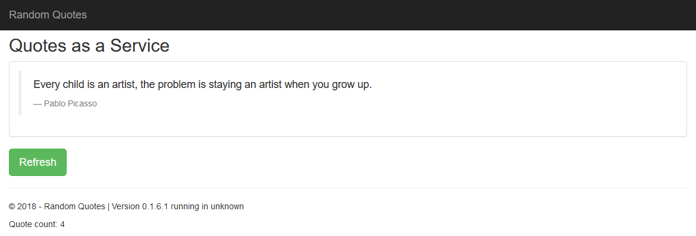

### Get an Octopus instance

If you do not already have Octopus installed, the easiest way to get an Octopus instance is to [sign up for a cloud account](https://octopus.com/start/cloud). These instances are free for up to 10 targets.

### Create the environments

We’ll create two environments for this example: **Dev** and **Prod**. This means we will configure eight targets in total: four load balancers and four Tomcat instances.

### Deploy the Tentacle

We will install a Tentacle on each of our virtual machines to allow us to perform deployments, updates, and system maintenance tasks. The instructions for installing the Tentacle software is found on the [Octopus download page](https://octopus.com/downloads/tentacle#linux). As this example is using Ubuntu as the base OS, we install the Tentacle with the commands:

```
apt-key adv --fetch-keys https://apt.octopus.com/public.key
add-apt-repository "deb https://apt.octopus.com/ stretch main"
apt-get update
apt-get install tentacle
```

After the Tentacle is installed we configure an instance with the command:

```
/opt/octopus/tentacle/configure-tentacle.sh
```

The installation gives you a choice between [polling or listening Tentacles](https://octopus.com/docs/infrastructure/deployment-targets/windows-targets/tentacle-communication). Which option you choose often depends on your network restrictions. Polling Tentacles require the VM hosting the Tentacle can reach the Octopus Server, while listening Tentacles require the Octopus Server can reach the VM. The choice of communication style depends on whether the Octopus Server or VMs have fixed IP addresses and the correct ports are opened in the firewall. Either option is a valid choice and does not impact the deployment process.

Here is a screenshot of the **Dev** environment with Tentacles for the Tomcat and Load Balancer instances. The Tomcat instances have a role of **tomcat**, and the load balancer instances have a role of **loadbalancer**:

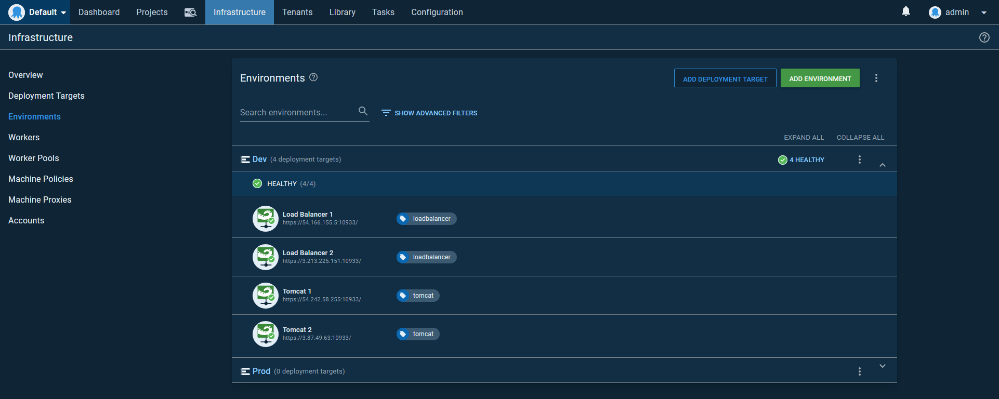

### Create the external feed

The Random Quotes sample application has been pushed to [Maven Central as a WAR file](https://repo.maven.apache.org/maven2/com/octopus/randomquotes/). This means we can deploy the application directly from a Maven feed.

Create a new Maven feed pointing to `https://repo.maven.apache.org/maven2/`. A screenshot of this feed is shown below:

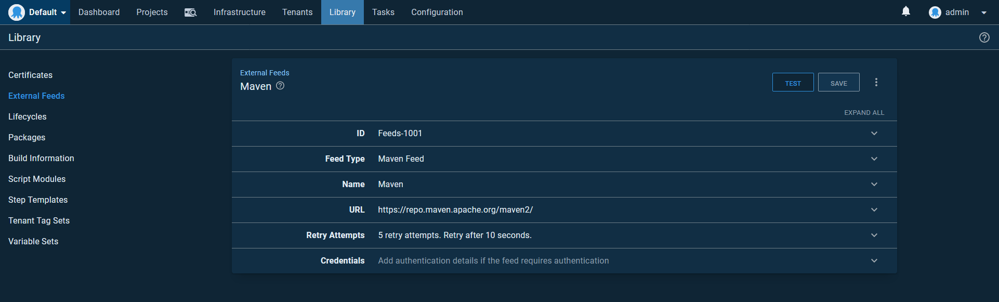

Test the feed by searching for **com.octopus:randomquotes**. Here we can see that our application is found in the repository:

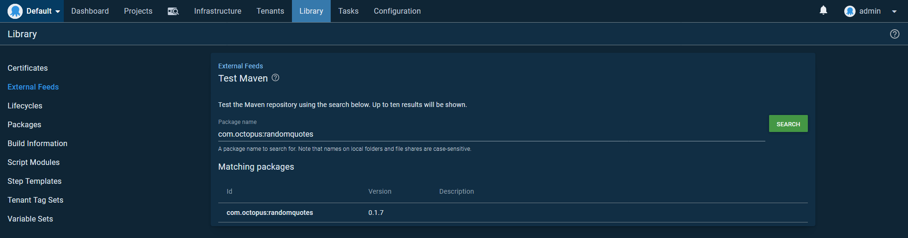

### Create the deployment process

#### Generate a timestamp

In order to support zero downtime deployments, we want to take advantage of the [parallel deployments](https://tomcat.apache.org/tomcat-9.0-doc/config/context.html#Parallel_deployment) feature in Tomcat. Parallel deployments are enabled by versioning each application when it is deployed.

This version number uses string comparisons to determine the latest version. Typical versioning schemes, like SemVer, use a *major.minor.patch* format, like *1.23.4*, to identify versions. For a lot of cases, these traditional versioning schemes can be compared as strings to determine their order.

However, padding can introduce issues. For example, the version *1.23.40* is lower than *01.23.41*, but a direct string comparison returns the opposite result.

For this reason, we use the time of the deployment as the Tomcat version. Because the version needs to be consistent across targets, we start with a script step that generates a timestamp and saves it to an output variable with the code:

```PowerShell
$timestamp = Get-Date -Format "yyMMddHHmmss"
Set-OctopusVariable -name "TimeStamp" -value $timestamp
```

#### The Tomcat deployment

Our deployment process starts with deploying the application to each Tomcat instance using the **Deploy to Tomcat via Manager** step. We’ll call this step **Random Quotes** and run it on the **tomcat** targets:


We deploy the **com.octopus:randomquotes** package from the Maven feed we setup earlier:

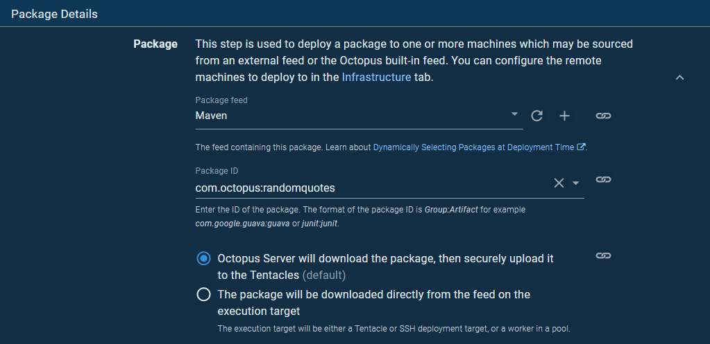

Because the Tentacle is located on the VM that hosts Tomcat, the location of the Manager API is **http://localhost:8080/manager**. We then supply the manager credentials, which were the details entered into the `tomcat-users.xml` file when we configured Tomcat:

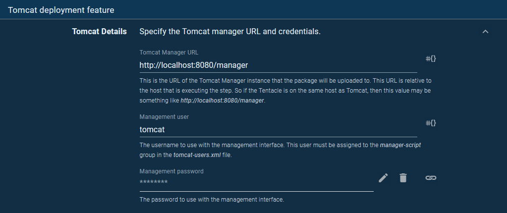

The context path makes up the path in the URL that the deployed application is accessible on. Here we expose the application on the path **/randomquotes**:


The deployment version is set to the timestamp that was generated by the previous step by referencing the output variable as **#{Octopus.Action[Get Timestamp].Output.TimeStamp}**:

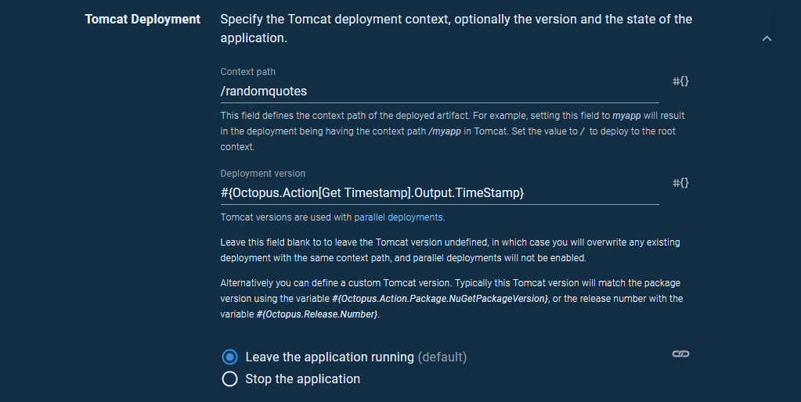

#### Smoke test the deployment

To verify that our deployment was successful, we issue an HTTP request and check the response code. To do this, we use a community step template called **HTTP - Test URL (Bash)**.

As before, this step will run on the Tomcat instances:

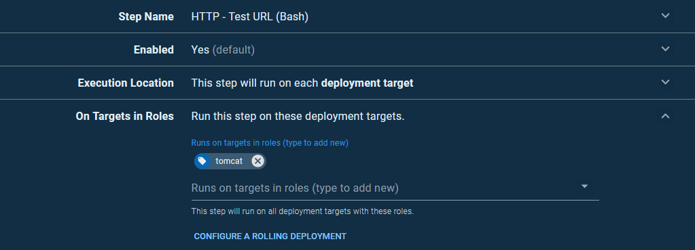

The step will attempt to open the `index.html` page from the newly deployed application, expecting an HTTP response code of **200**:

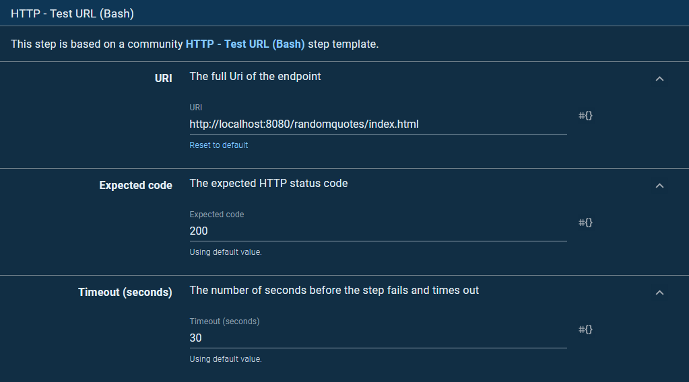

#### Perform the initial deployment

Let’s go ahead and perform the initial deployment. For this deployment, we’ll specifically select a previous version of the Random Quotes application. Version **0.1.6.1** in this case, is our second last artifact version:

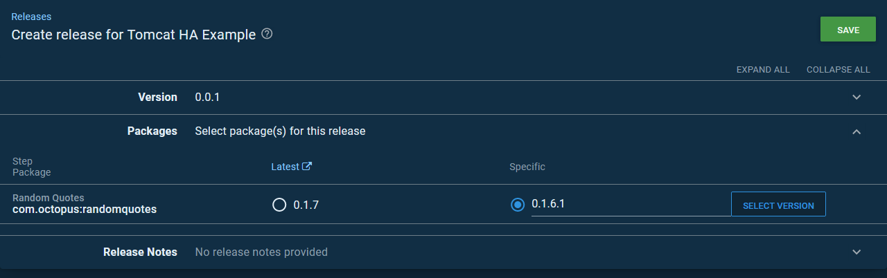

Octopus then proceeds to download the WAR file from the Maven repository, push it to the Tomcat instances and deploy it to Tomcat via the Manager. When complete, the smoke test runs to ensure the application can be opened successfully:

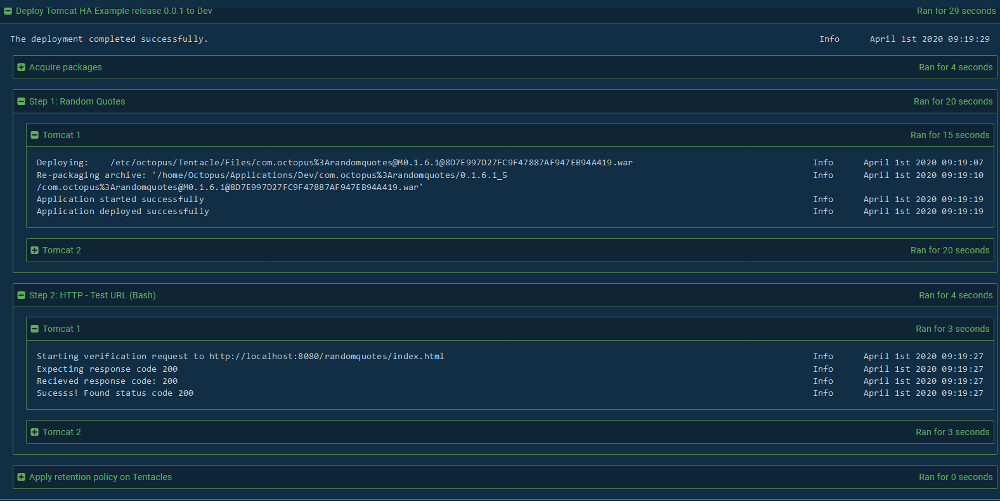

## Inspect a request through the stack

With the deployment done, we can access it via the load balancer.

:::hint
In the previous configuration examples, we had a floating IP address of 10.0.0.30, but for these screenshots, I used Keepalived to assign a public IP address to the load balancers.
:::

Here is a screenshot of the application opened with the Chrome developer tools:

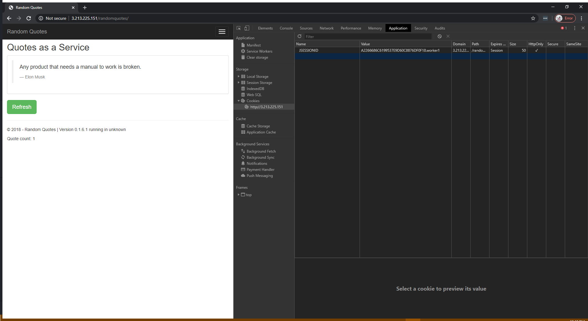

There are three things to note in this screenshot:

1. The **JSESSIONID** cookie is set with a random session ID and the name of the Tomcat instance that responded to the request. In this example, the Tomcat instance whose **jvmRoute** was set to **worker1** responded to the request.
2. We have opened version 0.1.6.1 of the application.
3. The **Quote count** is set to 1, but this will increase as we hit the **Refresh** button.

Let’s increase the **Quote count** by clicking the **Refresh** button. This value is saved on the Tomcat server in the session associated with the **JSESSIONID** cookie:

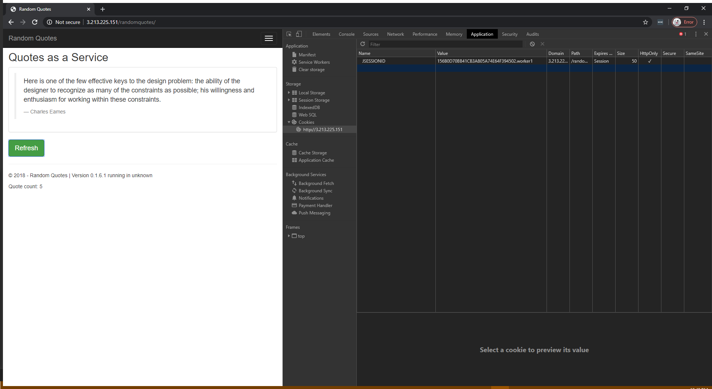

Let’s now shut down the **worker1** Tomcat instance. After shutdown, we click the **Refresh** button again:


There are three things to note in this screenshot:

1. The suffix on the **JSESSIONID** cookie changed from **worker1** to **worker2**.
2. The **JSESSIONID** cookie session ID remained the same.
3. The **Quote count** increased to 6.

When Tomcat is gracefully shut down, it will write out the contents of any sessions to the database. Then because the **worker1** Tomcat instance was no longer available, the request was directed to the **worker2** Tomcat instance. The **worker2** Tomcat instance loaded the session information from the database and incremented the counter. The **JvmRouteBinderValve** valve rewrote the session cookie to append the current Tomcat instance name to the end, and the response was returned to the browser.

We can now see that it is important that the worker names in the load balancer `/etc/libapache2-mod-jk/workers.properties` file match the names assigned to the **jvmRoute** in the `/etc/tomcat9/server.xml` file because matching these names allow sticky sessions to be implemented.

Because the **Quote count** did not reset back to 1, we know that the session was persisted to the database and replicated to the other Tomcat instances in the cluster. We also know that the request was served by another Tomcat instance because the **JSESSIONID** cookie shows a new worker name.

Even if we brought **worker1** back online, this browser session would continue to be handled by **worker2** because the load balancers implement sticky sessions by inspecting the **JSESSIONID** cookie. This also means that the load balancers don’t need to share state, as they only require the cookie value to direct traffic.

We’ve now demonstrated that the Tomcat instances support session replication and failover, making them highly available.

To demonstrate failover of the load balancers, we only need to restart the instance designated as the master by Keepalived. We can then watch the events on the backup instance with the command:

```
journalctl -u keepalived -f
```

Very quickly we’ll see these messages appear on the backup as it assumes the master role:

```
Apr 01 03:15:00 ip-10-0-0-21 Keepalived_vrrp[32485]: VRRP_Instance(loadbalancer2) Transition to MASTER STATE
Apr 01 03:15:01 ip-10-0-0-21 Keepalived_vrrp[32485]: VRRP_Instance(loadbalancer2) Entering MASTER STATE
```

Having assumed the master role, the load balancer will be assigned the virtual IP address, and distribute traffic as the previous master did.

After the previous master instance restarts, it will re-assume the master role because it is configured with a higher priority, and the virtual IP address will be assigned back.

The whole process is seamless, and upstream clients never need to be aware that a failover and failback took place. So we have demonstrated that the load balancers can failover, making them highly available.

In summary:
* The **JSESSIONID** cookie contains the session ID and the name of the Tomcat instance that processed the request.
* The load balancers implement sticky sessions based on the worker name appended to the **JSESSIONID** cookie.
* The `JvmRouteBinderValve` valve rewrites the **JSESSIONID** cookie when a Tomcat instance received traffic for a session it was not originally responsible for.
* Keepalived assigns a virtual IP to the backup load balancer if the master goes offline.
* The master load balancer re-assumes the virtual IP when it comes back online.
* The infrastructure stack can survive the loss of one Tomcat instance and one load balancer and still maintain availability.

## Zero downtime deployments

We have now successfully deployed version *0.1.6.1* of our web application to Tomcat. This version of the application uses a very simple table structure to hold the names of those credited with the quotes, placing both the first name and last name into a single column called `AUTHOR`.

This table structure was originally created by a Flyway database script with the following SQL:

```sql
create table AUTHOR
(
	ID INT auto_increment,
	AUTHOR VARCHAR(64) not null
);
```

The next version of our application will split the names into a `FIRSTNAME` and `LASTNAME` column. We add these columns with a new Flyway script that contains the following SQL:

```sql
ALTER TABLE AUTHOR
ADD FIRSTNAME varchar(64);

ALTER TABLE AUTHOR
ADD LASTNAME varchar(64);
```

At this point, we have to consider how these changes can be made in a backward compatible way. A cornerstone of the zero downtime deployment strategy requires that a shared database support both the current version of the application and the new version. Unfortunately, there is no silver bullet to provide this compatibility, and it is up to us as developers to ensure that our changes don’t break any existing sessions.

In this scenario, we must keep the old `AUTHOR` column and duplicate the data it held into the new `FIRSTNAME` and `LASTNAME` columns:

```sql
UPDATE AUTHOR SET FIRSTNAME = 'Rob', LASTNAME = 'Siltanen' WHERE ID = 1;
UPDATE AUTHOR SET FIRSTNAME = 'Albert', LASTNAME = 'Einstein' WHERE ID = 2;
UPDATE AUTHOR SET FIRSTNAME = 'Charles', LASTNAME = 'Eames' WHERE ID = 3;
UPDATE AUTHOR SET FIRSTNAME = 'Henry', LASTNAME = 'Ford' WHERE ID = 4;
UPDATE AUTHOR SET FIRSTNAME = 'Antoine', LASTNAME = 'de Saint-Exupery' WHERE ID = 5;
UPDATE AUTHOR SET FIRSTNAME = 'Salvador', LASTNAME = 'Dali' WHERE ID = 6;
UPDATE AUTHOR SET FIRSTNAME = 'M.C.', LASTNAME = 'Escher' WHERE ID = 7;
UPDATE AUTHOR SET FIRSTNAME = 'Paul', LASTNAME = 'Rand' WHERE ID = 8;
UPDATE AUTHOR SET FIRSTNAME = 'Elon', LASTNAME = 'Musk' WHERE ID = 9;
UPDATE AUTHOR SET FIRSTNAME = 'Jessica', LASTNAME = 'Hische' WHERE ID = 10;
UPDATE AUTHOR SET FIRSTNAME = 'Paul', LASTNAME = 'Rand' WHERE ID = 11;
UPDATE AUTHOR SET FIRSTNAME = 'Mark', LASTNAME = 'Weiser' WHERE ID = 12;
UPDATE AUTHOR SET FIRSTNAME = 'Pablo', LASTNAME = 'Picasso' WHERE ID = 13;
UPDATE AUTHOR SET FIRSTNAME = 'Charles', LASTNAME = 'Mingus' WHERE ID = 14;
```

In addition, the new JPA entity class needs to ignore the old `AUTHOR` column (through the `@Transient` annotation). The `getAuthor()` method then returns the combined values of the `getFirstName()` and `getLastName()` methods:

```Java
@Entity
public class Author {
    @Id
    @GeneratedValue(strategy= GenerationType.AUTO)
    private Integer id;
    @Column(name = "FIRSTNAME")
    private String firstName;
    @Column(name = "LASTNAME")
    private String lastName;

    @OneToMany(
            mappedBy = "author",
            cascade = CascadeType.ALL,
            orphanRemoval = true
    )
    private List<Quote> quotes = new ArrayList<>();

    protected Author() {

    }

    public Integer getId() {
        return id;
    }

    @Transient
    public String getAuthor() {
        return getFirstName() + " " + getLastName();
    }

    public List<Quote> getQuotes() {
        return quotes;
    }

    public String getFirstName() {
        return firstName;
    }

    public String getLastName() {
        return lastName;
    }
}
```

While this is a trivial example that is easy to implement thanks to the fact the `AUTHOR` table is read-only, it demonstrates how database changes can be implemented in a backward compatible manner. It would be possible to write entire books on the strategies for maintaining backward compatibility, but for the purposes of this post, we’ll leave this discussion here.

Before we perform the next deployment, reopen the existing application and refresh some quotes. This creates a session against the existing *0.1.6.1* version, which we’ll use to test our zero downtime deployment strategy.

With our migration scripts written in a backward compatible manner, we can deploy the new version of our application. For convenience this new version has been pushed to Maven Central as version *0.1.7*:

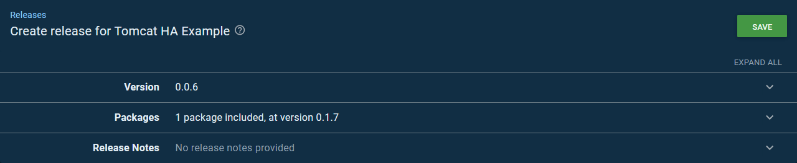

After the deployment completes, open the Manager application at `http://tomcatip:8080/manager/html`. Note, that while you could access the Manager through the load balancer, you do not get to choose which Tomcat instance you will be managing as the load balancer picks a Tomcat instance for you. This means it is better to connect to the Tomcat instance directly, bypassing the load balancer:

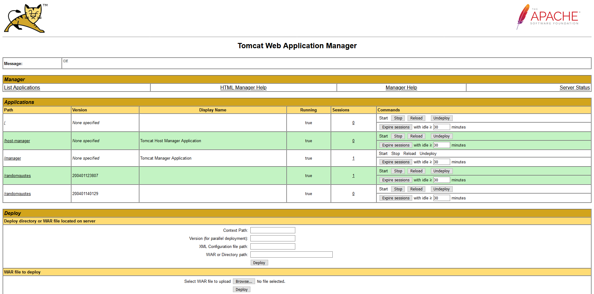

There are two things to notice in this screenshot:
1. We have two applications under the path `/randomquotes`, each with a unique version.
2. The application with the earlier version has a session associated with it. This was the session we created by accessing version *0.1.6.1* before version *0.1.7* was deployed.

If we go back to the browser where we opened version *0.1.6.1* of the application, we can continue to refresh the quotes. The counter increases as we expect, and the version number displayed in the footer remains at version *0.1.6.1*.

If we reopen the application in a private browsing window, we can be guaranteed that we won’t reuse an old session cookie, and we are directed to version *0.1.7* of the application:

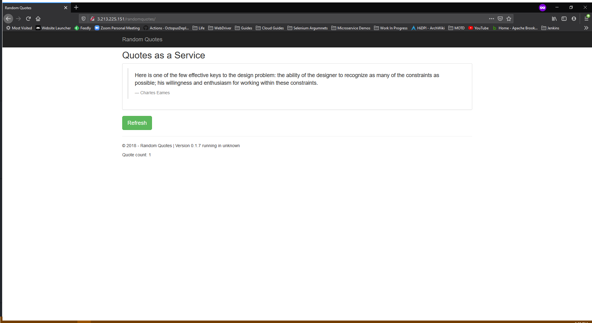

With that, we have demonstrated zero downtime deployments. Because our database migrations were designed to be backward compatible, version *0.1.6.1* and version *0.1.7* of our application can run side by side using Tomcat parallel deployments. Best of all, sessions for old deployments can still be transferred between Tomcat instances, so we retain high availability along with the parallel deployments.

## Rollback strategies

As long as database compatibility has been maintained between the last and current version of the application (versions `0.1.6.1` and `0.1.7` in this example), rolling back is as simple as creating a new deployment with the previous version of the application.

Because the Tomcat version has a timestamp calculated at deployment time, deploying version `0.1.6.1` of the application again results in it processing any new traffic as it has a later version.

Note, any existing sessions for version `0.1.7`, will be left to naturally expire thanks to the Tomcat’s parallel deployments. If this version has to be taken offline (for example, if there is a critical issue and it can not be left in service), we can use the **Start/stop App in Tomcat** step to stop a deployed application.

We’ll create a runbook to run this step, as it is a maintenance task that may need to be applied to any environment to pull a bad release.

We start by adding a prompted variable that will be populated with the Tomcat version timestamp corresponding to the deployment we want to shutdown:

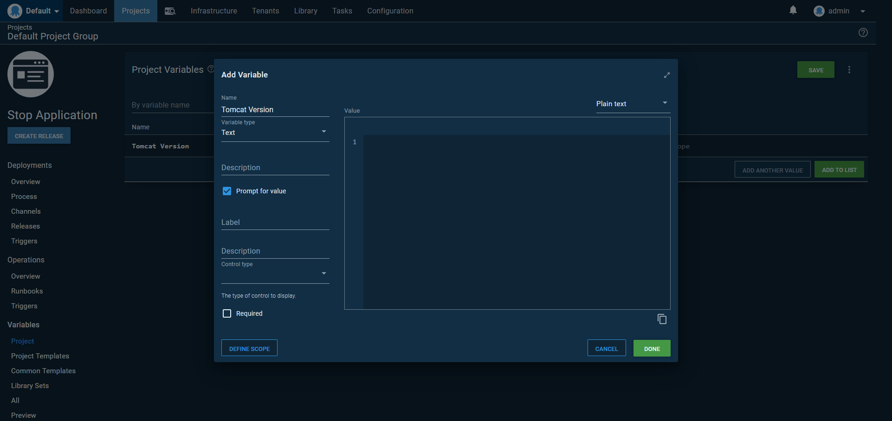

The runbook is then configured with the **Start/stop App in Tomcat** step. The **Deployment version** is set to the value of the prompted variable:

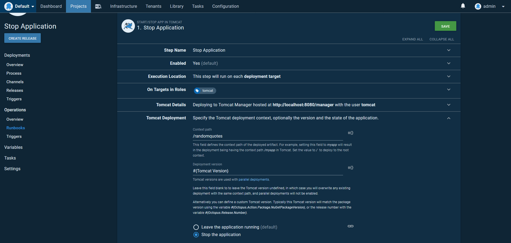

When the runbook is run, we are prompted for the timestamp version of the application to stop:

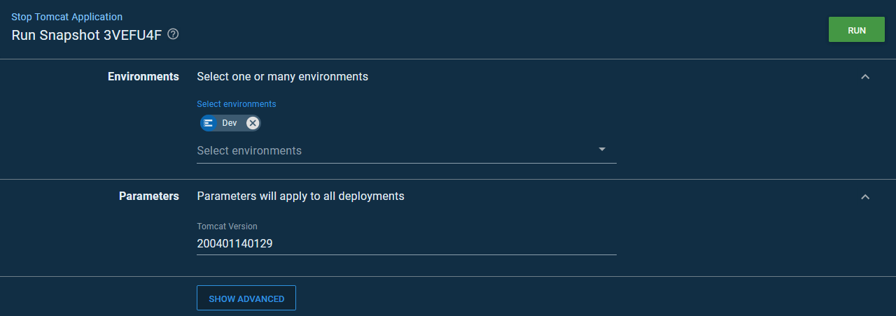

After the runbook has completed, we can verify the application was stopped by opening the Manager console. In the screenshot below, you can see version **200401140129** is not running. This version no longer responds to requests, and all future requests will then be directed to the latest version of the application:

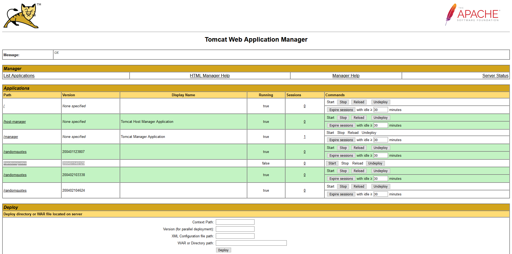

## Feature branch deployments

A common development practice is completing a feature in a separate SCM branch, known as a feature branch.

A CI server will typically watch for the presence of feature branches and create a deployable artifact from the code committed there.

These feature branch artifacts are then versioned to indicate which branch they were built from. GitVersion is a popular tool for generating versions to match commits and branches in Git, and they offer this example showing [versions created as part of their GitHub flow](https://gitversion.net/docs/git-branching-strategies/githubflow-examples):


As you can see from the image above, a commit to a feature branch called **myfeature** generates a version like **1.2.1-myfeature.1+1**. This in turn, produces an artifact with a filename like `myapp.1.2.1-myfeature.1+1.zip`.

Despite the fact that tools like GitVersion generate SemVer version strings, the same format can be used for Maven artifacts. However, there is a catch.

SemVer will order a version with a feature branch lower than a version without any pre-release component. For example, **1.2.1** is considered a higher version number than **1.2.1-myfeature**. This is the expected ordering as a feature branch will eventually be merged back into the master branch.

When a feature branch is appended to a Maven version, it is considered a qualifier. Maven allows any qualifiers but recognizes some special ones like **SNAPSHOT**, **final**, **ga**, etc. A complete list can be found in the blog post [Maven versions explained](https://octopus.com/blog/maven-versioning-explained). Maven versions with unrecognized qualifiers (and feature branch names are unrecognized qualifiers) are treated as later releases than unqualified versions.

This means Maven considers version **1.2.1-myfeature** is to be a later release than **1.2.1**, when clearly that is not the intention of a feature branch. You can verify this behavior with the following test in a project hosted on [GitHub](https://github.com/mcasperson/MavenVersionTest/blob/master/src/test/java/org/apache/maven/artifact/versioning/VersionTest.java#L122).

However, thanks to the functionality of channels in Octopus, we can ensure that both SemVer pre-release and Maven qualifiers are filtered in the expected way.

Here is the default channel for our application deployment. Note, the regular expression **^$** for the **Pre-release tag** field. This regular expression only matches empty strings, meaning the default channel will only ever deploy artifacts with no pre-release or qualifier string:

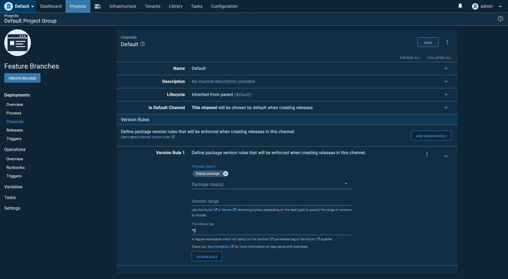

Next, we have the feature branch channel, which defines a regular expression of **.+** for the **Pre-release tag** field. This regular expression only matches non-empty strings, meaning the feature branch channel will only deploy artifacts with a pre-release or qualifier string:

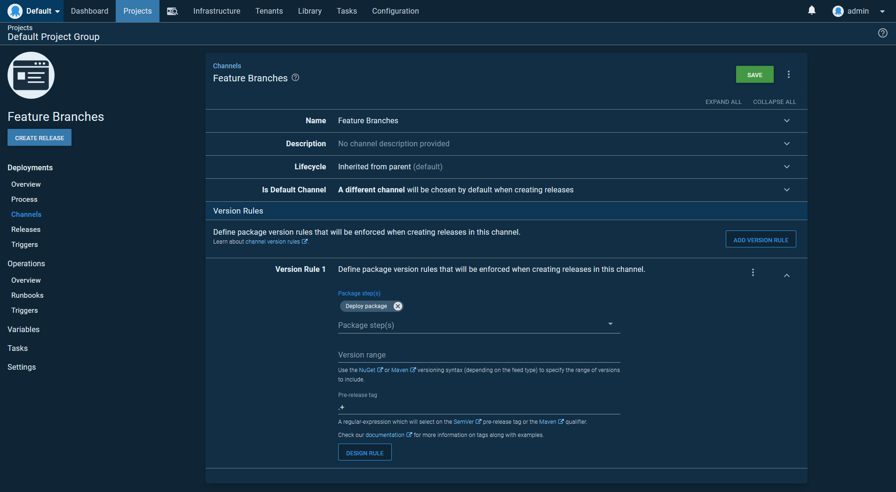

Here is the list of versions that Octopus allows a release to be created from in the default channel. Notice, the only version displayed has no qualifier, which we take to mean it is the master release:

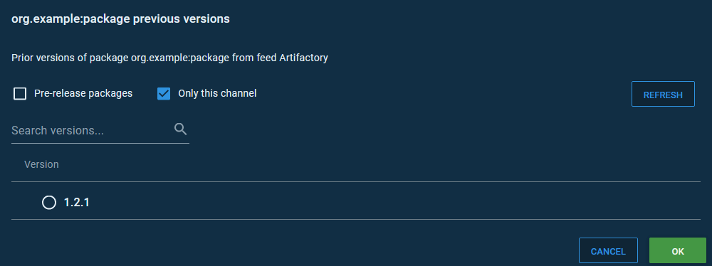

Here is the list of versions that Octopus allows a release to be created from using the feature branch channel. All of these versions have a qualifier embedding the feature branch name:

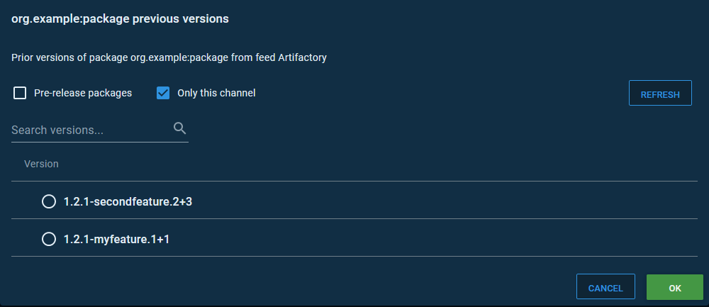

The end result of these channels is that versions like **1.2.1-myfeature** will never be compared to versions like **1.2.1**, which removes the ambiguity with feature branch version numbers being considered later releases.

The final step is to deploy these feature branch packages to unique contexts so they can be accessed side by side on a single Tomcat instance. To do this we modify the **Context path** to:

```
/randomquotes#{Octopus.Action.Package.PackageVersion | Replace "^([0-9\.]+)((?:-[A-Za-z0-9]+)?)(.*)$" "$2"}
```

Using the regular expression above on the version `1.2.1-myfeature.1+1` will do the following:

* `^([0-9\.]+)` groups all digits and periods at the start of the version as group 1, which matches `1.2.1`.
* `((?:-[A-Za-z0-9]+)?)` groups the leading dash and any subsequent alphanumeric characters (if any) as group 2, which matches `-myfeature`.
* `(.*)$` groups any subsequent characters (if any) as group 3, which matches `.1+1`.

This variable filter will result in the complete pre-release or qualifier strings being replaced by just the second group from the regular expression. This results in the following context path:

* Version `1.2.1-myfeature.1+1` generates a context path of `/randomquotes-myfeature`.
* Version `1.2.1` generates a context path of `/randomquotes`.

Here is a screenshot of the Tomcat deployment step with the new context path applied:

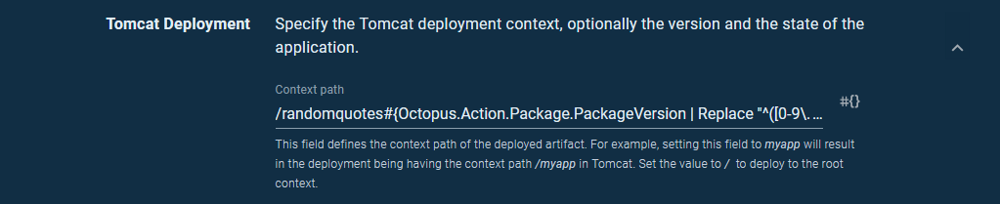

:::hint
The SemVer project provides a more [robust regular expression](https://semver.org/#is-there-a-suggested-regular-expression-regex-to-check-a-semver-string) that reliably captures the groups in a SemVer version.

The regular expression with named capture groups is:

```
^(?P<major>0|[1-9]\d*)\.(?P<minor>0|[1-9]\d*)\.(?P<patch>0|[1-9]\d*)(?:-(?P<prerelease>(?:0|[1-9]\d*|\d*[a-zA-Z-][0-9a-zA-Z-]*)(?:\.(?:0|[1-9]\d*|\d*[a-zA-Z-][0-9a-zA-Z-]*))*))?(?:\+(?P<buildmetadata>[0-9a-zA-Z-]+(?:\.[0-9a-zA-Z-]+)*))?$
```

The regular expression without named groups is:

```
^(0|[1-9]\d*)\.(0|[1-9]\d*)\.(0|[1-9]\d*)(?:-((?:0|[1-9]\d*|\d*[a-zA-Z-][0-9a-zA-Z-]*)(?:\.(?:0|[1-9]\d*|\d*[a-zA-Z-][0-9a-zA-Z-]*))*))?(?:\+([0-9a-zA-Z-]+(?:\.[0-9a-zA-Z-]+)*))?$
```
:::

## Public certificate management

To finish configuring our infrastructure, we will enable HTTPS access via our load balancers. We can edit the Apache web server virtual host configuration to enable SSL and point to the keys and certificates we have obtained for our domain.

### Obtain a certificate

For this post, I have obtained a Let’s Encrypt certificate, generated through our DNS provider. The exact process for generating HTTPS certificates is not something we’ll look at here, but you can refer to your DNS or certificate provider for specific instructions.

In the screenshot below, you can see the various options available for downloading the certificate. Note, while instructions and downloads are provided for Apache, we are downloading the PFX file provided under the instructions for IIS. PFX files contain the public certificate, private key, and certificate chain in a single file. We need this single file to upload the certificate to Octopus. Here we download the PFX file for the `octopus.tech` domain:

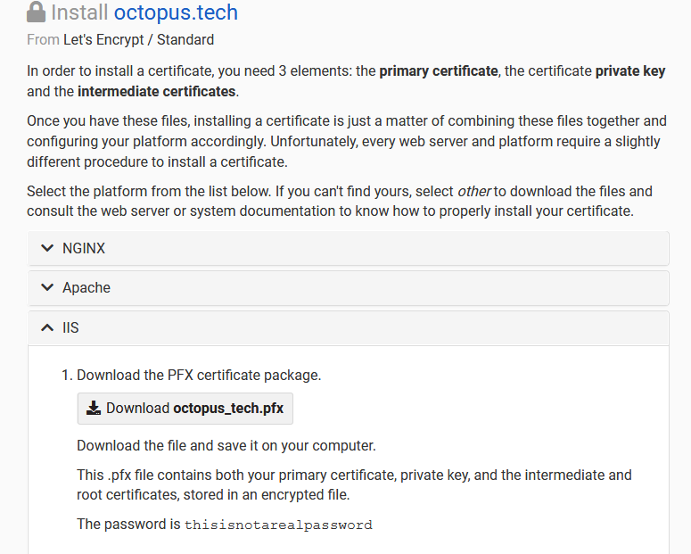

### Create the certificate in Octopus

Deploying certificates is an ongoing operation. In particular, certificates provided by Let’s Encrypt expire every three months, and so need to be frequently refreshed.

This makes deploying certificates a great use case for runbooks. Unlike a regular deployment, runbooks don’t need to progress through environments, and you don’t need to create a deployment. We’ll create a runbook to deploy the certificate to the Apache load balancers.

First, we need to upload the PFX certificate that was generated by the DNS provider. In the screenshot below you can see the Let’s Encrypt certificate uploaded to the Octopus certificate store:

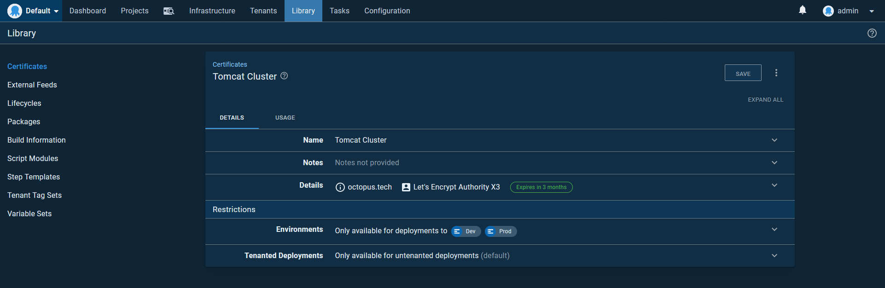

### Deploy the certificate

Create a new project in Octopus, and add the certificate we just uploaded as a variable:

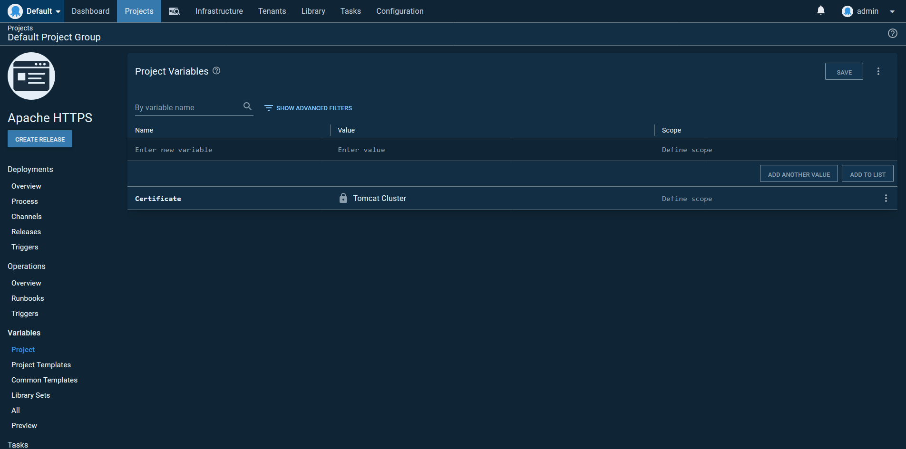

Next, create a runbook with a single **Run a Script** step.

The first step in the script is to enable **mod_ssl** with the command:

```bash
a2enmod ssl
```

Then create some directories to hold the certificate, certificate chain, and private key:

```bash
[ ! -d "/etc/apache2/ssl" ] && mkdir /etc/apache2/ssl
[ ! -d "/etc/apache2/ssl/private" ] && mkdir /etc/apache2/ssl/private
```

The contents of the certificate variable are then saved as files into the directories above. Certificates are special variables that expose the individual components that make up a certificate with [expanded properties](https://octopus.com/docs/projects/variables/certificate-variables#expanded-properties). We need to access three properties:

* `Certificate.CertificatePem`, which is the public certificate.
* `Certificate.PrivateKeyPem`, which is the private key.
* `Certificate.ChainPem`, which is the certificate chain.

We print the contents of these variables into three files:

```bash
get_octopusvariable "Certificate.CertificatePem" > /etc/apache2/ssl/octopus_tech.crt
get_octopusvariable "Certificate.PrivateKeyPem" > /etc/apache2/ssl/private/octopus_tech.key
get_octopusvariable "Certificate.ChainPem" > /etc/apache2/ssl/octopus_tech_bundle.pem
```

If you recall, earlier in the post we created the file `/etc/apache2/sites-enabled/000-default.conf` with the following contents:

```xml
<VirtualHost *:80>
  ErrorLog ${APACHE_LOG_DIR}/error.log
  CustomLog ${APACHE_LOG_DIR}/access.log combined
  JkMount /* loadbalancer
</VirtualHost>
```

We want to modify this file, like so:

```xml
<VirtualHost *:443>
  ErrorLog ${APACHE_LOG_DIR}/error.log
  CustomLog ${APACHE_LOG_DIR}/access.log combined
  JkMount /* loadbalancer
  SSLEngine on
  SSLCertificateFile /etc/apache2/ssl/octopus_tech.crt
  SSLCertificateKeyFile /etc/apache2/ssl/private/octopus_tech.key
  SSLCertificateChainFile /etc/apache2/ssl/octopus_tech_bundle.pem
</VirtualHost>
```

This is done by echoing the desired text into the file `/etc/apache2/sites-enabled/000-default.conf`:

```bash
{
cat << EOF
<VirtualHost *:443>
  ErrorLog ${APACHE_LOG_DIR}/error.log
  CustomLog ${APACHE_LOG_DIR}/access.log combined
  JkMount /* loadbalancer
  SSLEngine on
  SSLCertificateFile /etc/apache2/ssl/octopus_tech.crt
  SSLCertificateKeyFile /etc/apache2/ssl/private/octopus_tech.key
  SSLCertificateChainFile /etc/apache2/ssl/octopus_tech_bundle.pem
</VirtualHost>
EOF
} > /etc/apache2/sites-enabled/000-default.conf
```

The final step is to restart the `apache2` service to load the changes:

```bash
systemctl restart apache2
```

Here is the complete script for reference:

```bash
a2enmod ssl

[ ! -d "/etc/apache2/ssl" ] && mkdir /etc/apache2/ssl
[ ! -d "/etc/apache2/ssl/private" ] && mkdir /etc/apache2/ssl/private
get_octopusvariable "Certificate.CertificatePem" > /etc/apache2/ssl/octopus_tech.crt
get_octopusvariable "Certificate.PrivateKeyPem" > /etc/apache2/ssl/private/octopus_tech.key
get_octopusvariable "Certificate.ChainPem" > /etc/apache2/ssl/octopus_tech_bundle.pem

{
cat << EOF
<VirtualHost *:443>
  ErrorLog ${APACHE_LOG_DIR}/error.log
  CustomLog ${APACHE_LOG_DIR}/access.log combined
  JkMount /* loadbalancer
  SSLEngine on
  SSLCertificateFile /etc/apache2/ssl/octopus_tech.crt
  SSLCertificateKeyFile /etc/apache2/ssl/private/octopus_tech.key
  SSLCertificateChainFile /etc/apache2/ssl/octopus_tech_bundle.pem
</VirtualHost>
EOF
} > /etc/apache2/sites-enabled/000-default.conf
systemctl restart apache2
```

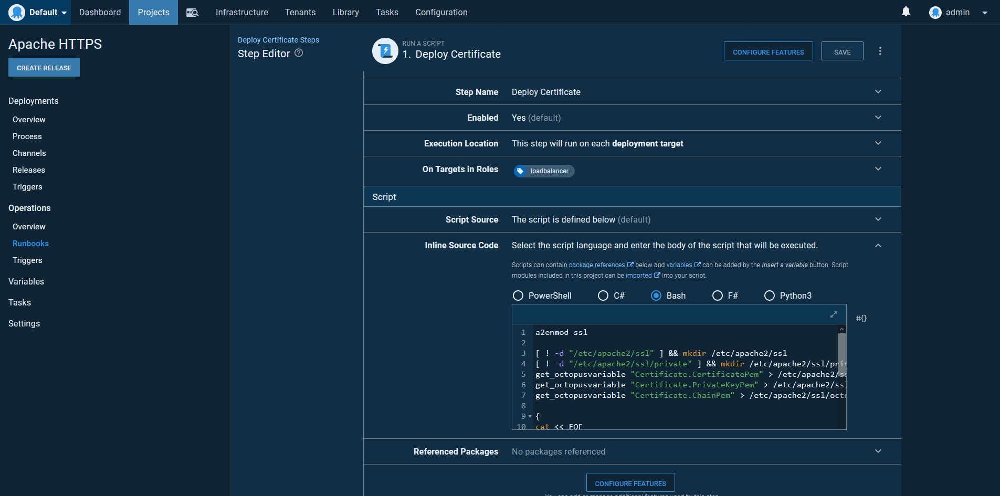

After the runbook has completed, we can verify the application is exposed via HTTPS:

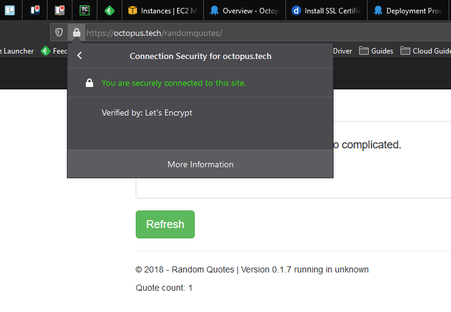

## Internal certificate management

As we’ve seen, it is useful to connect directly to the Tomcat instances when using the Manager console. This connection transfers credentials and should be done across a secure connection. To support this, we configure Tomcat with self-signed certificates.

### Create self-signed certificates

Because our Tomcat instances are not exposed via a hostname, [we don’t have the option of getting a certificate for them](https://cabforum.org/internal-names/). To enable HTTPS, we need to create self-signed certificates, which can be done with OpenSSL:

```
openssl genrsa 2048 > private.pem
openssl req -x509 -new -key private.pem -out public.pem -days 3650
openssl pkcs12 -export -in public.pem -inkey private.pem -out mycert.pfx
```

### Add the certificate to Tomcat

The certificate is configured in Tomcat using the **Deploy a certificate to Tomcat** step.

The **Tomcat CATALINA_HOME path** is set to `/usr/share/tomcat9` and the **Tomcat CATALINA_BASE path** is set to `/var/lib/tomcat9`.


We reference a certificate variable for the **Select certificate variable** field. The default value of **Catalina** is fine for the **Tomcat service name**.

We have a few choices for how the certificate is handled by Tomcat. Generally speaking, the **Blocking IO**, **Non-Blocking IO**, **Non-Blocking IO 2**, and **Apache Portable Runtime** options have an increasing level of performance. The **Apache Portable Runtime** is an additional library that Tomcat can take advantage of, and it is provided by the Tomcat packages we installed with `apt-get`, so it makes sense to use that option.

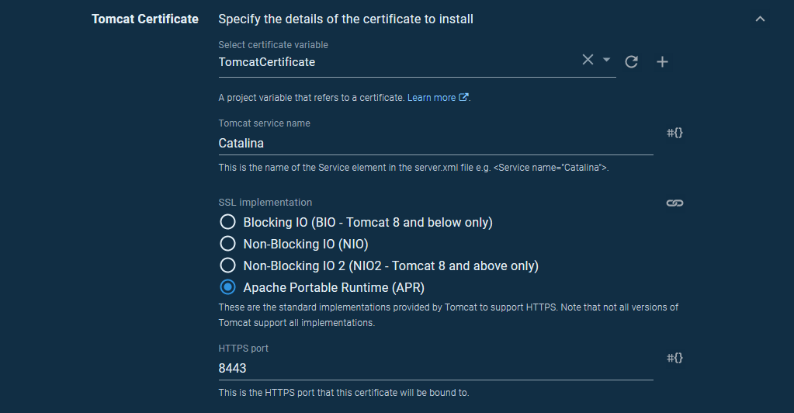

To allow Tomcat to use the new configuration, we need to restart the service with a script step using the command:

```
systemctl restart tomcat9
```

We can now load the manager console from `https://tomcatip:8443/manager/html`.

## Scale up to multiple environments

The infrastructure we have created thus far can now be used as a template for other testing or production environments. Nothing we have presented here is environment specific, meaning all the processes and infrastructure can be scaled out to as many environments as needed.

By associating the Tentacles assigned to the new Tomcat and load balancer instanced to additional environments in Octopus, we gain the ability to push deployments through to production:

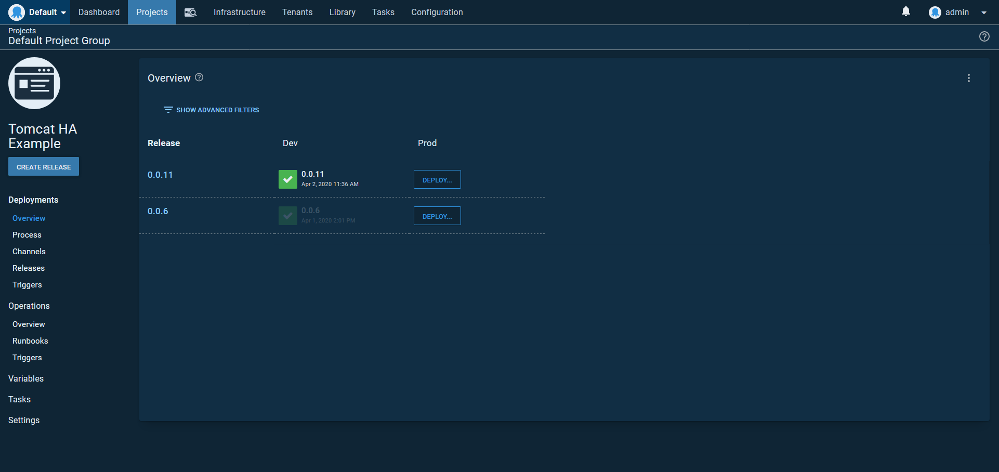

## Conclusion

If you have reached this point, congratulations! Setting up a highly available Tomcat cluster with zero downtime deployments, feature branches, rollback, and HTTPS is not for the fainthearted. It is still up to the end user to combine multiple technologies to achieve this result, but I hope the instructions laid out in this blog post expose some of the magic that goes into real world Java deployments.

To summarize, in this post we:

* Configured Tomcat session replication with a PostgreSQL database and session cookie rewriting with the `JvmRouteBinderValve` valve.
* Configured Apache web servers acting as load balancers with the mod_jk plugin.
* Implemented high availability amongst the load balancers with Keepalived.
* Performed zero downtime deployments with Tomcat’s parallel deployment feature and Flyway performing backward compatible database migrations.
* Smoke tested the deployments with community steps in Octopus.
* Implemented feature branch deployments, taking into account the limitations of the Maven versioning strategy with Octopus channels.
* Looked at how applications can be rolled back or pulled from service.
* Added HTTPS certificates to Apache.
* Repeated the process for multiple environments.
