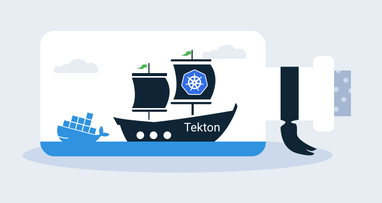

Kubernetes is quickly evolving from a Docker orchestration platform to a general purpose cloud operating system. With [operators](https://octopus.com/blog/operators-with-kotlin) Kubernetes gains the ability to natively manage high-level concepts and business processes, meaning you are no longer managing the building blocks of Pods, Services, and Deployments, but instead, describing the things those building blocks can create like web servers, databases, continuous deployments, certificate management, and more.

When deployed to a Kubernetes cluster, Tekton Pipelines expose the ability to define and execute build tasks, inputs and outputs in the form of simple values or complex objects like Docker images, and to combine these resources in pipelines. These new Kubernetes resources, and the controllers that manage them result in a headless CI/CD platform hosted by a Kubernetes cluster.

In this post, we’ll take a look at a simple build pipeline running on MicroK8S.

## Preparing the test Kubernetes cluster

For this post, I’m using [MicroK8S](https://microk8s.io/) to provide the Kubernetes cluster. MicroK8S is useful here because it offers a selection of [official add-ons](https://microk8s.io/docs/addons), one of which is a Docker image registry. Since our pipeline builds a Docker image, we need somewhere to host it, and the MicroK8S registry add-on gives us that functionality with a single command:

```
microk8s.enable registry
```

We also need to enable DNS lookups from within the MicroK8S cluster. This is done by enabling the DNS add-on:

```
microk8s.enable dns
```

## Installing Tekton Pipelines

Installation of Tekton Pipelines is simple, with a single `kubectl` (or `microk8s.kubectl` in our case) command:

```
microk8s.kubectl apply --filename https://storage.googleapis.com/tekton-releases/pipeline/latest/release.yaml
```

We can now create Tekton resources in our Kubernetes cluster.

## A "Hello World" task

Tasks contain the individual steps that are executed to do work. In the example below, we have a task with a single step that executes the `echo` command with the arguments `Hello World` in a container built from the `ubuntu` image.

The YAML below shows our `helloworldtask.yml` file:

```
apiVersion: tekton.dev/v1alpha1
kind: Task
metadata:
  name: echo-hello-world
spec:
  steps:
    - name: echo
      image: ubuntu
      command:
        - echo
      args:
        - "Hello World"
```

The task resource is created in the Kubernetes cluster with the command:

```
microk8s.kubectl apply -f helloworldtask.yml
```

A task describes how work is to be done, but creating the task resource does not result in any action being taken. A task run resource references the task, and the creation of a task run resource triggers Tekton to execute the steps in the referenced task.

The YAML below shows our `helloworldtaskrun.yml` file:

```
apiVersion: tekton.dev/v1alpha1
kind: TaskRun
metadata:
  name: echo-hello-world-task-run
spec:
  taskRef:
    name: echo-hello-world
```

The task run resource is created in the Kubernetes cluster with the command:

```
microk8s.kubectl apply -f helloworldtaskrun.yml
```

## Building a Docker image

To move beyond this hello world example, we’ll look at the canonical use case of a Tekton build pipeline, which is to compile and push a Docker image. To demonstrate this functionality, we’ll build our [RandomQuotes](https://github.com/OctopusSamples/RandomQuotes-Java) sample application.

We start the pipeline with a pipeline resource. Pipeline resources provide a decoupled method of defining inputs for the build process.

The first input we need is the Git repository that holds our code. Pipeline resources have a number of known types, and here we define a `git` pipeline resource specifying the URL and branch holding our code:

```YAML
apiVersion: tekton.dev/v1alpha1
kind: PipelineResource
metadata:
  name: randomquotes-git
spec:
  type: git
  params:
    - name: revision
      value: master
    - name: url
      value: https://github.com/OctopusSamples/RandomQuotes-Java.git
```

Next, we define the Docker registry holding our compiled image. This is where the MicroK8S registry add-on is useful, as it exposes a Docker registry at http://registry.container-registry.svc.cluster.local:5000.

Here is the pipeline resource of type `image` defining the Docker image we’ll create as `registry.container-registry.svc.cluster.local:5000/randomquotes`:

```YAML
apiVersion: tekton.dev/v1alpha1
kind: PipelineResource
metadata:
  name: randomquotes-image
spec:
  type: image
  params:
    - name: url
      value: registry.container-registry.svc.cluster.local:5000/randomquotes
```

With the input source code and destination Docker image defined, we can create a task to create the Docker image and push it to the repository.

Traditionally, building Docker images is performed by the Docker client directly on the host operating system. However, in Kubernetes, everything is run inside Docker, which leads to the question: How do you run Docker inside Docker?

Over the last few years, there has been an explosion of tools designed to perform the processes provided by the Docker CLI and daemon, but without any dependency on Docker itself. These include tools like [umoci](https://github.com/openSUSE/umoci) for unpacking and repacking Docker images, [Kaniko](https://github.com/GoogleContainerTools/kaniko) and [Buildah](https://github.com/containers/buildah) for building Docker images from a Dockerfile, and [Podman](https://podman.io/) for running Docker images.

We’ll use Kaniko in our Tekton task to build our Docker image inside the Docker container provided by Kubernetes. The YAML below shows the complete task:

```YAML
apiVersion: tekton.dev/v1alpha1
kind: Task
metadata:
  name: build-docker-image-from-git-source
spec:
  inputs:
    resources:
      - name: docker-source
        type: git
    params:
      - name: pathToDockerFile
        type: string
        description: The path to the dockerfile to build
        default: /workspace/docker-source/Dockerfile
      - name: pathToContext
        type: string
        description:
          The build context used by Kaniko
          (https://github.com/GoogleContainerTools/kaniko#kaniko-build-contexts)
        default: /workspace/docker-source
  outputs:
    resources:
      - name: builtImage
        type: image
  steps:
    - name: build-and-push
      image: gcr.io/kaniko-project/executor:v0.17.1
      # specifying DOCKER_CONFIG is required to allow kaniko to detect docker credential
      env:
        - name: "DOCKER_CONFIG"
          value: "/tekton/home/.docker/"
      command:
        - /kaniko/executor
      args:
        - --dockerfile=$(inputs.params.pathToDockerFile)
        - --destination=$(outputs.resources.builtImage.url)
        - --context=$(inputs.params.pathToContext)
```

There are some important aspects to this task that are worth pointing out.

There are two properties in this task that relate to the pipeline resources that we created above.

An input resource of type `git`:

```YAML
inputs:
    resources:
      - name: docker-source
        type: git
```

And an output of type `image`:

```YAML
outputs:
  resources:
    - name: builtImage
      type: image
```

There are two additional input parameters that define paths used for the Docker build process:

```YAML
spec:
  inputs:
    params:
      - name: pathToDockerFile
        type: string
        description: The path to the dockerfile to build
        default: /workspace/docker-source/Dockerfile
      - name: pathToContext
        type: string
        description:
          The build context used by Kaniko
          (https://github.com/GoogleContainerTools/kaniko#kaniko-build-contexts)
        default: /workspace/docker-source
```

Note that the path `/workspace/docker-source` is a convention used by `git` resources, with the `docker-source` directory matching the name of the input.

We then have a single step that builds the Docker image. The build is executed in a container created from the `gcr.io/kaniko-project/executor:v0.17.1` image, that provides Kaniko:

```YAML
spec:
  steps:
    - name: build-and-push
      image: gcr.io/kaniko-project/executor:v0.17.1
      # specifying DOCKER_CONFIG is required to allow kaniko to detect docker credential
      env:
        - name: "DOCKER_CONFIG"
          value: "/tekton/home/.docker/"
      command:
        - /kaniko/executor
      args:
        - --dockerfile=$(inputs.params.pathToDockerFile)
        - --destination=$(outputs.resources.builtImage.url)
        - --context=$(inputs.params.pathToContext)
```

Finally, a task run is used to bind the task and pipeline resources together. This resource maps the task `docker-source` input to the `randomquotes-git` pipeline resource and the `builtImage` output to the `randomquotes-image` pipeline resource.

Creating this resource then triggers the build to take place:

```YAML
apiVersion: tekton.dev/v1alpha1
kind: TaskRun
metadata:
  name: build-docker-image-from-git-source-task-run
spec:
  taskRef:
    name: build-docker-image-from-git-source
  inputs:
    resources:
      - name: docker-source
        resourceRef:
          name: randomquotes-git
    params:
      - name: pathToDockerFile
        value: Dockerfile
      - name: pathToContext
        value: /workspace/docker-source
  outputs:
    resources:
      - name: builtImage
        resourceRef:
          name: randomquotes-image
```

## Interacting with builds

Tekton itself does not provide any kind of dashboard or GUI for interacting with jobs. However, there is a [CLI tool](https://github.com/tektoncd/cli) for managing Tekton jobs.

The Tekton CLI tool assumes `kubectl` is configured, but MicroK8S maintains a separate tool called `microk8s.kubectl`. The easiest way to configure `kubectl` is with the following command which copies the MicroK8S configuration file to the standard location for `kubectl`:

```
sudo microk8s.kubectl config view --raw > $HOME/.kube/config
```

At this point, we can get the status of the task with the command:

```
tkn taskrun logs build-docker-image-from-git-source-task-run
```


## Is Tekton for you?

The idea of a headless build server is an intriguing one.

By composing builds with Docker images, Tekton removes the overhead of maintaining a suite of specialized build agents. Every tool and language provides a supported Docker image these days, making it easier to keep up with the new normal of six month release cycles for major language versions.

Kubernetes is also a natural platform to serve the elastic and short-lived requirements of software builds. Why have ten specialized agents sitting idle when you can have five nodes scheduling builds between them?

However, I suspect Tekton itself is too low-level for most engineering teams. The `tkn` CLI tool will be familiar to anyone who has used `kubectl` before, but it is difficult to understand the overall state of your builds from the terminal. Not to mention creating builds with `kubectl create -f taskrun.yml`  gets old quickly.

There is a [dashboard](https://github.com/tektoncd/dashboard) available, but it is a bare-bones user interface compared to existing CI tools.


That said, Tekton is a powerful foundation on which to build developer facing tools. [Jenkins X](https://jenkins-x.io/) and [OpenShift Pipelines](https://www.openshift.com/learn/topics/pipelines) are two such platforms that leverage Tekton under the hood.

## Conclusion

Kubernetes solves many of the requirements for running applications like authentication, authorization, CLI tooling, resource management, health checks, and more. The fact that a Kubernetes cluster can host a fully functional CI server with a single command is a testament to just how flexible Kubernetes is.

With projects like [Jenkins X](https://jenkins-x.io/) and [OpenShift Pipelines](https://www.openshift.com/learn/topics/pipelines), Tekton is at the start of a journey into mainstream development workflows. But as a standalone project, Tekton is a little too close to the metal to be something most development teams could use, if only because few people would have the experience to support it.
