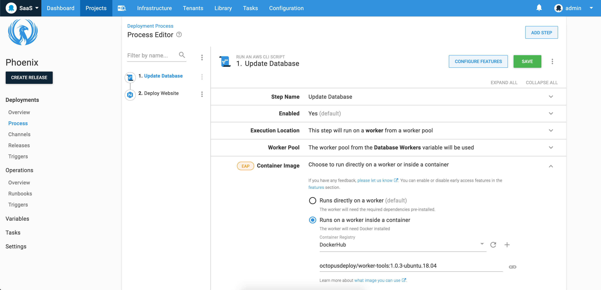
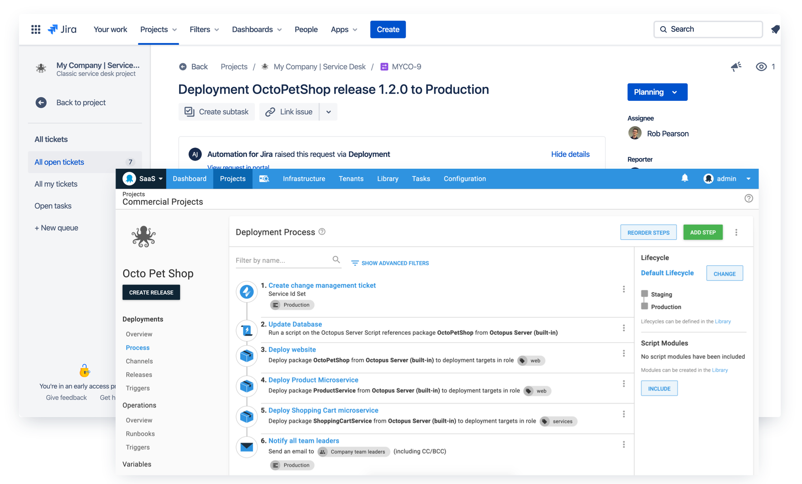
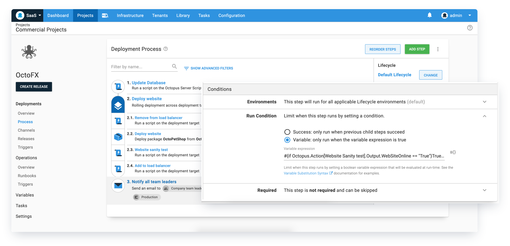
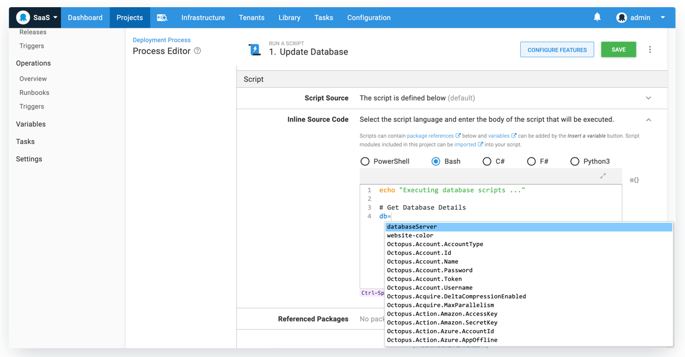

We're pleased to ship Octopus 2020.2, our second release of the year, with some great updates and benefits.

* [Execution containers for Workers (EAP)](blog/2020-05/octopus-release-2020-2/index.md#execution-containers-for-workers) enables you to execute deployment work in isolation without the need to manage dependencies and containers.
* [Integrated change management with Jira Service Desk](blog/2020-05/octopus-release-2020-2/index.md#integrated-change-management-with-jira-service-desk) allows team teams to automatically create change requests during their deployment.
* [Better run conditions](blog/2020-05/octopus-release-2020-2/index.md#better-run-conditions) adds deployment process improvements including rolling deployment and machine level variable conditions.
* [Fast variable lookups with our improved code editor](blog/2020-05/octopus-release-2020-2/index.md#fast-variable-lookups-in-our-updated-code-editor) unlocks the ability to quickly add Octopus variables into your custom scripts without touching the mouse.

This release is the [second of six in 2020](/blog/2020-03/releases-and-lts/index.md), and it includes 6 months of long term support. The following table shows our current releases with long term support. 

| Release               | Long term support           |
| --------------------- | --------------------------- |
| Octopus 2020.2        | Yes                         |
| Octopus 2020.1        | Yes                         |
| Octopus 2019.12       | Yes                         |
| Octopus 2019.9        | Expired                     |
| Octopus 2019.6        | Expired                     |

Keep reading to learn more about the updates.

## Execution containers for Workers



Workers were introduced in Octopus 2018.7 and they help teams move deployment work off the Octopus Server and onto other machines running in worker pools. Common scenarios for Workers include database deployments and cloud deployments where by you can create a pool of workers for that specific purpose. Worker pools can also be scoped to environments to suit your needs.

In this release, we're adding support to execute deployment work in isolated containers on Workers and we're shipping a collection of official container images bootstrapped with common deployment tooling. 

Previously, you would need to ensure the servers in your worker pools (including the built-in worker pool) have the necessary tools required for your deployments and you needed to maintain the OS and tool versions. This could also be problematic if different teams required different versions of specific tools which don't install side by side. This is further complicated by the fact that Octopus bundles some tooling to simplify deployments but this is also a challenge to keep up to date. 

**Execution containers for Workers** solve these problems and more.

* **Isolated and fast execution of deployment work.** Octopus is using [Docker](https://docker.com) to execute your scripts or other deployment work in the context of a container. This is fast and efficient isolated execution.
* **Simplified dependency management with pre-built [Octopus tooling container images](https://hub.docker.com/r/octopusdeploy/worker-tools)**. There is now far less friction required to ensure you're using the right versions of the tooling that you need for your deployments. 

Our pre-built images include cross platform support for Windows 2019 and Ubuntu 18.04 and you can select the `latest` image tag or a specific version based on major, minor or specific patch verisons. We are launching with the following tools installed. 

* Powershell Core
* .NET Core SDK (3.1 LTS)
* Java SDK
* Azure CLI
* Az Powershell Core Modules
* AWS CLI
* Node.js
* kubectl
* Helm 3
* Terraform
* Python
* Azure Function Core Tools
* Google Cloud CLI
* ScriptCS (Window-only)
* F# (Windows-only)

It's also possible to build your own container images with your team's exact requirements. For example, you can build a customize image with a specific version of kubectl with the following command.

```
docker build -t my-company/worker-tools --build-arg Kubectl_Version=X.Y.Z MyDockerFile
```

[Learn more](https://octopus.com/docs/deployment-process/execution-containers-for-workers)

## Integrated change management with Jira Service Desk



With Octopus 2020.2, we're shipping our initial support for integrated chanage management with Jira Service Desk Cloud. It is now possible to automatically create change requests during a deployment with our new Jira Service Desk Change Request step. 

This integration leverages our [Octopus Deploy for Jira plugin](https://marketplace.atlassian.com/apps/1220376/octopus-deploy-for-jira) and requires the [ITSM early access](https://support.atlassian.com/jira-service-desk-cloud/docs/set-up-an-itsm-project/). See [Atlassian's documentation](https://support.atlassian.com/jira-service-desk-cloud/docs/set-up-change-management-for-your-service-desk/) for more information on how to configure Octopus Deploy integration within within your ITSM project.

This release is the first part of a larger change management story so I recommend registering for updates on our [public roadmap](https://octopus.com/roadmap#change-management) to stay up to date with this feature.

Note: The Octopus Deploy plugin is only compatible with Jira Cloud and Jira Service Desk Cloud, as the APIs we depend on are only available in Jira Cloud. When those APIs become available in Jira Server this extension will work there too.

[Learn more](https://octopus.com/jira)

## Better run conditions



Run conditions allow you to custom each step in your deployment process to provide greater control over the step's execution. This release adds support for rolling deployment and machine level run conditions.

### Rolling deployment variable run conditions

It is now possible to add variable run conditions to child steps in rolling deployments. This adds greater flexibility to rolling deployments and allows you to customize the deployment process based on your specific needs. For example, you could check to see if a web service updated in a previous step is running (i.e. a a sanity test), and if so, run it re-add it back to a web farm.

[Learn more](https://octopus.com/docs/deployment-process/conditions)

### Machine-level variable run conditions

Another new addition to variable run conditions is added support for machine-level variables. The rolling deployment example above highlights this improvement as well. In such a deployment, if you check to see if a recently updated web service updated is running (i.e. a a sanity test) and set a variable to indicate the result, this is a machine-level variable that can then be resolved in a run condition in a future step within the same rolling deployment.

[Learn more](https://octopus.com/docs/deployment-process/conditions#machine-level-variable-expressions)

## Fast variable lookups in our updated code editor



We've also added a handy shortcut to be able to insert variables quickly without needing to click the variable lookup button. Press `Control` + `Space` on your keyboard to get a quick variable lookup menu with fuzzy search support. Select the appropriate variable using the arrow keys and then press `Enter`. This simply update is very handy once you get used to it. Try it today.

## Breaking changes

Octopus 2020.1 introduced [updated minimum requirements](https://octopus.com/blog/raising-minimum-requirements-for-octopus-server) for running Octopus Server to Windows Server 2012 R2 and SQL Server 2017. This release is now enforcing the SQL Server minimum requirements.

## Upgrading

Octopus Cloud users are already running this release, and self-hosted Octopus customers can [download](https://octopus.com/downloads/2020.2.0) the latest release now.  

As usual, the [steps for upgrading Octopus Deploy](https://octopus.com/docs/administration/upgrading) apply. Please see the [release notes](https://octopus.com/downloads/compare?to=2020.2.0) for further information.

## What's coming in Octopus 2020.3?

Check out our [public roadmap](https://octopus.com/roadmap) to see what's coming next. We're about to start work on some incredible new features, including deep git integration, unlocking pipeline as code.

## Conclusion

TODO: Write conclusion

Feel free to leave us a comment, and let us know what you think! Happy deployments!

## Related posts

- Related blog post 1
- Related blog post 2
