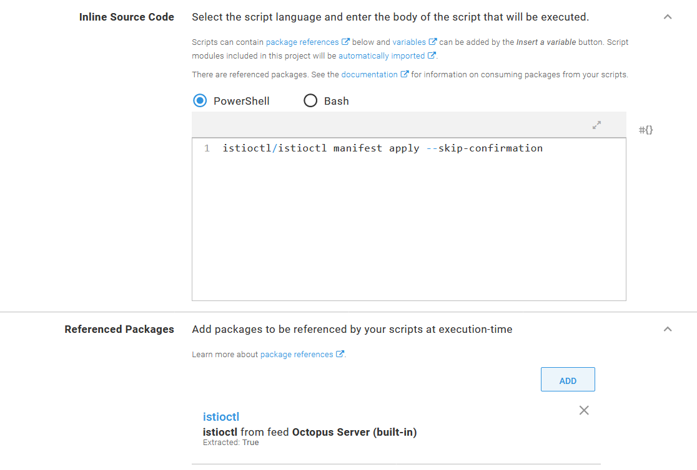
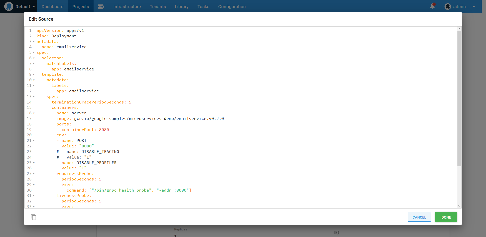
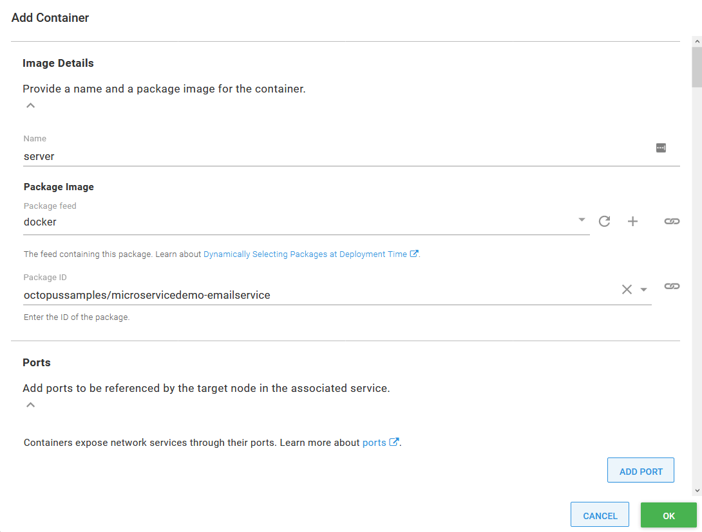

Microservices have emerged as a popular development practice for teams looking to release complex systems quickly and reliably. Kubernetes provides a natural platform for microservices as it handles much of the orchestration requirements imposed by deploying many instances of many individual microservices. On top we have service mesh technologies which lift common networking concerns from the application layer into the infrastrucutre, making it easy to route, secure, log and test network traffic.

Combining these development practices with Kubernetes to create a Continuous integration and delivery (CI/CD) pipeline does require some work however, as a robust CI/CD pipeline must address a number of concerns such as:

* High availability (HA)
* Multiple environments
* Zero downtime deployments
* HTTPS and certificate management
* Feature branch deployments
* Smoke testing
* Rollback strategies

In this blog post I look at how to create the continuous delivery (or deployment) half of the CI/CD pipeline by deploying a sample microservice application created by Google called [Hipster Shop](https://github.com/GoogleCloudPlatform/microservices-demo) to an Amazon EKS Kubernetes cluster, configure the Istio service mesh to handle network routing, and dive into HTTP and gRPC networking to route tenanted network traffic through the cluster to test feature branches.

## Create an EKS cluster

For this blog post we'll be deploying our microservice to a Kubernetes cluster hosted by Amazon EKS. However, we don't rely on any special functionality provided by EKS, so any Kubernetes cluster can be used to follow this post.

The easiest way to get started with EKS is with the [ekscli tool](https://eksctl.io/). This CLI tool abstracts away most of the details associated with creating and managing an EKS cluster, providing sensible defaults to get you up and running quickly.

TODO: Use the community library step to build the cluster.

## Creating the AWS account

Octopus has native support for autheticating to EKS clusters via an AWS account. This account is defined under {{ Infrastructure, Accounts }}.


## Create the Kubernetes target

Kubernetes targets are created under  {{ Infrastructure, Deployment Targets }}. Select the **AWS Account** option in the **Authentication** section, and add the name of the EKS cluster.


Under the **Kubernetes Details** section add the URL to the EKS cluster, and either select the cluster certificate or check the **Skip TLS verification** option.

The default namespace that this target operates in is defined in the **Kubernetes namespace** field.

:::hint
Each step in a deployment process can override the namespace, so it is possible to leave this field blank and reuse one target across multiple namespaces.
:::


:::hint
The Octopus server or workers that execute the steps must have `kubectl` and the AWS `aws-iam-authenticator` executable available on the path. See the [documentation](https://octopus.com/docs/infrastructure/deployment-targets/kubernetes-target#add-a-kubernetes-target) for more details.
:::

## Installing Istio

Istio provides many installation options, but I find the `istioctl` tool to be the easiest.

Download a copy of `istioctl` from [GitHub](https://github.com/istio/istio/releases). The filename will be something like `istioctl-1.5.2-win.zip`, which we rename to `istioctl.1.5.2.zip` and then upload into Octopus. Placing the executable in the Octopus built in feed means we can use it from a script step.

Add a **Run a kubectl CLI Script** step to a runbook, and reference the `istioctl` package:


In the script body, execute `istioctl` as shown below to install Istio into the EKS cluster. You can find more information on these commands from the [Istio documentation](https://istio.io/docs/setup/install/istioctl/):

```
istioctl/istioctl manifest apply --skip-confirmation
```

:::hint
You must use the `--skip-confirmation` argument to prevent `istioctl` waiting forever for input that can not be provided when the tool is run through Octopus.
:::



## Creating a Docker feed

The Docker images that make up our microservice application will be hosted in DockerHub. While Google provides images from their own Google Container Registry, the images do not have SemVer compatible tags, which Octopus requires to sort images during release creation time. We'll also be creating some feature branch images to deploy to the cluster, and so need a public repository we can publish to. A new Docker feed is created under {{Library, External Feeds}}:


## Deploying the microservices

The Hipster Shop sample application provides a [Kubernetes YAML file](https://github.com/GoogleCloudPlatform/microservices-demo/blob/master/release/kubernetes-manifests.yaml) with all the deployments and services needed to run the application.

Each of the individual services will be deployed as a seperate project in Octopus. One of the advantages of microservices is that each service has an independant lifecycle allowing it to be tested and deployed independant of any other service. Creating individual Octopus projects for each microservice allows us to create and deploy releases for just that service.

The first microservice mentioned in the YAML file is called `emailservice`, which we'll deploy in a project called `01. Hipster Shop - Email service`. This microservice has two Kubernetes resources: the deployment, and a service. The YAML for these two resources is shown below:

```YAML
apiVersion: apps/v1
kind: Deployment
metadata:
  name: emailservice
spec:
  selector:
    matchLabels:
      app: emailservice
  template:
    metadata:
      labels:
        app: emailservice
    spec:
      terminationGracePeriodSeconds: 5
      containers:
      - name: server
        image: gcr.io/google-samples/microservices-demo/emailservice:v0.2.0
        ports:
        - containerPort: 8080
        env:
        - name: PORT
          value: "8080"
        # - name: DISABLE_TRACING
        #   value: "1"
        - name: DISABLE_PROFILER
          value: "1"
        readinessProbe:
          periodSeconds: 5
          exec:
            command: ["/bin/grpc_health_probe", "-addr=:8080"]
        livenessProbe:
          periodSeconds: 5
          exec:
            command: ["/bin/grpc_health_probe", "-addr=:8080"]
        resources:
          requests:
            cpu: 100m
            memory: 64Mi
          limits:
            cpu: 200m
            memory: 128Mi
---
apiVersion: v1
kind: Service
metadata:
  name: emailservice
spec:
  type: ClusterIP
  selector:
    app: emailservice
  ports:
  - name: grpc
    port: 5000
    targetPort: 8080
```

This pairing of a deployment and a service resource is a pattern we'll find over and over in the YAML file. The deployments are used to deploy and manage the containers that implement the microservices, while the service resource exposes these containers to the other microservices, and for the front end application also exposing the microservice to end users.

The pattern of combining common Kubernetes resources is exposed in Octopus via the **Deploy Kubernetes containers** step. This opinionated step provides a rich user interface around Kubernetes deployments, services, ingresses, secrets and configmaps, making this step a natural choice to deploy our Hipster Shop microservices.

One of the downside to using the **Deploy Kubernetes containers** step has been how much time it took to translate the properties in an existing YAML file into the user interface. Each setting had to be copyed in manually, which was a significant undertaking.

A recent feature added in Octopus 2020.2.4 is the ability to edit the YAML that is generated by this step directly. Clicking the **EDIT YAML** button for each Kubernetes resource allowed YAML to be copied into the step directly in one go:


In the screenshot below you can see that I have pasted in the YAML that makes up the `emailservice` deployment resource:



Any property from the supplied YAML that matches a field exposed by the form is imported. In the screenshot below you can see the `server` container has been imported complete with environment settings, health checks, resource limits and ports:


:::hint
Not every possible deployment property is recognized by the **Deploy Kubernetes containers** step, and unrecognized properties are ignored during import. The `Deploy raw Kubernetes YAML` step provides a way to deploy generic YAML to a Kubernetes cluster. However, all properties used by the microservices that make up the Hipster Shop sample application are exposed by the **Deploy Kubernetes containers** step.
:::

We'll then import the service YAML for into the **Service** section of the step:


Our microservices won't be deploying ingress, secret or configmap resources, so we can remove these feature from the step by clicking the **CONFIGURE FEATURES** button:


The final step is to reference the containers we have built and uploaded to Docker Hub. The import process referenced the container `microservices-demo/emailservice` that was defined in the deployment YAML. We need to change this to `octopussamples/microservicedemo-emailservice` to reference the container that has been uploaded to by the [OctopusSamples](https://hub.docker.com/u/octopussamples) Docker Hub user:



And with that we have created an Octopus project to deploy `emailservice`, one of the eleven microservices that make up the Hipster Shop sample application. The other microservices are called:

* `checkoutservice`
* `recommendationservice`
* `frontend`
* `paymentservice`
* `productcatalogservice`
* `cartservice`
* `loadgenerator`
* `currencyservice`
* `shippingservice`
* `redis-cart`
* `adservice`

Most of these microservices are deployed with the same deployment and service pairing that we have seen for the `emailservice`. The exceptions are `loadgenerator`, which has no service, and `frontend`, which includes an additional load balancer service that exposes the microservice to public traffic. 

The additional load balancer service can be deployed with the **Deploy Kubernetes service resource** step. This stand alone step has the same **EDIT YAML** button found in the **Deploy Kubernetes containers** step, and so the `frontend-external` service YAML can be imported directly:


## High Availability

Replica count and pod anti affinity

## Zero downtime deployments

Rolling deployments or blue/green deployments

## HTTPS and certificate management

https://istio.io/docs/tasks/traffic-management/ingress/secure-ingress-sds/

## Feature branch deployments

grpc metadata headers and istio routing

## Smoke testing

HTTP test community step library

## Rollback strategies

Deployment rollback or deploy previous Octopus version

## Multiple environments

Different namespaces or different clusters