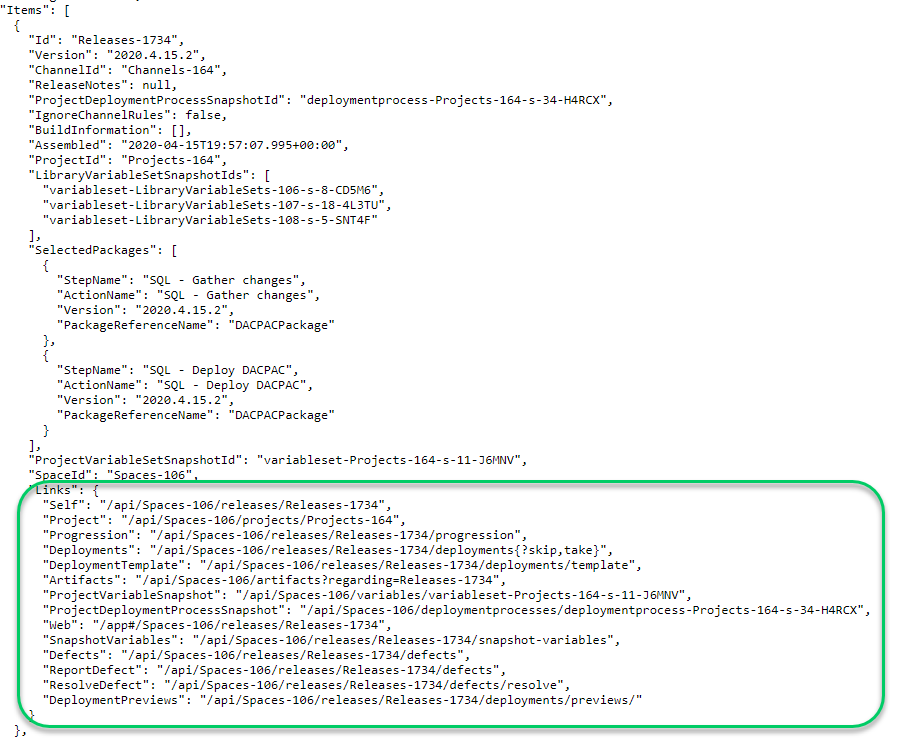

I was happy with how the [feature branch example](https://samples.octopus.app/app#/Spaces-106/projects/redgate-feature-branch-example/deployments) I put together for my [webinar with Redgate](https://event.on24.com/eventRegistration/EventLobbyServlet?target=reg20.jsp&partnerref=OS&eventid=2307799&sessionid=1&key=DCB6FD8458D78BEEBB341BE31CF8279B&regTag=&sourcepage=register).  My co-hosts at Redgate liked it so much they want a copy of their own to poke around with.  That sample project is located on Octopus Cloud, so I couldn't use the [migrator](https://octopus.com/docs/administration/data/data-migration), and if I am honest, I didn't want to for this specific use case.  For those of you who don't know, everything done in the Octopus Web Portal hits the Octopus Deploy RESTful API.  I set out to write a PowerShell script to use the Octopus API to copy a project from the sample instance over to Redgate's instance.  In this post, I share how I accomplished that and what you can do to write your own script.

**TL;DR;** I posted my script in [GitHub under the Octopus Samples organization](https://github.com/OctopusSamples/SpaceCloner).  Going forward, our team will use this script internally to speed up the creation of samples in that instance.  You can try it out for yourself, fork it, and modify it to meet your company's needs.

!toc

## Limitations of the Octopus Data Migration tool

The bundled [Octopus Data Migration](https://octopus.com/docs/administration/data/data-migration) tool does exactly what it says on the tin.  It helps migrate an Octopus project from one instance to another.  But quite often, I see people attempt to use the tool for use cases it wasn't designed for.  It is a blunt instrument.  You give it a project name, and it becomes a giant vacuum cleaner that sucks up everything about the project and exports it ready to be imported on another instance.

The migrator has several limitations for my use case:

- It has to be run on the same server as the Octopus Deploy instance because it needs direct access to the database to retrieve sensitive variables.  It was designed to _just work_ for migration, meaning all sensitive variables come along for the ride. However, I don't have access to cloud instances (they are running in a Kubernetes container).
- Any updates to the deployment process on the destination instance will be overridden.  Imagine my friends at Redgate opted to modify their deployment process for their own specific needs.  They asked for a fresh sync.  The migrator would come in and nuke any of their changes.
- It doesn't preserve existing steps in the deployment process.  If my friends at Redgate opted to change the worker pool name or variable name, a fresh sync would overwrite that as well.
- It exports too much data for subsequent runs.  After the initial, run I don't care about lifecycle phases, worker pools, environments, or anything like that.  I just want to make sure they have the latest steps in a deployment process and any missing variables.

With PowerShell, the Octopus Deploy API, and some if/then statements (okay _a lot_ of if/then statements), I can get 90-95% of the way there.

## Limitations of the Octopus Deploy API

The Octopus Deploy API cannot decrypt sensitive variables.  This includes account variables, variables marked as sensitive, and external feed usernames and passwords.  For my use case, all of that is perfectly acceptable.  I don't want to give Redgate all that sensitive information.  They have their own database servers, their own AWS cloud accounts, and so on.

Like any RESTful API, it is not very good at handling massive amounts of BLOB data in an efficient manner, such as packages, task logs, artifacts, project images, and tenant images.  In the end, this worked out fine for my use case as these items were not something I was interested in cloning to Redgate's instance.  They want the process, but they don't care about the releases, deployments, snapshots, and so on.  

## Goals of the script

If you write code that tries to be all things to all people, you end up with code that barely works for anybody, or it's a complex mess no one can maintain or understand.

My goals for my script were:
1. Support multiple runs - I should be able to run the script multiple times and not have it nuke and pave everything in sight.
2. Pick and choose items to clone - At first, I want to clone a lot of data to lay the foundation.  After that, I only want to clone a subset of the data.
3. Keep it simple stupid (KISS) - don't try to _walk the tree_ of dependencies.  Look up items by name, and if a match is found, great, use that.  Assume data won't be there and handle it.
4. Focus on this use case - I had to remind myself multiple times to only focus on the specific use case.  Don't try to make it work for every scenario.  Just do one scenario really well.

## API basics

As I wrote the script, I noticed a number of general rules I wanted to share to help.

### Same set of properties

All core objects (environments, projects, workers, etc.) have the same three properties:
- ID
- Name
- SpaceID

They will be named that.  I wrote a couple of helper functions to help find items by ID or Name in a list:

```PowerShell
function Get-OctopusItemByName
{
    param (
        $ItemList,
        $ItemName
        )    

    return ($ItemList | Where-Object {$_.Name -eq $ItemName})
}

function Get-OctopusItemById
{
    param (
        $ItemList,
        $ItemId
        ) 
        
    Write-VerboseOutput "Attempting to find $ItemId in the item list of $($ItemList.Length) item(s)"

    foreach($item in $ItemList)
    {
        Write-VerboseOutput "Checking to see if $($item.Id) matches with $ItemId"
        if ($item.Id -eq $ItemId)
        {
            Write-VerboseOutput "The Ids match, return the item $($item.Name)"
            return $item
        }
    }

    Write-VerboseOutput "No match found returning null"
    return $null    
}
```

### The Links object

All objects returned from the Octopus Deploy API have a Links object.  This is very useful when you need to update an existing item or you need to go to the next page in a list.



### Consistent endpoints parameters

For the items I needed to create or query, I noticed Octopus Deploy's API follows the same set of rules.

- Get all [x] items: Don't use the `all` endpoint, rather use the parameters `?skip=0&take=10000` to pull in the top 10,000 items.  If 10,000 is too much, use `?skip=0&take=100` and then use the paging properties on the links object.
- Create new item: Do a `POST` to the endpoint.  Ensure the ID property has been set to `$null` or removed.  The URL should just be the basic endpoint; a `POST` to `api/Spaces-1/environments` will create a new environment.
- Update existing item: Do a `PUT` to the endpoint.  The URL should include the ID, for example, `api/Spaces-1/environments/environments-1` to update that specific environment.
- The endpoints will always return an Error object with a message when the endpoint returns a 500 error.  

Because of that, I was able to put together some helper functions to query the Octopus API:

```PowerShell
function Get-OctopusUrl
{
    param (
        $EndPoint,        
        $SpaceId,
        $OctopusUrl
    )  

    if ($EndPoint -match "/api")
    {        
        return "$OctopusUrl/$endPoint"
    }
    
    if ([string]::IsNullOrWhiteSpace($SpaceId))
    {
        return "$OctopusUrl/api/$EndPoint"
    }
    
    return "$OctopusUrl/api/$spaceId/$EndPoint"
}

function Invoke-OctopusApi
{
    param
    (
        $url,
        $apiKey,
        $method,
        $item
    )

    try 
    {
        Write-VerboseOutput "Invoking $method $url"

        if ($null -eq $item)
        {            
            return Invoke-RestMethod -Method $method -Uri $url -Headers @{"X-Octopus-ApiKey"="$ApiKey"}
        }

        $body = $item | ConvertTo-Json -Depth 10
        Write-VerboseOutput $body
        return Invoke-RestMethod -Method $method -Uri $url -Headers @{"X-Octopus-ApiKey"="$ApiKey"} -Body $body
    }
    catch 
    {
        $result = $_.Exception.Response.GetResponseStream()
        $reader = New-Object System.IO.StreamReader($result)
        $reader.BaseStream.Position = 0
        $reader.DiscardBufferedData()
        $responseBody = $reader.ReadToEnd();
        Write-VerboseOutput -Message "Error calling $url $($_.Exception.Message) StatusCode: $($_.Exception.Response.StatusCode.value__ ) StatusDescription: $($_.Exception.Response.StatusDescription) $responseBody"        
    }

    Throw "There was an error calling the Octopus API please check the log for more details"
}

Function Get-OctopusApiItemList
{
    param (
        $EndPoint,
        $ApiKey,
        $SpaceId,
        $OctopusUrl
    )    

    $url = Get-OctopusUrl -EndPoint $EndPoint -SpaceId $SpaceId -OctopusUrl $OctopusUrl    

    $results = Invoke-OctopusApi -Method "Get" -Url $url -apiKey $ApiKey
    
    Write-VerboseOutput "$url returned a list with $($results.Items.Length) item(s)" 

    return $results.Items
}

Function Get-OctopusApi
{
    param (
        $EndPoint,
        $ApiKey,
        $SpaceId,
        $OctopusUrl
    )    

    $url = Get-OctopusUrl -EndPoint $EndPoint -SpaceId $SpaceId -OctopusUrl $OctopusUrl    

    $results = Invoke-OctopusApi -Method "Get" -Url $url -apiKey $ApiKey

    return $results
}

Function Save-OctopusApi
{
    param (
        $EndPoint,
        $ApiKey,
        $Method,
        $Item,
        $SpaceId,
        $OctopusUrl
    )

    $url = Get-OctopusUrl -EndPoint $EndPoint -SpaceId $SpaceId -OctopusUrl $OctopusUrl 
    
    $results = Invoke-OctopusApi -Method $Method -Url $url -apiKey $ApiKey -item $item

    return $results
}

function Save-OctopusApiItem
{
    param(
        $Item,
        $Endpoint,
        $ApiKey,
        $SpaceId,
        $OctopusUrl
    )    

    $method = "POST"

    if ($null -ne $Item.Id)    
    {
        Write-VerboseOutput "Item has id, updating method call to PUT"
        $method = "Put"
        $endPoint = "$endPoint/$($Item.Id)"
    }
    
    $results = Save-OctopusApi -EndPoint $Endpoint $method $method -Item $Item -ApiKey $ApiKey -OctopusUrl $OctopusUrl -SpaceId $SpaceId

    Write-VerboseOutput $results

    return $results
}
```

### Don't forget the logging

At first, I didn't have a lot of logging.  That was a mistake, but I quickly learned I needed to log everything.  Not only that, log the JSON requests being sent up to the API.  This makes debugging go so much quicker.  

I wanted to make it easy to let the user know general informational message vs. warnings vs. errors.  I used the simple `Green` for good, `Yellow` for warning and `Red` for bad.  I also added a verbose log to write out everything to a file.  I made a few helpful functions to help with logging:

```PowerShell
$currentDate = Get-Date
$currentDateFormatted = $currentDate.ToString("yyyy_MM_dd_HH_mm")
$logPath = "$PSScriptRoot\Log_$currentDateFormatted.txt"
$cleanupLogPath = "$PSScriptRoot\CleanUp_$currentDateFormatted.txt"

function Write-VerboseOutput
{
    param($message)
    
    Add-Content -Value $message -Path $logPath    
}

function Write-GreenOutput
{
    param($message)

    Write-Host $message -ForegroundColor Green
    Write-VerboseOutput $message    
}

function Write-YellowOutput
{
    param($message)

    Write-Host $message -ForegroundColor Yellow    
    Write-VerboseOutput $message
}

function Write-RedOutput
{
    param ($message)

    Write-Host $message -ForegroundColor Red
    Write-VerboseOutput $message
}

function Write-CleanUpOutput
{
    param($message)

    Write-YellowOutput $message
    Add-Content -Value $message -Path $cleanupLogPath
}
```

### Translating ID values

The source instance might have `Environments-123` for `Production` while the destination is set to `Environments-555`.  To translate that you'll need to:

1. Translate the source ID to a name.
2. Translate the name to a destination ID.

Again, I wrote a helper function for that:

```PowerShell
function Convert-SourceIdToDestinationId
{
    param(
        $SourceList,
        $DestinationList,
        $IdValue
    )

    Write-VerboseOutput "Getting Name of $IdValue"
    $sourceItem = Get-OctopusItemById -ItemList $SourceList -ItemId $IdValue
    Write-VerboseOutput "The name of $IdValue is $($sourceItem.Name)"

    Write-VerboseOutput "Attempting to find $($sourceItem.Name) in Destination List"
    $destinationItem = Get-OctopusItemByName -ItemName $sourceItem.Name -ItemList $DestinationList
    Write-VerboseOutput "The destination id for $($sourceItem.Name) is $($destinationItem.Id)"

    if ($null -eq $destinationItem)
    {
        return $null
    }
    else
    {
        return $destinationItem.Id
    }
}
```

### Follow the path of least resistance

For your script, focus on the most important items first.  Perfect is the enemy of done.  

I ran into a few tricky spots in my API script.  Specifically around:

- Script package references
- Assigning manual interventions to teams
- Tenant variables
- Handling different versions of Octopus Deploy (2020.2 cloning to 2020.1)

I opted to follow the path of least resistance.  I either wrote the code to remove items (package references), set a default (manual interventions), skip them (tenant variables), or added a guard clause to prevent it from running (different versions of Octopus Deploy).  If I get a high enough demand for those specific items, I'll probably look into adding them.  But for now, the complexity in getting them working vs. the reward just wasn't worth it.  

## Gathering the data

My goal was to clone that project from our samples instance onto a new instance.  A project is more than just a _project_.  It is dependent on a lot of other data inside Octopus, so I focused on items I always have to create when standing up a new space or a new instance.

This is the list of data I came up:

- Environments
- Worker Pools (not workers, just the pools)
- Project Groups
- External Feeds
- Tenant Tags
- Step Templates (both community and custom step templates)
- Accounts
- Library Variable Sets
- Lifecycles
- Projects
    - Settings
    - Deployment Process
    - Runbooks
    - Variables
- Tenants (no tenant variables)

I purposely left some key items off that list.  Some may surprise you:

- Targets
- Workers
- Deployments
- Releases
- Packages
- Users
- Teams
- Roles
- External Auth Providers

My use case was to copy a project from my samples instance to a new instance run by Redgate.  Every one of the items in the list above would be different between our two instances.  I wanted to keep it simple.  I marked them as excluded and proceeded.

## Sensitive values and dummy data

I knew I would run across a number of sensitive values.  I also knew I couldn't get the actual value, nor did I want to.  However, in a lot of cases, specifically accounts, they expect _something_ to be entered.  I created the following two rules in my script:

1. If the data doesn't exist, enter dummy data.  If possible, use `DUMMY VALUE`.  
2. If the data does exist, leave it alone.  Don't attempt to overwrite it.  

## Filtering the data

Each of the items I want to clone essentially followed this workflow.  I'll use environments as the example:

1. Load all the environments in the source.
2. Load all the environments in the destination.
3. Filter the source environments using the user provided filter.
4. Compare the filtered list with the destination, if it exists, skip it, if it doesn't exist, create it.

For some objects, that got quite a bit more complex.  I had to translate certain properties, or I had to remove certain properties.  In some cases, I wanted to overwrite existing data.  

Keeping the filter simple, yet powerful, was critical to me.  I opted for the following:

- `All` - keyword, will attempt to clone all data for that object.
- Comma Separated list - specify a CSV, such as `test,staging,production`, which will clone those three specific values.
- Wildcard support using Regular Expressions - can be combined with a CSV, so you could specify `AWS*,Notification` for variable sets, and that will bring across all variable sets which start with AWS and the notification variable set.

## Variables and Deployment Process

The variables and deployment process are the most complex part of the clone.  The initial run is straight-forward, take what is in the source and copy it over to the destination.  

Subsequent runs are tricky.  I started off with three basic rules:

1. Redgate most likely fixed all the dummy data initially created by my script.
2. Redgate would not like to fix the same dummy data created by my script over and over.
3. Redgate most likely will have altered the variables and deployment process in some way.

You can replace *Redgate* with *my users* for your own script.  I imagine the same is most likely true for you.  

The source project was the source of truth.  I wrote the script to follow these rules:

1. Loop through the source data.  For each item, check if the data exists on the destination, and if it doesn't exist, clone from the source.  Otherwise, use the existing data.
2. Loop through the destination data.  For each item, check the source to see if it exists.  If the item doesn't exist on the source, then add it back.  

Let's use a tangible example.  I have a deployment process on my destination instance.  The deployment process on my destination instance has a new step that is not in the source.

::: warning
To keep things clear, the destination instance is using dark mode.  The source instance is using light mode.
:::


The process on my source instance has step 3, which doesn't appear in the destination process.


The process after the sync runs, which follows the rules above, now looks like the following.  The new step 3 from the source was added in the appropriate location, then the new step found only on the destination was added after.


## Expanding the use cases

As I finished writing my script, I realized I could support a number of use cases outside of the migrator.  Those use cases were:

- Copy from cloud to self-hosted - I have a hypervisor at home, having a place I can clone to will make it easier to test things locally.
- Copy from self-hosted to cloud - copy from my hypervisor to samples instance after I am done making modifications.
- Copy default variable sets when creating a new space - the Customer Success team creates lots of new spaces on our samples instance.
- Break apart a massive space into several smaller spaces - We've done this a few times on our samples instance, having this will make that much easier.
- Keeping a parent/child project process in sync - this is a common one for a few of our samples, we will clone a project and have a different target (use AWS instead of Azure).  Keeping the two projects in sync via a script will make our lives easier.

## Sample to help get started

I realize it is a tall order to start writing a script from scratch.  That is why I have published the script(s) my team, Customer Success, uses to manage our samples instance.  You can find that [project in the Octopus Samples organization](https://github.com/OctopusSamples/SpaceCloner).  

I hope you'll fork that repo and modify it to meet your specific needs.  Perhaps you want to clone targets, or perhaps you want to exclude all variables.  That isn't a change we plan on making to that script, but by forking it, you can do whatever you like with the script.  And hopefully, the script has enough there to help with your basic cloning needs.

Until next time, Happy Deployments!
