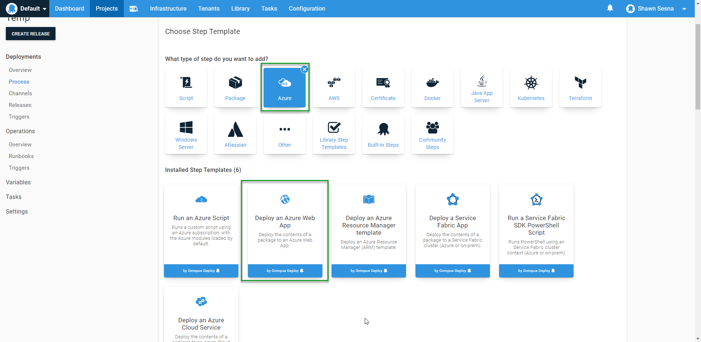

More and more of our customers are switching from running their software in Data Centers to using Cloud Providers.  When making this transition, customers are faced with a challenge, how do I adapt my existing deployment processes to include Cloud targets?  In this post, I will address a specific, yet common scenario with Microsoft .NET technologies.

## Transitioning from IIS to Azure Web Apps
Whether it's .NET or .NET core, the Deploy to IIS step is the most commonly used step template to deploy applications to Microsoft IIS.  This is most likely the starting point of a developer when they are transitioning an existing application from Data Center to Cloud.  

### Deploy an Azure Web App
When exploring the available step templates, it is logical for the developer to click on Azure category and discover the Deploy an Azure Web App template.

Great!  There's something that's already built-in, I just have to modify my existing process and replace the Deploy to IIS step with the Deploy an Azure Web app step, easy.  While this would absolutely work, it's ultimately unnecessary (more on that in just a bit).

### Local development, cloud production
What about the scenario where development is still deployed to IIS locally before ending up on Azure for Production?  Would I have to leave the IIS steps in place but add Deploy an Azure Web App for environments that are on Azure?  That is a fantastic question and not an uncommon scenario, but the answer is no (getting there, bear with me).  Cloud is great, but can sometimes get quite costly when running compute intensive operations such as automated testing suites.  It is often more cost effective to leave those on local hardware.

### So, continue to use Deploy to IIS?
YES!  Under the hood, Azure Web Apps are really just IIS Sites on Azure cloud architecture.  Since the underlying technology is the same, the step template still works despite the fact it's not specifically written for Azure.  I know it seems wierd, but it's true :)

#### Deploying to Azure requires an account, I don't see where to supply that in the Deploy to IIS step
I'll admit, this tripped me up as well.  The trick is ... there isn't one as the step doesn't need the credentials. At this point, you're probably squinting at the screen in disbelief, but I'm quite serious, you don't need to specify the credentials on the step.  The reason for this is because the credentials are supplied when creating the Azure Web App target, the authentication is happening at the target level and not the step level, which is contrary to the Azure specific step templates.

## Show me, don't tell me!
Something that I learned while being trained in my current position is that it's one thing to tell somebody it works, it's much more convincing if you an show them.  The Customer Success team has been quite busy setting up a [samples instance](https://samples.octopus.app) with all sorts of examples to showcase the capabilities of Octopus Deploy.  One such sample is the [Target - Hybrid](https://samples.octopus.app/app#/Spaces-342) which contains examples for Cloud Hybrid deployments and scenarios.

### Octo Pet Shop
Within the Samples instance, you will see our good ol' friend, Octo Pet Shop.  Octo Pet Shop is a .NET Core application using the Deploy to IIS steps

If we pop over to the Infrastructure tab, we can see that we have a number of targets set up, two VM targets and six Azure Web App targets.

The two VMs are configured for our on-premise installations of IIS for Development and Test with the Azure targets for Staging and Production.  The reason for the desparate target numbers is that I'm deploying the OctoPetShop Web, Product Service, and Shopping Cart service to a single IIS server whereas the Azure Web Apps are separated into their own apps.  Our VMs have been configured with all three roles and the Azure apps only have single.

Switching back to the Project, we can see from the Overview tab that the application has been successfully deployed to Development all the way to Production, all with a single process!

** Insert screen shot ... when you get a successful run ***

## Conclusion
In this post I demonstrated how you are able to use an existing on-premise deployment process for IIS applications to deploy to Azure Web Apps.  It is my hope that this little known fact can save you from having to re-work your deployment process to fit the cloud strategic goals.