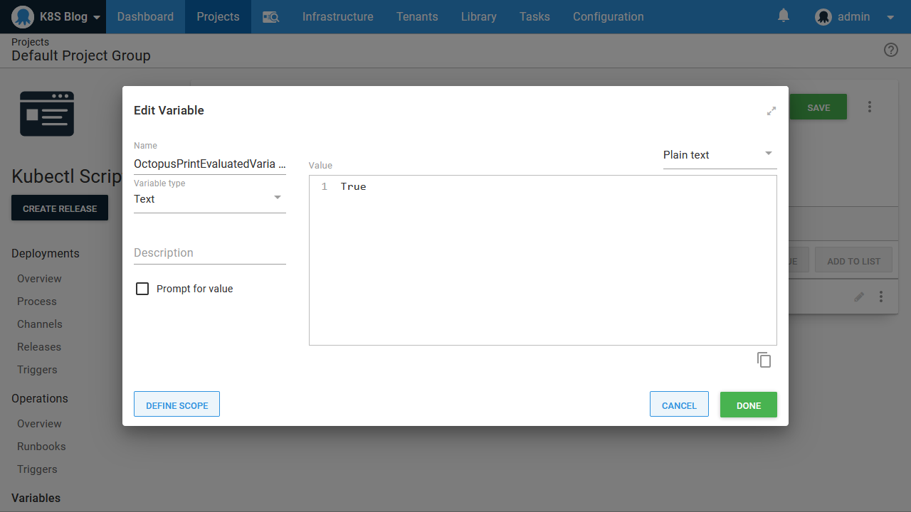

The previous blogs in this services have all focused on how to use the opinionated steps in Octopus to perform Kubernetes deployments. But there are times when you need to jump into a script. Maybe you want to take advantage of a custom scripting tool like [istioctl ](https://istio.io/docs/ops/diagnostic-tools/istioctl/) or use some advanced or uncommon properties exposed by Kubernetes resources. For these situations, Octopus allows you to write custom scripts against kubectl.

In this post we'll look at some of the tricks you can take advantage of to create flexible and reuseable scripts running against your Kubernetes cluster.

## Creating a kubectl script

The **Run a kubectl CLI script** step exposes the ability to write scripts against a Kubernetes cluster:


This step is similar to the other script steps in Octopus, with the exception that it must be run against a Kubernetes target. Behind the scenes Octopus takes the details of the Kubernetes target and constructs a configuration file scoped to the script being run. It does this by setting the `KUBECONFIG` environment variable to the path of the newly generated configuration file, which then allows all subsequent calls to `kubectl` to be directed to the Kubernetes target.

Here is a sample Powershell script that shows the environment variable and the contents of the configuration file:

```powershell
echo "KUBECONFIG environment variable is set to: $($env:KUBECONFIG)"
echo "kubectl config view returns:"
kubectl config view
```

Here is a screenshot of the result:


From the output we can see that the Kubernetes configuration file has been saved to `C:\Octopus\Master K8S Worker\Work\20200520001931-474360-35\kubectl-octo.yml`, which is a temporary directory created to hold the working files required by the step. We can also see how the configuration file has been constructed with the details saved in the Kubernetes target.

## Using variables

Our script has access to all the variables available when the step runs. The easiest way to see the variables that are available is to set the Octopus variable `OctopusPrintVariables` or `OctopusPrintEvaluatedVariables` to `True`:



With this variable defined the verbose logs will show the available variables and their values. This is a convenient way to browse the variables that can be used in your scripts:


## Referencing Docker images

One of the advantages to the Octopus deployment process is the idea that the deployment logic is relatively static, but the packages change each time. This is implemented by performing package selection at deployment time.

This process is not inherent to Kubernetes though. For example, in the deployment YAML below, you can see that we have hard coded a reference to the Docker image `mcasperson/mywebapp:0.1.7`:

```
apiVersion: apps/v1
kind: Deployment
metadata:
  name: mydeployment
  labels:
    app: mydeployment
spec:
  selector:
    matchLabels:
      app: mydeployment
  replicas: 1
  strategy:
    type: RollingUpdate
  template:
    metadata:
      labels:
        app: mydeployment
    spec:
      containers:
        - name: randomquotes
          image: mcasperson/mywebapp:0.1.7
          ports:
            - name: web
              containerPort: 80
```

Even if we did not supply the tag and used an image reference of `mcasperson/mywebapp`, the tag of `latest` is assumed, so we still effectively have a hard coded reference to a single Docker image.

To allow the YAML above to be deployed with different versions of a Docker image, we could use a tool like Helm to define the image tag via a template. But someone still has to know the version of the Docker image and supply it to Helm.

Octopus offers another option. By referencing a Docker image as an additional package, and setting it to not be acquired, Octopus will prompt for a version of the image to be selected during deployment and then expose the version as a variable at run time. Here is the Docker image referenced as an additional package:


The package version is then selected during deployment:


Finally, we scan through the variables printed in the logs to find the one that references our Docker image. You can see in the screenshot below that the variables called `Octopus.Action.Package[mywebapp].Image` is the complete Docker image name, and `Octopus.Action.Package[mywebapp].PackageVersion` is just the version:


We can use these variables in our script. The example script below writes a YAML file to disk, and then uses `kubectl` to apply it. The image property is defined as `image: #{Octopus.Action.Package[mywebapp].Image}`, which will be updated with each deployment to reflect the selected Docker image:

```Powershell
Set-Content -Path deployment.yml -Value @"
apiVersion: apps/v1
kind: Deployment
metadata:
  name: mydeployment
  labels:
    app: mydeployment
spec:
  selector:
    matchLabels:
      app: mydeployment
  replicas: 1
  strategy:
    type: RollingUpdate
  template:
    metadata:
      labels:
        app: mydeployment
    spec:
      containers:
        - name: randomquotes
          image: #{Octopus.Action.Package[mywebapp].Image}
          ports:
            - name: web
              containerPort: 80
"@

kubectl apply -f deployment.yml
```