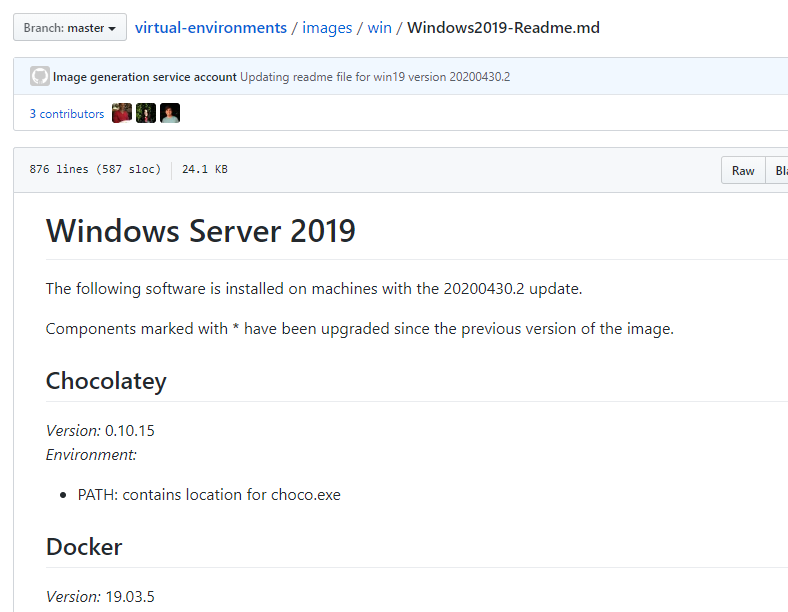
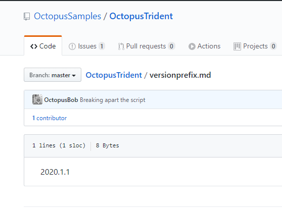
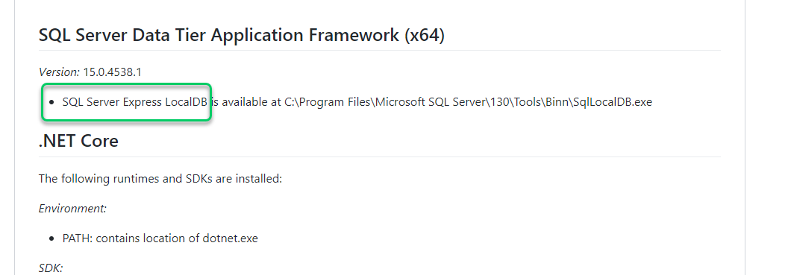
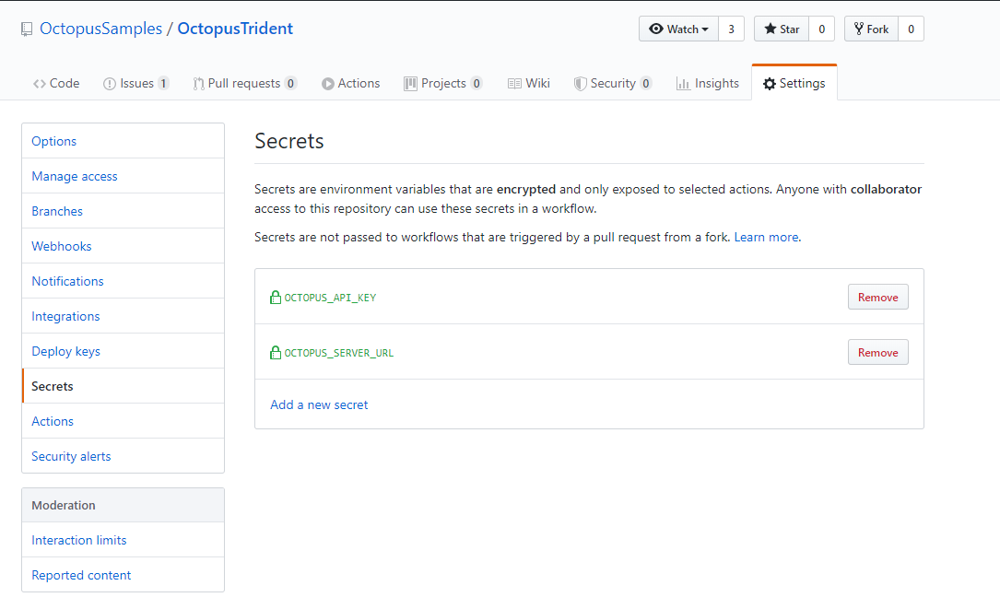

In this post, I show you how to use GitHub Actions to build a Redgate SQL Change Automation Package and push it to Octopus Deploy for deployments.

I've been prepping for a webinar on database deployments. My sample application is ready to go, and I have my deployment server ready (no doubt which one that should be), but which build server should I use?  The build server is only a small part of the webinar, and I don't feel like spinning up an entire project in Azure DevOps or standing up a sample Jenkins instance. Ryan recently wrote about [publishing a package to Octopus with GitHub Actions](https://octopus.com/blog/publishing-a-package-to-octopus-with-github-actions), so I decided to give that a shot. This approach led to several additional challenges:

- Install Redgate's SQL Change Automation to build the database package.  
- Redgate's SQL Change Automation can only be run on Windows (it requires the .NET Framework).
- Building a Redgate SQL Change Automation package involves creating a temporary database to ensure the proposed changes are syntactically correct.
- I still need to install the Octopus CLI, but Windows doesn't have a package manager built-in.  
- I think there is an easier way to define version numbers.

I overcome all of those challenges thanks to [GitHub Action's excellent documentation](https://help.github.com/en/actions/reference/workflow-syntax-for-github-actions), some examples, and a little trial and error.  Read on to see how I did it.

!toc

## Getting started

I opted to create a GitHub Action workflow file from scratch. The first decision, after the name, was what to monitor.  The monitoring possibilities are [quite staggering](https://help.github.com/en/actions/reference/events-that-trigger-workflows#webhook-events).  This is my first action, and I wanted to start simple before going complex.  A GitHub Action which monitors for changes to the master branch looks like this:

```YAML
name: Package Database

on:
  push:
    branches: 
      - master
```  

## Configuring to run on Windows

After defining the trigger, it is time to define the job and the individual steps. The samples I looked at, were configured to `run on` Ubuntu:

```YAML
jobs:
  build:

    runs-on: ubuntu-latest
```

Redgate SQL Change Automation needs to run on Windows.  I wasn't keen on standing up my own server, which GitHub calls runners, for this to work, but thankfully I didn't need to.  In looking at the documentation for [GitHub Actions](https://help.github.com/en/actions/reference/workflow-syntax-for-github-actions#jobsjob_idruns-on), a GitHub Action can run on:

- Windows
- Ubuntu
- MacOS

A deeper dive into [the documentation on hosted runners](https://help.github.com/en/actions/reference/virtual-environments-for-github-hosted-runners) provides a bit more insight.  Follow enough links, and you will end up on a page that lists the [software installed on the provided runners](https://help.github.com/en/actions/reference/software-installed-on-github-hosted-runners).

At the very top of the [installed software](https://github.com/actions/virtual-environments/blob/master/images/win/Windows2019-Readme.md) on the Windows runner is my favorite Windows Package Manager, Chocolatey.



Now we're cooking.  I am not particular about the version of Windows I need, so I chose `windows-latest`.

```YAML
name: Package Database

on:
  push:
    branches: 
      - master

jobs:
  build:
    name: Build and Push Database

    runs-on: windows-latest
```

## Installing the Octopus CLI

Most of the GitHub Action examples I found used bash scripts.  Redgate's SQL Change Automation uses PowerShell cmdlets.  The good news is [I had a choice](https://help.github.com/en/actions/reference/workflow-syntax-for-github-actions#jobsjob_idstepsrun).  My options were:

- Bash (All platforms)
- PowerShell Core (All Platforms)
- Python (All Platforms)
- Sh (Linux/MacOS)
- PowerShell (Windows)
- Batch or cmd (Windows)

This meant I could use Chocolatey to install the [Octopus Tools](https://chocolatey.org/packages/OctopusTools) package, which contains the Octopus CLI:

```YAML
name: Package Database

on:
  push:
    branches: 
      - master      

jobs:
  build:
    name: Build and Push Database

    runs-on: windows-latest

    steps:
    - uses: actions/checkout@v2

    - name: Install Octopus Tooling
      run: choco install octopustools -y
      shell: powershell
```

## Installing Redgate SQL Change Automation

That's all well and good, but what about SQL Change Automation?  Well, for quite some time, SQL Change Automation has been a PowerShell module.  PowerShell modules are a bit unique; you can install them to a central static location, or to a specified folder.  I was unsure of the best practice/recommendation for this, so I installed the SQL Change Automation Package into a sub-folder off the working directory.  

I used the [environment variable](https://help.github.com/en/actions/reference/workflow-syntax-for-github-actions#env) feature of GitHub actions to set a static value for the sub-folder name so that I wouldn't have to change it in multiple places if I ever rename the sub-folder.  I added a step to create that folder followed by a step which installs the PowerShell modules to the new folder:

```YAML
name: Package Database

on:
  push:
    branches: 
      - master   

env:  
  PACKAGES_FOLDER: Modules    

jobs:
  build:
    name: Build and Push Database

    runs-on: windows-latest

    steps:
    - uses: actions/checkout@v2

    - name: Install Octopus Tooling
      run: choco install octopustools -y
      shell: powershell

    - name: Make Install Modules Folder
      run: New-Item "$PSScriptRoot\${env:PACKAGES_FOLDER}" -ItemType Directory -Force
      shell: powershell    
    
    - name: Install Redgate Tooling
      run: |
        $LocalModules = "$PSScriptRoot\${env:PACKAGES_FOLDER}"
              
        Get-PackageProvider NuGet -ForceBootstrap | Out-Null
        Import-PackageProvider PowerShellGet 
        Save-Module -Name PowerShellGet -Path $LocalModules -MinimumVersion 1.6 -Force -ErrorAction SilentlyContinue

        Save-Module -Name SqlChangeAutomation -Path $LocalModules -Force -ErrorAction Stop -AcceptLicense        
      shell: powershell  
```

## Building the Redgate SQL Change Automation Package

Building Redgate SQL Change Automation Package involves a lot of little decisions:

- **Output Folder**: Where the package is going to be saved to.
- **Package Name**: The name of the package for the application.
- **Version Number**: The version number of the package, which should be auto-incrementing for Octopus Deploy.
- **Temporary Database**: Redgate SQL Change Automation will create a temporary database and attempt to run all the scripts stored in source control.  It does this to ensure the database is syntactically correct.

For this section, I won't show the entire YAML file (it will be quite long), but rather a section of it to highlight the important points.

### Output Folder

I used another environment variable here and created a new output directory based on that:

```YAML
name: Package Database

on:
  push:
    branches: 
      - master   

env:  
  PACKAGES_FOLDER: Modules
  OUTPUT_FOLDER: PackagesOutput

jobs:
  build:
    name: Build and Push Database

    runs-on: windows-latest

    steps:
    - uses: actions/checkout@v2        

    - name: Make Packages Output Folder
      run: New-Item "${env:OUTPUT_FOLDER}" -ItemType Directory
      shell: powershell    
```

### Package Name

The build process should be the one that defines the name of the package, and I don't expect the package name to change, so I set an environment variable for the package name:

```YAML
name: Package Database

on:
  push:
    branches: 
      - master

env:  
  PACKAGES_FOLDER: Modules
  OUTPUT_FOLDER: PackagesOutput
  PACKAGE_NAME: MySampleApplication  
```

### Version Number

I follow these rules of thumb for setting a version number:

- Define once for the entire application
- Consistent across applications
- Easy to maintain and update

I personally believe setting the version number should be done outside the GitHub Action or any build server.  By putting it in a GitHub Action, it means only a developer can change it.  It's too hidden.  That being said, most of the time, a developer is the only one who does change it.  

I think the GitHub Action should have the necessary logic in it to calculate the version number.  You could have it look at the branch name.  Or, in my case, pull the version prefix from a file in source control.  GitHub Actions provide a number of [pre-defined environment variables](https://help.github.com/en/actions/configuring-and-managing-workflows/using-environment-variables#default-environment-variables).  The one I am interested in is GITHUB_RUN_NUMBER as that is always incrementing.  



GitHub Actions now has the ability to set environment variables that can be used by other steps in the workflow.  The syntax is a bit...interesting:

```
echo "::set-env name=[VARIABLE NAME]::[VARIABLE VALUE]
```

```YAML
name: Package Database

on:
  push:
    branches: 
      - master      

env:  
  PACKAGES_FOLDER: Modules
  OUTPUT_FOLDER: PackagesOutput
  PACKAGE_NAME: OctopusTrident.Redgate.Database  

jobs:
  build:
    name: Build and Push Database

    runs-on: windows-latest

    steps:
    - uses: actions/checkout@v2

    - name: Set environment variables      
      run: |        
        $versionFromFile = Get-Content versionprefix.md 
        Write-Host "Found $versionFromFile in versionprefix.md"
        $versionNumber = "$versionfromFile.${env:GITHUB_RUN_NUMBER}"
        Write-Host "Setting environment version number to: $versionNumber"        
        
        echo "::set-env name=PACKAGE_VERSION::$versionNumber"                
      shell: powershell
```

### Temporary database

This one stumped me for longer than I cared to admit.  I went down the road of setting up an Azure SQL Server with a permanent _build_ database to use.  Unlike traditional SQL Servers, Azure SQL Server does not offer the ability to create a database using the `Create Database` T-SQL Command.  You have to use the [Portal, an ARM Template](https://docs.microsoft.com/en-us/azure/sql-database/sql-database-single-database-get-started?tabs=azure-portal), TerraForm, or the Azure CLI.  Basically, everything but T-SQL.  But my default settings for Azure SQL Server were a bit too strict.  

The [documentation for the build database package cmdlet](https://documentation.red-gate.com/sca/reference/powershell-cmdlets/new-databasebuildartifact) said it uses LocalDB as the default database.  On a whim, I did a quick find on the installed app list.  Lo and behold, `localdb` is part of the pre-installed apps:



## Sensitive variables and invoking the Octopus CLI

You can store sensitive variables for GitHub Actions using the secrets functionality.  This can be accessed by going to the repository in the GitHub UI, clicking on {{Settings , Secrets}}:



A few observations about GitHub Secrets.  

- A secret can only be written once.  If you need to update a secret, you have to delete the secret, then recreate it.
- GitHub Actions will do it's darnedest to prevent you from writing a secret to a log.  
- Accessing Secrets on a PowerShell step is not as straight-forward as bash.

I tripped over that last bullet point.  What the syntax ends up looking like is:

```YAML
 - name: Handoff to Octopus Deploy
      env:
        OCTOPUS_URL: ${{ secrets.OCTOPUS_SERVER_URL }}
        OCTOPUS_API_KEY: ${{ secrets.OCTOPUS_API_KEY }}        
      run: |        
        octo push --package="${env:OUTPUT_FOLDER}\${env:PACKAGE_NAME}.${env:PACKAGE_VERSION}.nupkg" --server="${env:OCTOPUS_URL}" --apiKey="${env:OCTOPUS_API_KEY}" --space="${env:OCTOPUS_SPACE_NAME}"

        octo create-release --project="${env:OCTOPUS_PROJECT_NAME}" --packageVersion="${env:PACKAGE_VERSION}" --releaseNumber="${env:PACKAGE_VERSION}" --server="${env:OCTOPUS_URL}" --apiKey="${env:OCTOPUS_API_KEY}" --space="${env:OCTOPUS_SPACE_NAME}" --deployTo="${env:ENVIRONMENT_NAME}"
```

## Putting it all together

I have all the bits and pieces needed to build the Redgate SQL Change Automation package, push it to Octopus Deploy, and create a release:

```YAML
name: Package Database

on:
  push:
    branches: 
      - master   

env:  
  PACKAGES_FOLDER: Modules
  OUTPUT_FOLDER: PackagesOutput
  PACKAGE_NAME: OctopusTrident.Redgate.Database
  OCTOPUS_PROJECT_NAME: Redgate - Feature Branch Example  
  OCTOPUS_SPACE_NAME: Target - SQL Server
  ENVIRONMENT_NAME: Dev

jobs:
  build:
    name: Build and Push Database

    runs-on: windows-latest

    steps:
    - uses: actions/checkout@v2

    - name: Set environment variables      
      run: |        
        $versionFromFile = Get-Content versionprefix.md 
        Write-Host "Found $versionFromFile in versionprefix.md"
        $versionNumber = "$versionfromFile.${env:GITHUB_RUN_NUMBER}"
        Write-Host "Setting environment version number to: $versionNumber"
        
        echo "::set-env name=PACKAGE_VERSION::$versionNumber"        
      shell: powershell

    - name: Install Octopus Tooling
      run: choco install octopustools -y
      shell: powershell

    - name: Make Install Modules Folder
      run: New-Item "$PSScriptRoot\${env:PACKAGES_FOLDER}" -ItemType Directory -Force
      shell: powershell

    - name: Make Packages Output Folder
      run: New-Item "${env:OUTPUT_FOLDER}" -ItemType Directory
      shell: powershell
    
    - name: Install Redgate Tooling
      run: |
        $LocalModules = "$PSScriptRoot\${env:PACKAGES_FOLDER}"
              
        Get-PackageProvider NuGet -ForceBootstrap | Out-Null
        Import-PackageProvider PowerShellGet 
        Save-Module -Name PowerShellGet -Path $LocalModules -MinimumVersion 1.6 -Force -ErrorAction SilentlyContinue

        Save-Module -Name SqlChangeAutomation -Path $LocalModules -Force -ErrorAction Stop -AcceptLicense        
      shell: powershell    
    
    - name: Build Redgate Packages      
      run: |
        $LocalModules = "$PSScriptRoot\${env:PACKAGES_FOLDER}"
        $env:PSModulePath = "$LocalModules;$env:PSModulePath"
        
        Import-Module SqlChangeAutomation
        
        $project = "db/src"
        $validatedProject = $project | Invoke-DatabaseBuild        

        $buildArtifact = New-DatabaseBuildArtifact $validatedProject -PackageId "${env:PACKAGE_NAME}" -PackageVersion "${env:PACKAGE_VERSION}"
        Export-DatabaseBuildArtifact $buildArtifact -Path "${env:OUTPUT_FOLDER}" 
      shell: powershell   
      
    - name: Handoff to Octopus Deploy
      env:
        OCTOPUS_URL: ${{ secrets.OCTOPUS_SERVER_URL }}
        OCTOPUS_API_KEY: ${{ secrets.OCTOPUS_API_KEY }}        
      run: |        
        octo push --package="${env:OUTPUT_FOLDER}\${env:PACKAGE_NAME}.${env:PACKAGE_VERSION}.nupkg" --server="${env:OCTOPUS_URL}" --apiKey="${env:OCTOPUS_API_KEY}" --space="${env:OCTOPUS_SPACE_NAME}"

        octo create-release --project="${env:OCTOPUS_PROJECT_NAME}" --packageVersion="${env:PACKAGE_VERSION}" --releaseNumber="${env:PACKAGE_VERSION}" --server="${env:OCTOPUS_URL}" --apiKey="${env:OCTOPUS_API_KEY}" --space="${env:OCTOPUS_SPACE_NAME}" --deployTo="${env:ENVIRONMENT_NAME}"

      shell: powershell        
```

## Why Handover to Octopus Deploy?

DBAs are a picky bunch.  I worked with a DBA who told me repeatably, "All I want is something that is stupid simple."  In the next breath, he said, "I also want to make sure developers aren't throwing crap over the wall at the DBAs. We need to know what changes are being deployed to Production.  If something doesn't look right, I need to stop it from going out."  Finally, he told me, "I don't want any surprises when we deploy to Production.  I'm tired of this wild-west stuff where you give me a script you wrote just hours ago."

I believe in using the right tool for the job.  In a pinch, I could use a Maglite to hammer a nail.  But a Maglite is not a hammer.  The same holds true for shop tools, dev tools, or CI/CD tools.  I could probably cobble something together to meet those requirements using GitHub Actions, but that's not what it was designed for.  With Octopus Deploy, I get all those requirements out of the box.  

I look at GitHub Actions like any CI tool. What it does, it does well.  But don't try to force it to be something it isn't.  

## Conclusion

All in all, I am very impressed with how well put together GitHub Actions is.  I was able to put the entire GitHub Action together using their documentation, some examples, and a little trial and error in a few hours.  I have since extended this action to handle feature branches and other logic.  But that is for a future post.

Until next time, Happy Deployments!

!include <database-deployment-automation-posts>
