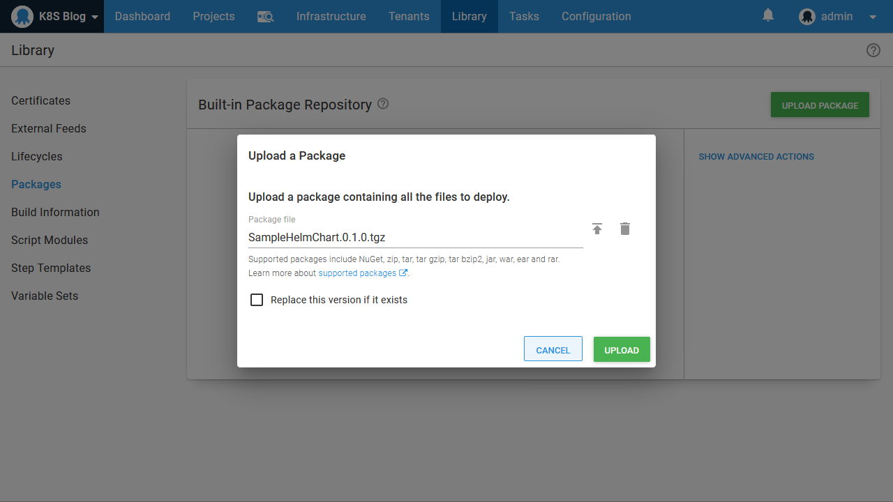

Helm has emerged as the defacto Kubernetes package manager. It offers rich templates, a powerful CLI tool, centralized repositories for sharing charts, and the recently released Helm 3 addresses the security concerns that overshadowed previous Helm versions.

Octopus provides native support for deploying Helm charts, and in this blog post we'll look at how to manage Helm deployments in Octopus.

## The sample chart

In the blog post [Deploy your first container to Kubernetes via Octopus](/blog/2020-06/deploy-your-first-container-to-octopus/index.md) we ran through the process of creating a Docker image and pushing it to Docker Hub. The end result was the image [mcasperson/mywebapp](https://hub.docker.com/r/mcasperson/mywebapp), which we will reuse in our Helm chart.

The example Helm chart can be found on [GitHub](https://github.com/OctopusSamples/SampleHelmChart). This chart creates a Kubernetes deployment and service to expose the web application embedded in our Docker image.

Start by cloning the GitHub repository, and packaging the files into a chart with the command `helm package .\SampleHelmChart`:

```
$ helm package .\SampleHelmChart
Successfully packaged chart and saved it to: C:\Code\SampleHelmChart-0.1.0.tgz
```

The resulting chart has a filename of `SampleHelmChart-0.1.0.tgz`. Typically this file would then be uploaded to a chart repository such as one hosted by [ChartMuseum](https://chartmuseum.com/). Such chart repositories are natively supported by Octopus, and setting up a chart repository is a perfectly valid option for those looking to take advantage of Helm:


However, starting with version 2020.3.0, Octopus offers the ability to upload Helm charts directly to the built-in feed. This removes the need to configure a separate chart repository. The only requirement to upload a chart to the built in feed is that the package version be embedded in the filename after a period, meaning we need to rename the chart file to `SampleHelmChart.0.1.0.tgz` before it is uploaded:



