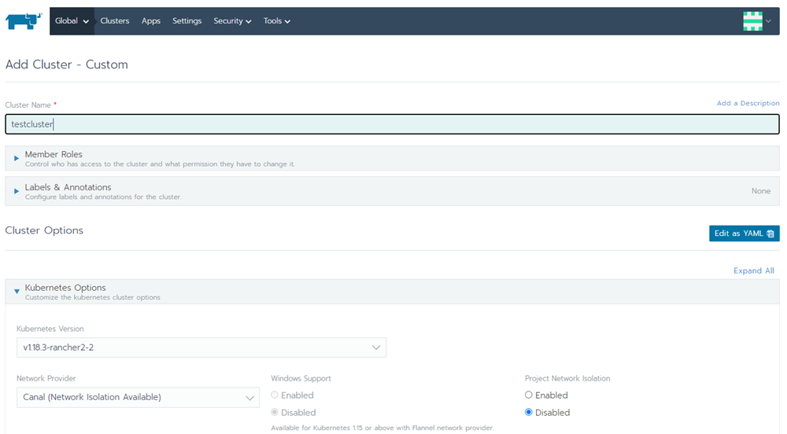
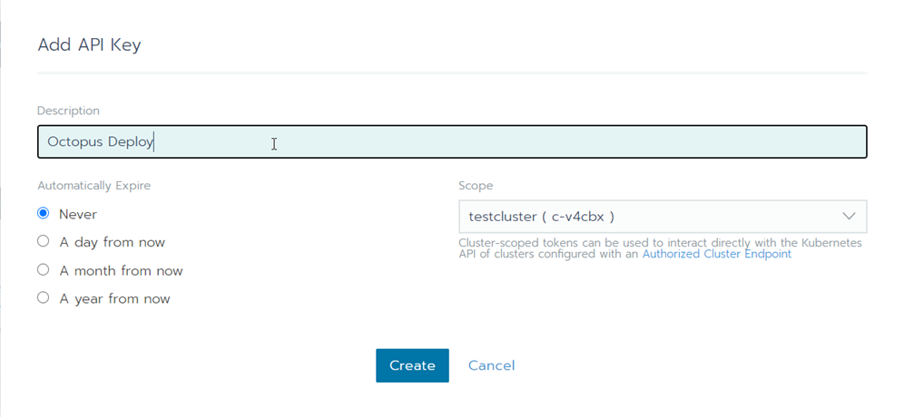
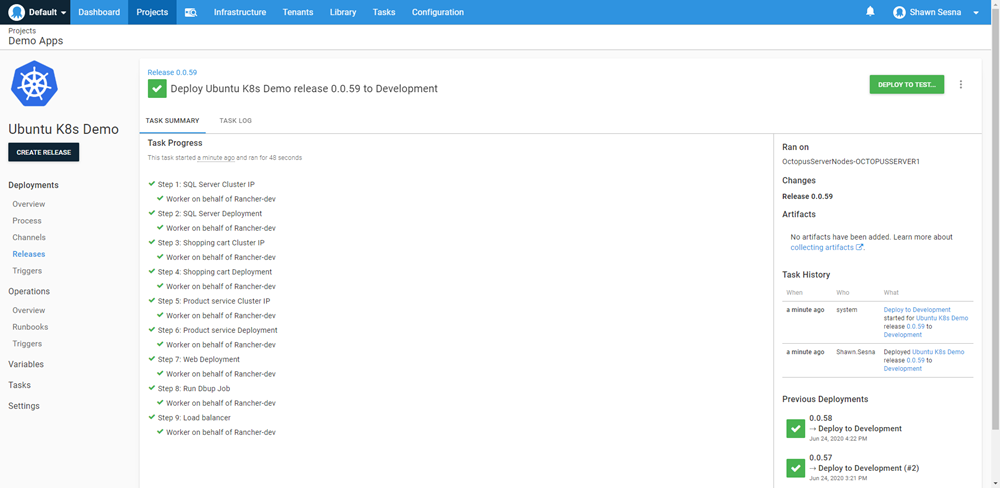

Managing Kubernetes via the command-line can be cumbersome and tedious, especially when you have multiple clusters to take care of.  To ease this burden, a number of tools have been developed to easily create and manage Kubernetes clusters.  One such product is called [Rancher](http://www.rancher.com).  In this post I'll show you how to add your Kubernetes cluster that is managed by Rancher as a deployment target in Octopus Deploy and deploy to it.

## Getting started with Rancher
Rancher is a rather unique product in that it's not actually installed anywhere.  Instead, Rancher runs within a Docker container and can run anywhere that Docker is installed.  This is all that is required to get started, 

```bash
$ sudo docker run -d --restart=unless-stopped -p 80:80 -p 443:443 rancher/rancher
```

There are, of course, more advanced installations with High Availability and a range of other options (see https://rancher.com/docs/rancher/v2.x/en/installation/), but for testing it out, that's all that is needed.  Once the container is up and running, connect to it with a browser and set the `admin` password.  After setting the password, you're ready to create a cluster.

## Creating a cluster
Rancher has made the process of creating a cluster really simple and easy to follow.  Once in the UI, simply click on **Add Cluster**


Rancher can work with:
- On-premise infrastructure
- Cloud infrastructure providers
  - Amazon EC2
  - Azure
  - Digital Ocean
  - Linode
  - vShere
- Cloud Kubernetes sercices
  - Amazon Elastic Kubernetes Service (EKS)
  - Azure Kubernetes Service (AKS)
  - Google Kubernetes Engine (GKE)

For this post, I created three Ubuntu VMs for my cluster so I chose **From existing nodes (Custom)**.


The next screen asks for the cluster name as well as some other options, I just chose the defaults and clicked **Next**.  



The final screen of the creation process presents us with checkboxes with  three options.  Clusters managed my Rancher need to have nodes that serve three roles:
- [etcd](https://rancher.com/blog/2019/2019-01-29-what-is-etcd/)
- [Control Plane](https://kubernetes.io/docs/concepts/)
- worker.

Checking or unchecking a box updates the command on the screen to run against the members of the cluster.  It is possible to assign a single node with all three roles, for this post, I chose one role per VM (image shows all three options selected)


As you run the commands on each node, the screen will show a pop-up indicating how many nodes have been registered to the cluster.  When you've finished adding nodes, click on **Done** to begin the provisioning process.  Once the provisioning process has completed, you will have a brand spankin new cluster!


## Connecting the cluster to Octopus Deploy
Not only does Rancher provide a centralized interface to manage Kubernetes clusters, it also provides a centralized means of communication to the clusters.  This means that Octopus Deploy can connect to Rancher instead of having to connect to the clusters it manages individually.

### Authentication
Before we can add our Rancher managed cluster, we must first create a means of authenticating to it.  This can be accomplished using the Rancher UI to create a key for access.  Log into Racher, then click on your Profile in the upper right-hand corner and choose **API & Keys**


Click on **Add Key** in the upper right-hand corner


Give the API Key an expiration and a scope.  It is recommended that you give it a description so you know what this key is going to be used for then click **Create**.



After you click create, you will be shown the API Key information, **save this information, you will not be able to retrive it later**


### Finding the right API endpoint
If you are framiliar with Kubernetes, you already know that commands are issued against an API endpoint like `https://ubuntu-k8:16443`.  However, the correct API to use with Rancher for Octopus Deploy can be a bit tricky to find if you don't know where to look (hint: it's not the Endpoint you were presented with when creating your API Key from the Authentication section above).  The correct endpoint is `https://<RancherUrl>/k8s/clusters/<ClusterId>`.  

A quick way to find the correct URL is to grab it from the provided Kubeconfig File information.  For each cluster defined, Rancher provides a `Kubeconfig File` that can be downloaded directly from the UI.  To find it, select the cluster you need from the Global dashboard


Now click on the **Kubeconfig File** button


This brings up a window that you can paste into a `~/.kube/config` file and interact with the cluster using something like `kubectl`.  It also contains the specific URL we need to use to connect our cluster to Octopus Deploy


### Adding the account to Octopus Deploy
In order for Octopus Deploy to be able to deploy to the cluster, it needs credentials to log in with, so we need to create an Account with in Octopus Deploy.  This is done by navigating to the Infrastructure tab within Octopus Deploy and clicking on Accounts


Rancher provided us with two methods to authenticate with when we created our API Key, Username and Password or Token.  Both of these methods will work with Octopus Deploy so it's up to you as to which one you want to use.  For this post, I chose token out of pure laziness in that it was only one value to input versus two.

Click on **ADD ACCOUNT** and select which Account type you want to create

Fill in the values for your selection, then click **SAVE**

Now that we have our Account created, we're ready to create our Kubernetes target!

### Create a Kubernetes Deployment Target
With the prepw work out of the way, we can now add your Rancher managed Kubernetes cluster to Octopus Deploy.  Adding the target is exactly how you would add any other Kubernetes target.  Click on Infrastructure -> Deployment Targets


Click **ADD DEPLOYMENT TARGET**


Click on the **KUBERNETES CLUSTER** category, then click **ADD** on the Kubernetes Cluster


The two most important parts of the Kubernetes Deployment Target form are going to be 
- Authentication
- Kubernetes Details

#### Authentication
Select the radio button that corresponds with what you've chosen to connect to Rancher with.  For this post, I chose Token.

#### Kubernetes Details
This is where we use the URL we found from the `kubeconfig`.  In my case, it was `https://rancher1/k8s/clusters/c-v4cbx`.  Since my cluster is using a self-signed certificate, I needed to also select `Skip TLS verification`.  Also, I created three namespaces for my cluster
- development
- test
- production


Click **SAVE** and you're done!  For verification, you can watch for the initial health check to run.

## Deploying to the cluster
Deploying to a cluster that is managed through Rancher is no different than deploying to a non-Rancher managed cluster.  I'll use the same example process from my [Beyond Hello World: Build a real-world Kubernetes CI/CD pipeline](https://octopus.com/blog/build-a-real-world-kubernetes-cicd-pipeline) post, but target the Rancher managed cluster instead.  If you haven't read that post, the project looks like this,


Deploying the Release, we can see it executed against Rancher-dev



And there you have it, we've successfully deployed to a Kubernetes cluster managed by Rancher!

## Conclusion
In this post I demonstrated how you can integrate Racher with Octopus deploy.  Happy Deployments!