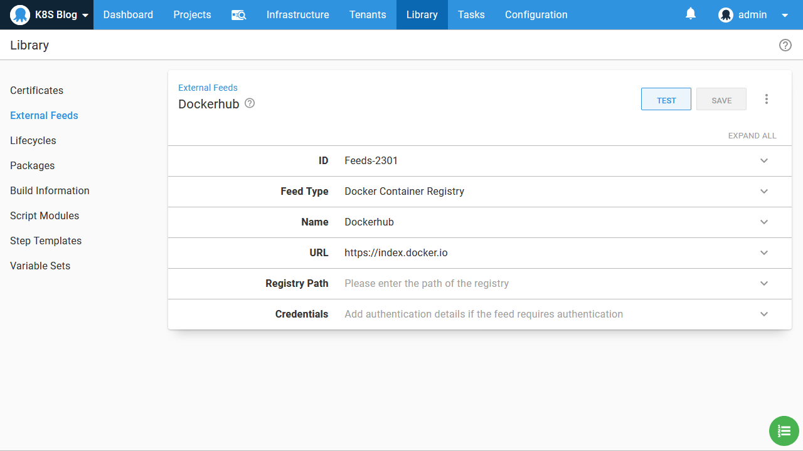

In the [previous blog post](/blog/2020-06/getting-started-with-kind-and-octopus/index.md) we saw how to create a local test Kubernetes cluster with kind and configure it in Octopus. In this blog post we learn how to deploy and expose a single Docker container to the local Kubernetes cluster using the steps in Octopus.

## Creating and pushing the Docker image

Octopus uses a feed to access Docker images from a Docker repository. Many tools exist to allow you to host your own Docker repository, but when getting started the public repository [Docker Hub](https://hub.docker.com/) is by far the easiest way to get started.

Create a new account if you do not already have one, and then log into Docker Hub with the command `docker login`:

```
$ docker login
Login with your Docker ID to push and pull images from Docker Hub. If you don't have a Docker ID, head over to https://hub.docker.com to create one.
Username: mcasperson
Password:

Login Succeeded
```

Then we need to build the Docker image. For this post we'll use the sample application from https://github.com/OctopusSamples/RandomQuotes-Java. Build the image with the command `docker build . -t mcasperson/mywebapp:0.1.7` (replacing `mcasperson` with your Docker Hub username). 

It is important that the tag (`0.1.7` in this case), is a valid SemVer version string. Docker tags don't enforce any versioning rules, but Octopus expects all packages it is deploying to be able to be compared to find the latest one. This is achieved by requiring Docker tags to be SemVer strings.

:::hint
Docker images without SemVer compatible tags are ignored by Octopus.
:::

Once the build is complete, you can verify the image has been created with the command `docker images "mcasperson/mywebapp"`:

```
$ docker images "mcasperson/mywebapp"
REPOSITORY            TAG                 IMAGE ID            CREATED             SIZE
mcasperson/mywebapp   0.1.7               fadf80ecf48a        1 second ago        129MB
```

Finally the image is pushed to Docker Hub with the command `docker push mcasperson/mywebapp:0.1.7`:

```
$ docker push mcasperson/mywebapp:0.1.7
The push refers to repository [docker.io/mcasperson/mywebapp]
d817461c3564: Pushed
11276c4aac8e: Pushed
f955d35132bf: Pushed
edd61588d126: Mounted from library/openjdk
9b9b7f3d56a0: Mounted from library/openjdk
f1b5933fe4b5: Mounted from library/openjdk
0.1.7: digest: sha256:0eb09072c3ab7768e9e5f9cae994e63a2d5c8d6957a2d0cd85baae31ee8cc6d7 size: 1573
```

Once pushed, the image can be [viewed on Docker Hub](https://hub.docker.com/r/mcasperson/mywebapp).

## Creating the Docker feed

All packages referenced by Octopus during deployment are sourced from feeds. In order to use our new Docker image in a Kubernetes deployment, we need to configure Docker Hub as a Docker feed via the URL https://index.docker.io:


We can then search for our new image:

