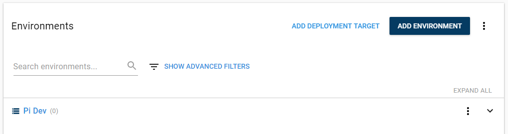
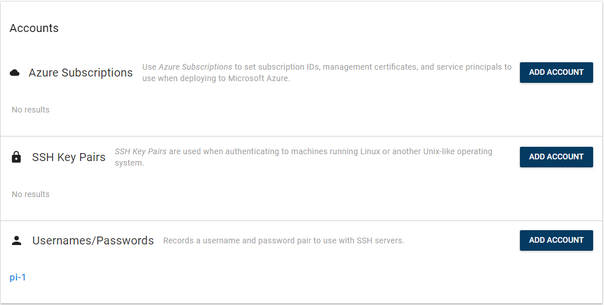
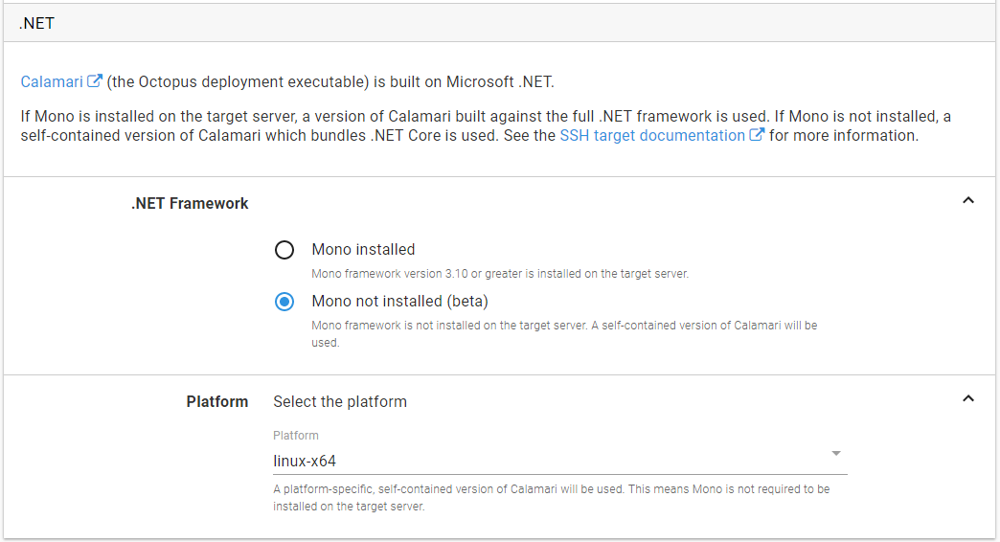
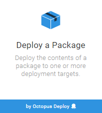
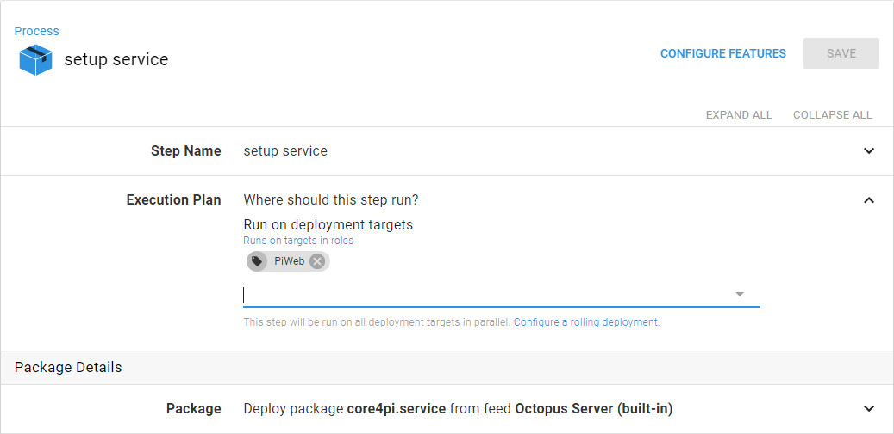
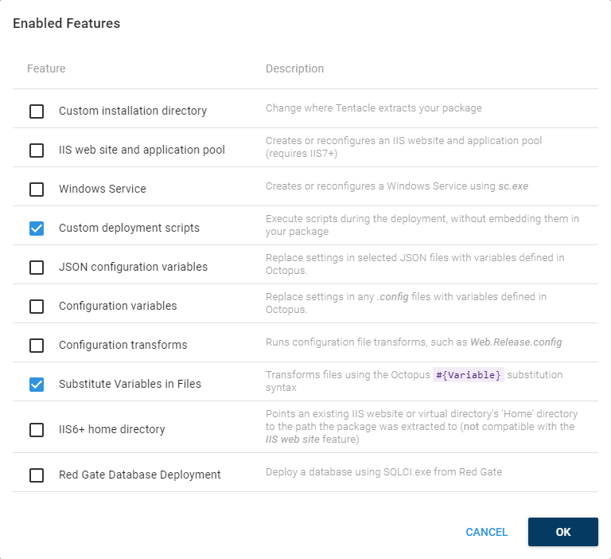
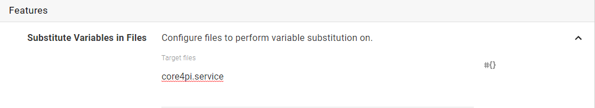
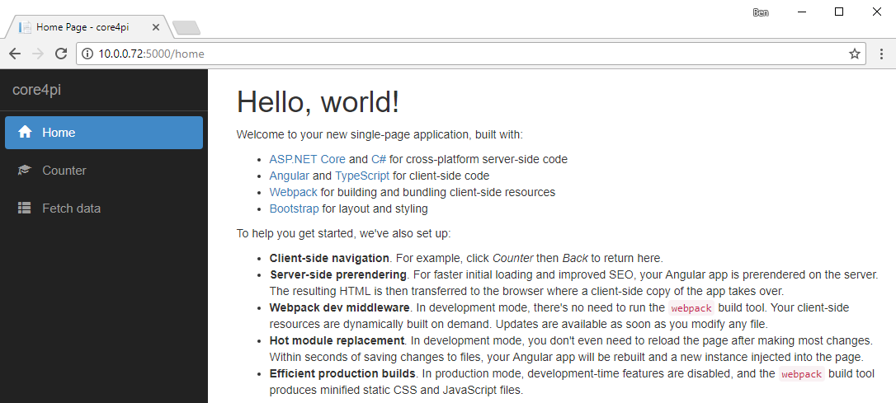

:::info
**Update February 2020**
*Out of the box* support for Linux ARM and Linux ARM64 SSH targets was included in *Octopus Server 2019.11.2* and *2020.2.0*, respectively.
:::

This post was originally published in February 2018, but a few things have changed since, and this is an updated version of the original post. 

.NET Core has come a long way in the last few years, and Octopus Deploy has too. We recently added support for running [Calamari without Mono](https://octopus.com/blog/octopus-release-3-16#ssh-targets-sans-mono), and in this post I will you through how to deploy .NET Core applications on to a Raspberry Pi 3+ without Mono.

In this post, I will show you that it is possible to deploy and run .NET Core applications on the Raspberry Pi 3+, and I'll also describe some of the different ways you can interact with your Octopus Deploy server.

## Requirements before you start

* Editor: Visual Studio, Visual Studio Code, Rider.
* [Octopus Command Line](http://octopus.com/downloads).
* [Octopus Server](http://octopus.com/downloads) and an [API key](https://octopus.com/docs/octopus-rest-api/how-to-create-an-api-key).
* .NET Core: [Windows](https://www.microsoft.com/net/download/windows) or [Macos](https://www.microsoft.com/net/download/macos).
* A Raspberry Pi 3+ running [Raspbian](https://www.raspberrypi.org/downloads/raspbian/) with .NET core 2.0 or later Runtime [installed](https://github.com/dotnet/core/blob/master/samples/RaspberryPiInstructions.md):
    * Download link: [Linux ARM (armhf)](https://github.com/dotnet/core-setup).
* For Angular or React applications:
    * node and npm on your development machine, if your chosen application requires it (angular or react).
    * nodejs on your Pi. 
* [Curl](https://curl.haxx.se/download.html)

:::hint
ASP.NET includes NodeServices in its bundle, which requires Node to be installed before it can serve any requests. When you install Node.js on the Raspberry Pi, it installs version 4.x and the executable is called `nodejs`, but NodeServices is looking for `node` in your path. You can fix this by creating a symlink: 

```Bash
sudo ln -s /usr/bin/nodejs /usr/bin/node
```

:::

## Build the application

### Create a basic .NET Core application

```powershell
dotnet new angular
```

### Modify the application to listen for external requests

By default, an ASP.NET Core application will only serve requests to `http://localhost:5000`. To allow the web host to serve requests to your local network, add the following after the `.UseStartup<Startup>()` in `Program.cs`:

```c#
.UseKestrel(options => {
    options.Listen(System.Net.IPAddress.Any, 5000);
})
```

For more information on configuring the Kestrel Web Host, check the [docs](https://docs.microsoft.com/en-us/aspnet/core/fundamentals/servers/kestrel?tabs=aspnetcore2x).

### Build the application

```powershell
npm install
dotnet build
mkdir publish
dotnet publish -o publish --self-contained -r linux-arm
```

:::hint
replace `linux-arm` with `linux-arm64` if you are targeting a distribution which supports 64-bit on the Raspberry Pi
:::


### Package the application

The simplest way to create a package of a .NET Core application is using the Octopus CLI tool.

Create an `artifacts` directory and then use the `octo pack` command to create the package:

```powershell
mkdir artifacts
octo pack --id core4pi --version 1.0.0 --format zip --outFolder artifacts --basePath publish
```

Using the Octopus CLI again, push the package to the server:

```powershell
octo push --server http://octopus/ --apikey API-ABCDEF123456 --package artifacts\core4pi.1.0.0.zip
```

## Building a service definition

To get the application to run as a service, see Microsoft’s documentation for [hosting .NET Core on Linux](https://docs.microsoft.com/en-au/aspnet/core/host-and-deploy/linux-nginx?tabs=aspnetcore2x).

Create a file called `core4pi.service` containing the following text:

```text
[Unit]
Description=core4pi

[Service]
WorkingDirectory=#{Octopus.Action[deploy web site].Output.Package.InstallationDirectoryPath}
ExecStart=/usr/local/bin/dotnet "#{Octopus.Action[deploy web site].Output.Package.InstallationDirectoryPath}/core4pi.dll"
Restart=always
RestartSec=10
User=pi
Environment=ASPNETCORE_ENVIRONMENT=Production
Environment=DOTNET_PRINT_TELEMETRY_MESSAGE=false

[Install]
WantedBy=multi-user.target
```

:::info
The `[deploy web site]` strings in the `core4pi.service` text above, represents the name of the step that deploys the package.
This output variable will contain the path to the newly installed service. This will ensure when the service is installed it is looking at the latest version.
:::

Create a package for the service definition and push it to the Octopus Server:

```powershell
octo pack --id core4pi.service --version 1.0.0 --format zip --outFolder artifacts
octo push --server http://octopus/ --apikey API-ABCDEF123456 --package artifacts\core4pi.service.1.0.0.zip
```

## Create infrastructure

If you don't already have an Octopus environment configured for your Raspberry Pi, create one either at the command line:

```powershell
octo create-environment --server http://octopus/ --apikey API-ABCDEF123456 --name "Pi Dev"
```

Or using the web interface via **{{Infrastructure > Environments > Add Environments}}**.

 

Next, create an account to access the Pi, this can either be a Username/Password account or an SSH Key in the **{{Infrastructure > Accounts}}**section in the Octopus web portal.



Finally, create a deployment target under **{{Infrastructure > Deployment Targets > Add Deployment Target}}** as an **SSH target**.

Set the targets role to something that represents the responsibility of the target, e.g, `PiWeb`.

After adding the details (IP Address or DNS name, SSH port, and account), under the **.NET** section, ensure you select _Mono not installed_, and select `linux-arm` or `linux-arm64` as the platform.




<!-- removing as outdated

### Modify the target config to specify the calamari version as `linux-arm`

This code can easily be run from [LinqPad](http://www.linqpad.net/)

```c#
string machineId = "Machines-1";
HttpClient client = new HttpClient();
client.BaseAddress = new Uri(@"http:\\octopus");
client.DefaultRequestHeaders.Add("X-Octopus-Apikey", "API-ABCDEF123456");
var machineJson = client.GetAsync($"api/machines/{machineId}").Result.Content.ReadAsStringAsync().Result;
machineJson = machineJson.Replace("linux-x64","linux-arm");
client.PutAsync($"api/machines/{machineId}", new StringContent(machineJson));
```

The machine id, defined on the first line, can be obtained from the Web Portal URL when viewing the deployment target `app#/infrastructure/machines/_machineId_/settings` or using the command line:
```powershell
octo list-machines --server http://octopus/ --apikey API-ABCDEF123456
```

You can also filter the list at the command line by using the JSON output format and filtering in Powershell:
```powershell
octo list-machines --server http://octopus/ --apikey API-ABCDEF123456 --outputformat=json | 
    ConvertFrom-Json | 
    % { $_ } |
    Where { $_.Name -eq 'target name' }
```

:::info
The `% { $_ }` line unwraps the top-level array that is being returned, which seems to be a quirk of the `ConvertFrom-Json` command in Powershell.
:::

### Download Calamari for linux-arm

:::warn
This step can be skipped if you are running *Octopus Server 2019.11.2* or later.
:::

```powershell
curl https://f.feedz.io/octopus-deploy/dependencies/packages/Calamari.linux-arm/4.4.15/download -L -o "c:\Program Files\Octopus Deploy\Octopus\Calamari.linux-arm.nupkg"
```

Replace the output path, `-o`, with the path to your Octopus Installation, if required.
Replace the version number in the `curl` command (_4.4.15_) with the current version number supplied with your Octopus installation, this number can be obtained from the verbose log of another project. Look for a line that looks like `Using Calamari.linux-x64 x.y.z`, which will give you the Calamari version in use on your Octopus Server.

:::info
The `linux-arm` Calamari package was provided in *Octopus Server 2019.11.2*.
If upgrading the Octopus Server installation before support is included by default, you will need to update the Calamari version to match the version of the other Calamari packages. The version number can be obtained from the `Calamari.nupkg` package using [Nuget Package Explorer](https://github.com/NuGetPackageExplorer/NuGetPackageExplorer).
:::

-->

## Create the deployment project

Create a new project via the **Projects** section in the Octopus web portal or with the command line:

```powershell
octo create-project --server http://octopus/ --apikey API-ABCDEF123456 --name "PiWeb" --projectgroup "All projects" --lifecycle "Default Lifecycle"
```

### Create a deployment step for the application

In the new **PiWeb** project, define your deployment process. 

Add a **Deploy a Package** step, called `deploy web site`. 

:::hint
The step name here will allow the values in the service definition file to be updated correctly.
:::



Set the **Environment** to the `Pi Dev` environment.

Set the **Role** to the `PiWeb` role.

Under the **Package** section, select the package you pushed to the server: `core4pi`.

We don't need to complete the other options so save the step.

### Create a deployment step for the service definition

Add another **Deploy a Package** step. This one will install a service on the target to run the application.

For the package selection, select the `core4pi.service` package from the **Octopus Server (built in)** package feed.



You will need to `Configure Features` for this step:



In the **Substitute Variables in Files** feature add the name of the service definition file `core4pi.service`:



Under the `Configuration Scripts` feature, select **Bash**, paste the script below into the **Deployment Script** section:

```bash
#!/bin/bash
if [ -e /lib/systemd/system/core4pi.service ]
then
    echo stopping service
    sudo systemctl stop core4pi.service
fi

echo installing service
sudo cp core4pi.service /lib/systemd/system/
sudo chmod 644 /lib/systemd/system/core4pi.service
sudo systemctl daemon-reload
sudo systemctl enable core4pi.service
echo starting service
sudo systemctl start core4pi.service
```

This script performs the service installation and will be executed during the step execution. It will require the user you are using to connect to the Raspberry Pi to have `sudo` rights.

## Deploy it

From the **Project** navigation menu, select **Create Release**. 

The **Create Release** page will allow you to set a version number for the release, you can just leave the default. It will also allow to pick which versions of the packages you want to deploy, by default it will pick the latest version.

Press **Save** and then press **Deploy to PI Dev** and then **Deploy** to start the deployment process.

**Create Release** can also be performed from the command line:

```powershell
octo create-release --server http://octopus/ --apikey API-ABCDEF123456 --project "PiWeb"
octo deploy-release --server http://octopus/ --apikey API-ABCDEF123456 --project "PiWeb" --deployto="Pi Dev" --version "0.0.1"
```

:::info
The first time you deploy, Octopus Server will update Calamari on the target machine, this may take a couple of minutes.
:::

## Test it

After the deployment has finished, navigate to the IP address or DNS name of your Raspberry Pi on port 5000, and you should see the application:




## Conclusion

With the alignment of a number of different technologies, deploying .NET to a Raspberry Pi is supported, and Octopus Deploy makes it painless. Throughout this post, you have also seen a number of different ways that you can integrate with your Octopus Server, including the command line and the web portal.
