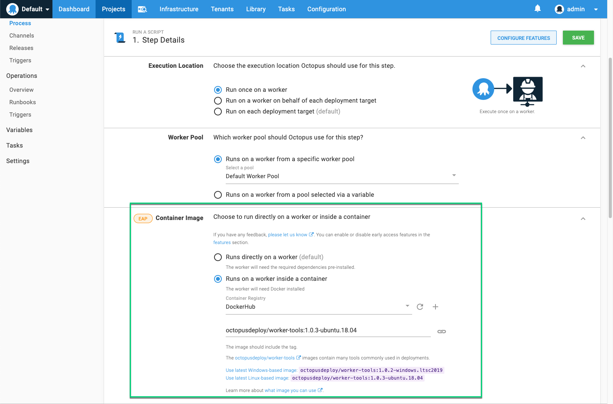
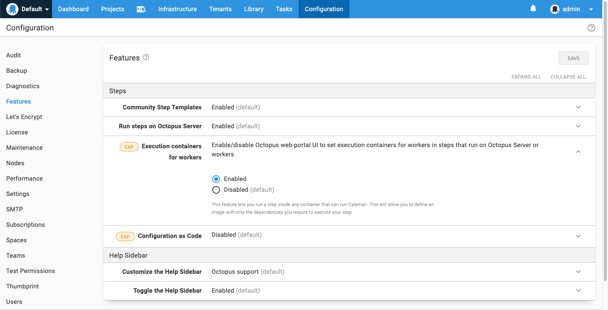

Modern deployments depend on tools. For example, AWS, Azure, and Google command-lines, Terraform, kubectl, Helm, Java, NodeJS, .NET, etcetera, etcetera, _etcetera_.         

Octopus has historically taken an inconsistent approach to these. Some are bundled with the Octopus Server and pushed to deployment targets (on Windows). Examples of these are the Azure CLI, AWS CLI, and Terraform. In other cases, Octopus assumes the dependencies are pre-installed on the targets, e.g., kubectl, Helm, Java.

Neither approach is all rainbows.

The bundled dependencies have a number of drawbacks.  They are always out of date, and users often require the latest version of the tools, but they can’t be updated independently of the Octopus Server. There is no way to pin the versions of the bundled dependencies, so if the tool’s publisher introduces breaking changes, we find ourselves unable to update them without potentially causing users’ deployment processes to fail (this is currently an issue with Terraform).

Of course, by _not_ bundling dependencies, we are pushing our pain onto our users. Spinning up a new machine to use as an Octopus Worker is a chore if you have to then install dozens of dependencies. And managing the relationship between various projects’ deployment processes and Workers is not obvious.  

Fortunately, there’s a technology that’s perfect for this scenario: _containers_.

Containers allow [bundling dependencies](https://twitter.com/b0rk/status/1237464479811633154), and (this is the magic bit) executing a command inside the container.

It’s no coincidence that CI tools have converged on using containers as execution environments for building software.  The same power can be leveraged for deployments.

Octopus 2020.2 introduces the ability to [run a deployment action inside a container](https://octopus.com/docs/deployment-process/execution-containers-for-workers):

This will be available on any step which executes on a Worker (or on the Octopus Server, for self-hosted instances).

Normally the Octopus Server sends the [Calamari](https://octopus.com/docs/octopus-rest-api/calamari) executable to a worker, via the Tentacle service, where it is run directly on the worker machine.

When a step is configured to use an execution container, the Octopus Server will still send Calamari, but rather than being run directly on the worker machine, it is executed inside the specified container (using [docker exec](https://docs.docker.com/engine/reference/commandline/exec/)).   

You can use any Docker image, but to help provide a happy path, we’ve published some images to a repository on DockerHub ([octopusdeploy/worker-tools](https://hub.docker.com/r/octopusdeploy/worker-tools)), which contain many of the most [common deployment tools](https://github.com/OctopusDeploy/WorkerTools/blob/master/ubuntu.18.04/Dockerfile), and we will regularly publish updates with the latest versions of the contained tools. If your deployment process requires tools that aren’t in the `octopusdeploy/worker-tools` images, or you prefer a smaller image, then you can use another image, or even build your own.

It’s worth noting that when you configure a deployment action to execute inside a container, the specified image is treated differently to the packages being deployed.  The action image is fully specified in the deployment process (including the tag), unlike deployed packages that have their versions selected when creating the release.  This is significant, as it allows the maintainers of the deployment process to control when the image is updated, and anyone creating a release of the project doesn’t require any knowledge of these images.

As Octopus continues to support deploying many types of applications (.NET, Java, NodeJS, etc.) to many platforms (Windows, Linux, PaaS) in many clouds (self-hosted, AWS, Azure, etc.), we hope this will prove to be a powerful weapon in taming deployment tooling dependencies.

Execution containers are available as an Early Access Preview in Octopus 2020.2.  This feature is not currently supported on Octopus Cloud dynamic workers; we will be adding support for this in the very near future.

Happy (containerized) Deployments!
