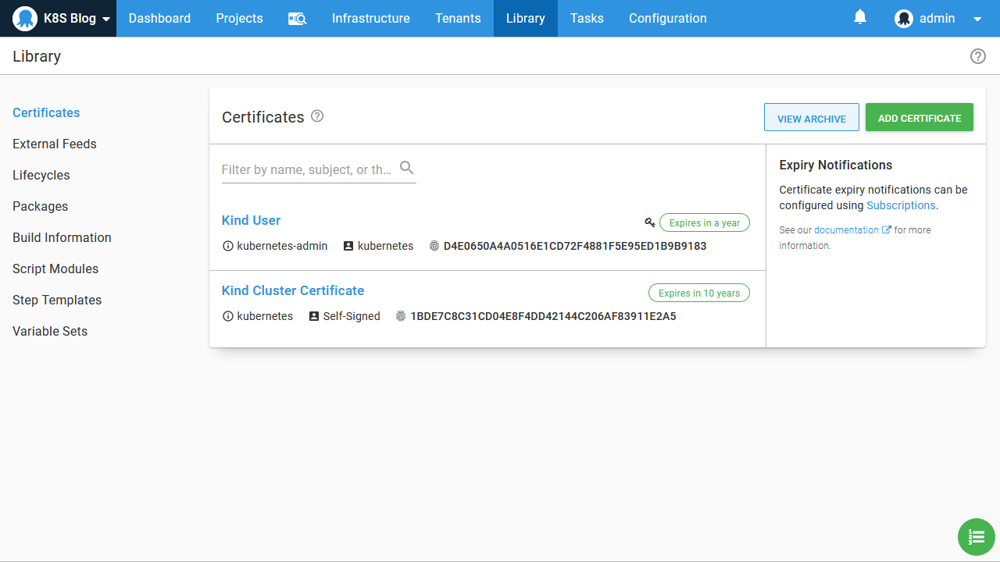
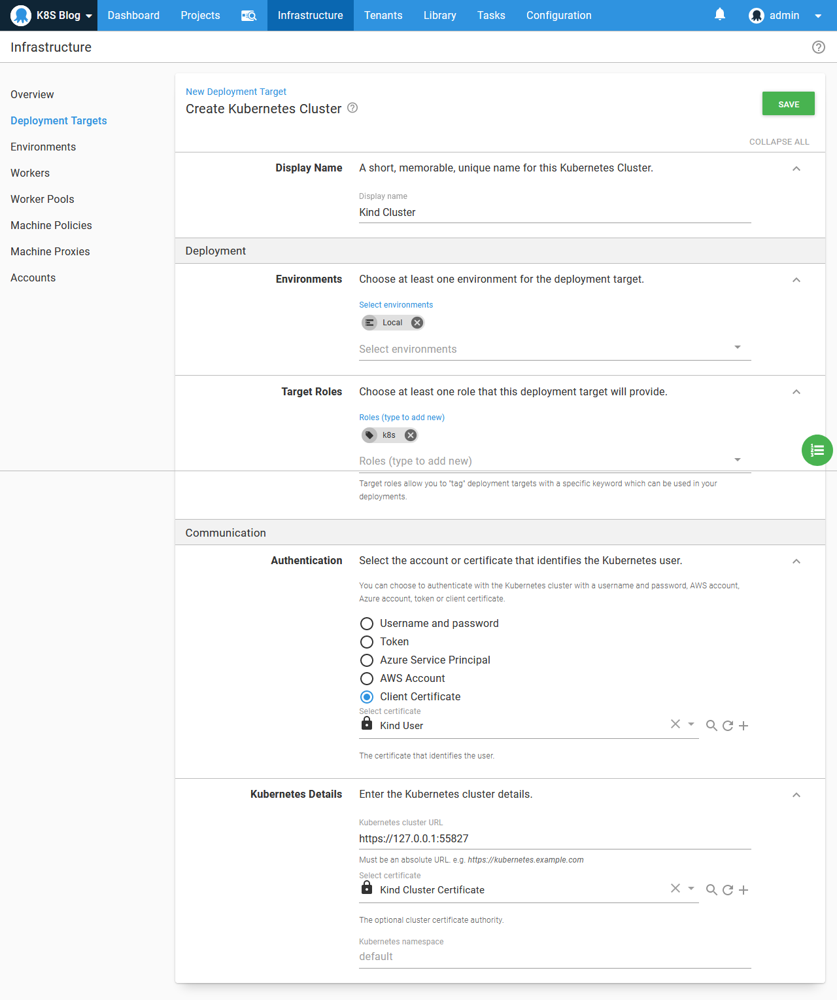
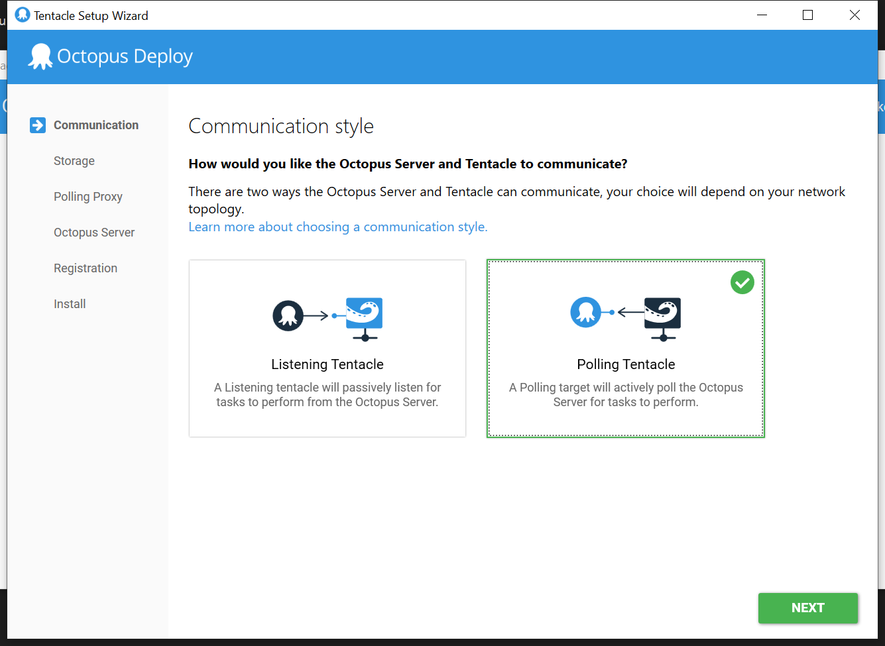
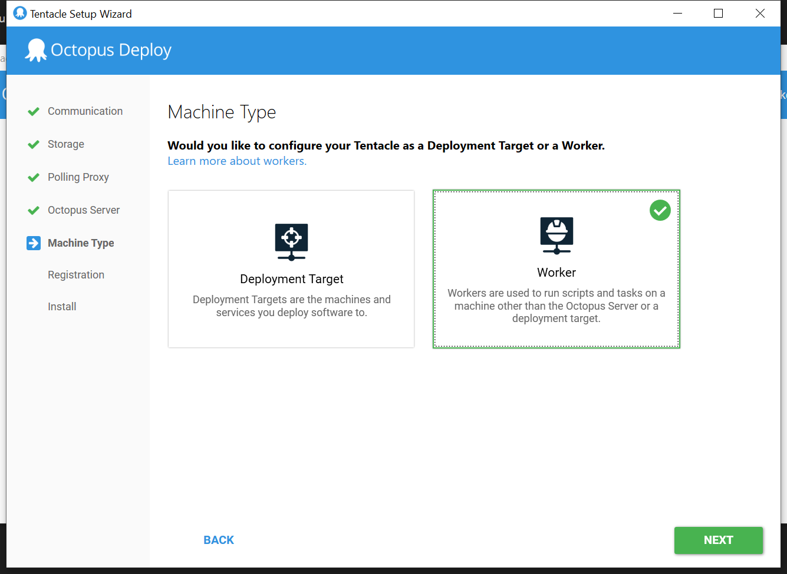
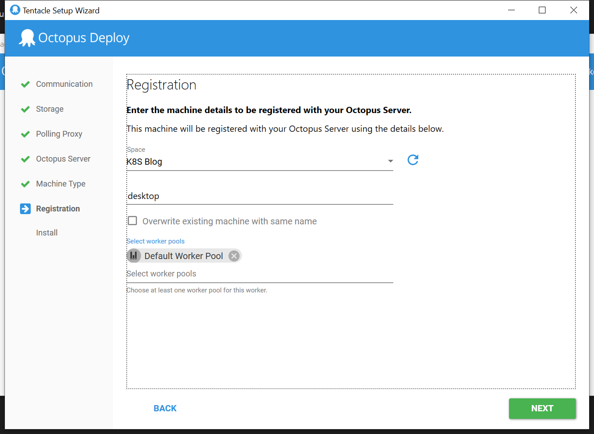

When getting started with Kubernetes, the sheer number of tools and options available can present a significant hurdle to be jumped before it is possible to deploy even the most simple example application. Unlike most other platforms, Kubernetes does not provide a standard package that you can download and install onto your local development PC. The community has filled this void with many different options like [Minikube](https://github.com/kubernetes/minikube), [MicroK8s](https://microk8s.io/), [k3s](https://k3s.io/), and [Docker Desktop with Kubernetes](https://www.docker.com/blog/docker-windows-desktop-now-kubernetes/). 

For this blog post we'll look at [kind](https://kind.sigs.k8s.io/). Although any of the perviously mentioned solutions are excellent choices, I prefer kind because it works seamlessly across all major operating systems and plays nicely in [WSL2](https://docs.microsoft.com/en-us/windows/wsl/wsl2-about), which makes it easy for Windows developers jumping between Windows and Linux.

## Installing kind

Kind creates a Kubernetes cluster as Docker containers. It can be a little mind bending to think of a Docker container implementing the Kubernetes platform which in turn orchestrates more Docker containers, but in practice the process of setting up a kind Kubernetes cluster is quick and easy.

Once you have [installed Docker](https://docs.docker.com/get-docker/), install [kubectl](https://kubernetes.io/docs/tasks/tools/install-kubectl/) and the [kind executable](https://kind.sigs.k8s.io/docs/user/quick-start/). Both kubectl and kind are self contained executables, meaning they only need to be downloaded and saved in a directory on your PATH.

Then create a cluster with the command `kind create cluster`. This command creates or updates the Kubernetes configuration file at `~/.kube/config` with a cluster and user called `kind-kind`. An example of the `config` file is shown below:

```
apiVersion: v1
clusters:
- cluster:
    certificate-authority-data: LS0tLS1CRUdJTiBDRVJUSUZJQ0FURS0tLS0tCk1JSUN5RENDQWJDZ0F3SUJBZ0lCQURBTkJna3Foa2lHOXcwQkFRc0ZBREFWTVJNd0VRWURWUVFERXdwcmRXSmwKY201bGRHVnpNQjRYRFRJd01EVXhPREl5TkRneU0xb1hEVE13TURVeE5qSXlORGd5TTFvd0ZURVRNQkVHQTFVRQpBeE1LYTNWaVpYSnVaWFJsY3pDQ0FTSXdEUVlKS29aSWh2Y05BUUVCQlFBRGdnRVBBRENDQVFvQ2dnRUJBTnBzCmY4NndReGRBSTcwdlZyZVVTSG54L2hqNkltbDBTeS9RK1dUOUxpT01kbjBraExrN3NuZGJZNTRGUStRTTMvVHoKWUpkVVl6SXpId0hNSFU4bkM2anlCN2FRQTM5UnczWnk2cXc2Y09WaXJPTnhlNCsyc0p5eHhkWE5zaDdjRHp2TQo0dnYwTnBsWEwyRnROMHZiOGZ0MzV3KzdTQmt0MkdtMW5JUDlkMWk1SCs4ejJHNjFGN3FwMjVkelRIcDJvYzVKClUyTWZucDIzSHkxQkJCVlpROUVyYVlSTEQxSU1kcm5nZElqcVgvTUt3bzNielpLelhZMC9PaDhocXgwVTUyYm0KTmE2QjNVcm5FNGhrMFZNR0NKaHRrdEtKOExESGFhdXpZOXRGTXl2amNDcnlrMGkyampUKzlIS3ZFNnpQL0hnVgpmYWpVNlE3NTBndGFHTHVzMmZVQ0F3RUFBYU1qTUNFd0RnWURWUjBQQVFIL0JBUURBZ0trTUE4R0ExVWRFd0VCCi93UUZNQU1CQWY4d0RRWUpLb1pJaHZjTkFRRUxCUUFEZ2dFQkFLTFJmY0tqM0NFblYxRWpxbmdNZENmWVRyaVEKL3JPS1oyVnF5TC9WMjlVaHZZUTREMmE1My9Wd1ZVb0hXS3NNMGMrQlZFUGdKWERacnZDM0dOV3RBc0tiSmQ4YwpUNWthODA1N1hpRG4xbWx0bjhKR0pUS2tUTFhKTEVZZ3g5cHA2Zkw0MGtrZy9WWmRqcjUzVzBKQmd5NHB1K1p4CjdJS3JOYys1YXNxMGpnWXZCQS8rakthOUVkQUxXM1p0N3hhcjN0NU9vZG1qR2pUdHRQV3A2Z3JmWjY5UTVRS2sKREhyNWhIbkVzQU43bjd5WUg3aU5WOHhwb3BwRlVmK3JPMDNJR2tSanBqUUNmRkxTRnAwNGZrZ3lKTGM3Z3gzOQpZYkNyUGpVYzM3YmRUQk5HSGtPVndsVEcwZDd5ZVZoTitHa04zNUppV3hyR1ZXZ0hoWkcxRFhkT0M4VT0KLS0tLS1FTkQgQ0VSVElGSUNBVEUtLS0tLQo=
    server: https://127.0.0.1:55827
  name: kind-kind
contexts:
- context:
    cluster: kind-kind
    user: kind-kind
  name: kind-kind
current-context: kind-kind
kind: Config
preferences: {}
users:
- name: kind-kind
  user:
    client-certificate-data: LS0tLS1CRUdJTiBDRVJUSUZJQ0FURS0tLS0tCk1JSUM4akNDQWRxZ0F3SUJBZ0lJQ01NR3pGZHhvb2t3RFFZSktvWklodmNOQVFFTEJRQXdGVEVUTUJFR0ExVUUKQXhNS2EzVmlaWEp1WlhSbGN6QWVGdzB5TURBMU1UZ3lNalE0TWpOYUZ3MHlNVEExTVRneU1qUTRNalJhTURReApGekFWQmdOVkJBb1REbk41YzNSbGJUcHRZWE4wWlhKek1Sa3dGd1lEVlFRREV4QnJkV0psY201bGRHVnpMV0ZrCmJXbHVNSUlCSWpBTkJna3Foa2lHOXcwQkFRRUZBQU9DQVE4QU1JSUJDZ0tDQVFFQXJvSld5NkFrY1pwT1dZSHUKejBtTzlLU3RXcVJUVGVTdElFRFVTbmNxTFNmQmtLQitLU3Q5ekFyek1uUzkwbVBPUkdpNm8vOStTRWh0eS9MYwpNdEhOdUV6dGp3R0FtdXlYS3R0b1R2bnNBNTdsVEhsS0dQbDV5S0dZQ0lpclZ0dUFzZFkydTlIbitHK3RpVVZIClFXVnlnWnNwazYxSjFVRUNITG1xdzIzaWN5RHZiSzh3bTI5V3NuRmhwVE9Ud0VPbDRKOGFmK21pVGt2RVJ1YVkKMGlvWTcwb3d3ZzhaY0dLMnFBWkNodEFrbzVsZUNZZzBueG5aL2FiRG0zZk1PQ2VJdS9xeE5yR2V6NFkrUTcwSwpaUnRsZW1qQlFHWHY4TDM2UFdDRVJQMGZ1bkZrNnVQMnJzSEpLd2RsbWNxUlorTEQ3Vm9IODZRTEhRWkJkZXppCnBqcDBWd0lEQVFBQm95Y3dKVEFPQmdOVkhROEJBZjhFQkFNQ0JhQXdFd1lEVlIwbEJBd3dDZ1lJS3dZQkJRVUgKQXdJd0RRWUpLb1pJaHZjTkFRRUxCUUFEZ2dFQkFNTzhZODFoVVh6bkphTFA0UG0vbDFpSFc2a3FlSWNBbHd4QQp4aFp4SjVYM2dXc3VReGhXVzdvVlM5WTUvYWlYU1p6VFNkVDNMSGxoSUxld0lYVXpLWS9hL2s4ZkRwR09xa0FRCmNmQWQ0emlkS0MwT1FWZi9McXFzWkhiNDhQSXdydkNYK1lmV05pOWZWellhMUdMMnRmamQ1Rk9MdEdyVmNuK1QKVmd0NDYwcUs3eHJRMi9nS3RmcGRGMFFIbmE5RW1sNy9xVlg0Tjh4bXUrUGQwZml1aXJMNHllOHhYRnJvNDVNQQphdkw1dFRXL29saWhEb25DMXhuTmFCZ2pucFBWYjNqVW5lQzZlSElXZzBJZGMxZmhtY2pwOUUweGtyOFF2L0hYCkkrTWVqOXNpZUpwUGZFcmI0RmwyOVQvUFU5eWwrejdQOUU3cmpaTGRZZlB3L0ZHbG0wMD0KLS0tLS1FTkQgQ0VSVElGSUNBVEUtLS0tLQo=
    client-key-data: LS0tLS1CRUdJTiBSU0EgUFJJVkFURSBLRVktLS0tLQpNSUlFb3dJQkFBS0NBUUVBcm9KV3k2QWtjWnBPV1lIdXowbU85S1N0V3FSVFRlU3RJRURVU25jcUxTZkJrS0IrCktTdDl6QXJ6TW5TOTBtUE9SR2k2by85K1NFaHR5L0xjTXRITnVFenRqd0dBbXV5WEt0dG9Udm5zQTU3bFRIbEsKR1BsNXlLR1lDSWlyVnR1QXNkWTJ1OUhuK0crdGlVVkhRV1Z5Z1pzcGs2MUoxVUVDSExtcXcyM2ljeUR2Yks4dwptMjlXc25GaHBUT1R3RU9sNEo4YWYrbWlUa3ZFUnVhWTBpb1k3MG93d2c4WmNHSzJxQVpDaHRBa281bGVDWWcwCm54blovYWJEbTNmTU9DZUl1L3F4TnJHZXo0WStRNzBLWlJ0bGVtakJRR1h2OEwzNlBXQ0VSUDBmdW5GazZ1UDIKcnNISkt3ZGxtY3FSWitMRDdWb0g4NlFMSFFaQmRlemlwanAwVndJREFRQUJBb0lCQUNjMk5sYU81MkYzY0wrQQpDSzhmTWpZYWdyRnBWeWFiaWFORHJmQUZrcjZPdmxuSEZsSWQ2YWhkbFlQeTQyeFE3TnBHUmhudm9PcVJDOHJXCkNWQ0tBQlczZzNHc3ZyOFJCbTZrMm0xVWp3bkpQSERRbUN2QWN2TDRESGR1YmtHWUZQVGcwMitrbk9FZ0J2aGYKVHNHTkVBdTdWNzVOSTlmOVFZSSszZllIek9oZFVSUEswUWRwTTN4NCs5VTJINFhvbHhaSnVNVzVXaWl5bU5hbQpaaEJBems0clI2RmpIMjZORHN0MkVyOW9HeksrNGVObUtYdUJXL1ljSlRVanRMYXdScUFLdWNVS3pMblZRblBHClpHbjljU3JUS2orVnhKTHpIc1gxQUtsM0lJV2FUbmJJOWIvZUhSZEw1TWhGVk54Tnh1YytrejNRaEFLT1FmclAKNU5tR2ZpRUNnWUVBM2tPbXVuUHJ5eklPQU9wT0pxSWpIYmVnYXlRK013VWFYVTQ5YzVQYXJQV3BTcVgrV01rNgptNUNEaEh6Zjc4ZDRrVVZsS09MTDZ0WnkzVXBtRTRBcDA1NVd6MXB1YWx1akwzUE1QZno2U0tLTFpKcDBFSmNjCnRwSXJUQjBZWnlLTzd2YTVIM01jUEIyQVE2TXNrQ0dhaW82MWFqMVdrSzBwbGZ5VDQySWVRQ2tDZ1lFQXlQOGEKcW5vVnV3a2YwVVdvWlJYcmRUc1lYRVZxYTNYa1hRcG42RkZaSmJEdlZ3YWlqcUI0L1JQaE5GMW5DTlFHa3MxaQphZE1oOWgyMWh6eklpVnQwZlFkZGFQQ1hsNGdmVjJRS0cwb3BWU25YeDhHNWVheTdXSEVMVUFpYkF4L0hzQm8yCnlyTzBXSDVEeU9za1F0SERFeVEwMDd4SmU2S2VoNEUrQmRBSG9IOENnWUFGVmJCWngxQ0Fod29KQVphd25MR2wKRS9RNHZoejBFb3BJZFFsS2plRHd4OUN4WnZ5TTJ2K2FIa1RaMkRsend1RGs4N3B5MmNhMU0wSjhoejJkK0RTSQp6TU1lcFBnRGU0R1dNUHhVL0k1eFVkMXdvN2huY1lrUjVMNC9URzk2Z2p6V0JYdjZBa1JLT1JjTUNJMllSQVkyCmp5aFJqWGxYYmFDUzVnWVNyaGMxeVFLQmdRQ09VVE5NYWsxZ3RjRTFxS0Rua25HNS9ESHZnNmNxbDdzdXRlT0UKOTdTcm4zQ1lxallIejFCYndldS83REs4YVlTT0JhY2RUMFhJd3BoNlBXdXc5blN3NHJvZFI5M09pYS9IYlNwSwowR1FielJqZ2RDY2tKRTR5L1RnSlgwNkRFOG1NdzhMd0cvWWlncVQwYXFxdU5XQnUrVC8rZkY5N2oxVzRsS2FaCjd3YTNlUUtCZ0hzTXo0UjQ1ejBQYVpHckQ3QVNudkZWQUVYcENybmhhb3kxdFZQTlpOak44M2thY3MrRzNtSUoKcDlZc0RHVGtTcnB5UWFXdldlWE1tak9WOTIvMDFuT3p3Z3p5RHFVbXU3UXFkNkZxMGpDVWZpaDlwMWd4RUsvWQpKcFEwMkFuYzRpN2Z4eDlmWDA0RXE0MVZJSnZOdFVpamdqeVQzcHFQMEJyREk1RUJrSUFzCi0tLS0tRU5EIFJTQSBQUklWQVRFIEtFWS0tLS0tCg==
```

To verify that the cluster is running, execute `kubectl get nodes`. You should see output that looks something like this:

```
$ kubectl get nodes
NAME                 STATUS   ROLES    AGE    VERSION
kind-control-plane   Ready    master   101s   v1.18.2
```

We now have a local Kubernetes cluster ready for testing.

## Extracting the certificates

The `config` file created by kind embeds a cluster certificate which is used to secure API traffic and a client key and certificate used to identify the Kubernetes user. We need to extract these values into files that can be imported into Octopus.

The Bash and Powershell scripts below extract the data, decode it, and combine the client key and certificate into a single PFX file. The end result of these scripts are two files: cluster.crt and client.pfx:

Here is the Bash script:

```bash
kubectl config view --raw -o json | jq -r ".users[] | select(.name==\"$1\") | .user[\"client-certificate-data\"]" | base64 -d > client.crt
kubectl config view --raw -o json | jq -r ".users[] | select(.name==\"$1\") | .user[\"client-key-data\"]" | base64 -d > client.key
kubectl config view --raw -o json | jq -r ".clusters[] | select(.name==\"$1\") | .cluster[\"certificate-authority-data\"]" | base64 -d > cluster.crt
openssl pkcs12 -export -in client.crt -inkey client.key -out client.pfx -passout pass:
rm client.crt
rm client.key
```

Here is the Powershell script, where the `openssl` executable was downloaded from [here](https://slproweb.com/products/Win32OpenSSL.html):

```powershell
param($username)

kubectl config view --raw -o json |
  ConvertFrom-JSON |
  Select-Object -ExpandProperty users |
  ? {$_.name -eq $username} |
  % {
  	[System.Text.Encoding]::ASCII.GetString([System.Convert]::FromBase64String($_.user.'client-certificate-data')) | Out-File -Encoding "ASCII" client.crt
  	[System.Text.Encoding]::ASCII.GetString([System.Convert]::FromBase64String($_.user.'client-key-data')) | Out-File -Encoding "ASCII" client.key
    & "C:\Program Files\OpenSSL-Win64\bin\openssl" pkcs12 -export -in client.crt -inkey client.key -out client.pfx -passout pass:
    rm client.crt
    rm client.key
  }
  
  kubectl config view --raw -o json |
  ConvertFrom-JSON |
  Select-Object -ExpandProperty clusters |
  ? {$_.name -eq $username} |
  % {
  	[System.Text.Encoding]::ASCII.GetString([System.Convert]::FromBase64String($_.cluster.'certificate-authority-data')) | Out-File -Encoding "ASCII" cluster.crt
  }
```

## Creating the Octopus Kubernetes target

The files `cluster.crt` and `client.pfx` are uploaded to the Octopus certificate store. Here I have called these certificates **Kind User** and **Kind Cluster Certificate**:



We also need a local environment:


The final step is to create the Kubernetes target. This target uses the certificate **Kind User** for authentication, **Kind Cluster Certificate** for the server certificate authority, and https://127.0.0.1:55827 for the cluster URL. This URL comes from the `clusters[].clusters.server` field in the Kubernetes `config` file:



## A word on workers

Because the Kubernetes URL references `localhost`, we either need to run Octopus on our local development PC, or install a worker on our local PC, which essentially allows a remote Octopus instance to tunnel into our local PC.

In the screenshots below you can see some of the steps from the Tentacle manager which configure a worker:







Here we can see the new worker assigned to the **Default Worker Pool**:


With the worker in place, the Kubernetes target on the remote Octopus server can now access our local Kubernetes cluster:


## Conclusion

We have now successfully created a local Kubernetes cluster with kind, extracted the certificates from the Kubernetes configuration file, imported the certificates into Octopus, and created a Kubernetes target in Octopus that connects to our local cluster via a worker.

From here we can learn how to use Octopus to deploy Kubernetes resources. The blog posts below show you how to:

* [Deploy your first container to Kubernetes via Octopus](/blog/2020-06/deploy-your-first-container-to-kubernetes/index.md).
* [Import an existing Kubernetes YAML file into Octopus](/blog/2020-06/importing-kubernetes-yaml-in-octopus/index.md).
* [Deploy a Helm chart via Octopus](/blog/2020-06/deploy-helm-chart-with-octopus/index.md).
* [Perform custom Kubernetes scripting in Octopus](/blog/2020-06/custom-kubectl-scripting-in-octopus/index.md).