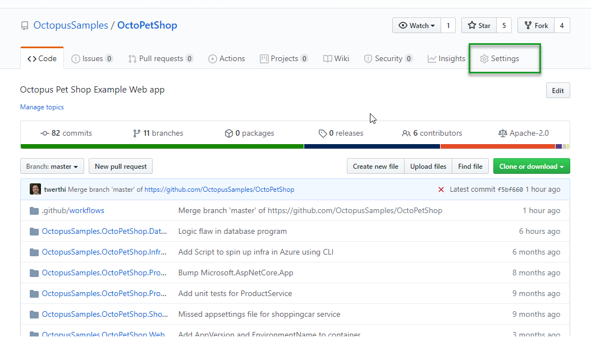
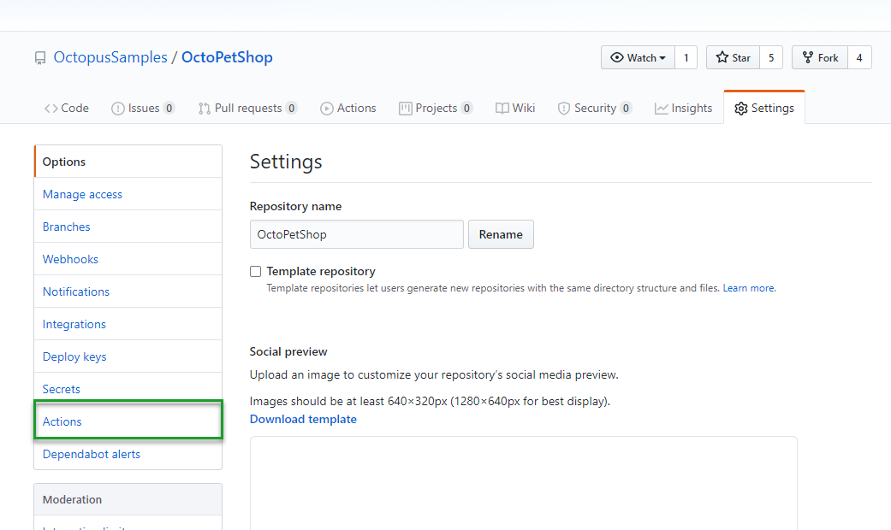
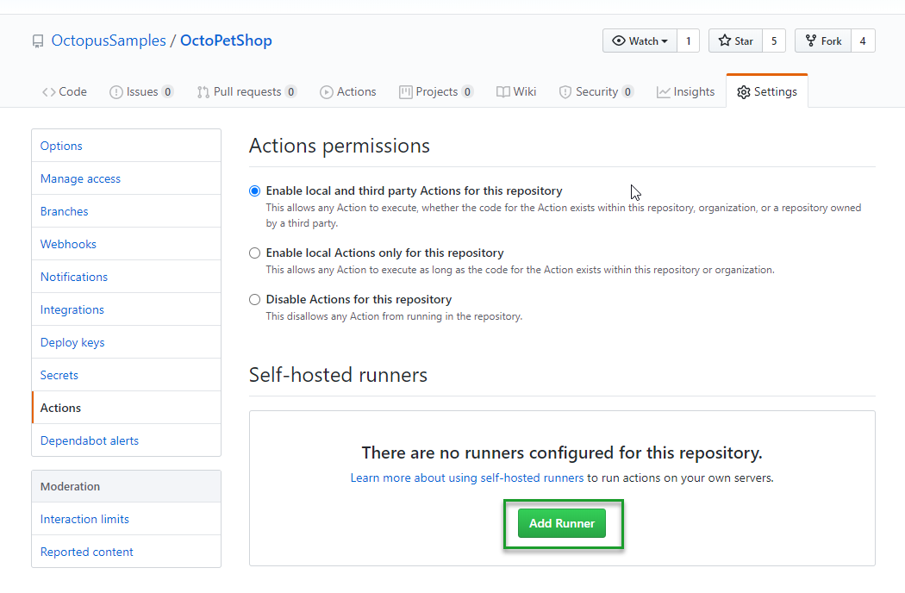
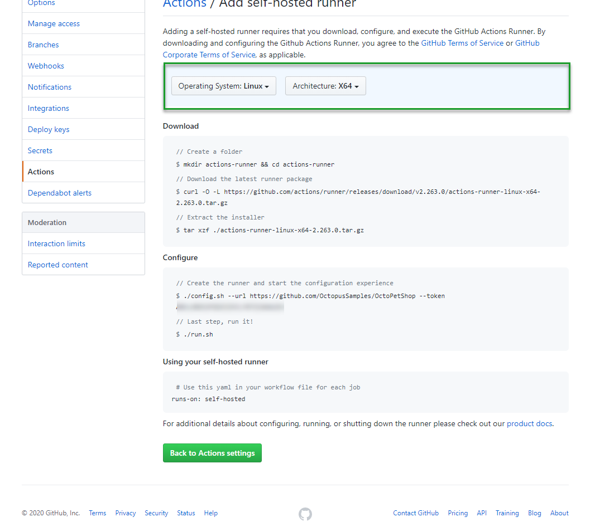
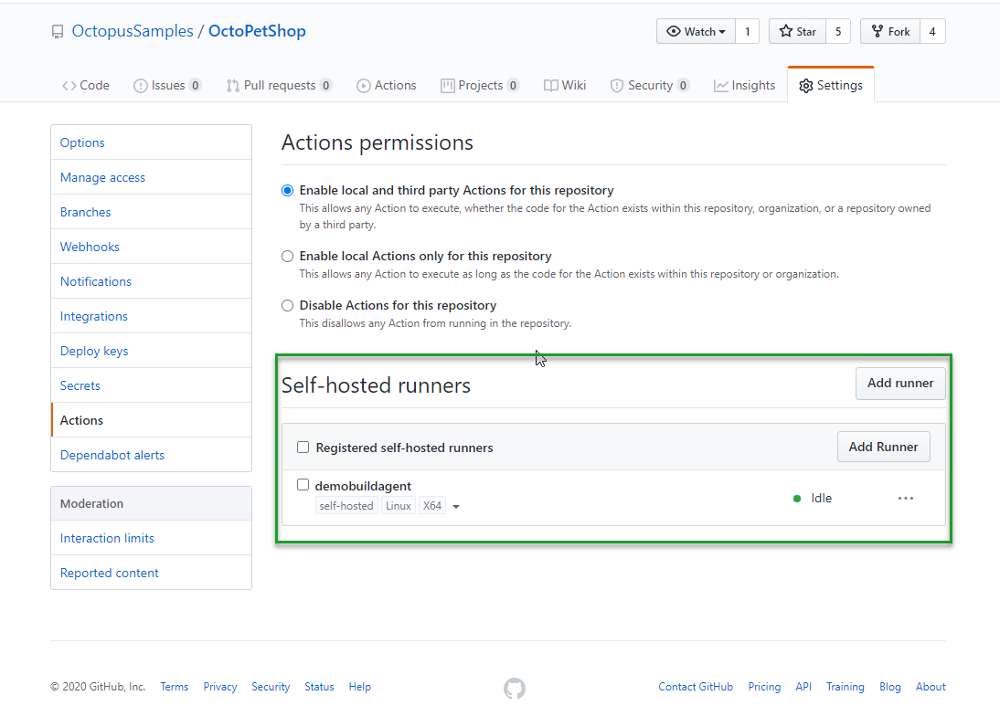
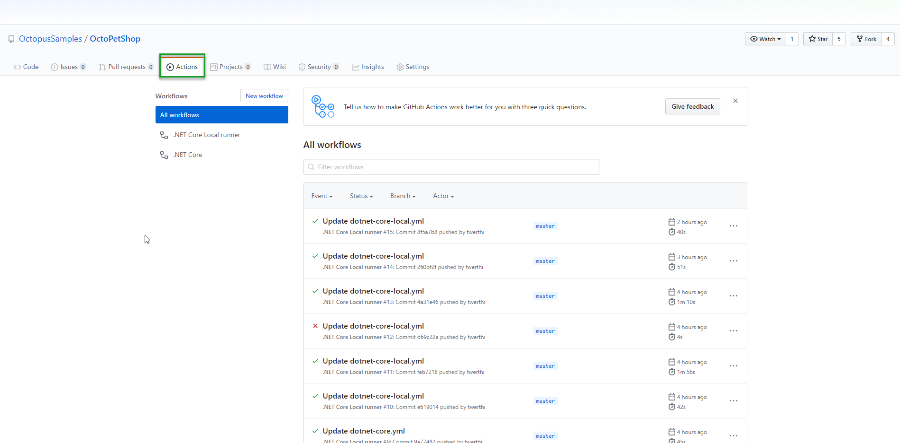
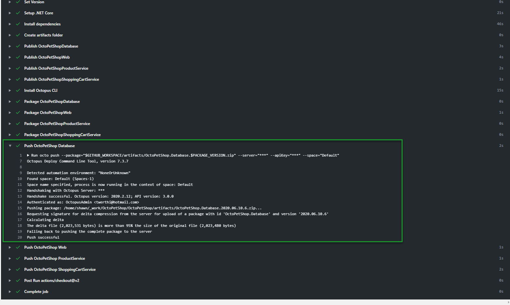
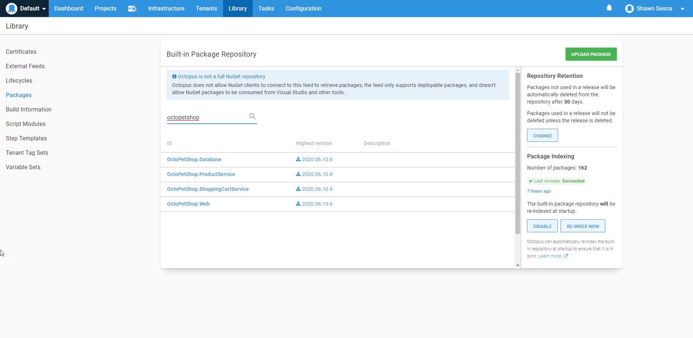

Earlier this year, my colleague Ryan Rousseau wrote a blog post about [publishing a package to Octopus Deploy using GitHub Actions](https://octopus.com/blog/publishing-a-package-to-octopus-with-github-actions).  In this post, I'll take that a step further by publishing a package to a *local* instance of Octopus Deploy with a self-hosted GitHub Actions Runner.

## GitHub Actions

GitHub Actions is GitHub's version of a build server.  Like many other build tools, such as BitBucket PipeLines and Azure DevOps, GitHub Actions uses Yet Another Markup Language (YAML) to define the build process called a **workflow**. Below is an example GitHub Actions workflow YAML file.  

This example builds the [OctoPetShop Sample](https://github.com/OctopusSamples/OctoPetShop) .NET core application, then pushes the packages to our [Octopus Deploy Samples](https://samples.octopus.app/) instance:

```
name: .NET Core 

on:
  push:
    branches: [ master ] 
  pull_request:
    branches: [ master ]

jobs:
  build:

    runs-on: ubuntu-latest 

    steps:
    - uses: actions/checkout@v2
    - name: Set Version
      run: echo "::set-env name=PACKAGE_VERSION::$(date +'%Y.%m.%d').$GITHUB_RUN_NUMBER"
    - name: Setup .NET Core
      uses: actions/setup-dotnet@v1
      with:
        dotnet-version: 2.2.207
    - name: Install dependencies
      run: dotnet restore
    - name: Build
      run: dotnet build --configuration Release --no-restore
    - name: Test
      run: dotnet test --no-restore --verbosity normal
    - name: Create artifacts folder
      run: |
        mkdir "$GITHUB_WORKSPACE/artifacts"
        mkdir "$GITHUB_WORKSPACE/artifacts/OctopusSamples.OctoPetShop.Database"
        mkdir "$GITHUB_WORKSPACE/artifacts/OctopusSamples.OctoPetShop.Web"
        mkdir "$GITHUB_WORKSPACE/artifacts/OctopusSamples.OctoPetShop.ProductService"
        mkdir "$GITHUB_WORKSPACE/artifacts/OctopusSamples.OctoPetShop.ShoppingCartService"
    - name: Publish OctoPetShopDatabase
      run: dotnet publish OctopusSamples.OctoPetShop.Database/OctopusSamples.OctoPetShop.Database.csproj --configuration Release --no-restore --output "$GITHUB_WORKSPACE/artifacts/OctopusSamples.OctoPetShop.Database"
    - name: Publish OctoPetShopWeb
      run: dotnet publish OctopusSamples.OctoPetShop.Web/OctopusSamples.OctoPetShop.Web.csproj --configuration Release --no-restore --output "$GITHUB_WORKSPACE/artifacts/OctopusSamples.OctoPetShop.Web"
    - name: Publish OctoPetShopProductService
      run: dotnet publish OctopusSamples.OctoPetShop.ProductService/OctopusSamples.OctoPetShop.ProductService.csproj --configuration Release --no-restore --output "$GITHUB_WORKSPACE/artifacts/OctopusSamples.OctoPetShop.ProductService"
    - name: Publish OctoPetShopShoppingCartService
      run: dotnet publish OctopusSamples.OctoPetShop.ShoppingCartService/OctopusSamples.OctoPetShop.ShoppingCartService.csproj --configuration Release --no-restore --output "$GITHUB_WORKSPACE/artifacts/OctopusSamples.OctoPetshop.ShoppingCartService"
    - name: Install Octopus CLI
      uses: OctopusDeploy/install-octocli@v1
      with:
        version: 7.4.2
    - name: Package OctoPetShopDatabase
      run: |
        octo pack --id="OctoPetShop.Database" --format="Zip" --version="$PACKAGE_VERSION" --basePath="$GITHUB_WORKSPACE/artifacts/OctopusSamples.OctoPetShop.Database" --outFolder="$GITHUB_WORKSPACE/artifacts"
    - name: Package OctoPetShopWeb
      run: |
        octo pack --id="OctoPetShop.Web" --format="Zip" --version="$PACKAGE_VERSION" --basePath="$GITHUB_WORKSPACE/artifacts/OctopusSamples.OctoPetShop.Web" --outFolder="$GITHUB_WORKSPACE/artifacts"
    - name: Package OctoPetShopProductService
      run: |
        octo pack --id="OctoPetShop.ProductService" --format="Zip" --version="$PACKAGE_VERSION" --basePath="$GITHUB_WORKSPACE/artifacts/OctopusSamples.OctoPetShop.ProductService" --outFolder="$GITHUB_WORKSPACE/artifacts"
    - name: Package OctoPetShopShoppingCartService
      run: |
        octo pack --id="OctoPetShop.ShoppingCartService" --format="Zip" --version="$PACKAGE_VERSION" --basePath="$GITHUB_WORKSPACE/artifacts/OctopusSamples.OctoPetshop.ShoppingCartService" --outFolder="$GITHUB_WORKSPACE/artifacts"
    - name: Push OctoPetShop Database
      run: |
        octo push --package="$GITHUB_WORKSPACE/artifacts/OctoPetShop.Database.$PACKAGE_VERSION.zip" --server="${{ secrets.OCTOPUSSERVERURL }}" --apiKey="${{ secrets.OCTOPUSSERVERAPIKEY }}" --space="${{ secrets.OCTOPUSSERVERSPACE_HYBRID }}"
    - name: Push OctoPetShop Web
      run: |
        octo push --package="$GITHUB_WORKSPACE/artifacts/OctoPetShop.Web.$PACKAGE_VERSION.zip" --server="${{ secrets.OCTOPUSSERVERURL }}" --apiKey="${{ secrets.OCTOPUSSERVERAPIKEY }}" --space="${{ secrets.OCTOPUSSERVERSPACE_HYBRID }}"
    - name: Push OctoPetShop ProductService
      run: |
        octo push --package="$GITHUB_WORKSPACE/artifacts/OctoPetShop.ProductService.$PACKAGE_VERSION.zip" --server="${{ secrets.OCTOPUSSERVERURL }}" --apiKey="${{ secrets.OCTOPUSSERVERAPIKEY }}" --space="${{ secrets.OCTOPUSSERVERSPACE_HYBRID }}"
    - name: Push OctoPetShop ShoppingCartService
      run: |
        octo push --package="$GITHUB_WORKSPACE/artifacts/OctoPetShop.ShoppingCartService.$PACKAGE_VERSION.zip" --server="${{ secrets.OCTOPUSSERVERURL }}" --apiKey="${{ secrets.OCTOPUSSERVERAPIKEY }}" --space="${{ secrets.OCTOPUSSERVERSPACE_HYBRID }}"
```

With the GitHub-Hosted runners pushing to Octopus Cloud, this solution works great. However, without poking holes through the firewall, GitHub-Hosted runners cannot push packages to your self-hosted Octopus Deploy server.

### Local build runners

GitHub-Hosted runners are pre-packaged with a lot of functionality, but there are times when you have specific software needs, need the ability to control the version that you are using, or need the runner to have access to on-premises resources such as Octopus Deploy.  To solve this problem, the folks over at GitHub developed the ability for Actions to have locally hosted runners.  The local runner works in a similar fashion to Octopus Polling Tentacles in that they reach out to GitHub Actions instead of GitHub Actions reaching in.  

#### Set up the runner

Setting up a local runner is incredibly easy. Kudos to GitHub for making it so simple.  After you've created your workflow YAML file, make your way over to the **Settings** in your GitHub repo:



From there, click on Actions:



Scroll down slightly to see the **Add Runner** button and click it:



The next screen gives you the option to choose the local runner architecture, and then provides the commands necessary to download and configure it:



When running the configuration commands, you'll be asked a couple of basic questions such as runner name, tags, and the work folder location.  Pressing Enter at these prompts accepts the default values.

When you are done, you will have a local runner listening for jobs:



#### Configure the workflow to use a local runner

Configuring the workflow to use a local runner is a one-line change in the YAML.  Taking the YAML from above, we change the line `runs-on` to the tags of our local instance.  The current value of `runs-on` uses the single tag `ubuntu-latest`.  However, when you need multiple tags, you have to place them inside an array, which is designated by the use of square brackets.  For our new runner, we want it to use tags `self-hosted` and `linux`.  To do this, we'll change:

```yaml
runs-on: ubuntu-latest 
```

to:

```yaml
runs-on: [self-hosted, linux]
```

With our workflow configured to use a local runner, we now can push packages to our local instance of Octopus Deploy. By making the change to the YAML file, it kicked off a build, and I can see that my local runner has picked it up by clicking on `Actions`:



On my VM, I see the message that it's running the job:

```

√ Connected to GitHub

2020-06-09 23:47:30Z: Listening for Jobs
2020-06-10 00:27:20Z: Running job: build
```

Examining the log output, we can see that the version number built was 2020.06.10.6:



On my local Octopus Deploy instance, I find that this has been pushed:



## Conclusion

This post demonstrates one method of using a cloud build server to push packages to a self-hosted Octopus Deploy instance by using local build runners or agents.  While this focuses on GitHub Actions, the same idea can be extended to TeamCity, Jenkins, or Azure DevOps.
