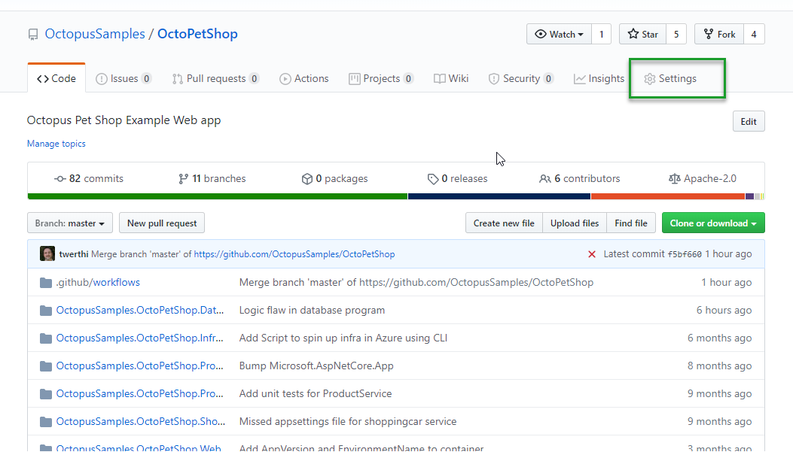
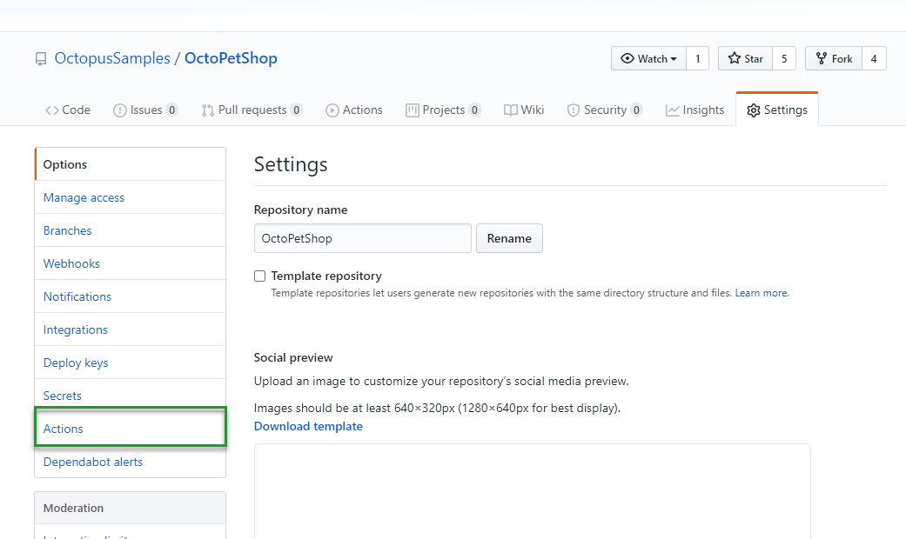
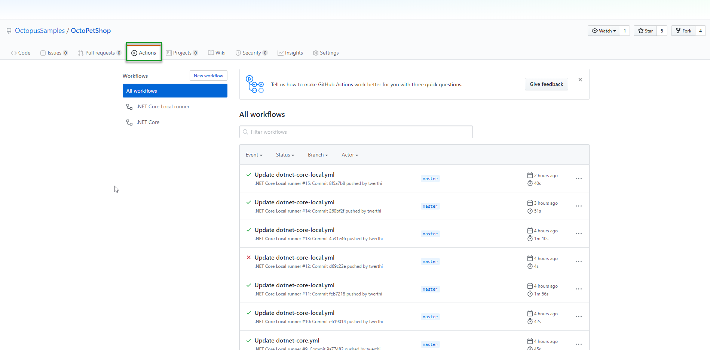

Earlier this year, my colleague Ryan Rousseau wrote a blog post on [publishing a package to Octopus Deploy using GitHub Actions](https://octopus.com/blog/publishing-a-package-to-octopus-with-github-actions).  In this post, I'll take this a step further by publishing a package to a **local** instance of Octopus Deploy with a self-hosted GitHub Actions Runner.

## GitHub Actions
GitHub Actions is GitHubs' version of a build server.  Like many other build tools such as BitBucket PipeLines and Azure DevOps, GitHub Actions utilizes Yet Another Markup Language (YAML) to define the build process.  Below is an example of what a GitHub Actions YAML build file looks like.  This builds the [OctoPetShop Sample](https://github.com/OctopusSamples/OctoPetShop) .NET core application, then pushes the packages to our [Samples Octopus Deploy](https://samples.octopus.app/) instance.

```
name: .NET Core 

on:
  push:
    branches: [ master ] 
  pull_request:
    branches: [ master ]

jobs:
  build:

    runs-on: ubuntu-latest 

    steps:
    - uses: actions/checkout@v2
    - name: Set Version
      run: echo "::set-env name=PACKAGE_VERSION::$(date +'%Y.%m.%d').$GITHUB_RUN_NUMBER"
    - name: Setup .NET Core
      uses: actions/setup-dotnet@v1
      with:
        dotnet-version: 2.2.207
    - name: Install dependencies
      run: dotnet restore
    - name: Build
      run: dotnet build --configuration Release --no-restore
    - name: Test
      run: dotnet test --no-restore --verbosity normal
    - name: Create artifacts folder
      run: |
        mkdir "$GITHUB_WORKSPACE/artifacts"
        mkdir "$GITHUB_WORKSPACE/artifacts/OctopusSamples.OctoPetShop.Database"
        mkdir "$GITHUB_WORKSPACE/artifacts/OctopusSamples.OctoPetShop.Web"
        mkdir "$GITHUB_WORKSPACE/artifacts/OctopusSamples.OctoPetShop.ProductService"
        mkdir "$GITHUB_WORKSPACE/artifacts/OctopusSamples.OctoPetShop.ShoppingCartService"
    - name: Publish OctoPetShopDatabase
      run: dotnet publish OctopusSamples.OctoPetShop.Database/OctopusSamples.OctoPetShop.Database.csproj --configuration Release --no-restore --output "$GITHUB_WORKSPACE/artifacts/OctopusSamples.OctoPetShop.Database"
    - name: Publish OctoPetShopWeb
      run: dotnet publish OctopusSamples.OctoPetShop.Web/OctopusSamples.OctoPetShop.Web.csproj --configuration Release --no-restore --output "$GITHUB_WORKSPACE/artifacts/OctopusSamples.OctoPetShop.Web"
    - name: Publish OctoPetShopProductService
      run: dotnet publish OctopusSamples.OctoPetShop.ProductService/OctopusSamples.OctoPetShop.ProductService.csproj --configuration Release --no-restore --output "$GITHUB_WORKSPACE/artifacts/OctopusSamples.OctoPetShop.ProductService"
    - name: Publish OctoPetShopShoppingCartService
      run: dotnet publish OctopusSamples.OctoPetShop.ShoppingCartService/OctopusSamples.OctoPetShop.ShoppingCartService.csproj --configuration Release --no-restore --output "$GITHUB_WORKSPACE/artifacts/OctopusSamples.OctoPetshop.ShoppingCartService"
    - name: Install Octopus CLI
      run: |
        sudo apt update && sudo apt install --no-install-recommends gnupg curl ca-certificates apt-transport-https && \
        curl -sSfL https://apt.octopus.com/public.key | sudo apt-key add - && \
        sudo sh -c "echo deb https://apt.octopus.com/ stable main > /etc/apt/sources.list.d/octopus.com.list" && \
        sudo apt update && sudo apt install octopuscli
    - name: Package OctoPetShopDatabase
      run: |
        octo pack --id="OctoPetShop.Database" --format="Zip" --version="$PACKAGE_VERSION" --basePath="$GITHUB_WORKSPACE/artifacts/OctopusSamples.OctoPetShop.Database" --outFolder="$GITHUB_WORKSPACE/artifacts"
    - name: Package OctoPetShopWeb
      run: |
        octo pack --id="OctoPetShop.Web" --format="Zip" --version="$PACKAGE_VERSION" --basePath="$GITHUB_WORKSPACE/artifacts/OctopusSamples.OctoPetShop.Web" --outFolder="$GITHUB_WORKSPACE/artifacts"
    - name: Package OctoPetShopProductService
      run: |
        octo pack --id="OctoPetShop.ProductService" --format="Zip" --version="$PACKAGE_VERSION" --basePath="$GITHUB_WORKSPACE/artifacts/OctopusSamples.OctoPetShop.ProductService" --outFolder="$GITHUB_WORKSPACE/artifacts"
    - name: Package OctoPetShopShoppingCartService
      run: |
        octo pack --id="OctoPetShop.ShoppingCartService" --format="Zip" --version="$PACKAGE_VERSION" --basePath="$GITHUB_WORKSPACE/artifacts/OctopusSamples.OctoPetshop.ShoppingCartService" --outFolder="$GITHUB_WORKSPACE/artifacts"
    - name: Push OctoPetShop Database
      run: |
        octo push --package="$GITHUB_WORKSPACE/artifacts/OctoPetShop.Database.$PACKAGE_VERSION.zip" --server="${{ secrets.OCTOPUSSERVERURL }}" --apiKey="${{ secrets.OCTOPUSSERVERAPIKEY }}" --space="${{ secrets.OCTOPUSSERVERSPACE_HYBRID }}"
    - name: Push OctoPetShop Web
      run: |
        octo push --package="$GITHUB_WORKSPACE/artifacts/OctoPetShop.Web.$PACKAGE_VERSION.zip" --server="${{ secrets.OCTOPUSSERVERURL }}" --apiKey="${{ secrets.OCTOPUSSERVERAPIKEY }}" --space="${{ secrets.OCTOPUSSERVERSPACE_HYBRID }}"
    - name: Push OctoPetShop ProductService
      run: |
        octo push --package="$GITHUB_WORKSPACE/artifacts/OctoPetShop.ProductService.$PACKAGE_VERSION.zip" --server="${{ secrets.OCTOPUSSERVERURL }}" --apiKey="${{ secrets.OCTOPUSSERVERAPIKEY }}" --space="${{ secrets.OCTOPUSSERVERSPACE_HYBRID }}"
    - name: Push OctoPetShop ShoppingCartService
      run: |
        octo push --package="$GITHUB_WORKSPACE/artifacts/OctoPetShop.ShoppingCartService.$PACKAGE_VERSION.zip" --server="${{ secrets.OCTOPUSSERVERURL }}" --apiKey="${{ secrets.OCTOPUSSERVERAPIKEY }}" --space="${{ secrets.OCTOPUSSERVERSPACE_HYBRID }}"
```
With the GitHub-Hosted runners, this solution works great!  However, when you are using a self-hosted version of Octopus Deploy on your local infrastructure, without the ability to reach into your Octopus server, it falls short.

### Local build runners
While the GitHub-Hosted runners are pre-packaged with a lot of functionality, there are times when you have specific software needs or need the ability to control the version that you are using.  To solve this problem, the folks over at GitHub developed the ability for Actions to have locally hosted runners!  The local runner works in a similar fashion to Octopus Polling tentacles in that they reach out to GitHub Actions instead of GitHub Actions reaching in.  This allows users to run runners on their local infrastructure which would have access to push packages to the local instance of Octopus Deploy!

#### Setting up the runner
Setting up a local runner is incredibly easy, kudos to GitHub for making it so simple.  After you've created a workflow (the build YAML file), make your way over to **Settings** in your GitHub repo



Once there, click on Actions



Scroll down slightly to see the **Add Runner** button and click it.


The next screen gives you the option to choose the local runner architecuture, then provides the commands necessary to download and configure it.


When running the configuration commands, you'll be asked a couple of basic questions such as runner name, tags and work folder location.  Pressing Enter at these prompts accepts the default values.

Once done, you should have a screen similar to this

```
  % Total    % Received % Xferd  Average Speed   Time    Time     Time  Current
                                 Dload  Upload   Total   Spent    Left  Speed
100   652  100   652    0     0   7164      0 --:--:-- --:--:-- --:--:--  7164
100 72.0M  100 72.0M    0     0  11.0M      0  0:00:06  0:00:06 --:--:-- 12.9M

--------------------------------------------------------------------------------
|        ____ _ _   _   _       _          _        _   _                      |
|       / ___(_) |_| | | |_   _| |__      / \   ___| |_(_) ___  _ __  ___      |
|      | |  _| | __| |_| | | | | '_ \    / _ \ / __| __| |/ _ \| '_ \/ __|     |
|      | |_| | | |_|  _  | |_| | |_) |  / ___ \ (__| |_| | (_) | | | \__ \     |
|       \____|_|\__|_| |_|\__,_|_.__/  /_/   \_\___|\__|_|\___/|_| |_|___/     |
|                                                                              |
|                       Self-hosted runner registration                        |
|                                                                              |
--------------------------------------------------------------------------------

# Authentication


√ Connected to GitHub

# Runner Registration

Enter the name of runner: [press Enter for demobuildagent]

This runner will have the following labels: 'self-hosted', 'Linux', 'X64'
Enter any additional labels (ex. label-1,label-2): [press Enter to skip]

√ Runner successfully added
√ Runner connection is good

# Runner settings

Enter name of work folder: [press Enter for _work]

√ Settings Saved.


√ Connected to GitHub

2020-06-09 23:47:30Z: Listening for Jobs
```

And like that, you have a local runner!


#### Configuring build to use local runner
Configuring the build to use a local runner is a one-line change in the YAML.  Taking our YAML from above, we change the line `runs-on` to the tags of our local instance.  The current value of `runs-on` uses a single tag, when you need multiple tags, you have to place them inside an array which is designated by the use of square brackets.  For our new runner, we want it to use tags `self-hosted` and `linux`.  To do this we'll change

```
runs-on: ubuntu-latest 
```

to

```
runs-on: [self-hosted, linux]
```

With our build configured to use a local runner, we now can push packages to our local instance of Octopus Deploy!  By making the change to the YAML file, it kicked off a build, I can see that my local runner has picked up it up,



```

√ Connected to GitHub

2020-06-09 23:47:30Z: Listening for Jobs
2020-06-10 00:27:20Z: Running job: build
```

Examining the log output, we can see that the version number built was 2020.06.10.6


Popping over to my local Octopus Deploy instance, I find that this has been pushed!


## Conclusion
This blog post demonstrates one method of using a cloud build server to push packages to an on-premise installation of Octopus Deploy by using local build runners or agents.  While this focuses on GitHub Actions, the same idea can be extended to TeamCity, Jenkins, or Azure DevOps.