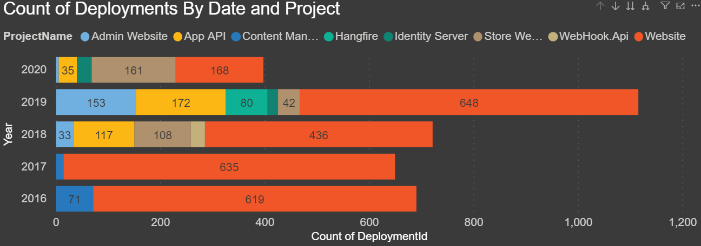
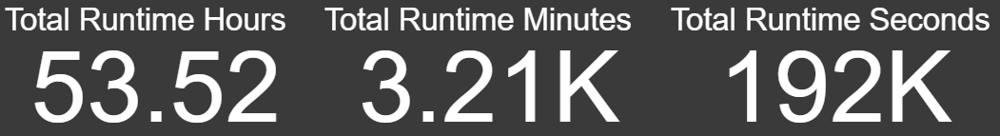
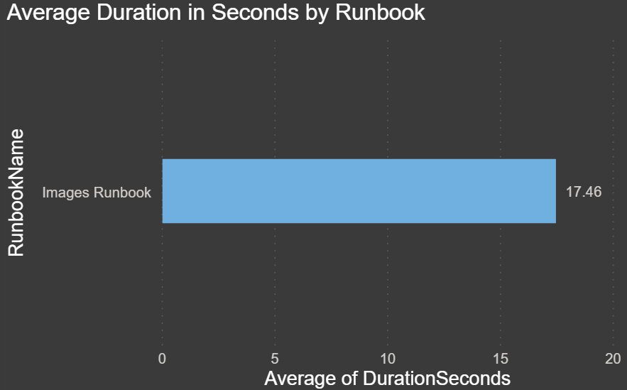
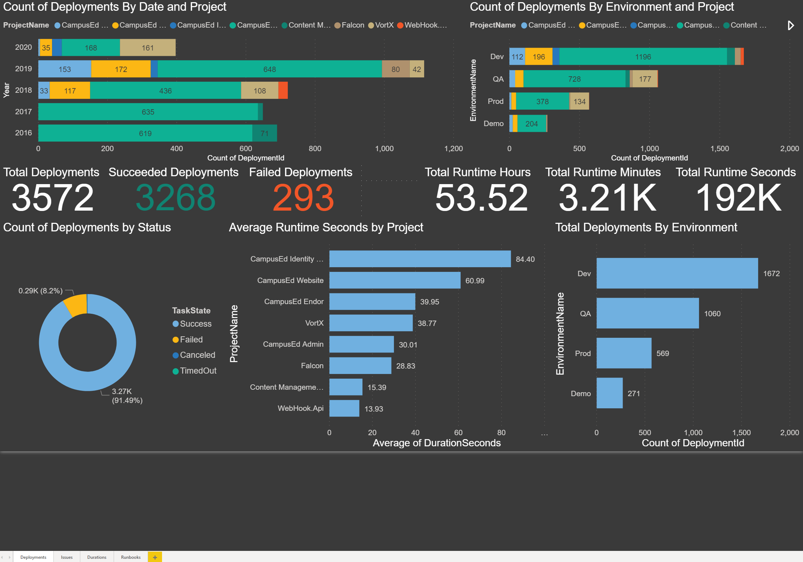
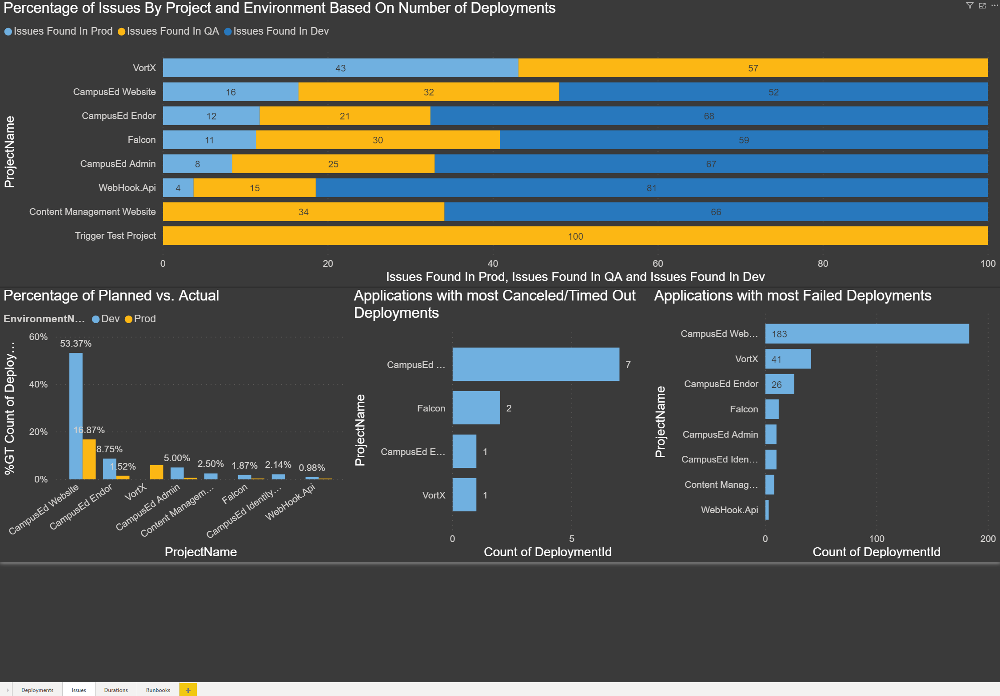

It recently dawned on me that I have been using Octopus Deploy for 5 years now. I do not remember how I first heard about Octopus Deploy, but before I started using Octopus Deploy, I had been automating deployments using RedGate SQL Toolbelt with SQL Compare with a combination of a C# app and batch files which I wrote to handle deployments.

I had a thought...I wonder if there are any metrics I can gather from the Octopus Deploy database for the past five years and create reports.

I started thinking about what I could determine, such as how much time and money automation has saved my company and me. If I could place an actual number on this, perhaps I could help others in their fight for automation where they work for justification. In the past, it has been a challenge trying to convince management that automation was a good thing. The most significant issues I've encountered is the constant human error and weekends away from the family due to long deployment times.

Another thought I had was to highlight development issues, such as how many times we have to skip releases due to bugs not found in our lower environments or to justify more resources to management for more testing.

I love saving time, so the best tool I know of to put together some metrics and display the analysis of data is PowerBI Dashboard.

Below is a sneak peek of what I was able to put together. In this blog we will go over how you can create a connection and pull data from your instance of Octopus Deploy. I've also included PowerBI Desktop templates for your Cloud and Local instances to help you get started quickly.

Let me summarize each section of the blog before we jump in
1. **Prerequisites:** This section covers the prerequisites for reporting from Octopus Deploy.
2. **Deployment History Charts:** This section covers each of the individual charts for deployments.
3. **Runbooks History Charts:** This section covers each of the individual runbook history charts.
4. **Reports:** This section covers the four initial reports and charts in the templates I provided.
5. **ROI** - Does Octopus Deploy really save my company and I time and money?
6. **Conclusion:** Wrap up!

## Prerequisites

### PowerBI Desktop - Setup
If you don't already have PowerBI Desktop installed go to my blog post for detailed instructions on how to install it [https://blog.reviewmydb.com/2020/06/how-to-install-powerbi-desktop.html](https://blog.reviewmydb.com/2020/06/how-to-install-powerbi-desktop.html).

### Octopus Deploy - SQL Server
Learn how to connect to a local instance of Octopus Deploy by going to my blog post [https://blog.reviewmydb.com/2020/06/how-to-connect-to-octopus-deploy-local.html](https://blog.reviewmydb.com/2020/06/how-to-connect-to-octopus-deploy-local.html).

### Octopus Deploy - Cloud

Learn how to get your cloud instance API key and connect to your cloud instance of Ocotpus Deploy by going to my blog post [https://blog.reviewmydb.com/2020/06/how-to-connect-to-your-octopus-deploy.html](https://blog.reviewmydb.com/2020/06/how-to-connect-to-your-octopus-deploy.html).

Learn

## Deployment History Charts

**Count of Deployments By Date and Project** - This was the first chart I put together, and I was kind of in shock to see how many deployments we had done each year over the last five years. This report breaks down each year and stacks each project. In this chart, you can drill down to see the count of deployments by quarters, month, and day. You can drill down by clicking the 'double down arrow' and then click on the 'up arrow' to go back.

**Count of Deployments By Environment and Project** - The chart below is showing us how many deployments we have done in each environment split by project.

**Total Deployments** - This is a count of all records in the Deployment History table, which is all of the deployments.

**Succeeded Deployments** - This is the count of all, but filtered by TaskState = Succeeded.

**Failed Deployments**  - This is the count of all, but filtered by TaskState = Failed.

**Total Runtime Hours** - This is a measure summing the total duration which, is stored in seconds and dividing it to get the total time all of the deployments took in hours.

**Total Runtime Minutes** - This is a measure summing the total duration which, is stored in seconds and dividing it to get the total time all of the deployments took in minutes.

**Total Runtime Seconds** - This is a sum of the total duration for all deployments.

**Count of Deployments by Status** - The chart below is displaying a summary and count of all deployment's Task Statuses.

**Average Runtime Seconds by Project** - The chart below shows us how long each deployment takes for each project on average. This would be for all environments.

**Total Deployments by Environment** - The chart below shows how many total deployments have occurred in each environment.

**Percentage of Issues by Project and Environment Based on Number of Deployments** - With this chart below, I wanted to show what the ratio of deployments, or redeployments we have done to each environment by project. This may not be an exact representation, but it suggests that the percentage of deployments in the lower environments (Dev and QA) means that if issues were found, they were re-deployed and fixed. If we had an even percentage of deployments in each environment, it could mean that no bugs/issues were found and the deployment when through to Production. 

If you notice in this chart that the 'Store Website' in both QA and Prod almost have the same percentage of deployments. To me, this means that instead of testing and finding issues in QA, the bugs are found in Production. This, to me, means that there is a code quality issue and needs to be addressed.

Compare the 'Store Website' to the 'Website', and you can see that the percentage difference is might higher in Dev and then QA compared to Production. To me, this means that the developers are finding bugs in Dev, and then the ones they miss are caught in QA, this over the past 5 years, we have released 16 major stable versions of the 'Website'.

While this may not be 100% accurate, you may want to pull in some data and create a relationship from your ticket system to perhaps make this more precise.

**Percentage of Planned vs. Actual** - The chart below compares the releases from Development vs. Production. The goal was to see how many project releases were meant to go to Production, but due to either, code issues or bugs they had to be re-released before making it to Production.

**Applications with most Canceled/Timed Out Deployments** - The chart below shows us which project has had the most canceled or timed out deployments. This could be an indication of perhaps a script or process taking too long if it timed out, maybe a large database change script or perhaps large file transfers.

**Applications with most Failed Deployments** - The chart below shows us which project/application has had the most failed deployments. This could be any number of things, such as misconfigured variables, changed servers, 3rd party component changes or upgrades, servers down, failed scripts, etc. If there is a high number, this may be something you should look into as why they keep failing.

**Applications with the Most Deployments** - The chart below shows us which project/application has had the most successful deployments.

**Max Duration of Seconds by Project and Environment** - The chart below shows us the max duration in seconds for each environment for each project. This allows you to compare how long it takes to deploy your code for each project.

**Average Days from Dev to Prod by Project** - The chart below shows us the average duration in days from the time a release has been deployed to Development and then the same release deployed to Production.

**Minimum Days To Release To Prod** - The chart below shows us the minimum time in days for a release to make it to Production from Development. In our case, we have deployed releases from Dev to Production on the same day. 

**Maximum Days To Release To Prod** - The chart below shows us the maximum time in days for a release to make it to Production from Development.

## Runbooks History Charts 
*Currently unavailable in the cloud API*

**Frequency of Runbooks by Date** - The chart below shows us the frequency of executions by date. Since we have only recently started using Runbooks, I have drilled down to the day to see how many we have run this month.

**Runbook Executions** - This is a count of all records in the Runbooks History table, which is all of the executions of all Runbooks.
**Succeeded Runs** - This is the count of all runs but filtered by TaskState = Succeeded.
**Failed Runs** - This is the count of all runs but filtered by TaskState = Failed.

**Total Runtime Hours** - This is a measure summing the entire duration, which is stored in seconds and dividing it to get the total time all of the runbook executions took in hours.
**Total Runtime Minutes** - This is a measure summing the entire duration, which is stored in seconds and dividing it to get the total time all of the runbook executions took in minutes.
**Total Runtime Seconds** - This is a sum of the entire duration for all runbook executions.

**Runbook Success Rates** - The chart below shows us the count of Runbook Executions based on their task status. In this case, we have filtered this by the 'IsPublished' flag = true. While we were testing, obviously, we had some failures, but we only want to know if this has failed since it's been published and used by our end users.

**Users Executing Runbooks** - The chart below shows us which users are executing the Runbooks and how many times each user has initiated an execution.

**Average Duration in Second by Runbook** - The chart below shows us the number of times each Runbook has been executed. This chart is also filtered on the 'IsPublished' flag = 'true'.

This might seem like a decent amount of work to create these reports, and you are correct. But I have a treat for you! I have taken a copy of my PowerBI reports and created a template for both the SQL Server and the Cloud Instances of Octopus Deploy. Below are links to each template and links to my blog which cover how to set up the connection string and API URL and API key so you can access your data.

Here is the SQL Server template: OctopusDeploySQLServer.pbt ([https://tinyurl.com/ycz4awvl](https://tinyurl.com/ycz4awvl))
Click here for instructions on how to set up this template: [https://blog.reviewmydb.com/2020/06/how-to-configure-sql-server-powerbi.html](https://blog.reviewmydb.com/2020/06/how-to-configure-sql-server-powerbi.html)

Here is the Cloud template: OctopusDeployCloud.pbt ([https://tinyurl.com/ydz9vjy5](https://tinyurl.com/ydz9vjy5)) Click here for instructions on how to set up this template: [https://blog.reviewmydb.com/2020/06/how-to-configure-powerbi-template-for.html](https://blog.reviewmydb.com/2020/06/how-to-configure-powerbi-template-for.html)

## Reports

Now that we have our data, we will be able to view all of the charts we created. I have organized the charts into several report 'pages'.

The first page is called 'Deployments'. Here is a screenshot of what it looks like with a sample of the data from my local instance of Octopus Deploy for the last 5 years, and then the next screenshot is a sample of data from my cloud app test.

*Local Instance - Deployments Page*

*Cloud Instance - Deployments Page*

The second page is 'Issues'. Here is a screenshot of my report with all of the charts relating to potential issues.

*Local Instance - Issues Page*

*Cloud Instance - Issues Page*

The third page is called 'Durations' and contains all charts relating to execution duration.

*Local Instance - Durations Page*

*Cloud Instance - Durations Page*

The final page is called 'Runbooks', this is currently only an option on the local instance of Octopus Deploy because there is no 'RunbookHistory' API call on the cloud instance.

*Local Instance - Runbooks Page*

## ROI

To answer the question of how much Octopus Deploy has saved my company, let's look at the data we have collected.

Over the past five years, Octopus Deploy has executed 3,572 deployments. Let us say that on a typical manual deployment, each deployment takes 1 hour to deploy to multiple servers. In my case, we have at least one website, one API, and two databases. Our other environments have more web servers, which are in web farms and more APIs.

At a bare minimum, 3,572 hours, and we know for sure it would have taken more time for the larger environments. Manual execution 3,572 hours, but the Octopus Deploy engines automated execution time tool only 53.5 hours.

If we had a person handling the deployments, this would take approximately 1/3rd of their time each month to just perform deployments at about 60 hours out of a typical 168 hour work month (21 workdays X 8 hours).

If our hourly rate was $80/hr, it would have cost us over $57k each year for 5 years for a total of $285,760.00.

The 'Server' instance of Octopus Deploy with 10 targets is free. 25 targets costs $2,300/year (per their website). They have varying degrees of licenses from 25 to 2,000 to unlimited targets. Click here to see pricing information: [https://octopus.com/pricing/overview](https://octopus.com/pricing/overview).

The 'Cloud' version for up to 10 targets is free for small teams with some storage limitations. Click here to see pricing information: [https://octopus.com/pricing/overview](https://octopus.com/pricing/overview).

Our licenses were purchased a while ago, and we were able to work out a custom deal for a reasonable price.

Which would you prefer, a $57k/year resource to focus 1/3rd of their time on deployments or $2,300 for a license and allow your resource to handle more critical work?

Now, if I could convince my company to give me a small bonus out of the $267,360.00, I saved them over the last 5 years that would be awesome, right?

## Conclusion

Now that you can see your data, I hope that you find some of these reports and charts useful, and perhaps you will even think up of new reports and charts to add to this. I hope you have now seen the extreme value of what Octopus Deploy brings to the table. If you do, comment and share your ideas, and perhaps I can incorporate them into my next version.