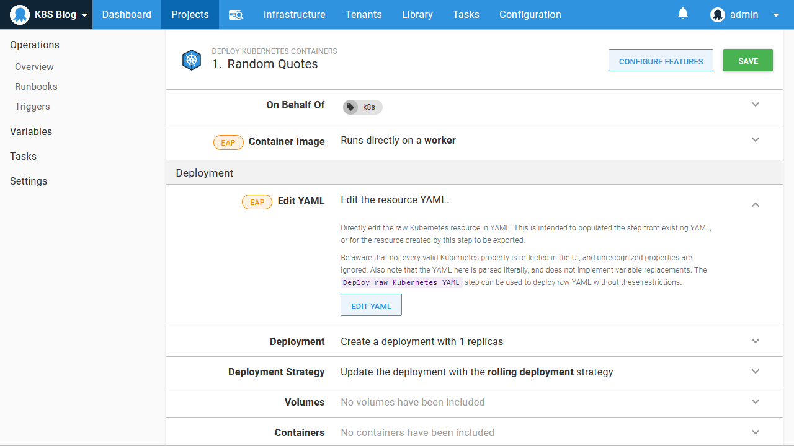
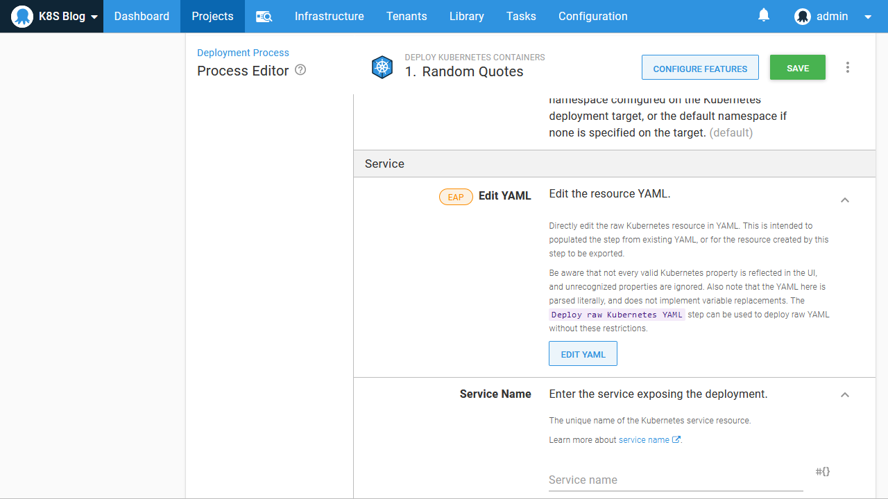

If you have been using Kubernetes for some time outside of Octopus, you likely have existing YAML resource definitions. Migrating this YAML into Octopus is easy thanks to a new feature introduced in Octopus 2020.2, giving you the best of both world with the ability to import, export and edit raw YAML while having your Kubernetes resources managed in an opinionated way by Octopus.

In this blog post we'll learn how to migrate existing YAML definition into an Octopus deployment.

## The sample yaml

Below is a YAML file defining a deployment resource and a service to expose the web application the Docker image contains:

```yaml
apiVersion: apps/v1
kind: Deployment
metadata:
  name: randomquotes
spec:
  selector:
    matchLabels:
      app: randomquotes
  replicas: 1
  strategy:
    type: RollingUpdate
  template:
    metadata:
      labels:
        app: randomquotes
    spec:
      containers:
        - name: randomquotes
          image: mcasperson/mywebapp:0.1.7
          ports:
            - name: web
              containerPort: 80
---
apiVersion: v1
kind: Service
metadata:
  name: randomquotes
spec:
  selector:
    app: randomquotes
  ports:
    - name: web
      port: 80
```

A common pattern in Kubernetes is to have a deployment exposed by a service, and potentially then have web traffic directed to it via an ingress. The YAML above is a simple example of the deployment and service pattern.

The Kubernetes steps in Octopus provide a way to capture this pattern in a single step, abstracting away some of the plumbing that links these resources together. So let's take our raw YAML and use it to build a step in Octopus.

## Creating the Octopus step

We'll use the **Deploy Kubernetes containers** step to define the deployment and service in the YAML above. This step is an opinionated combination of a deployment with an optional service, ingress, secret and configmap, and handles the plumbing required to link everything together:


Because we are not deploying an ingress, secret or configmap, we can remove those features from the step. This simplifies the user interface, allowing us to focus on the resources we are creating:


The **Edit YAML** section is new in Octopus 2020.2, and it allows the Kubernetes resources created by the step to be edited as YAML:



Clicking the **Edit YAML** button displays the YAML representation of the current settings in the step. Since we have just added the step, the only values shown are defaults or placeholders:


We can overwrite these values with the deployment YAML from our example above:


The deployment properties and container definitions are then populated in the form:


We can then repeat the process for the service, which has it's own **Edit YAML** section:



Once the details are saved, the service is populate with the service properties and ports:


