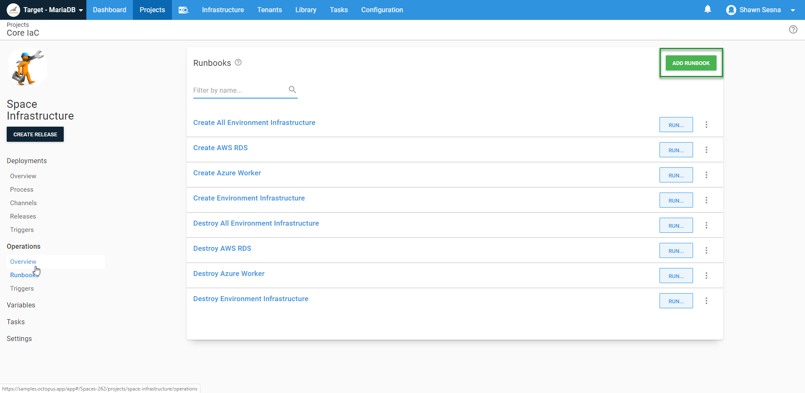

Octopus Deploy has over 400 step templates that you can use in your deployments. Many of these templates are written in PowerShell, and with the introduction of the [Linux Tentacle](https://octopus.com/docs/infrastructure/deployment-targets/linux/tentacle) a handful of step templates that have been converted to Bash versions, however, with PowerShell Core, converting existing templates to Bash isn't necessary.

In this post, I demonstrate how you can use existing Octopus Deploy step templates on a Linux Worker with PowerShell Core.

## Creating the ARM template

The first thing I'll need for this is a Linux machine to work with.  I'm using an Ubuntu Linux VM in Azure spun up from a Runbook.  

### Azure Resource Manager (ARM) template

Creating a VM in Azure is dead easy using ARM templates.  Microsoft did a fantastic job of making this generation of an ARM template quick and easy.  Go through the process of defining how you want your VM configured and export the template when you're done.


### ARM template parameters

The specific selections that you make when generating your ARM template aren't important as you can parameterize everything and control them with Octopus Deploy variables.  In the above image, items like `Virtual machine name`, `Username`, and `OS disk type` will all be parameters in our template to make it more generic.  This will make more sense when creating our Runbook.

## Octopus Deploy Runbook

[Operations Runbooks](https://octopus.com/docs/operations-runbooks) is one of Octopus Deploys more recent features.  Runbooks allow you to harness the power of Octopus Deploy to perform operational tasks such as restoring a database or recycling an IIS App Pool.  Unlike deployments, runbooks are designed to be run in any environment at any time and aren't constrained by Lifecycles (other than they can only be executed in the environments your application uses).  In this case, we're going to use runbooks to spin up our Linux VM.

### Create the Runbook

A Runbook exists inside your Octopus Deploy project, under Operations:


Click **Runbooks**, then click **ADD RUNBOOK**:



To spin up our Linux Worker VM, our Runbook will consist of:
- Creating a new Azure Resource Group
- Converting our Cloud init script to a Base64 string (more on this later)
- Running an ARM template
- Wait for the VM to be available
- Perform a health check

This post is more focused on demonstrating Linux with PowerShell core, so we're not going to go into too much detail regarding runbooks.

#### Create a resource group

Creating a new resource group is optional and mostly meant for tidiness and ease of deleting the resources created when executing an ARM template.  Using an existing resource group is perfectly fine.  Using a **Run an Azure Script** step, you can quickly create a resource group with a script:

```PS
$resourceGroupName = $OctopusParameters["Azure.Worker.ResourceGroup.Name"]
$resourceGroupLocation = $OctopusParameters["Azure.Location.Abbr"]

Try {
    Get-AzureRmResourceGroup -Name $resourceGroupName
    $createResourceGroup = $false
} Catch {
    $createResourceGroup = $true
}

if ($createResourceGroup -eq $true){
    New-AzureRmResourceGroup -Name $resourceGroupName -Location $resourceGroupLocation
}
```

#### Convert the Cloud init script to a Base64 string

ARM templates have two different ways to execute init scripts:
- [Custom Script Extension](https://docs.microsoft.com/en-us/azure/virtual-machines/extensions/custom-script-windows):
  Using the Custom Script Extension, you can supply a URI to a file (such as a [Gist](https://gist.github.com/discover)) that contains the script to include.  The advantage of this method is using source control for the script file.
- CustomData parameter (this post uses this method):
  The CustomData Parameter allows us to include the script as a string and pass it in as a parameter.  When provisioning Windows VMs, this value can be a string.  For Linux, this value must first be Base64 encoded, which can easily be done within a run a script task

For this example, I want my init script to do the following:
- Install Linux Tentacle
- Install PowerShell Core
- Configure Tentacle and register itself of to my cloud instance

##### Install Linux Tentacle

This portion of the script will cover the installation of the Tentacle.  If you've read any of our other blog posts about Linux Tentacle, it should look familiar:

```bash
serverUrl="#{Global.Base.Url}"   # The url of your Octous server
thumbprint="#{Global.Server.Thumbprint}"       # The thumbprint of your Octopus Server
apiKey="#{Global.Api.Key}"           # An Octopus Server api key with permission to add machines
name="#{Octopus.Space.Name}-#{Octopus.Environment.Name}"      # The name of the Tentacle at is will appear in the Octopus portal
publicHostName="#{Azure.Worker.DNS.Prefix}.centralus.cloudapp.azure.com"      # The url to the tentacle
workerPoolName="#{Azure.Worker.Pool.Name}"
configFilePath="/etc/octopus/default/tentacle-default.config"
applicationPath="/home/Octopus/Applications/"
spaceName="#{Octopus.Space.Name}"

sudo apt install --no-install-recommends gnupg curl ca-certificates apt-transport-https && \
curl -sSfL https://apt.octopus.com/public.key | sudo apt-key add - && \
sudo sh -c "echo deb https://apt.octopus.com/ stable main > /etc/apt/sources.list.d/octopus.com.list" && \
sudo apt update && sudo apt install tentacle -y
```

##### Install PowerShell Core

This bit will install PowerShell Core onto Ubuntu (see [Microsoft's documentation](https://docs.microsoft.com/en-us/powershell/scripting/install/installing-powershell-core-on-linux?view=powershell-7) for more information):

```bash
# Download the Microsoft repository GPG keys
wget -q https://packages.microsoft.com/config/ubuntu/18.04/packages-microsoft-prod.deb

# Register the Microsoft repository GPG keys
sudo dpkg -i packages-microsoft-prod.deb

# Update the list of products
sudo apt-get update

# Enable the "universe" repositories
sudo add-apt-repository universe

# Install PowerShell
sudo apt-get install -y powershell
```

##### Configure Tentacle and register itself of to my cloud instance

Lastly, we need the script to configure the Tentacle and then register itself to our instance.  This script uses variables that were defined in the installation section above:

```bash
sudo /opt/octopus/tentacle/Tentacle create-instance --config "$configFilePath"
sudo /opt/octopus/tentacle/Tentacle new-certificate --if-blank
sudo /opt/octopus/tentacle/Tentacle configure --port 10933 --noListen False --reset-trust --app "$applicationPath"
sudo /opt/octopus/tentacle/Tentacle configure --trust $thumbprint
echo "Registering the Tentacle $name as a worker with server $serverUrl in $workerPoolName"
sudo /opt/octopus/tentacle/Tentacle register-worker --server "$serverUrl" --apiKey "$apiKey" --name "$name" --space "$spaceName" --publicHostName "$publicHostName" --workerpool "$workerPoolName"
# Install and start the service
sudo /opt/octopus/tentacle/Tentacle service --install --start
```

With our script set up, we need to convert it to a Base64 string, then assign it to an output variable so it can be used in the ARM template.  Here it is in a **Run a Script** step called `Convert cloud init script`:

```PS
# Define cloud init script
$cloudInitScript = @'
#!/bin/bash

# Install Octopus listening tentacle
serverUrl="#{Global.Base.Url}"   # The URL of your Octopus server
thumbprint="#{Global.Server.Thumbprint}"       # The thumbprint of your Octopus Server
apiKey="#{Global.Api.Key}"           # An Octopus Server api key with permission to add machines
name="#{Octopus.Space.Name}-#{Octopus.Environment.Name}"      # The name of the Tentacle at is will appear in the Octopus portal
publicHostName="#{Azure.Worker.DNS.Prefix}.centralus.cloudapp.azure.com"      # The url to the tentacle
workerPoolName="#{Azure.Worker.Pool.Name}"
configFilePath="/etc/octopus/default/tentacle-default.config"
applicationPath="/home/Octopus/Applications/"
spaceName="#{Octopus.Space.Name}"

sudo apt install --no-install-recommends gnupg curl ca-certificates apt-transport-https && \
curl -sSfL https://apt.octopus.com/public.key | sudo apt-key add - && \
sudo sh -c "echo deb https://apt.octopus.com/ stable main > /etc/apt/sources.list.d/octopus.com.list" && \
sudo apt update && sudo apt install tentacle -y

sudo /opt/octopus/tentacle/Tentacle create-instance --config "$configFilePath"
sudo /opt/octopus/tentacle/Tentacle new-certificate --if-blank
sudo /opt/octopus/tentacle/Tentacle configure --port 10933 --noListen False --reset-trust --app "$applicationPath"
sudo /opt/octopus/tentacle/Tentacle configure --trust $thumbprint
echo "Registering the Tentacle $name as a worker with server $serverUrl in $workerPoolName"
sudo /opt/octopus/tentacle/Tentacle register-worker --server "$serverUrl" --apiKey "$apiKey" --name "$name" --space "$spaceName" --publicHostName "$publicHostName" --workerpool "$workerPoolName"


# Download the Microsoft repository GPG keys
wget -q https://packages.microsoft.com/config/ubuntu/18.04/packages-microsoft-prod.deb

# Register the Microsoft repository GPG keys
sudo dpkg -i packages-microsoft-prod.deb

# Update the list of products
sudo apt-get update

# Enable the "universe" repositories
sudo add-apt-repository universe

# Install PowerShell
sudo apt-get install -y powershell

# Install and start the Tentacle service
sudo /opt/octopus/tentacle/Tentacle service --install --start
'@

Write-Output "Converting cloudInitScript to base64"

# Convert to Base64
$cloudInitScript = [System.Convert]::ToBase64String([system.Text.Encoding]::UTF8.GetBytes($cloudInitScript))

# Set output variable
Set-OctopusVariable -name "CloudInitScript" -value $cloudInitScript
```

With our script converted to a Base64 string, we can pass it to our ARM template:


#### Wait for the VM

This step is another **Run a Script** step that waits for the newly created VM to respond and lets us know it's available for use.  Here's the script (`Test-NetConnect` returns warnings if the destination is unreachable, this is normal as we wait for the VM to be available):

```PS
# Define variables
$publicDNS = "#{Azure.Worker.DNS.Prefix}.#{Azure.Region.Name}.cloudapp.azure.com"

$connectionTest = Test-NetConnection -ComputerName $publicDNS -Port 10933 -WarningAction SilentlyContinue -InformationLevel Quiet

while ($connectionTest -eq $false)
{
  # Give it five seconds
  Start-Sleep -Seconds 5

  # Server not quite ready
  $connectionTest = Test-NetConnection -ComputerName $publicDNS -Port 10933 -WarningAction SilentlyContinue -InformationLevel Quiet
}
```

#### Perform a health check
The final step of our Runbook is to perform a health check on the newly created Worker.  The **Health Check** built-in step template won't work for us in this as it is designed to work against a deployment target and not a Worker.  This step is another **Run a Script** step that calls the Octopus Deploy API to initiate a health check on a Worker:

```PS
# Define parameters
$baseUrl = $OctopusParameters['Global.Base.Url']
$apiKey = $OctopusParameters['Global.Api.Key']
$spaceId = $OctopusParameters['Octopus.Space.Id']
$spaceName = $OctopusParameters['Octopus.Space.Name']
$environmentName = $OctopusParameters['Octopus.Environment.Name']

# Get worker pool
$workerPool = (Invoke-RestMethod -Method Get -Uri "$baseUrl/api/$spaceId/workerpools/all" -Headers @{"X-Octopus-ApiKey"="$apiKey"}) | Where-Object {$_.Name -eq "#{PoolName}"}

# Get worker
$worker = (Invoke-RestMethod -Method Get -Uri "$baseUrl/api/$spaceId/workerpools/$($workerPool.Id)/workers" -Headers @{"X-Octopus-ApiKey"="$apiKey"}).Items | Where-Object {$_.Name -eq "$spaceName-$environmentName"}

# Build payload
$jsonPayload = @{
    Name = "Health"
    Description = "Check $spaceName-$environmentName health"
    Arguments = @{
        Timeout = "00:05:00"
        MachineIds = @(
            $worker.Id
        )
    OnlyTestConnection = "false"
    }
    SpaceId = "$spaceId"
}

# Execute health check
Invoke-RestMethod -Method Post -Uri "$baseUrl/api/tasks" -Body ($jsonPayload | ConvertTo-Json -Depth 10) -Headers @{"X-Octopus-ApiKey"="$apiKey"}
```

When done, your Runbook should look something like this:


## Executing a PowerShell step template on Linux with PowerShell Core
Now comes the fun part!  In this example, I'm using the [MariaDB - Create Database If Not Exists](https://library.octopus.com/step-templates/2bdfe600-e205-43f9-b174-67ee5d36bf5b/actiontemplate-mariadb-create-database-if-not-exists) step template.  As the name implies, it connects to a MariaDB server and creates a database if it doesn't exist.  Not only is this step template written completely in PowerShell, it also makes use of a third-party PowerShell module called [SimplySql](https://www.powershellgallery.com/packages/SimplySql/1.6.2).  During execution, if the template detects that SimplySql is not installed, it downloads it to a temporary folder and uses `Import-Module` so that it's included for the deployment:


When included in a deployment, we can see that the Linux Worker uses PowerShell Core to execute the step:


Here's the log output of the step*:

```
PowerShell module SimplySql is not installed, downloading temporary copy ... 
Installing package 'SimplySql'
Downloaded 0.00 MB out of 6.53 MB.
[                                                                    ]
Installing package 'SimplySql'
Unzipping
[ooooooooooooooooooooooooooooooooooooooooooooooo                     ]
Installing package 'SimplySql'
Process Package Manifest
[oooooooooooooooooooooooooooooooooooooooooooooooooooooooooooooooo    ]
Importing module SimplySql ... 

Database d_petclinic_dbup already exists. 
```
*Log has been formatted for readability.

As you can see, the step template detects the SimplySql module is not installed, downloads SimplySql, and imports it.  It then connects to the MariaDB server and finds the database already exists, and it does it all with PowerShell.


## Conclusion
A contributing factor in Octopus Deploy adoption amongst those in the world of Linux was the limited selection of templates that could be used.  With PowerShell Core, the selection of templates that can execute on Linux machines is opened up exponentially.
