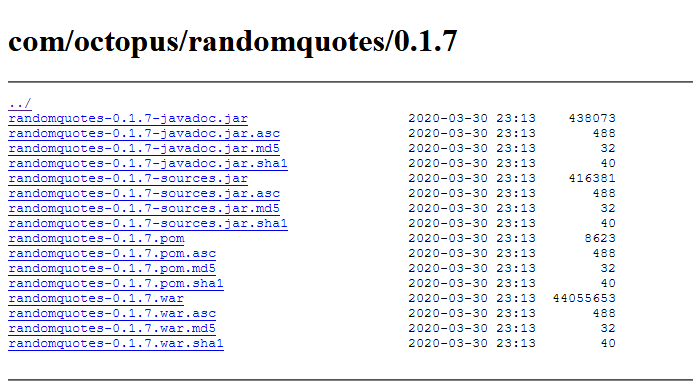
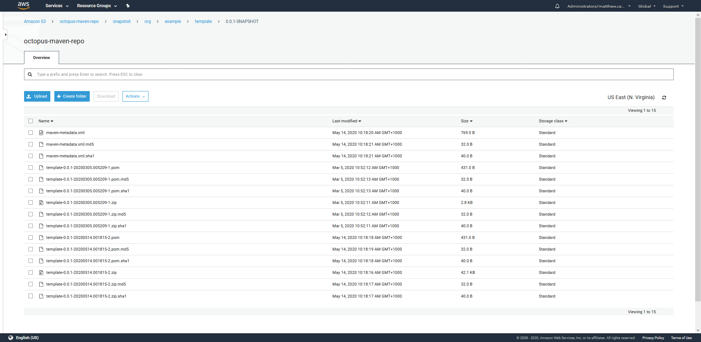

Maven provides many features for Java developers. As a build tool, Maven provides a well supported project format and a huge selection of build tool plugins to create almost any kind of Java (or JVM) application imaginable. Other build tools like Gradle also exist in this space, though Maven is still popular.

Maven also defines a standard package repository that is almost universally used by Java developers. A Maven repository is fairly simple, as it is implemented using static files. There is no API and no server beyond something like an HTTP server to host the files. This makes it easy to inspect the contents of a Maven repository and access the files it contains.

In this blog post, I'll look at how files are hosted in a Maven repository and learn how to access the artifacts.

## Maven Central vs. Maven Search portals

Maven Central is a free and publicly available repository of open source libraries and applications. There are many mirrors of Maven Central, but the main repository can be found at https://repo1.maven.org/maven2/.

As noted in the introduction, Maven repositories are nothing more than static files saved in a specifically formatted hierarchy. You can open https://repo1.maven.org/maven2/ in a web browser and navigate the directory structure yourself with no additional tools.

However, being able to quickly search these repositories is very convenient, and sites like https://search.maven.org/ maintain an index of the artifacts in a repository and expose them via searches.

It is important to be aware that unlike other artifact repositories that expose APIs with search functionality, a Maven repository is a separate entity from any search service. A site like https://search.maven.org/ is not a Maven repository and is not used by Maven clients; it only provides a convenient interface through which to search a Maven repository.

## Browsing the Maven repository

Maven artifacts are identified by a group ID, an artifact ID, and a version. These three points are often combined into a coordinate called a GAV (Group, Artifact, and Version).

Octopus has published a sample Java application with a group ID of `com.octopus`, and an artifact ID of `randomquotes`.

:::hint
Group IDs are commonly a reverse DNS name. However, this is just a convention and not a requirement.
:::

The group and artifact IDs are used to build the directory structure that holds the Maven artifacts. If you open https://repo1.maven.org/maven2/com/octopus/randomquotes/, you will find a number of subdirectories that contain releases and metadata files that describe them.

The file at https://repo1.maven.org/maven2/com/octopus/randomquotes/maven-metadata.xml is created when a Maven artifact is published. It lists various details about the artifacts that have been published, like version number and the dates when the artifact was last updated.

## Maven artifact files

Browsing to a specific Maven artifact version like https://repo1.maven.org/maven2/com/octopus/randomquotes/0.1.7/ shows the files that make up a release.

Again we find some differences here between Maven and other package repositories, specifically that a given version of a Maven artifact can contain a number of individual files. In the screenshot below you can see this Maven artifact has files containing the JavaDocs, application source code, and the application itself as a WAR file:



*The files that make up a Maven release.*

Maven supports this through the use of classifiers, which are embedded in the artifact file names. For example, the file `randomquotes-0.1.7-javadoc.jar` shares the GAV of `com.octopus:randomquotes:0.1.7` with the other files in this directory, but is distinguished by a classifier of `javadoc`. Likewise the file `randomquotes-0.1.7-sources.jar` has the classifier of `sources`.

The file `randomquotes-0.1.7.war` has no classifier, and would typically be considered the default artifact, and is most likely the artifact that you would deploy or consume as a dependency in your own project.

Maven also supports multiple files of different types. For example, we may have a file called `randomquotes-0.1.7.zip` in the same directory. The file extension is referred to as the packaging.

## Downloading Maven files

While we can happily use a web browser or tools like Curl to download Maven artifacts, this does require us to know exactly how to construct the URLs. We can use the Maven CLI tool to download files based on their GAV, classifier, and packaging, and let it deal with finding the correct files.

The command below will attempt to download the default JAR package to the local `/tmp` directory:

```
mvn org.apache.maven.plugins:maven-dependency-plugin:2.8:copy -DrepoUrl=http://central.maven.org/maven2/ -Dartifact=com.octopus:randomquotes:0.1.7 -DoutputDirectory=/tmp
```

If we run this, we receive an error saying `Could not find artifact com.octopus:randomquotes:jar:0.1.7`. This error is generated because this particular artifact does not have an unclassified JAR file available; it only contains a WAR file. We can append this packaging type to the GAV to download the WAR file:

```
mvn org.apache.maven.plugins:maven-dependency-plugin:2.8:copy -DrepoUrl=http://central.maven.org/maven2/ -Dartifact=com.octopus:randomquotes:0.1.7:war -DoutputDirectory=/tmp
```

To download the source code associated with this artifact, we can define the packaging type and classifier of the source code package:

```
mvn org.apache.maven.plugins:maven-dependency-plugin:2.8:copy -DrepoUrl=http://central.maven.org/maven2/ -Dartifact=com.octopus:randomquotes:0.1.7:jar:sources -DoutputDirectory=/tmp
```

These commands highlight how Maven defaults to downloading unclassified JAR files, but it can specifically download a package of a certain type and classifier if required.

## SHAPSHOT versions

Maven has the notion of a SNAPSHOT version. SNAPSHOT artifact versions are typically used during development to continually republish the same version over and over.

In the screenshot below, you can see the files from a Maven repository hosted in AWS S3 for the artifact `org.example:template:0.0.1-SNAPSHOT`. There are multiple ZIP files with names like:
- `template-0.0.1-20200305.005209-1.zip`
- `template-0.0.1-20200514.001815-2.zip`

Both of these files represent a SNAPSHOT version pushed to the repository:



*The files that make up a SNAPSHOT release.*

End users don't normally need to worry about downloading a specific SNAPSHOT version. Maven clients will inspect the file at https://octopus-maven-repo.s3.amazonaws.com/snapshot/org/example/template/0.0.1-SNAPSHOT/maven-metadata.xml, read the time when each file was updated, and download the latest one automatically.

Note, only SNAPSHOT versions contain this second `maven-metadata.xml` file. Non-SNAPSHOT versions are expected to only be published once and remain unchanged, so the files that make up non-SNAPSHOT releases can be determined from the GAV, packaging type, and classifier, removing the need for this second `maven-metadata.xml` file.

## Conclusion

Because they are just static files, Maven repositories are relatively simple to interact with. Web browsers and tools like Curl can download artifacts directly if you know how the URLs are constructed.

SNAPSHOT versions can be a little trickier as the file names include unique timestamps that must be read from a `maven-metadata.xml` file.

Using the Maven command-line tool `mvn` avoids these issues and allows you to download files knowing only the group ID, artifact ID, and versions, and optionally the classifier and packaging type.