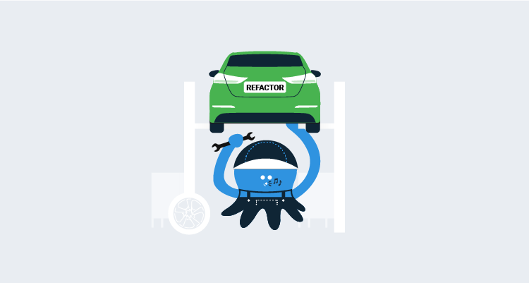

In 2012, we shipped Octopus Deploy 1.0, and nearly eight years later, the product continues to grow in popularity and capability. As a part of this journey, the codebase has undergone some significant changes, including major overhauls and rewrites. This post is the first in a new blog series, where we will share some of the problems we’ve encountered as part of this growth, and how we’re refactoring the Octopus codebase to simplify it and make it easier to change.

In this post, I explain how we’re introducing modularity to reduce the complexity of integrating Octopus with external services and tools.

## Octopus, Tentacle, and Calamari

Octopus has always made it easy to ship web sites and services, but the programming logic that powers deployment execution has moved around over the years.

In Octopus 1.x and 2.x, the deployment execution logic lived inside the Tentacle. Octopus Server did the primary coordination, but deployments were executed directly within the Tentacle agent running on deployment targets. If we shipped a new version of Octopus Server or made an update to the deployment execution logic, we had to ship a new version of Tentacle. They were tightly coupled and had to be kept in sync.

In Octopus 3.0, we introduced Calamari, which we thought of as little slices of Octopus. This new component was a standalone deployment execution engine, and we envisioned creating multiple independent calamari slices for different purposes and technologies. Tentacle was simplified as it became a simple pipe to communicate with the Octopus Server and securely transfer deployment data. Deployment work was delegated to Calamari. Over time, Calamari has grown into a bit of a monolith, and we never quite created the multiple versions we expected to, just the Standard Calamari version and a Calamari Cloud version.

Tentacle and Calamari have worked very well this way, and they’ve helped our customers execute tens of millions of deployments.

This hasn’t been without challenges, though. If we want to add a new technology integration, it requires the developer to have in-depth knowledge of numerous touch-points across the Octopus codebase from the front-end to the server-side code and Calamari. While this works, it slows us down, and it adds friction to creating new features.

## Introducing Calamari flavors

Our first step was to split up Calamari, as we originally intended, into pieces we’re calling _flavors_. The split is between step categories (e.g., AWS, Terraform, K8). Each flavor is a separate executable, which allows us to vary the platforms we target with each flavor (Windows, macOS, Linux, and ARM) as well as the runtime (e.g., .NET Core 3.1). This clean separation allows us to iterate quickly and focus on a particular technology without having to keep everything else front of mind.

Calamari flavors have several advantages:

* Each slice is independent and can be upgraded independently and customized as per the project’s needs.
* We can separate older technologies like Azure Cloud Services and keep them stable while we focus on other priorities.

## Introducing Sashimi

With the rethink of Calamari, we’ve also started slicing up the Octopus Server into pieces we’re calling Sashimi. Similar to Calamari, these slices will be along deployment step technology lines. The slices will eventually contain the UI and server-side parts of the step, deployment target, and accounts.

This is a huge step forward that allows us to make the Octopus Server (both front-end and web services) a world-class coordination engine without any specific knowledge or hooks for technology-specific steps. For example, we can have support for Azure, AWS, or Terraform without the server having any specific knowledge or references to these technologies.

With Sashimi, our goal is to simplify the development work required to add support for new technologies and services. In other words, developers on our team can write code to add support in isolation from Octopus, grok it, and test it in isolation without having to understand all the touch-points within Octopus Server. The outcome is faster integration with fewer headaches. For instance, we could introduce Pulumi support by following the patterns created by Terraform in a very short period. It also opens up the possibility for third parties to add support for their technologies within Octopus with very little overhead.

### Sashimi and avoiding duplication

Each Sashimi slices is contained within a NuGet (`.nupkg`) package and contains:

- Zipped UI files that we inject into the main user interface.
- Server-side processing components.
- Any third party libraries or components (dependencies).
- Standalone Calamari executables for each platform.

This approach introduced an interesting problem that previously held us back. Since each of the Calamari executables contain the full .NET Core runtime, the size of the Octopus Server installer would increase significantly. For example, if we had ten Calamari flavors for three platforms each, this produces thirty Calamari components at 40 MB each when compressed. That’s an additional 1.2 GB added to the installer download, which isn’t ideal.

### Sashimi and Calamari consolidation

To solve this problem, we took a page out of the [Windows Imaging Format](https://en.wikipedia.org/wiki/Windows_Imaging_Format) file format and used the [Single-instance storage](https://en.wikipedia.org/wiki/Single-instance_storage) technique. At build time, we look at all the Calamari packages and hash each individual file. Then we only store the unique files in the resulting archive, which is only about 150MB in size, regardless of how many flavors of Calamari there are. At runtime, we use the included index file to reconstitute the original Calamari executable archives.

## Conclusion

With Calamari and Sashimi, we are achieving our goal of little slices of Octopus and true modularity. This approach brings many benefits, the most prominent of which is a simpler codebase that makes it easier for us to add new integrations.

We’re still in the middle of this transition, but it’s already proving its value. This is refactoring at its best. We’re improving the design of our codebase, and it should be transparent to our customers.
