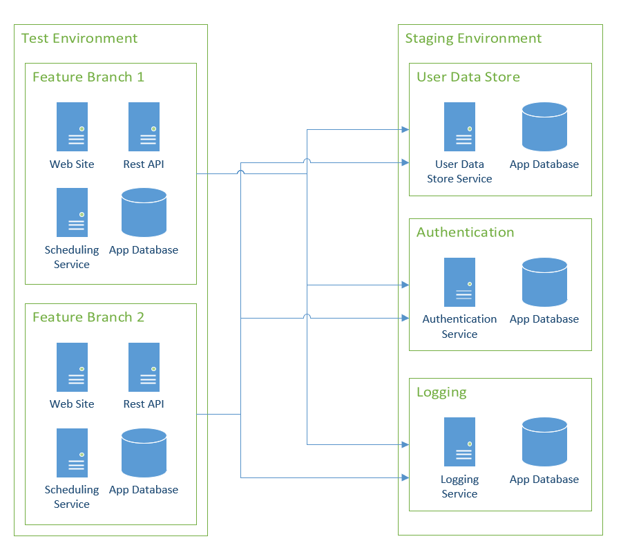
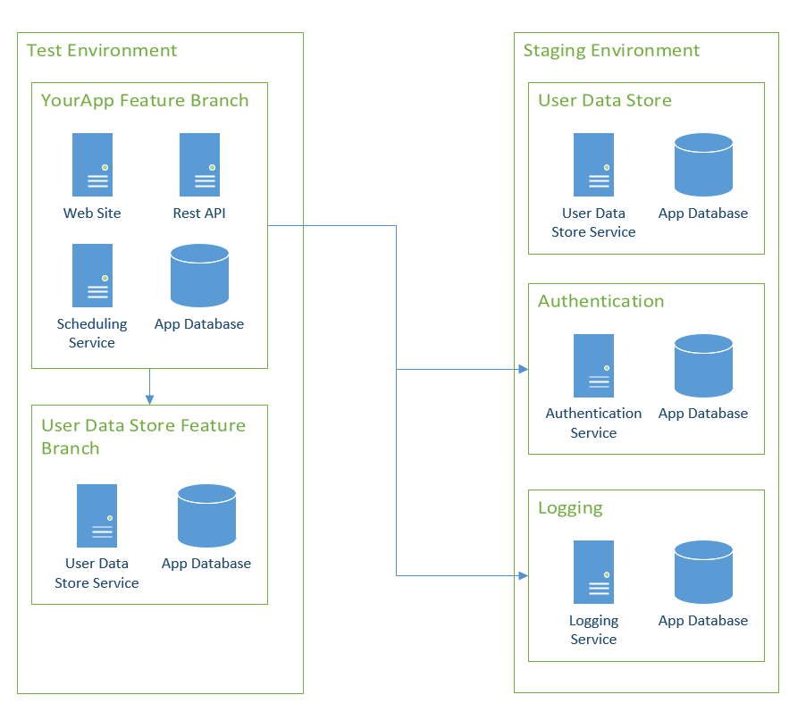
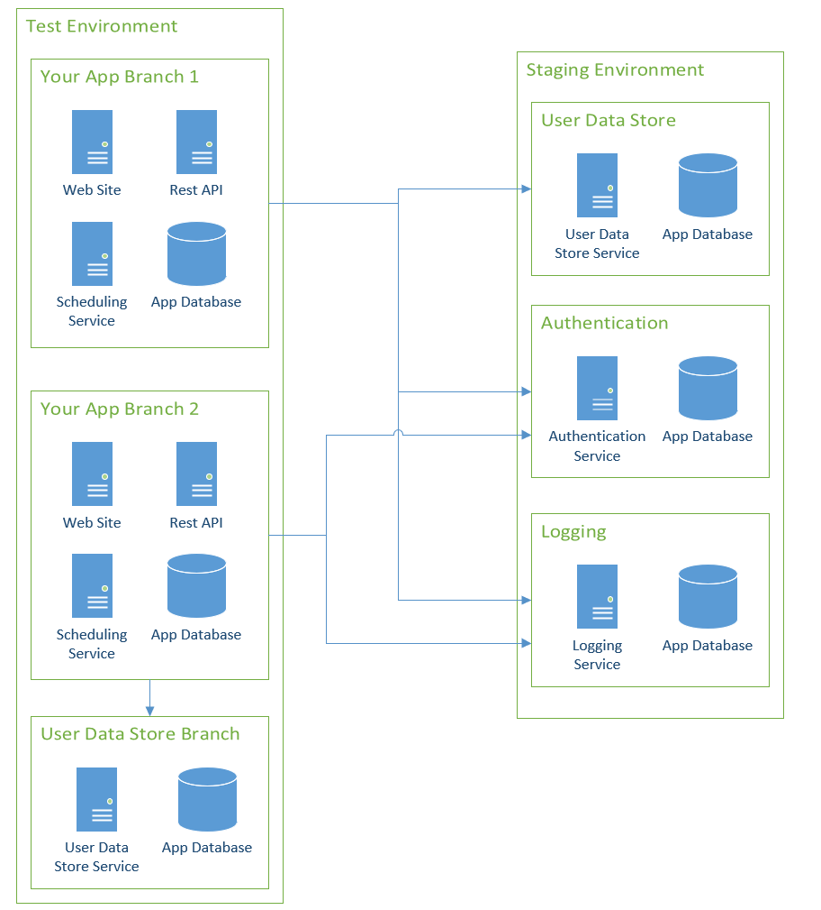

I transitioned to Git in 2013.  Since that time, I have been doing feature branch testing all wrong.  The problem was, I worked in places with the same static environments, **{{Dev, Test, Staging, Production}}**.  Each environment had one instance of my application, and they all reflected what was in the `master` branch.  The only way for QA to test a new feature was to merge code into `master`.  In a perfect world, I would stand up a sandbox for the feature branch for QA to test.  The **{{Dev, Test, Staging, Production}}** lifecycle represented my pre-Git life.  In this article, I walk through how I’ve adjusted my thinking to better leverage Git.

!toc

## Feature branches and feature flags

This article discusses the [feature branches workflow](https://www.atlassian.com/git/tutorials/comparing-workflows/feature-branch-workflow), but this article can also be used for those following the [Gitflow workflow](https://www.atlassian.com/git/tutorials/comparing-workflows/gitflow-workflow). There is an alternative to this approach, [feature flags](https://www.martinfowler.com/articles/feature-toggles.html).  Before diving into the rest of the article, I want to discuss the differences between feature branches and feature flags.  

As I mentioned before, I started using Git back in 2013.  At that time, I worked on a loan origination system for a bank.  When someone came in for a loan, the loan officer would enter in their details into the loan origination system my team was responsible for.  At any given point there were hundreds of users at the bank using the software.  They all had different ideas about how it should work, and they’d submit a variety of feature requests, bug reports, and other miscellaneous information.  Loan origination systems are complex.  What seems like a _simple feature_ requires significant testing.

Imagine a feature request came in which stated “for loans with two or more people, show the lowest credit score found for each person in the last six months rather than the showing current credit score.”  There are a lot of implementation questions and details that need to be worked out to implement that feature.  The developers would create a new branch called `feature/lowest-credit-score` and start their implementation.  Eventually, the developers would reach a point in which they felt _good_ about the change and were ready for feedback from QA and the Business Owner of the feature.  How should they get feedback for that?

There are two main problems we ran into:
1. The code is not ready for **Production**.  The only branch being used for deployments is `master`.  After it is merged into `master` it could end up in **Production** if someone isn’t careful.
2. QA has several automated tests that verify the old business rules that show the current credit score.

Typically, I have seen two approaches to solve this problem:
1. Create a feature flag called `LowestCreditScore`.  When the feature flag is set to `True` it will use the new logic.  When that flag is set to `False` it will use the old logic.
2. Spin up a new instance of the application, also called creating a sandbox, in a **Test** or **QA** environment to get feedback and a place for QA to update their tests.

There are pros can cons to either approach.  Feature flags have a nasty way of embedding themselves everywhere in the code, and they introduce complexity.  Each if/then statement in the code requires additional unit tests.  But feature flags allow you to deploy code with the new feature turned off.  You can turn on the feature when you are ready.  Or, you can turn on the feature for a set of people to get their feedback.  

Creating a sandbox requires additional resources, such as CPU, disk space, and RAM.  If sandboxes aren’t cleaned up, it is easy to reach the point of resource exhaustion.  There are only so many websites that can be created in a web server and only so many databases can be created in a database server.  But they allow someone to get feedback and for QA to verify without merging unfinished code into `master`.  

What’s nice, is these options are not mutually exclusive.  You can have both, or you can have neither.  In my experience, having a separate sandbox for testing and feedback on a new feature (or hot-fix) would’ve prevented a lot of headaches.  In this example, I would’ve recommended both approaches.  I can foresee a lot of back and forth, and this change could have ramifications on how loans are approved.  If the ramifications are negative in **Production**, being able to turn off the change quickly is extremely beneficial.

## Deployment lifecycles

I have been busy configuring an application to demo feature branches.  I started two lifecycles along with corresponding channels.  These lifecycles represented the same process I have been using since I started as a developer back in 2004.

- Default: **{{Dev, Test, Staging, Production}}**
- Feature Branch: **{{Dev, Test}}**

The intended development workflow is:
1. All feature branches go to the `Dev` environment, and if that is successful, they proceed to `Test` for QA/Business Owners to verify the work.  New infrastructure is spun up for that feature branch only.  The branch name is stored in the pre-release tag.
2. When the feature branch looks okay, a PR will merge the feature branch into master.  Unlike feature branches, there are no pre-release tags for this package. That’ll deploy the merged code to the static `Test` database.  The feature branch infrastructure is then backed up and deleted.
3. QA and the Business Owners will verify everything still looks good in the static `Test` environment.  
4. The release will be pushed to `Staging` and reverified.
5. Assuming everything looks good, that release will be promoted to `Production`.

As I got deeper into setting up the example for this post, the same question kept popping into my head:

> Why would I re-deploy to dev and test after merging to master?  Why do those environments have static resources, such as databases, websites, and file storage?

## Static vs. dynamic environments

A static environment is an environment where application-specific resources (databases, file storage, etc.) have to be static.  Spinning up and using new resources requires a lot of coordination and communication to avoid an outage or downtime.  Any sort of downtime which affects non-IT staff (external users, business users, etc.) is considered a BIG DEAL.  The time between deployments to these environments is measured in days, not minutes.

Most applications deployed via Octopus Deploy use RDMS databases such as SQL Server, Oracle, PostgreSQL, and MySQL.  The `Production` instance of the database has to be static.  It isn’t feasible to create a new copy of a `Production` database for each deployment.  As cool as it would be, the time and resource (disk space, CPU usage, RAM usage) cost would be too high.  One application deployment to `Production` a week is considered fast.  Typically, it is once a fortnight to once a quarter.

Based on those reasons, `Production` is a static environment.  

It is common for companies to have a *Production-like* environment to run final tests before going to `Production`.  These environments have names like `Staging`, `Pre-Prod`, `Integration`, or `UAT`.  For the purposes of this article, I will use `Staging` to represent those environments.  

`Staging` is as _Production-like_ as possible.  This includes making websites publicly available to external users to test upcoming features.  Even if it is not publicly available, non-IT staff may access it to try out new features prior to going to `Production`.  `Staging` is deployed to more often than `Production`, perhaps once or maybe even twice a day.

Based on the static environment criteria, `Staging` is a static environment as well.

A dynamic environment is an environment where application-specific resources are in flux.  Resources can be spun up and down as needed.  Or if there is a bug in the authentication pipeline.  Or if a person is doing a deployment, and it hasn’t finished yet.  Downtime, while annoying, is tolerated and limited to IT Staff. Deployments occur multiple times a day.

`Test` is very much a dynamic environment.  

## The downside of static test environments

When I think of `Dev` and `Test` environments, I think of one word: *churn*.

### Test environments are rarely stable

I’ve worked on projects where at the height of crunch time, we did 20-25 deployments to `Test` in a 10-hour period.  That is a deployment every 24-30 minutes, and during the same time we were doing 1.5x as many deployments to `Dev`.  That’s because we had a single `Dev` instance and a single `Test` instance of the application.  When it was time for QA to test new features, we merged our changes into master to get it deployed to `Test`.  Believe it or not, we weren’t perfect on the first try.  

Those 20-25 deployments are actually 4-5 deployments per feature.  Some deployments were due to bugs, while some were the result of an incorrect merge conflict resolution. Features were only half-done before being merged into master, and it was rare when more than one feature was finished on the same day.  Planning when to release code was a bit of a nightmare.  Prior to a scheduled release, we would _freeze_ feature work and spend several days _bug bashing_.  A freeze meant no new features could be merged into master.

We had a whiteboard in our team area that told us if it was okay to merge into master.

This also made it very difficult to deploy hot-fixes.  We had to create a separate channel to bypass `Dev` and `Test` and go straight to `Staging`.  

### Very few apps are completely isolated

With the advent of SOA and Microservices, applications are no longer these big massive (isolated) monoliths.  Before, each application would have its own logging, authentication, configuration, and notification modules.  That’s okay when you have one application, but the cost of maintaining those duplicate modules grows when you add two or more applications into the mix.  Thankfully, companies wised up to the duplicate effort, and now they have a single logging server or a single authentication service, and so on.

This leads me to my next point, applications, it seems more than ever, are dependent on other applications to function properly.  Services my application is dependent on are being changed at the same time.  If a dependent service goes down due to a bug, my application goes into a degraded state, and certain functionality is limited until that dependent service is back up.

We do this because we point our applications to the services in the same environment.  It makes sense when every environment is static.  My app is in `Test`, a dependent service is in `Test`.  The URL of that service never changes; I should point my application to that.

### What is the point of the dev environment?

Most places I worked the `Dev` environment was rarely used.  It didn’t have very much data to test with.  It was almost always down, and no one really used it.  It was just there.  Some teams ran automated tests against it, but the results were typically ignored because the data was so out of date.  If a deployment failed, we would band-aid a solution so it could get to the `Test` environment so QA could continue working.  

`Dev` was always a rubber stamp environment.  

## Re-thinking environments for feature branch deployments

`Production` and `Staging` aren’t going anywhere, nor should they, but `Dev` and `Test` need to be completely re-thought.

- Combine `Dev` and `Test` into one environment: `Test`.
- When a new feature branch is checked in, new infrastructure for that feature branch is spun-up in `Test`.  
- Subsequent check-ins for that feature branch will go to that infrastructure.
- By default, all applications in `Test` use the `Staging` instance of their dependent applications.  This can be overwritten to point to `Test` when work on 1 to N applications is tightly coupled.
- When the feature branch is merged into master, a deployment is kicked off which tears the testing infrastructure down and then it automatically deploys the merged code to `Staging`.
- After final verification and sign-off, the code is pushed to `Production`.

The lifecycles will be:

- Default: **{{Staging, Production}}**
- Feature Branch: `Test`

Unfinished code will no longer be merged into master.  This will make scheduling a release much easier.  What is in master has been signed off by QA and any Business or Product Owners.  You could merge Feature A into master on Monday, deploy on Tuesday, then merge Feature B into master on Wednesday and deploy on Friday.  Each deployment will be much smaller, as well.

The same holds true for bug fixes.  They will be treated as feature branches.  When a hot-fix branch is checked in, new infrastructure is stood up to verify the fix actually fixes the issue.  When it is ready to go, it is merged into master and pushed up to `Staging`.  

If you are using Gitflow, you could configure the build server to kick off releases to `Staging` when a change is checked into a release branch.

### Merge conflicts and pulling in latest changes

Each feature branch will have its own sandbox to test changes in.  A feature can take one day or one month to finish.  There are many advantages to having separate sandboxes to test changes in, but it is up to the developers to keep their feature branch up to date by regularly pulling in changes from the `master` branch.  It gets exponentially harder to merge the latest changes in `master` into a feature branch as time goes on.  One feature my team worked on took four weeks before it was ready for QA to test.  The developers waited to merge master into their branch until the very end; it took four days to resolve all the merge conflicts.  

I’m not saying you need to stop what you’re doing and merge from `master` every hour.  I recommend setting up a regular cadence, once a day, once every couple of days, just have something.  The earlier you start, the fewer headaches you’ll encounter.  Unless someone does a massive refactor of the code.  That merge won’t be fun, no matter how quickly you start.

Ideally, the number of changes being merged into `master` will decrease with this new workflow.  Remember, before changes being merged into `master` were half complete.  They were ready for testing, but I rarely saw a change make it past the test stage without at least one modification.  Instead of merging changes 20-25 times a day into `master`, it would drop down to three or four a week.  

Merge conflicts will happen.  Developers need to talk to one another and let everyone know what area of the code they are working in.  The Product Owners or Business Analysts should work with developers to ensure they aren’t sending in feature requests which all touch the same code.  This new workflow will help ensure **Production** ready code is merged into master, not help better organize developers.

### External Services and databases

In this configuration, the `Staging` environment matches `Production` as closely as possible, which means it should be stable.  The only time `Staging` varies from `Production` is prior to a `Production` deployment.

As a rule of thumb, all the services in `Test` that are dependent on external, or downstream, services should point to `Staging`.  I realize this is much easier said than done.  

Applications often store unique identifiers they get from external services.  In the old workflow, because `Staging` and `Test` were isolated from one another, they would have different identifiers.  The good news is those identifiers are typically stored in a database.  This brings me to my next point, the database.  A new sandbox without data to test with is useless.  That data needs to come from somewhere.  Rather than copying the same `Test` database, I recommend restoring a recent backup of the `Staging` database(s) when you create the feature branch sandboxes.

### Tightly coupled changes across multiple applications

It is common for a large project to involve multiple applications, with the changes being tightly coupled together.  In this specific case, a sandbox of sandboxes will be created:

Without a doubt, this scenario will makes things significantly trickier.  Spinning up a sandbox for your specific application’s feature branch is relatively easy as you have control over that application.  Other teams will have a different cadence.  You might get your sandbox stood up before the other team’s is ready.  While you’re waiting for the other team, your sandbox needs to work, so you’ll point to `Staging`.  As all the dependent sandboxes come online, you’ll need to update your configuration entries to point to them in `Test`.

The easy way out is to say, “Don’t tightly couple application changes like that.”  From a release standpoint, it is much harder to deploy this project, as applications have to be deployed in a specific order.  Delays will compound themselves, and you’ll hear, “My app can’t be modified until [Team X]‘s service is modified.”  While decoupling is the end goal, in practice, tightly coupled application changes happen.

With dependent services, you have two things to worry about:

1. The URL of the service.
2. The data contract of the service.

The URL needs to be modified to point to the feature branch sandbox in `Test`.  There are multiple ways to accomplish this:

- [Configuration Transforms](https://octopus.com/docs/deployment-process/configuration-features/configuration-transforms#Configurationfiles-Wildcard) - you create a configuration transform which points to that specific service in `Test` in your feature branch.  After the dependent service has been promoted to `Staging` that configuration transform is deleted.
- New configuration value - add a new config value which points to the URL of the service in `Test`.  After the dependent service has been promoted to `Staging` that new config value is deleted.  The downside of this option is it also requires a code change.
- [Leverage multi-tenancy](https://octopus.com/docs/deployment-patterns/multi-tenant-deployments) where feature branches are deployed to specific tenants.  The service URLs are stored as tenant variables.  [Uber did a great write-up](https://eng.uber.com/multitenancy-microservice-architecture/) on how they leveraged multi-tenancy.
- Leverage load balancers or URLs to dynamically route traffic - I don’t have as much experience doing this, but I have heard of people being successful with this approach.

The data contract is the other concern, even with JSON and RESTful services.  Something as simple as adding a property to a JSON object will have ramifications.  That is not to mention new endpoints, new objects, or changed properties.  There are books upon books written on this subject.  What I found works best, is to analyze the change being made, and if it is a new property, write the code assuming that new property will be null.  If it is new endpoints or objects, look at feature flags.  That way the app can be deployed independently of the downstream service.

A separate sandbox makes testing and verification of the project easier, but it will involve a lot more prep work.

## New infrastructure vs. re-using existing infrastructure

This is a question you have to answer.  

> When you spin up a sandbox, will you spin up new infrastructure or re-use existing infrastructure?  

Spinning up new infrastructure has the benefit of making it much easier to tear down when finished.  Especially, if you are using AWS, Azure, or GCP.  

However, new infrastructure has a cost associated with it, whether it is running on the cloud or self-hosted.  For the cloud, the cost is very much real in what you are billed each day.  For self-hosted, there is a time concern and resource utilization.  For example, does the SAN have enough space for another virtual disk, or are there enough v-CPUs available in the hypervisors?  In general, most servers in `Test` are not being fully utilized.  Even when QA is testing, if you look at a resource monitor, the CPU usage is probably under 20%.  Most web servers, database servers, and app servers allow you to host multiple applications, websites, or databases.  

There isn’t a right or wrong answer to this.  It’s a case of doing what is best for you, your sanity, and your company.

## Leveraging Octopus Deploy

In my next post, I will walk through a full-on setup of a build server and Octopus Deploy.

In general, the solution will use the following features within Octopus Deploy:

- [Runbooks](https://octopus.com/runbooks): This will be used to spin up and tear down the sandbox for a feature branch.
- [Channels](https://octopus.com/docs/deployment-process/channels): Channels allow for different lifecycles in a deployment process.
- [Prompted Variables](https://octopus.com/docs/projects/variables/prompted-variables): Allows specific settings (database name, URLs, external references, etc.) to be overwritten when using a feature branch.

## Conclusion

You’ll often see the phrases _branches_ and _trunks_ when reading about Git workflows.  The idea of a branch is that it’s short-lived, after a while, it either merges back to a trunk, or it’s pruned.  The trunk is long-living, it is what branches are, um, branched from.

This article proposed treating your testing environments like branches and the staging/production environments like a trunk.  It is a mind-shift, and it is much easier to talk about than actually doing it.  As I said in the previous section, in my next post, I will provide a guide for configuring CI/CD pipeline using this new workflow.  It will include both the build server and Octopus Deploy.

Until next time, Happy Deployments!
