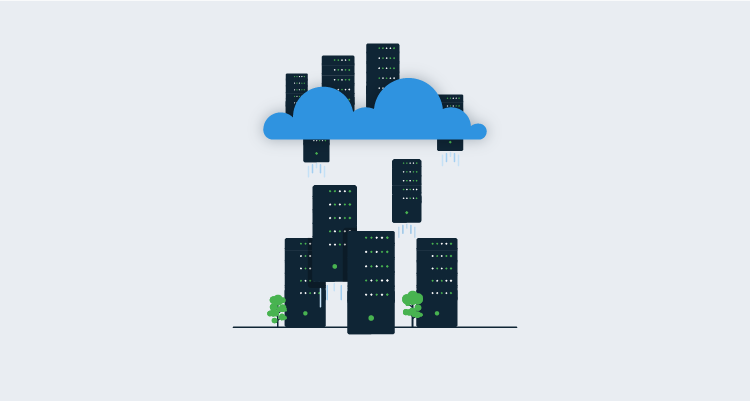
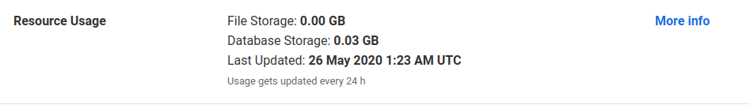
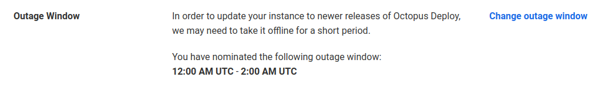
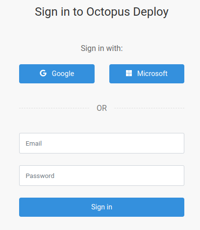
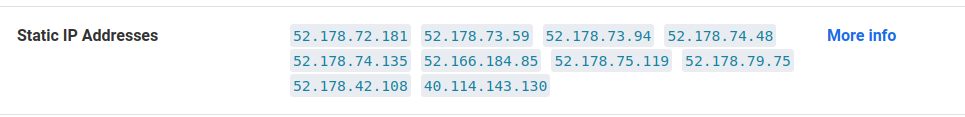
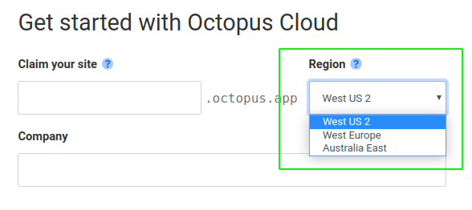

A common question we receive from customers thinking about moving Octopus to cloud infrastructure is:

> Should I move to Octopus Server on a virtual machine or to the hosted Octopus Cloud?

In this post, we take a look at why you might choose one over the other. Cost and security are key considerations, but we’ll also consider how you’ll use Octopus.

:::hint

**Octopus Cloud** refers to the Octopus Cloud [SaaS](https://en.wikipedia.org/wiki/Software_as_a_service) offering from Octopus Deploy and **Octopus Server** refers to the self-hosted version of Octopus Deploy.  In the context of this post, **Octopus Server** resides on a virtual machine in the cloud.

- [Octopus Cloud](https://g.octopushq.com/OctopusCloudPricing)
- [Octopus Server](https://g.octopushq.com/ProductDownloadPage)

:::

!toc

## Architecture

Before I get into the details, let’s look at the architecture for the two incarnations of Octopus we’re discussing.

**Server**

Octopus Server runs as a Windows Service; this provides access to the [Octopus REST API](https://octopus.com/docs/octopus-rest-api) and [Octopus Web Portal](https://octopus.com/docs/getting-started#the-octopus-web-portal).  It connects to a SQL Server database and uses [file shares](https://g.octopushq.com/MovingOctopusComponents) to store task logs, artifacts, and packages.

**Cloud**

Octopus Cloud uses a Linux container running on [AKS](https://octopus.com/blog/octopus-cloud-v2-why-kubernetes) with the database hosted in Azure SQL.  The file shares use Azure Cloud Storage.

## Management

Opting for Octopus Cloud reduces the number of administration tasks you have to carry out on your Octopus instance; however, there are some reasons you might want the greater control that Octopus Server offers.

### Retention policies and storage

Octopus [retention policies](https://g.octopushq.com/RetentionPolicies) have a default configuration on all Octopus instances, and we recommend reviewing them to suit your requirements.

**Server**

When you configure Octopus Server on a VM, you select the storage that Octopus uses for the [server folders](https://g.octopushq.com/OctopusServerFolders). This means you can set the storage limits that suit you for these folders and configure retention policies accordingly.  

**Cloud**

Octopus Cloud provides plenty of storage for most businesses; however, the amount of storage you can use has a [limit](ttp://g.octopushq.com/AcceptableUsage).  Where long term retention is required for regulatory compliance, you may find this a reason to select Octopus Server over Octopus Cloud.  

We’ve added monitoring to the Technical section of the Octopus instance management page. To view the details, login to your Octopus Account, then, on your instance, select {{ Manage,Resource Usage }}. This is updated every 24 hours.

:::hint

Octopus has a built-in package repository available to all instances, in addition to this, external repository feeds can be configured to serve your [deployment packages](https://g.octopushq.com/OnboardingPackageRepositoriesLearnMore).  You might choose to use an external feed to aid in [multi-region deployments](#regional-package-feeds) or if your package feed storage requirements are considerable.

:::

### Maintenance window

**Cloud**

One of the great things about Octopus Cloud is that you don’t have to worry about how and when to perform system maintenance and [upgrades](https://g.octopushq.com/OctopusUpgradeDoc). Octopus manages those for you, and you can choose a maintenance window to suit your business and region.

Outage window information is in the Technical section of the Octopus instance management page:

**Server**

Octopus Server allows you to be even more specific about when you perform your system maintenance and upgrades.  If you implement [high availability](https://g.octopushq.com/HighAvailability) then you can have zero downtime while maintenance is carried out.  Some customers choose to automate maintenance and upgrade tasks by using [runbooks](https://g.octopushq.com/OnboardingRunbooksLearnMore) in [another instance of Octopus](https://g.octopushq.com/UpgradeOctopusWithOctopus). A free Octopus Cloud instance is suitable for this task.

### Managing infrastructure

**Server**

With Octopus Server, you can use infrastructure that fits into your business’s operational architecture, and any infrastructure management processes and policies in place can be used for your Octopus instance.  And because you are hosting your Octopus Server, it is your responsibility to ensure the [infrastructure](https://g.octopushq.com/ManagingInfrastructure) performs well, is maintained, and recoverable as well as scaling capabilities.

**Cloud**

Using Octopus Cloud allows you to take a step back from infrastructure management. It’s our responsibility to ensure that the infrastructure is robust and scales according to your usage.

#### Workers

There is a distinct difference between the [Default Worker Pool](https://g.octopushq.com/OnboardingWorkersLearnMore) for Octopus Server and Octopus Cloud.  

**Server**

In Octopus Server, the [Default Worker](https://g.octopushq.com/BuiltinWorker) is the Octopus Server itself, whereas Octopus Cloud doesn’t allow the server to perform outside operations.  

When you use Octopus Server, we recommend using Workers when possible to reduce the resource usage on the Octopus Server, and as Octopus executes under a privileged account, if you can offload work to another machine in the form of a Worker, it’s wise to do so for added security.

**Cloud**

Octopus Cloud leases a [dynamic Worker](https://g.octopushq.com/DynamicWorkerPools) machine from a Worker Pool specific to its region.

### Backups

**Cloud**

Backups are included as part of the managed service with Octopus Cloud.  The database, built-in package repository, and configuration are backed up.  If you use an external package feed, then it is your responsibility to ensure backups are configured.

**Server**

When managing your infrastructure as part of an Octopus Server installation, you can design your [backup](https://g.octopushq.com/BackupRestore) and recovery plan to match your existing infrastructure plans.

### Monitoring

Octopus [subscriptions](https://g.octopushq.com/Subscriptions) can be used in both Octopus Cloud and Octopus Server. You can configure notifications to notify you of changes in Octopus, for instance, a change to a specific project process, a user amendment, the addition of a deployment target. There is a long list.

The [REST API](https://g.octopushq.com/RestAPI) has a [reporting](https://g.octopushq.com/Reporting) endpoint you can use to create a dashboard, available in both Octopus Cloud and Octopus Server.

With Octopus Server, you can also [send logs to a central log tool](https://help.octopus.com/t/how-can-i-configure-octopus-deploy-to-write-logs-to-a-centralized-logger-such-as-seq-splunk-or-papertrail/24551) by adding a log target to the *nlog config* file.

## Database

**Cloud**

The Octopus Cloud database is not accessible to customers, so all interactions with Octopus must be done using the web interface or with the API.  The great thing about this is that the database maintenance, security, and patching is all done by us.

**Server**

Octopus Server on a cloud VM gives you several options for database hosting:

- **VM**: Host SQL Server on a virtual machine.
- **PaaS**: For example, [Google Cloud SQL](https://cloud.google.com/sql/docs/sqlserver), [Azure SQL](https://azure.microsoft.com/en-gb/services/sql-database/), or [AWS RDS for SQL Server](https://aws.amazon.com/rds/sqlserver/).
- **Docker**: Use SQL Server within a [Docker](https://www.docker.com/) container. This could be on a Windows or Linux virtual machine or a cloud container hosting platform.   

The benefit of managing your database gives you the choice of more lenient [retention policies](https://g.octopushq.com/RetentionPolicies), the ability to use a clustered database, and managing your own backups.

## Security

**Cloud**

With Octopus Cloud, we secure the infrastructure and carry out penetration testing to ensure the security and integrity of the Octopus instances.  However, you are still responsible for:

- How you connect Octopus to your infrastructure.
- How you identify your users and control their activities within Octopus.
- How you handle sensitive information within Octopus.

**Server**

When you use Octopus Server, it is your responsibility to [harden](https://octopus.com/docs/security/hardening-octopus) the Octopus instance infrastructure.  This level of control may be beneficial if there are industry-specific regulations to which you are required to adhere.  In this case, you also taking responsibility for:

- How you harden the underlying server operating system.
- How you protect the Octopus Server files on the operating system.
- How you store files generated by Octopus Server.
- How you secure your SQL Database and protect the data generated by Octopus Server.
- How you expose your Octopus Server to your infrastructure.
- How you identify your users and control their activities within Octopus.
- How you handle sensitive information within Octopus.

:::hint

When adding deployment targets and Worker machines to Octopus Cloud or Octopus Server infrastructure, their security and integrity are your responsibility.

:::

### Authentication providers

**Cloud**

Octopus Cloud [authentication](https://g.octopushq.com/AuthenticationProviders) uses [Octopus ID](https://g.octopushq.com/AuthOctopusID), which allows you to use the same account you use to sign in at [octopus.com](https://octopus.com).  Octopus ID supports username and password or can use a Google or Microsoft account.

Octopus ID allows mapping of an Octopus user to a Google or Microsoft account however, it does not allow mapping to external groups as is possible with Active Directory.

**Server**

Octopus Server has several authentication providers available:

- username and password
- [Active Directory](https://g.octopushq.com/AuthAD)
- [Azure Active Directory](hhttps://g.octopushq.com/AuthAzureAD)
- [Google account](https://g.octopushq.com/AuthGoogleApps)
- [Okta](https://g.octopushq.com/AuthOkta)

Multiple providers can be configured concurrently.

### IP restrictions

**Cloud**

An Octopus Cloud instance has a range of [static IP addresses](https://g.octopushq.com/CloudStaticIP) shared among customers in the same Azure region. These can found in the Technical section of the Octopus instance management page:

**Server**

When you use Octopus Server on a VM, you can configure the IP and DNS that suits your business’s requirements.  You may choose to configure a load balancer to handle traffic to the Octopus web interface; this is especially useful if you configure [HA](#high-availability).

### Organize projects and environments

[Spaces](https://octopus.com/docs/administration/spaces) are available with both Octopus Cloud and Octopus Server. Spaces create a hard wall between projects and infrastructure, so each of your teams only access the projects and infrastructure they need.

**Server**

Concurrent licenses are an additional benefit of Octopus Server. You can use three instances for each license, which means you can run one Octopus Deploy service for production use and set up extra services for development or test. Or you can use two separate Octopus Deploy instances to keep production and pre-production deployments isolated.

## Networking

Connecting [Polling Tentacles](https://g.octopushq.com/PollingTentacle) over WebSockets to Octopus Cloud is not currently possible, but we do have plans to support Polling Tentacles connecting on port 443 soon.

### Proxy support

Both Octopus Server and Octopus Cloud have support for [proxies](https://g.octopushq.com/ProxySupport).  You can specify a proxy server for Octopus to use when communicating with a Tentacle or SSH Target. You can also specify a proxy server when a Tentacle and the Octopus server make web requests to other servers.

## Region

**Server**

Using Octopus Server on a VM lets you host your Octopus instance in your choice of geographic region.  

**Cloud**

Octopus Cloud also offers you the option of hosting your instance in a region that suits you. We use Microsoft Azure to host Octopus Cloud, and at the time of writing, we offer the following regions:

- West US 2
- West Europe
- Australia East

The region is selected when you first create your Octopus Cloud instance.

Should we introduce a new region that suits your needs better, please get in touch so we can move your instance to that region.

### Regional package feeds

If you operate in multiple regions and are concerned about network latency issues when you transfer large packages during deployments, we recommend opting for an external [package feed](https://g.octopushq.com/OnboardingPackageRepositoriesLearnMore) and either replicating it across multiple regions.  With DNS aliasing, you can have the Tentacle fetch packages from geographically local package repositories.  Or you could have two separate but identical package repositories and use a [variable for the Feed ID](https://g.octopushq.com/DynamicPackageFeeds).  Package repositories work in this way for both **Octopus Server** and **Octopus Cloud**.

## High Availability

[High Availability](https://g.octopushq.com/HighAvailability) (HA) can be configured for Octopus Server to run multiple Octopus Servers that distribute the load and tasks between them.  

Octopus HA is not available for Octopus Cloud, but all instances are provisioned as a [Linux container running on AKS](https://octopus.com/blog/octopus-cloud-v2-why-kubernetes) (Azure’s managed Kubernetes).  [Kubernetes](https://kubernetes.io/) helps us achieve resilience and scaling flexibility for Octopus Cloud.

## Other considerations

### Tentacles

An Octopus Tentacle machine can be configured for either the [polling](https://g.octopushq.com/PollingTentacle) or [listening](https://g.octopushq.com/ListeningTentacle) communication modes.  The type of Tentacles you select for your deployments will depend on your business requirements. You should also consider if the configuration of these machines has any impact on the infrastructure chosen for your Octopus instance.

#### Tentacle firewall rules

The type of Tentacle you use will depend on your firewall rules. A listening Tentacle must have an inbound firewall rule to allow access via TCP port 10933. A polling Tentacle doesn’t require any firewall rules on the Tentacle, but the Octopus Server must allow access through the firewall inbound on TCP port 10943. Listening Tentacles uses fewer resources, but if you use dynamic IPs or the Tentacle sits behind a NAT, a polling Tentacle will be required.

You will need to apply these rules to any intermediary firewalls.

### Octopus in a container

An alternative to running Octopus Server on a virtual machine is to run it in a container.  In fact, this is how we manage our Octopus Cloud instances.  The [Windows container](https://g.octopushq.com/DockerWindows) for Octopus is fully supported, and the [Linux container](https://g.octopushq.com/DockerLinux) is, at the time of writing, part of our Early Access Program.

## Conclusion

This post has hopefully provided clarity to your decision-making process about moving to cloud infrastructure.  Whatever your business requirements, Octopus Deploy makes release management easy and simplifies even the most complex deployments wherever you deploy your software. Runbook automation minimizes outages and gives you control over your infrastructure and applications.  

If you have any questions or would like advice on how Octopus can work for you, please drop us a line at [advice@octopus.com](mailto:advice@octopus.com)

## More information

- [An explanation of Worker security and scoped Worker Pools](https://g.octopushq.com/WorkerSecurityScopedWorkerPools)
- [Execution containers for Workers](https://g.octopushq.com/ExecutionContainersForWorkers)
- [Moving Octopus](https://g.octopushq.com/MovingOctopusComponents)
