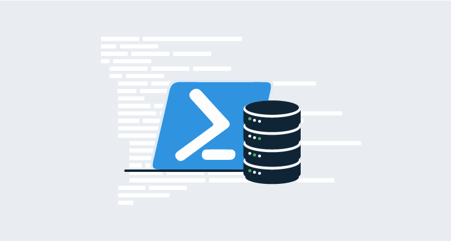

<h2>Get to the point!</h2>

!toc

## Why PowerShell? {#why-ps}

Our data continues to grow exponentially with respect to scale and complexity. The DevOps and SRE movements are redefining expectations about resilience and responsiveness. The cost of data breaches, data loss, or delays in reporting are increasing dramatically.

Forty-five years ago, [The Mythical Man Month](https://en.wikipedia.org/wiki/The_Mythical_Man-Month) taught us that the answer to meeting exponentially increasing demand is not simply to increase our headcount. Productivity will not scale in the same way.

Those of us responsible for curating this data need to scale our abilities to architect, deliver, and secure our data at scale to meet the demand upon our services. Frankly, if our skill set only extends to using the wizards in the SQL Server Management Studio (SSMS), we will not be able to keep up.

It is essential that we embrace automation.

If your data is in SQL Server databases, that means it is essential to learn PowerShell. If PowerShell isn’t already a key part of your toolbox, it will be soon. If you aren’t already comfortable using PowerShell as your primary interface with SQL Server, and you would like to stay employable, it’s time for a little R&D.

## Why dbatools? {#why-dba}

A few months ago, James wrote [this excellent post about using the SqlServer PowerShell module](https://octopus.com/blog/sql-server-powershell#installing-the-sql-server-powershell-module). He correctly states that “Microsoft recommends using the SqlServer module for interacting with SQL Server from PowerShell”. He’s not wrong. Microsoft do say that. But I don’t. In my opinion, [dbatools](https://dbatools.io/) should be your default PowerShell module for any SQL Server work.

dbatools is a community-driven, open source PowerShell module for managing SQL Server. It was started by [Chrissy LeMaire](https://twitter.com/cl) but has since been extended, under Chrissy’s inspiring mentorship, by (at the time of writing) [189 contributors](https://github.com/sqlcollaborative/dbatools/graphs/contributors). It continues to grow organically, including commands that real end users need. At the time of writing, it comes with [over 500 cmdlets](https://dbatools.io/commands/), that’s approximately 5x more than you get in the SqlServer module.

And it’s not just quantity; it’s quality too. Relative to the SqlServer module, dbatools is also surprisingly easy to use. That’s both because the commands are much simpler, and also because there is a huge community of folks who are passionate about supporting each other and a lot of them chill out in [the public SQL Server Community Slack workspace](https://dbatools.io/dbatools-is-now-on-the-sql-server-communitys-slack/) all day long. If you have any questions or if you get stuck, you will normally get a response there within minutes. While this is a community thing, you need to respect these folks are helping you out of the goodness of their heart. You’ll struggle to find an official support team for any vendor that can beat that.

## Basic Examples {#basic}

In this post, I start by showing you the dbatools equivalents of all of James’ examples to demonstrate the relative simplicity and maintainability of using dbatools. Then I talk about some of the significantly more powerful capabilities that dbatools will give you over and above what the SqlServer module provides.

Just like James, all my scripts are in [a public GitHub repo](https://github.com/Alex-Yates/dbatools-powershell-examples). If you have any suggestions about how to improve on them, I’d love to review your pull request. :-P

### Installing the dbatools PowerShell module {#install}

First James installed the SqlServer module. For dbatools, the process is the same:


```powershell
#Install the dbatools module from the PowerShell gallery
Install-Module -Name dbatools

#If the module is already installed, update it using the following commands:
#For PowerShell 5.0 or later
Update-Module -Name dbatools

#For PowerShell version earlier than 5.0
Uninstall-Module -Name dbatools
Install-Module -Name dbatools
```

### Test connectivity to SQL Server {#connect}

Next, we need to test that we can connect to our SQL instance.

We can test this at an instance level by using the [Test-DbaConnection](https://docs.dbatools.io/#Test-DbaConnection) cmdlet, or we can test at a database level with the [Get-DbaDatabase](https://docs.dbatools.io/#Get-DbaDatabase) cmdlet. As with (all/most?) of the dbatools cmdlets, the cmdlet attempts to catch any exceptions for us to avoid *sea of red* stack traces, but if we want to enable the exceptions and handle them ourselves we can use the `-EnableException` parameter:

```powershell
# To test connectivity to a SQL instance
Test-DbaConnection localhost

# To test connectivity to a specific database
Get-DbaDatabase -SqlInstance localhost -Database MyDatabase
```

Personally, I find the code above much easier to understand and work with than the SqlServer module example:

```powershell
try
{
    # This is a simple user/pass connection string. 
    # Feel free to substitute "Integrated Security=True" for system logins.
    $connString = "Data Source=YourInstance;Database=YourDB;User ID=YourUser;Password=YourPassword"
    
    #Create a SQL connection object
    $conn = New-Object System.Data.SqlClient.SqlConnection $connString

    #Attempt to open the connection
    $conn.Open()
    if($conn.State -eq "Open")
    {
        # We have a successful connection here
        # Notify of successful connection
        Write-Host "Test connection successful"
        $conn.Close()
    }
    # We could not connect here
    # Notify connection was not in the "open" state
}
catch
{
    # We could not connect here
    # Notify there was an error connecting to the database
}
```

### Create SQL Server login {#login}

Next, James created a SQL Server login. The equivalent cmdlet in dbatools, [New-DbaLogin](https://docs.dbatools.io/#New-DbaLogin), is very similar.

```powershell
# To run in a non-interactive mode, such as through an Octopus deployment, you will most likely need to pass the new login credentials as a PSCredential object.
$securePassword = ConvertTo-SecureString "Th!sI5Y0urP4ss" -AsPlainText -Force

# Create the login using the New-DbaLogin cmdlet
New-DbaLogin -SqlInstance localhost -Login MyLogin -SecurePassword $securePassword -PasswordPolicyEnforced -PasswordExpirationEnabled
```

### Create SQL Server database and assign an owner {#db}

Creating databases using the SqlServer module is surprisingly hard. James had to either revert to running a custom SQL script or using SQL Server Management Objects (SMOs) to “do the heavy lifting”. Both of these solutions seem annoyingly complicated to me.

Next, James changed the database owner, once again by creating a pair of SMOs. As James correctly explains, this is the officially recommended route by Microsoft. However, dbatools makes the code much simpler to read and maintain.

In the script below, I’ve used the [New-DbaDatabase](https://docs.dbatools.io/#New-DbaDatabase) and [Restore-DbaDatabase](https://docs.dbatools.io/#Restore-DbaDatabase) cmdlets to demonstrate how to either create a new database or restore a new database with a single command. Then I combined the [Get-DbaDatabase](https://docs.dbatools.io/#Get-DbaDatabase) and [Set-DbaDbOwner](https://docs.dbatools.io/#Set-DbaDbOwner) cmdlets to change the database owner for the new database.  

```powershell
# Create a new empty database
New-DbaDatabase -SqlInstance localhost -Name MyDatabase

# Create a new database from a backup
Restore-DbaDatabase -SqlInstance localhost -Path "\\Backups\MyDatabase.bak"

# Assign a new owner to your database
$db = Get-DbaDatabase -SqlInstance localhost -Database MyDatabase
$db | Set-DbaDbOwner -TargetLogin MyLogin
```

### Run a SQL script {#script}

James finished by demonstrating how to use the SqlServer cmdlet Invoke-Sqlcmd to execute either some in-line SQL or a separate .sql script. This code seems simple enough, and the dbatools equivalent, [Invoke-DbaQuery](https://docs.dbatools.io/#Invoke-DbaQuery) looks and feels pretty similar. However, the dbatools equivalent is designed to be more convenient to use in a pipeline and to behave more consistently with other dbatools functions.

```powershell
# Run a query from a script
Invoke-DbaQuery -sqlinstance localhost -File "sql_script.sql" -MessagesToOutput

# Run an in-line SQL command
Invoke-DbaQuery -sqlinstance localhost -Query "PRINT 'hello world'" -MessagesToOutput
```

## More powerful examples {#power}

As stated above, dbatools contains hundreds of commands, so it’s impossible to cover them all in this post. Up until now, I’ve focused on some of the simpler commands for handling basic operations. The real power, however, comes with some of the larger cmdlets that build on the simpler cmdlets to enable us to deliver best practice implementations of larger and more complicated tasks.

### Migrating a SQL instance {#migrate}

The [Start-DbaMigration](https://docs.dbatools.io/#Start-DbaMigration) cmdlet was perhaps the first headline feature of dbatools. It’s a wrapper for many of the **Copy** cmdlets (e.g. [Copy-DbaDatabase](https://docs.dbatools.io/#Copy-DbaDatabase), [Copy-DbaAgentJob](https://docs.dbatools.io/#Copy-DbaAgentJob), [Copy-DbaLinkedServer](https://docs.dbatools.io/#Copy-DbaLinkedServer), etc.) which allows us to migrate **ALL** SQL Server objects, including databases, agent jobs, linked servers, and a long list of other object types from one instance to another.

Trying to do that using SSMS GUI wizards or even plain T-SQL scripting is a world of pain. To do it with the SqlServer module isn’t much easier. However, with dbatools, we can kick off that job as quickly as you can open a PowerShell window and type:

```powershell
Start-DbaMigration -Source sql01 -Destination sql02 -DetachAttach
```

Sounds a bit unbelievable, right? Here are a couple of videos with more info. [This one](https://www.youtube.com/watch?v=hg8tovMRX2k&feature=youtu.be) is 50 seconds long. [This one](https://www.youtube.com/watch?v=kQYUrSlb0wg), by Chrissy herself, is 50 minutes long.

### Remove database safely {#remove}

Beardy-man, [Rob Sewell](https://twitter.com/sqldbawithbeard), is one of dbatools biggest contributors. His first contribution was [Remove-DbaDatabaseSafely](https://docs.dbatools.io/#Remove-DbaDatabaseSafely). Inspired by [Grant Fritchey’s three-minute backup rant](https://www.youtube.com/watch?v=Ah0jabU9G8o&list=PLIg9rQe6gY0puRVhUfxDdO3-39sJfnwwY), he codified Grant’s seven steps for reliable backups so that with a single command you can safely backup and remove a database with confidence. 

```powershell
Remove-DbaDatabaseSafely -SqlInstance localhost -Database MyDatabase -BackupFolder 'C:\Backups\Old databases - DO NOT DELETE'
```

[You can read more about it here](https://sqldbawithabeard.com/2016/07/20/remove-sqldatabasesafely-my-first-contribution-to-dbatools/).

### More best-practice stuff {#more}

The two examples above demonstrate how using dbatools helps you to simultaneously work more efficiently and to standardize better practices. As I mentioned, dbatools has over 500 commands, and it’s growing. To give you a flavor of some of the other best-practice stuff that dbatools allows you to complete with a simple command, check out these blog posts:

1.	[new best practice commands now available](https://dbatools.io/new-best-practices-commands-now-available/)
2.	[another batch of new commands now available](https://dbatools.io/new-batch-of-commands/)

Those blog posts aren’t particularly new, but I hope they pique your interest. It’s over to you now to get your hands dirty and practice using these commands.

## Conclusion {#conclusion}

I’m not saying the DBA role is dead. If anything, our data concerns are getting bigger and more complicated. Database administration is no longer a capability that can be outsourced to a highly specialized department and abstracted away from daily development work. We desperately need folks who understand how to look after the data, and we need them to be intimately involved in the design and development of our data structures. DBAs need to join the rest of the engineering team.

DBAs are busy folks, and hiring more of them isn’t a practical solution. If the DBAs we have are going to find the time to get involved much earlier in the development cycle, while simultaneously supporting bigger and more complicated data estates, it is essential that they embrace automation to efficiently and reliably do more administration work in less time. The DBAs who can do this well will be in high demand. There will be fewer opportunities for those who can’t.

Fundamentally, DBAs need to be making efforts to spend less time using SSMS wizards and more time working with PowerShell scripts and source control. Database administration is not dead, but it is evolving.

And the best and fastest growing PowerShell module to support SQL Server folks (at the time of writing) is dbatools.

## Call to action {#cta}

Since 500 cmdlets can be pretty daunting, you might not know where to start. Here are a few suggestions:

1.	Check out Chrissy and Rob’s “[Learn dbatools in a month of lunches](https://www.manning.com/books/learn-dbatools-in-a-month-of-lunches)”. At the time of writing, it’s still a work in progress, but the first eight chapters are already available. It’s not a bad place to start.
2.	Start with what you need. Next time you have a database task that you need to complete, ask yourself if it’s the sort of thing you could script out, test, and stick in source control. After you’ve scripted it out, if it’s a regular task, you could create an [Octopus Runbook](https://octopus.com/docs/operations-runbooks) for it. Then, if you ever need to repeat it or complete a similar task, you’ve got a template ready to go.
3.	Join the SQL Community. There are a bunch of us [hanging out on Slack](https://dbatools.io/dbatools-is-now-on-the-sql-server-communitys-slack/). We are an overbearingly friendly bunch, and we love to help make things go. (And if you spot an opportunity to improve dbatools, [submit a pull request](https://github.com/sqlcollaborative/dbatools/blob/master/contributing.md)!)

Join us. We’d love to meet you! 😊

---

Alex Yates has been helping organisations to apply DevOps principles to their data since 2010. He’s most proud of helping Skyscanner develop the ability to  [deploy 95 times a day](https://www.youtube.com/watch?v=sNsPnCv7hHo) and for supporting the United Nations Office for Project Services with their release processes. Alex has worked with clients on every continent except Antarctica – so he’s keen to meet anyone who researches penguins.
 
A keen community member, he co-organises [Data Relay](https://datarelay.co.uk/), is the founder of [www.SpeakingMentors.com](http://www.speakingmentors.com/) and has been recognised as a  [Microsoft Data Platform MVP](https://mvp.microsoft.com/en-us/PublicProfile/5002655?fullName=Alex%20Yates) since 2017.
 
Alex is the founder of [DLM Consultants](https://dlmconsultants.com/), an official Octopus Deploy partner. He enjoys mentoring, coaching, training and consulting with customers who want to achieve better business outcomes through improved IT and database delivery practices.
 
If you would like to work with Alex, email: [enquiries@dlmconsultants.com](mailto:enquiries@dlmconsultants.com) 