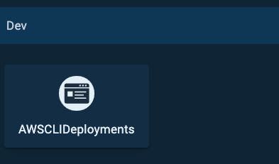
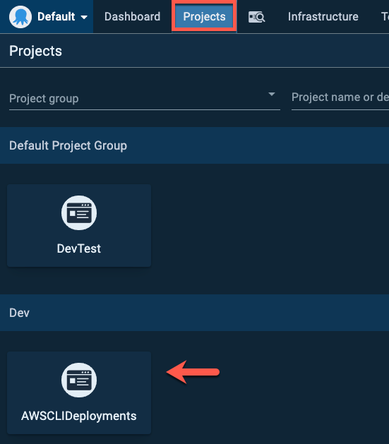
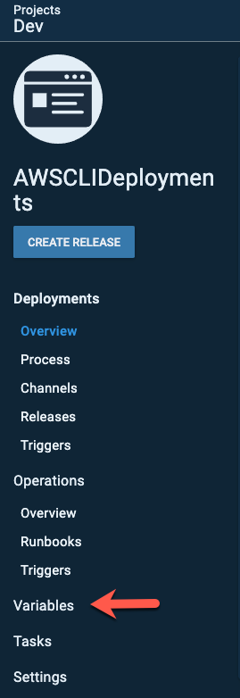

Have you ever found yourself in a situation where you knew you wanted to automate the creation of an object or perhaps even list out objects and get a report, but you didn't want to jump around between programming languages? CLI's give you a way to have the full usability of an SDK and they typically always run the same on every system, which means you don't have to create a wrapper around some API.

In this blog post, you're going to take a look at how to utilize the AWS CLI in Octopus Deploy. The demonstration will be around creating an S3 bucket with the **Run an AWS CLI Script** step template.

## Prerequisites

To follow along with this blog post and be successful, you should have the following:

- An Octopus Deploy server, on-prem or in the cloud.
- An AWS account set up with an IAM user in Octopus Deploy.
- Experience with the AWS CLI.
- At least one environment set up in Octopus Deploy.
- Octopus CLI installed. If you don't have it installed, you can install it [here](https://octopus.com/downloads/octopuscli).

## Creating a new Project

Before running any AWS CLI commands or creating steps, you need to ensure you have a project set up to create the AWS CLI process and steps in. To do this, we'll utilize the power of another CLI, the Octopus CLI.

Open up a terminal and run the following command to create a new project with the appropriate switch values added:

```
octo create-project --name AWSCLIDeployments --server=octopus_server_url --apiKey=octopus_server_api_key --projectGroup project_group --lifecycle=lifecycle_name
```

The output will look similar to the screenshot below.


Open up a web browser and log into the Octopus Deploy server. You should now see the new project available.



## Configuring Variables

Now that the project is created, you can start the configuration process of the project itself. The first configuration that you'll take a look at is variables. For the AWS CLI step template to work, it needs the AWS account to be a variable.

In the Octopus Deploy server, go to Projects —> AWSCLIDeployments to start configuring the variables.



Under the project pane, click on **Variables**.



Within the Project Variables under Value, choose the drop down and select **CHANGE TYPE**.


Under the type options, choose AWS Account as shown in the screenshot below.


Choose an existing AWS Account setup and give it a name. For example, the screenshot below shows an AWS account selected that's called **OctopustoAWS** and the name is **AWSAccount.** Once complete, click the green **DONE** button**.**


Click the green **SAVE** button to save the variable into the project.


The variable for the AWS account has now been configured.

## Adding the AWS CLI Step

In the previous section, you set up one of the primary prerequisites, which is an AWS account as a variable. Now you're ready to start configuring the actual AWS CLI step itself to run AWS CLI commands. To do that, you're going to create a new process.

Under the project pane, choose **Process**.


Under the Process page is where you can start adding in new steps, specifically, the AWS CLI step. Click the **ADD STEP** button.


Under **Choose Step Template**, choose AWS.


Under AWS you'll see a few options under two categories:

- Installed Step Templates
- Community Contributed Step Templates

The AWS CLI step is under the Installed Step Templates and is called **Run an AWS CLI Script**. Once you find it, click the step.


Under the **Run an AWS CLI Script** step, there are going to be several options that are going to be based on your needs. For example, which environment to run in and worker pools. Because of that, this blog post will outline the specific tasks in the step that are specified to the AWS CLI.

The first task is the AWS Tools task. Ideally, you want to use the AWS tools bundled with Octopus unless you have a specific need for a certain version for an environment, which typically isn't the case.


The second task for AWS specific tasks is under Amazon Web Services, which is where you can select the account variable and specify a region. For example, in the screenshot below, the AWSAccount account variable and **us-east-1** region are specified.


The final task-specific for AWS is going to be the Script section, where you can add in what AWS CLI command you want to use. You have two primary options:

- Inline source code
- Script in a package

For the purposes of this blog post, the inline source code was used. Under the Inline **Source Code option**, type in the following code which will be used to create an S3 bucket. You can also change the name of the bucket for an environment you're in instead. Remember, the S3 bucket names must be unique.

```
aws s3api create-bucket --bucket octopusdeploys392 --region us-east-1
```

After you type in the code, click the green **SAVE** button.


You are now ready to run the pipeline.

## Running the Pipeline

The step is now created to use the AWS CLI, the inline code has been added, and you're ready to start the deployment process of the pipeline. 

Under the project, click the blue **CREATE RELEASE** button.


To save the release, click the green **SAVE** button.


Choose which environment you want to deploy to. For example, Dev as shown in the screenshot below.


Click the green **DEPLOY** button and the deployment will begin.


Once complete, you will see the task summary in which creating the S3 bucket was complete.


Congrats! You have successfully used the AWS CLI to create an S3 bucket in AWS.

## Conclusion

Many CLI's give you the ability to perform simple actions around tasks that may be complex or cumbersome in the UI. With a CLI, you can still interact directly with a platform from a programmatic perspective to ensure the ability to automate tasks.

In this blog post you learned not only how to get a project up and running in Octopus Deploy, but also how to configure the AWS CLI task to create an S3 bucket in AWS.