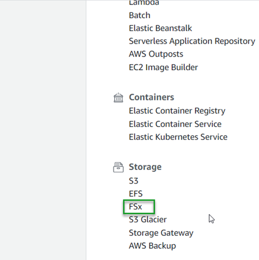

Octopus Deploy documentation for configuring [High Availability on AWS](https://octopus.com/docs/administration/high-availability/configuring-octopus-for-high-availability#shared-storage-in-amazon-aws) states that you will need to configure something like Microsoft DFS for the shared storage.  However, there is another option that Amazom offers, FSx.  In this post, I will set up an Octopus Deploy High Availablility cluster using FSx.

## Amazon FSx
FSx is a network file system that comes in two flavors
- [FSx for Windows File Server](https://aws.amazon.com/fsx/windows/)
- [FSx for Lustre](https://aws.amazon.com/fsx/lustre/)

In this post we'll be using FSx for Windows File Server

### Configuring FSx
Like many of the other Amazon AWS offerings, FSx comes with a convenient, easy to use wizard for configuration.  To start, open your [AWS Management Console](https://aws.amazon.com/console) and click on FSx, located under the Storage category.

:::hint
Unlike the other file storage options that AWS has, the FSx for Windows File Server **requires** Active Directory, so you may need to create one.  Be aware that Active Directory services are not free, refer to their [pricing](https://aws.amazon.com/directoryservice/pricing/) page for details.
:::

#### Step 1: Select file system type
The first step in this process is to select the file system type that you're going to use.  As stated previously, your selections are
- FSx for Windows File Server
- FSx for Lustre
This post is going to be using FSx for Windows File Server

#### Step 2: Specify file system details
In this step you'll define the file system details and consists of several sections

##### File system details
This section defines the following
- Deployment Type
- Storage Type
 - SSD
 - HDD (not supported for Single-AZ file systems)
- Storage capacity (minimum of 32 GB)

##### Network & security
In this section, you select the networking and security groups (firewall) components
- VPC
- VPC Security Groups
- Subnet

##### Windows Authentication
For this section, you select your Active Directory details.  You can choose either:
- AWS Managed Microsoft Active Directory
- Self-managed Microsoft Active Directory

You will also have the ability to create a new Active Directory (if using AWS Managed Microsoft Active Directory).

##### Encryption
This is the section where you define your encryption key so that your data is protected at rest.  Your options areL:
- aws/fsx
- ARN

The next two sections are optional
- Backup and maintenance preferences
- Tags

#### Step 3: Review and create
The final step in the process is to review the options you have chosen for your file server before creating.  On this page, it will show you which options can be changed after the File System has been created, and which ones cannot be edited.  Click **Create file system** when you are satisfied with your choices.

### Connecting to the share

