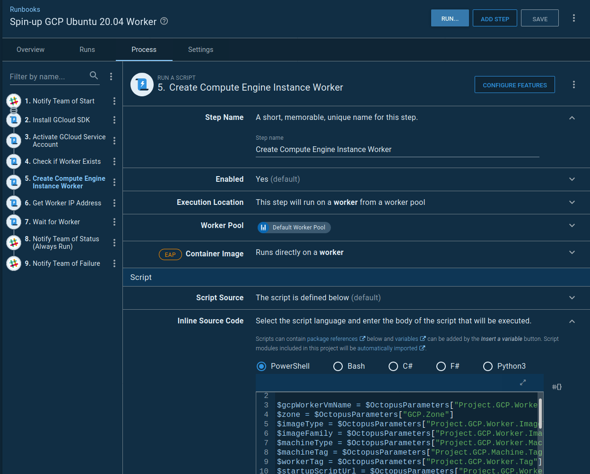
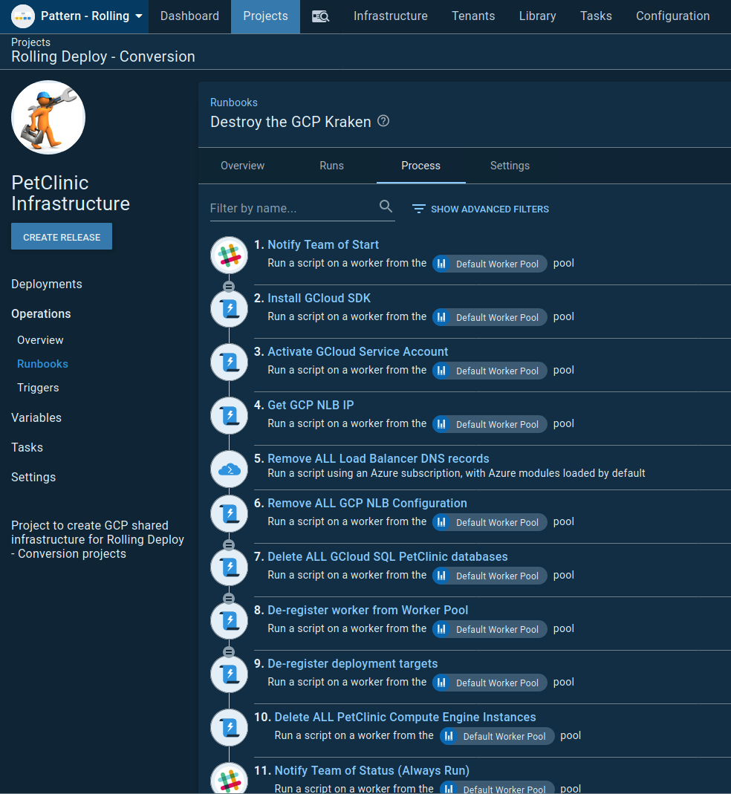
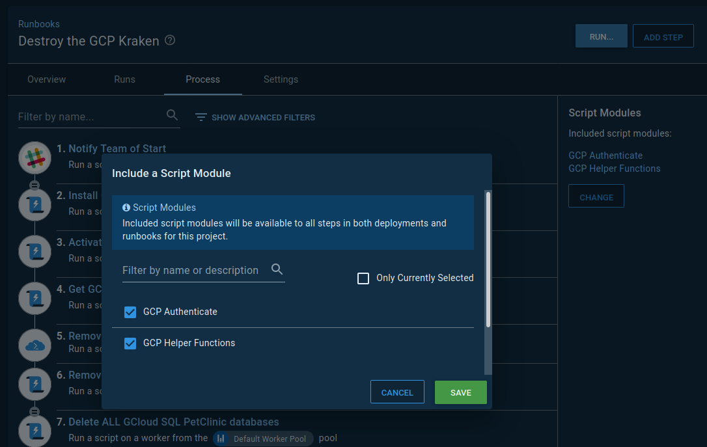
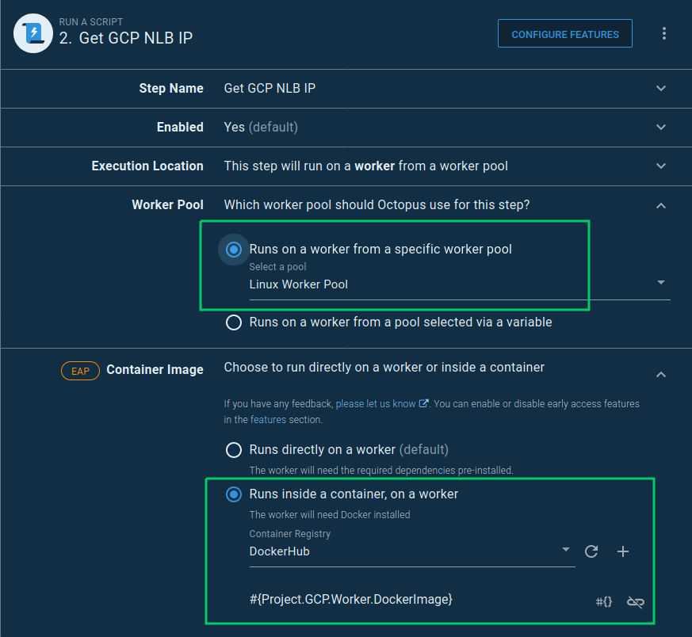
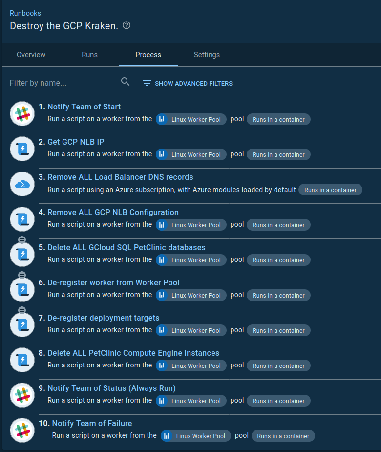

## todo: intro, make the words work, links, check flow, show the container being downloaded or used in task logs...

## Set up the worker machine

Take the [runbook](https://samples.octopus.app/app#/Spaces-45/projects/petclinic-infrastructure/operations/runbooks/Runbooks-445/process/RunbookProcess-Runbooks-445) that creates the worker machine and make sure it installs Docker on the machine.  To do this we need to update the bootstrapping script that is used as a startup script on the newly created GCP VM.  For this I took and existing bootstrap script and added the lines to install Docker:

```bash
# Install Docker
apt-get update
apt-get -y install apt-transport-https ca-certificates curl software-properties-common
curl -fsSL https://download.docker.com/linux/ubuntu/gpg | sudo apt-key add -
add-apt-repository "deb [arch=amd64] https://download.docker.com/linux/ubuntu bionic stable"
apt-get update
apt-get -y install docker-ce docker-ce-cli containerd.io

```

The complete script can be found [here](https://github.com/OctopusSamples/IaC/blob/master/gcp/bootstrap/gcp-linux-listening-worker-install-and-register-docker.sh).

Then, in order for the runbook to use the new script I updated the `Project.GCP.Targets.StartupScriptUrl` project variable to point to the raw version of the script: https://raw.githubusercontent.com/OctopusSamples/IaC/master/gcp/bootstrap/gcp-linux-listening-tentacle-wildfly.sh.  This variable is used by the `Create Compute Engine Instance Worker` step. 



## Create Docker Image

The bulk of the work we're doing here is GCP.  All of the scripts for this project are currently written in Powershell so, for this first pass of updates, I'm going to stick with that.  This means I need an image with the [Google SDK](https://cloud.google.com/sdk/install) and Powershell.

```dockerfile
FROM ubuntu:18.04

ARG DEBIAN_FRONTEND=noninteractive
ARG Azure_Cli_Version=2.9.0\*
ARG Powershell_Version=7.0.0\*

# get `wget` & utils & software-properties-common
# https://docs.microsoft.com/en-us/powershell/scripting/install/installing-powershell-core-on-linux?view=powershell-7#ubuntu-1804
RUN apt-get update && \ 
    apt-get install -y wget apt-utils curl && \
    apt-get install -y software-properties-common 

# get powershell for 18.04
RUN wget -q https://packages.microsoft.com/config/ubuntu/18.04/packages-microsoft-prod.deb && \
    dpkg -i packages-microsoft-prod.deb && \
    apt-get update && \
    add-apt-repository universe && \
    apt-get install -y powershell=${Powershell_Version}

# Install Google SDK
RUN echo "deb [signed-by=/usr/share/keyrings/cloud.google.gpg] https://packages.cloud.google.com/apt cloud-sdk main" | tee -a /etc/apt/sources.list.d/google-cloud-sdk.list && \
  apt-get -y install apt-transport-https ca-certificates gnupg && \
  curl https://packages.cloud.google.com/apt/doc/apt-key.gpg | apt-key --keyring /usr/share/keyrings/cloud.google.gpg add - && \
  apt-get update && apt-get -y install google-cloud-sdk

RUN apt-get clean

```

## Update the first Runbook to execution containers 

The first runbook I'm going to convert to using execution containers is "Destroy the GCP Kraken".  



### The Google Cloud SDK

In the Dockerfile above I installed the `google-cloud-sdk`.  In the runbook there is a step to install the SDK on the worker machine.  Now that I'm going to be using the Docker image as an execution container, I no longer need the step to install the SDK, so I'll go ahead and delete the "Install GCloud SDK" step.

### Authentication

The runbook has a step that sets the authentication scope; this needs to change as we need to set the authentication scope on each step.  This sounds like an onerous task but we can refactor this out to a reusable [script module](http://g.octopushq.com/ScriptModules).

I'll go to { Library, Script Modules, Add Script Module } and add the following Powershell code that I've taken from the "Activate GCloud Service Account" step:

```Powershell
function Set-GCPAuth() {
  $JsonKey = $OctopusParameters["GCP.ServiceAccount.Key"]
  $JsonFile = [System.IO.Path]::GetTempFileName()

  if (Test-Path $JsonFile)
  {
      Remove-Item $JsonFile -Force
  }

  New-Item $JsonFile -Type "File" -Force

  $JsonKey | Set-Content $JsonFile
  $gcpServiceAccountEmail = $OctopusParameters["GCP.ServiceAccount.Email"]
  $gcpProjectName = $OctopusParameters["Project.GCP.ProjectName"]
  Write-Host "Activating service account $gcpServiceAccountEmail"

  Write-Host "##octopus[stderr-progress]"
  gcloud auth activate-service-account $gcpServiceAccountEmail --key-file=$JsonFile --project=$gcpProjectName --quiet
  Test-LastExit "gcloud auth activate-service-account"

  if (Test-Path $JsonFile)
  {
      Write-Host "Clearing up temp auth file"
      Remove-Item $JsonFile -Force
  }
}
```

Then I just need to go into my runbook and include the newly created script module, by clicking `Change` and selecting "GCP Auhtenticate":



Now we can delete the step "Activate GCloud Service Account".

### Specifying the execution container

The first step in the runbook that I'm going to set to use an execution container is "Get GCP NLB IP". Before using a container, I have to setup an [external feed](http://g.octopushq.com/DockerRegistries) for [DockerHub](https://hub.docker.com/).  To do this navigate to { Library, External Feeds, Add Feed }.


In the runbook the majority of steps are running GCP scripts but one uses the Azure CLI, to manage DNS.  I'm going to set two variables to specify the Docker image to use.  

- Project.Default.Worker.DockerImage - This has a value of `octopusdeploy/worker-tools:1.0-ubuntu.18.04`, the default image I'm going to use is the Octopus [worker-tools](https://hub.docker.com/r/octopusdeploy/worker-tools/) image.

The "Get GCP NLB IP" runbook step runs a script that uses GCloud.  I'm going to set a variable to specify the Docker image to use; I'll name it "Project.GCP.Worker.DockerImage" and set the value to `octocrock/gcp-tools:1.0.0`, this points to the image created from the Dockerfile created above.  Now I can set the step to use the Worker Pool that contains the machine I configured to have Docker installed, I'll select "Linux Worker Pool".  I'll also set the container image to use by specifying the "Project.GCP.Worker.DockerImage" variable.



As I mentioned previously, each step needs to authenticate with GCP, now we need to set that in the script.  The current script code for this step is:

```powershell
CheckForGCPSDK

$projectName = $OctopusParameters["Project.GCP.ProjectName"]
$loadbalancerIPName = $OctopusParameters["Project.GCP.LoadBalancer.ExternalIP.Name"]

Write-Host "Getting compute address matching name: $loadbalancerIPName"
Write-Host "##octopus[stderr-progress]"
$ipAddress=(& $GCloudExecutable compute addresses list --project=$projectName --filter="name=($loadbalancerIPName)" --format="get(address)" --quiet)
Test-LastExit "gcloud compute addresses list"

if( -not ([string]::IsNullOrEmpty($ipAddress))) 
{
	Write-Highlight "Found $loadbalancerIPName of: $ipAddress"
    Set-OctopusVariable -name "IPAddress" -value $ipAddress
}
else {
    Set-OctopusVariable -name "IPAddress" -value ""
```

The first command here is now obselete, the check for GCP being installed, as we know it is installed in the Docker image we're using.  I'm going to replace it with a call to the function created for GCP authentication - `Set-GCPAuth`.  

Next, because we're using the gcloud CLI directly in the container, I can change the reference to `$GCloudExecutable` to be `gcloud`.

These very minor changes mean the resulting script looks like this:

```powershell
Set-GCPAuth

$projectName = $OctopusParameters["Project.GCP.ProjectName"]
$loadbalancerIPName = $OctopusParameters["Project.GCP.LoadBalancer.ExternalIP.Name"]

Write-Host "Getting compute address matching name: $loadbalancerIPName"
Write-Host "##octopus[stderr-progress]"
$ipAddress=(& gcloud compute addresses list --project=$projectName --filter="name=($loadbalancerIPName)" --format="get(address)" --quiet)
Test-LastExit "gcloud compute addresses list"

if( -not ([string]::IsNullOrEmpty($ipAddress))) 
{
	Write-Highlight "Found $loadbalancerIPName of: $ipAddress"
    Set-OctopusVariable -name "IPAddress" -value $ipAddress
}
else {
    Set-OctopusVariable -name "IPAddress" -value ""
}
```

And that's all we need to do to get this step to run inside a container on a worker.  The same changes need to be made on all other steps that use GCP scripts.

### Azure CLI step

The DNS records referenced by this runbook are managed in Microsoft Azure; the step to remove the DNS records will need a different Docker image that has the Azure CLI installed.  I'm going to set a new variable to hold the name of the image I want to use for this step, I'll name it "Project.Default.Worker.DockerImage" and set the value to "octopusdeploy/worker-tools:1.0-ubuntu.18.04".  This is the Octopus worker-tool image, it has a lot installed so works well as the default image.  NOT GCP though!!

Then I can set the image to be used in the step "Remove ALL Load Balancer DNS records":


This Docker image can also be used for the Slack message steps as well.  This is the finished runbook steps:




## todo: conclusion