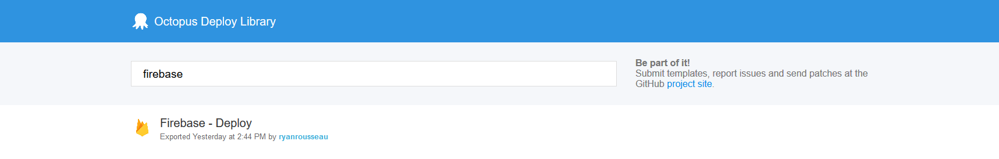
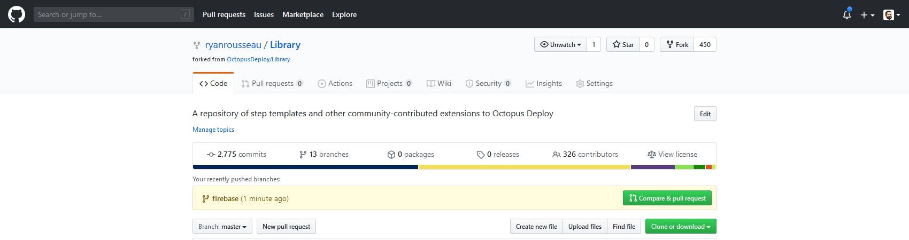

I recently created an Octopus Deploy [step template for the Firebase CLI deploy command](https://octopus.com/blog/creating-an-octopus-deploy-step-template).

In this post, I will introduce the Octopus Community Library and walk through the process of submitting a new template.

## The Octopus Community Library

The [Community Library](https://library.octopus.com/listing) is a repository of step templates and other community-contributed extensions to Octopus Deploy.

The steps in the library are contributed by Octopus, other vendors, and Octopus users.

## Contributing

If you have authored a step template, you might consider contributing it to the library.

Examples of steps that are a good fit for the library include those that:

* Wrap the details of another application’s CLI or API ([Create an event in Datadog](https://library.octopus.com/step-templates/40af3b8d-83b0-499e-99ed-e4b1093a7633/actiontemplate-datadog-create-event), [Create an alert in VictorOps](https://library.octopus.com/step-templates/2ecb9ec9-2c81-4e75-8093-175d2557ca54/actiontemplate-victorops-create-alert), [Update a Rackspace Load Balancer](https://library.octopus.com/step-templates/94aa35a3-0a0c-4c45-8781-98006bda3bcd/actiontemplate-rackspace-update-load-balancer)).
* Provide a generic, widely used function ([Clean directory](https://library.octopus.com/step-templates/e56aafe2-0d59-453b-9449-d7384914468d/actiontemplate-file-system-clean-directory), [Test URL](https://library.octopus.com/step-templates/17092e2b-7fae-4aae-b8df-bb1c7ec76ff9/actiontemplate-http-test-url-(bash)), [Restart Windows service](https://library.octopus.com/step-templates/d1df734a-c0da-4022-9e70-8e1931b083da/actiontemplate-windows-service-restart).
* Manipulate Octopus itself ([Delete a target or worker](https://library.octopus.com/step-templates/e4255fcb-fe7d-4d5b-8ec0-0243e5f48a9c/actiontemplate-delete-target-or-worker-registration-from-octopus), [Upgrade Octopus server](https://library.octopus.com/step-templates/4b3a1f09-1827-41bb-88a4-894c6317922b/actiontemplate-upgrade-octopus-server), [Find unreplaced variables](https://library.octopus.com/step-templates/0b753c94-c12b-46f3-bb82-459e27bbe812/actiontemplate-variables-find-unreplaced)).

That is not an exhaustive list. If you have an idea for a step template, and you want feedback, open an issue on [GitHub](https://github.com/OctopusDeploy/Library/issues).

There are also [contributing guidelines](https://github.com/OctopusDeploy/Library/blob/master/.github/CONTRIBUTING.md) posted in the repository.

The guidelines include instructions for submitting the step template, and there is a checklist of common review feedback provided on step templates.

I will follow the submission instructions in this post.

## Fork and clone the repository

I forked the repository in GitHub so that I have [a copy](https://github.com/ryanrousseau/Library) where I can work.

Then I hop into a terminal window to clone the repository and start a branch. I am usually in the terminal when I interact with Git, but you can also do these steps with your preferred Git GUI.

```bash
git clone https://github.com/ryanrousseau/Library.git rr_library
cd rr_library
git checkout -b firebase
```

With my repository forked and cloned, it is time to export my template.

## Export a step template

While viewing a step template, you can export it by choosing **Export** from the action menu. The export generates the JSON that goes into the repository.

In some older versions of Octopus, the author needs to update the ID and Version. In newer versions, Octopus sets these for the author.

The exported JSON of my Firebase Deploy step is:

```json
{
  "Id": "ac0dee2d-dcbe-42aa-96c6-bb6c644183b4",
  "Name": "Firebase - Deploy",
  "Description": "Deploys the contents of a package to a Firebase project using the [Firebase CLI deploy command](https://firebase.google.com/docs/cli/#deployment).",
  "ActionType": "Octopus.Script",
  "Version": 1,
  "CommunityActionTemplateId": null,
  "Packages": [
    {
      "Id": "343306b7-6997-429f-9ed5-4214ca4d32ac",
      "Name": "FirebaseDeploy.Package",
      "PackageId": null,
      "FeedId": "feeds-builtin",
      "AcquisitionLocation": "Server",
      "Properties": {
        "Extract": "True",
        "SelectionMode": "deferred",
        "PackageParameterName": "FirebaseDeploy.Package"
      }
    }
  ],
  "Properties": {
    "Octopus.Action.Script.ScriptSource": "Inline",
    "Octopus.Action.Script.Syntax": "Bash",
    "Octopus.Action.Script.ScriptBody": "packagePath=$(get_octopusvariable \"Octopus.Action.Package[FirebaseDeploy.Package].ExtractedPath\")\ntoken=$(get_octopusvariable \"FirebaseDeploy.CIToken\")\npublic=$(get_octopusvariable \"FirebaseDeploy.Public\")\nmessage=$(get_octopusvariable \"FirebaseDeploy.Message\")\nforce=$(get_octopusvariable \"FirebaseDeploy.Force\")\nonly=$(get_octopusvariable \"FirebaseDeploy.Only\")\nexcept=$(get_octopusvariable \"FirebaseDeploy.Except\")\nprintCommand=$(get_octopusvariable \"FirebaseDeploy.PrintCommand\")\nfirebasePath=$(get_octopusvariable \"FirebaseDeploy.FirebasePath\")\n\nif [ ! -z \"$firebasePath\" ] ; then\n   \tPATH=$firebasePath:$PATH\nfi\n\nif [ \"$force\" = \"True\" ] ; then\n    force=true\nelse\n    force=\nfi\n\nif [ \"$printCommand\" = \"True\" ] ; then\n    set -x\nfi\n\ncd $packagePath\n\nfirebase deploy ${public:+ -p \"$public\"} ${message:+ -m \"$message\"} ${force:+ -f} ${only:+ --only \"$only\"} ${except:+ --except \"$except\"} --token $token"
  },
  "Parameters": [
    {
      "Id": "55ddf9fd-bf2f-4148-912b-bc599c5f6ec6",
      "Name": "FirebaseDeploy.Package",
      "Label": "Package",
      "HelpText": "The package containing the Firebase project being deployed.",
      "DefaultValue": "",
      "DisplaySettings": {
        "Octopus.ControlType": "Package"
      }
    },
    {
      "Id": "46874eaf-7632-40d1-bd46-4627bd0f2d0c",
      "Name": "FirebaseDeploy.FirebasePath",
      "Label": "Firebase Path",
      "HelpText": "The path to the directory containing the Firebase CLI, if not in $PATH.",
      "DefaultValue": "",
      "DisplaySettings": {
        "Octopus.ControlType": "SingleLineText"
      }
    },
    {
      "Id": "c982c1f3-a91e-4dd4-89a6-db5d99b08347",
      "Name": "FirebaseDeploy.CIToken",
      "Label": "CI Token",
      "HelpText": "A CI token generated by the [Firebase CLI](https://firebase.google.com/docs/cli/#cli-ci-systems)",
      "DefaultValue": "",
      "DisplaySettings": {
        "Octopus.ControlType": "Sensitive"
      }
    },
    {
      "Id": "56628161-6b99-4ca3-9c4a-1234117a0018",
      "Name": "FirebaseDeploy.Public",
      "Label": "Public Path",
      "HelpText": "Override the Hosting public directory specified in firebase.json.",
      "DefaultValue": "",
      "DisplaySettings": {
        "Octopus.ControlType": "SingleLineText"
      }
    },
    {
      "Id": "e7c41fcb-dd74-4ba2-9671-fa7313d632b8",
      "Name": "FirebaseDeploy.Message",
      "Label": "Message",
      "HelpText": "An optional message describing this deploy.",
      "DefaultValue": "",
      "DisplaySettings": {
        "Octopus.ControlType": "SingleLineText"
      }
    },
    {
      "Id": "6a88a428-a538-4292-b6ee-b843c28887f3",
      "Name": "FirebaseDeploy.Force",
      "Label": "Force?",
      "HelpText": "Delete Cloud Functions missing from the current working directory without confirmation.",
      "DefaultValue": "",
      "DisplaySettings": {
        "Octopus.ControlType": "Checkbox"
      }
    },
    {
      "Id": "c0debcc3-6708-4d3c-977b-880811b48594",
      "Name": "FirebaseDeploy.Only",
      "Label": "Only Targets",
      "HelpText": "Only deploy to specified, comma-separated targets (e.g. \"hosting,storage\"). For functions, can specify filters with colons to scope function deploys to only those functions (e.g. \"--only functions:func1,functions:func2\"). When filtering based on export groups (the exported module object keys), use dots to specify group names (e.g. \"--only functions:group1.subgroup1,functions:group2)\".",
      "DefaultValue": "",
      "DisplaySettings": {
        "Octopus.ControlType": "SingleLineText"
      }
    },
    {
      "Id": "e62a6b0f-6331-4a63-a908-c759798ccd1c",
      "Name": "FirebaseDeploy.Except",
      "Label": "Except Targets",
      "HelpText": "Deploy to all targets except specified (e.g. \"database\").",
      "DefaultValue": "",
      "DisplaySettings": {
        "Octopus.ControlType": "SingleLineText"
      }
    },
    {
      "Id": "e2e0ac14-e5e9-4b3c-bdc1-b1da3d7be184",
      "Name": "FirebaseDeploy.PrintCommand",
      "Label": "Print Command?",
      "HelpText": "Prints the command in the logs using `set -x`. This will cause a warning when the step runs.",
      "DefaultValue": "",
      "DisplaySettings": {
        "Octopus.ControlType": "Checkbox"
      }
    }
  ],
  "$Meta": {
    "ExportedAt": "2020-06-08T19:44:37.662Z",
    "OctopusVersion": "2020.2.11",
    "Type": "ActionTemplate"
  },
  "LastModifiedBy": "Your GitHub Username",
  "Category": "other"
}
```

It is almost ready to commit. I only need to set `LastModifiedBy` to my GitHub username and the category to "firebase."

Lucky for me, naming the file going into the repository does not pose a challenge. I save the JSON in `step-templates\firebase-deploy.json`.

## Add the Firebase category

`Firebase - Deploy` is the first step in the library in the `firebase` category. I need to add a logo and update the site to handle the category.

I track down a logo and save it as `step-templates\logos\firebase.png`.

I open `.gulpfile.babel.js` and find the `humanize` function. I add a case for Firebase.

```javascript
    case 'firebase': return 'Firebase';
```

## Testing

I can run the library site locally to make sure that I did not miss anything.

I need to install `gulp` to build and test the site:

```bash
npm install -g gulp
```

Then I install the dependencies, build, and start the site:

```bash
npm install
gulp
node build/server.js
```

I navigate to `http://localhost:9000` and search for `firebase`:



It looks like everything is working. It is time to create a pull request.

## Commit the changes

I stage and commit my changes to the library, and then I push them to my fork of the repository:

```bash
git add ./gulpfile.babel.js
git add ./step-templates/firebase-deploy.json
git add ./step-templates/logos/firebase.png
git commit -m "Add Firebase - Deploy template"
git push -u origin firebase
```

## Submit the pull request

I navigate over to my [fork in GitHub](https://github.com/ryanrousseau/Library). I see that GitHub has picked up the new branch and offers me a **Compare & pull request** button.



I click the button to start the pull request process. GitHub defaults the pull request target to the original repository. That is correct, so I don’t change it.

The pull request template includes two sections. The first section is a copy of the guidelines. I verify that my template follows the guidelines. Then I delete the first section per the instructions.

The second section is a checklist of items that need to be completed for step templates. I review the list and check them to confirm my step follows these rules.

I submit the [pull request](https://github.com/OctopusDeploy/Library/pull/929). It will likely be closed by the time this post is published, but the history of any review comments and changes will be available.

## Next steps

There is a Contributor License Agreement to sign before the pull request can be merged. There is also an automated build to make sure that the site builds. The last piece of the puzzle is a review from the Octopus team.

A fellow Octopod will review the changes to make sure I followed the guidelines and that the step is a valuable addition to the library.

If there are any changes, I will make them and add them to the pull request for another review.

After the pull request is approved, the reviewer will merge the step into the library. A build and deployment of the library site will start. Within a few minutes, the step will be available for other Octopus users.

## Conclusion

The [Octopus Community Library](https://library.octopus.com/listing) hosts a wide variety of community-contributed steps. You can submit a template to the library for the benefit of others.
