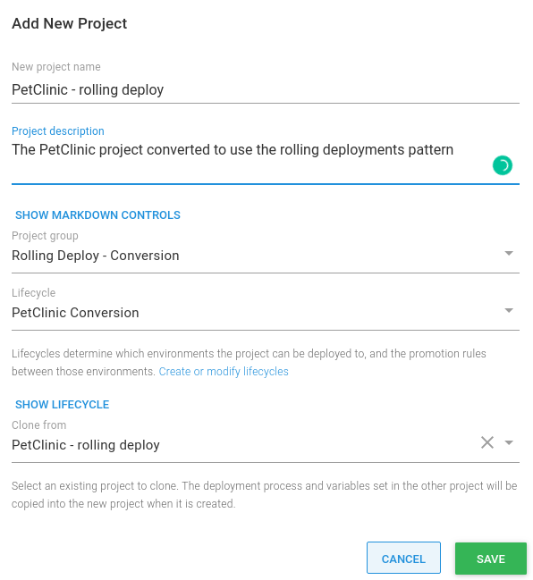
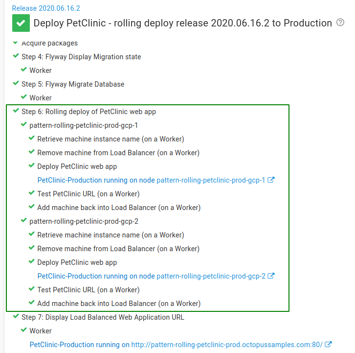

In a previous post, I wrote about the [benefits of the rolling deployments pattern](/blog/2020-01/ultimate-guide-to-rolling-deployments/index.md) as a way to reduce application downtime at deployment time. Designing an application to fit this deployment pattern is arguably much easier when you’re first creating it, but where do you start with an existing application, and how do you take the application and convert it to use the rolling deployments pattern?

In this post, I show you how to convert an existing application to use the rolling deployments pattern in Octopus with the help of [child steps](https://octopus.com/docs/deployment-patterns/rolling-deployments#Rollingdeployments-Childsteps).

<h2>In this post</h2>

!toc

## The application

I am going to use [PetClinic](https://github.com/spring-projects/spring-petclinic) as an example and convert the deployment process for the application from one that runs deployment steps sequentially in Octopus to a rolling deployment process. PetClinic is a sample Spring Boot application written in Java that has two main components:

- A web front-end.
- A database.

:::hint
I don’t explain how to build the PetClinic application in this post. If you are new to building Java applications, we have a number of [guides](https://octopus.com/docs/guides?application=java) that include step-by-step instructions to setup CI/CD pipelines for various tools.
:::

For both the sequential and rolling deployment processes, the PetClinic application and [MySQL](https://www.mysql.com/) database are hosted in [Google Cloud](https://cloud.google.com/gcp). All of the infrastructure used in these examples, including the servers, load balancer, and databases are re-created regularly using [Operations Runbooks](https://octopus.com/docs/operations-runbooks).

### Some caveats

It’s important to highlight that this post won’t cover every element required for a zero-downtime deployment. It makes some assumptions about the application set-up:

1. The database is already deployed in a highly available configuration. For more information on MySQL high availability, refer to the [documentation](https://dev.mysql.com/doc/mysql-ha-scalability/en/ha-overview.html).
1. Changes to the database are made in a backward and forward compatible way using [Flyway](https://flywaydb.org/).
1. Any required session state is persisted for when an individual server is being deployed to.

## Sequential deployment process

For deployments where you aren’t concerned about application downtime, Octopus caters for this by running steps sequentially one after the other, by default.

:::hint
**Start trigger**
It’s also possible to configure your deployment process to run steps in [parallel](https://octopus.com/docs/deployment-process/conditions#start-trigger). However, care should be taken to avoid situations where steps running in parallel depend on one another.
:::

The existing PetClinic application is modeled using this sequential deployment technique. The deployment process consists of a number of key steps:

- A [manual intervention](https://octopus.com/docs/deployment-process/steps/manual-intervention-and-approvals) approval step for the **Production** environment only.
- Flyway DB migration [community step template](https://library.octopus.com/listing/flyway) steps to display the migration state and apply any new database changes.
- A deploy to [WildFly](https://wildfly.org/) step for the PetClinic web front-end.

In addition, the deployment process includes steps that will post messages to a [Slack](https://slack.com/) channel with deployment progression updates.

The complete deployment process can be seen here:


After [creating a release](https://octopus.com/docs/managing-releases#creating-a-release) in Octopus, you can see an example of the sequential deployment in action to the **Development** environment:


The steps are run one at a time until the deployment is complete. When the **Deploy PetClinic web app** step is run, the application becomes unavailable to serve requests to users. 

Perhaps unsurprisingly, the infrastructure used in these deployments (per environment) looks like this:


It includes:

- A single [Ubuntu](https://ubuntu.com/) virtual machine hosting the Wildfly application server.
- A MySQL database hosted in a Google [Cloud SQL](https://cloud.google.com/sql/) service.

:::success
**Sample Octopus project**
You can see the PetClinic sequential deployment process *before* the conversion to a rolling deployment process in our [samples instance](https://g.octopushq.com/PatternRollingSamplePetClinicNoRollingDeploy).
:::

## Convert to a rolling deployment process

Now that we have seen the deployment process for the existing application, we first need to decide on what our infrastructure will look like for the rolling deployment process.

### Scale up the servers

In order to reduce downtime and still serve requests for users, we need to scale up the number of servers we use. We also need a load-balancer that we can use to control which servers are available.

In the previous sequential deployment example, we had a single virtual machine per environment. To keep things simple we’ll keep the infrastructure for the **Development** environment the same as before. For the **Test** and **Production** environments, however, the infrastructure will look like this:


This includes a *shared* load balancer, and this time, two application servers in each environment, connecting to the MySQL database as before.

After you have created your new servers, you also need to add them in Octopus as new [deployment targets](https://octopus.com/docs/infrastructure/deployment-targets#adding-deployment-targets) and tag them with any appropriate [target roles](https://octopus.com/docs/octopus-concepts/target-roles).

### Choosing a load balancer

There are many different types of load balancer, but a key requirement for this rolling deployments example is the ability to control which servers are available to serve traffic. For this reason, and as this example is running from Google Cloud, we’ll use a [network load balancer](https://cloud.google.com/load-balancing/docs/network/). This provides a way to add and remove our servers from the load balancer as part of the deployment process, which we’ll see a little later on. For more information about setting up a network load balancer, please refer to the [Google documentation](https://cloud.google.com/load-balancing/docs/network/setting-up-network).

:::hint
In this example, the load balancer is shared between the **Test** and **Production** environments. To route traffic to the correct place, a different TCP port is used at the load balancer to identify the intended environment. 
- Port `8080` is used for traffic destined for the **Test** environment.
- Port `80` is used for traffic destined for the **Production** environment.
:::

### Load balancer target pools

Previously, users accessed the PetClinic web front-end directly on a single virtual machine. Here, we use dedicated target pools for the **Test** and **Production** environments. A [target pool](https://cloud.google.com/load-balancing/docs/target-pools) is the name given to a group of virtual machine instances hosted in Google Cloud. 

### Create a new project

In order to change our deployment process, and keep the ability to deploy PetClinic sequentially, we need to create a new project. One way to achieve this is by [cloning](https://octopus.com/docs/projects#clone-a-project) the existing project.

In the existing project, under **Settings**, use the overflow menu (...) and select **Clone**:


- Give the new project you are cloning from the original project a name, review the settings, and when you are satisfied, click **SAVE**:




### Convert the PetClinic deployment process

Next, we’ll convert the deployment process for the project itself. Not all of the PetClinic deployment process lends itself naturally to the rolling deployments pattern, and for this reason, we are focusing on the web front-end of PetClinic. 

:::hint
**Choosing what to convert**
It’s important to decide for yourself what elements of your project’s deployment process should be converted to use a rolling deployments pattern. In certain situations, it could make things *harder to deploy*.
:::

#### Configure a rolling deployment

To convert the **Deploy PetCinic web app** step to a rolling deployment we perform the following actions:

 - Open the step in the deployment process editor, expand the section **On Targets in Roles**, and click **CONFIGURE A ROLLING DEPLOYMENT**:


- In the **Rolling Deployment** option that appears, choose a **Window size**. I’ve chosen a Window Size of `1` since we will only deploy to a maximum of two servers per environment:


- Click **SAVE** to update the deployment step.

#### Add the child steps

We’ve configured a rolling deployment, but it’s not very intelligent yet. Currently, the process deploys PetClinic to each server one at a time, taking each instance of the application offline as it deploys.

We need to add new steps to our rolling deployment to safely deploy new versions of the PetClinic application to each virtual machine and continue serving traffic to users on the other server.

These steps will:
1. Retrieve the virtual machine name.
1. Remove the virtual machine from the load balancer *before* the PetClinic deployment.
1. Add the virtual machine into the load balancer *after* the PetClinic deployment.
1. Test the PetClinic web front-end is available.

In Octopus, adding multiple steps to a rolling deployment process is done with [child steps](https://octopus.com/docs/deployment-patterns/rolling-deployments#Rollingdeployments-Childsteps).

:::warning
**gcloud CLI and authorization**
Most of the commands used for interacting with Google in this next section make use of the [Google Cloud CLI](https://cloud.google.com/sdk/gcloud). To use the **gcloud** CLI you usually need to authorize it. For further information on gcloud authorization, please refer to the [documentation](https://cloud.google.com/sdk/docs/authorizing).
:::

##### Add a new child step

To add a child step, we open the overflow menu (...) for the existing **Deploy PetClinic web app** step and select **Add child step**:


We are presented with the **Choose Step Template** selector where we choose the required step type.

Next, I’ll walk through the new child steps needed to complete the rolling deployment process. Some of the script examples have been reduced to the minimum needed to highlight the key parts.

##### Retrieve the instance name

This [script step](https://octopus.com/docs/deployment-examples/custom-scripts/run-a-script-step) is required so that we can identify the name of the virtual machine hosted in Google Cloud for use when removing and adding to the load balancer. We do this by querying Google with the gcloud `instances describe` command:

```powershell
$machineName = $OctopusParameters["Octopus.Machine.Name"]

$instanceName=(& gcloud compute instances describe $machineName --project=$projectName --zone=$zone --format="get(name)" --quiet) -join ", "
```

If a match is found using the machine identified by the Octopus system variable `Octopus.Machine.Name`, the script sets an [output variable](https://octopus.com/docs/projects/variables/output-variables) with the name as recorded in Google Cloud:

```powershell
Set-OctopusVariable -name "InstanceName" -value $instanceName
```

##### Remove the machine from the load balancer

When we have the name of the machine we are deploying to, we need to remove it from the load balancer target pool. However, to prevent an attempt to remove the virtual machine from the target pool when it’s not present to start with, we can run the gcloud `target-pools describe` command to check:

```powershell
$instances=(& gcloud compute target-pools describe $targetPoolName --format="flattened(instances[])" --region=$region --project=$projectName --quiet)
```

If the instance is found in the target pool, we run the gcloud `target-pools remove-instances` command supplying the instance name with the `--instances` parameter:

```powershell
$instanceName = $OctopusParameters["Octopus.Action[Retrieve machine instance name].Output.InstanceName"]

$response=(& gcloud compute target-pools remove-instances $targetPoolName --instances=$instanceName --instances-zone=$zone --project=$projectName --quiet)
```

After the virtual machine has been removed from the load balancer, we can proceed to deploy the PetClinic application.

:::hint
We don’t need to add a new child step to deploy the PetClinic application, as it already exists. Instead, we will place that step in the right place after we have added the necessary child steps.
:::

##### Testing the PetClinic application

After the PetClinic front-end has been deployed, we can test if it’s responding to requests by adding a community [step template](https://g.octopushq.comCommunityContributedStepTemplates) called **HTTP - Test URL** as a child step.

We use a variable of `#{Project.Wildfly.Url}` to test that it returns an HTTP 200 OK response. This will tell us if the application is running. Any other HTTP response will result in a failure.

##### Add the machine to the load balancer

Lastly, when the PetClinic application has been verified as online, we can add it back to the load balancer target pool. We do this by running the gcloud `target-pools add-instances` command and supplying the instance name (as before) with the `--instances` parameter:

```powershell
$instanceName = $OctopusParameters["Octopus.Action[Retrieve machine instance name].Output.InstanceName"]

$response=(& gcloud compute target-pools add-instances $targetPoolName --instances=$instanceName --instances-zone=$zone --project=$projectName --quiet)
```

##### Re-order the child steps

After all of the child steps have been added, you can reorder them if necessary. In our case, we need to move the original **Deploy PetClinic web app** step to the middle so that we don’t deploy the application to the virtual machine *until* it has been removed from the load balancer.

To reorder the child steps:
- Use the overflow menu (...) and select **Reorder child steps**.
- Rearrange the steps in the desired order.
- Click **SAVE** when done.


#### The rolling deployment process

Some of the steps in the rolling deployment process aren’t required for the **Development** environment. This is because we’re not using a load balancer in that environment. To skip the steps that don’t need to run, we use an environment [run condition](https://octopus.com/docs/deployment-process/conditions#environments). This will skip the steps applicable to the load-balanced environments when deploying to **Development**.

The complete rolling deployment process is shown here: 


You can see an example deployment to **Production** using the new rolling deployment process:



And that’s it! We’ve successfully converted our deployment process from a sequential one to a rolling deployment process.

:::success
**Sample Octopus project**
You can see the complete PetClinic deployment process *after* the conversion to a rolling deployment process, in our [samples instance](https://g.octopushq.com/PatternRollingSamplePetClinicRollingDeploy).
:::

### Switch over to new infrastructure

In order to use our new infrastructure, we need to direct our users to our application via the load balancer. The simplest way to do that is to adjust your DNS records. In the case of PetClinic, I just need to adjust the DNS [A record](https://en.wikipedia.org/wiki/List_of_DNS_record_types) to point to the load balancer and wait for the DNS changes to update.

:::warning
Changing any DNS records may result in a period of time where users are still connecting directly to the virtual machines. This is usually no more than 24 hours, but this will depend on your DNS provider and how long the DNS changes take to propagate.
:::

### Clean-up

At this point, you no longer need your old Octopus project. You can clean it up by either disabling it (and effectively archiving it), or delete it if you no longer need it for any auditing requirements.

## Conclusion

As you can hopefully see from this post, with a few steps, you can switch from a sequential deployment process in Octopus to one using the rolling deployments feature. This allows you to benefit from reduced downtime, safe in the knowledge that your application can remain online to serve requests to your users.

Until next time, Happy Deployments! 

## Learn more
- [Octopus rolling deployments docs](https://octopus.com/docs/deployment-patterns/rolling-deployments)
- [Octopus CI/CD guides](https://octopus.com/docs/guides)
