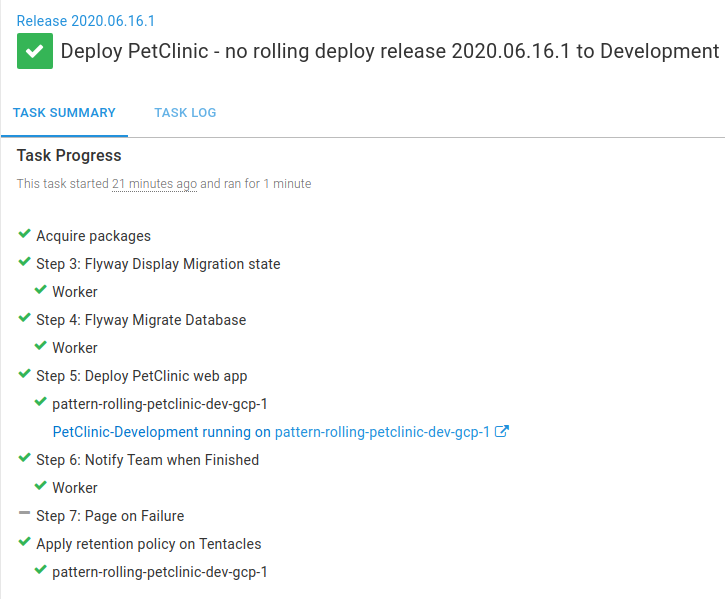

In a previous post this year, I wrote about the [benefits of the rolling deployments pattern](/blog/2020-01/ultimate-guide-to-rolling-deployments/index.md) as a way to reduce application downtime when deploying. Designing an application to fit this deployment pattern is arguably much easier when you’re first creating it. But where do you start with an existing application, and how do you take the application and convert it to use the rolling deployments pattern?

In this post, I’ll show you how to convert an existing application to use the rolling deployments pattern in Octopus with the help of [Child Steps](https://octopus.com/docs/deployment-patterns/rolling-deployments#Rollingdeployments-Childsteps).

<h2>In this post</h2>

!toc

## The application

I am going to use [PetClinic](https://github.com/spring-projects/spring-petclinic) as an example and convert this from a process which runs deployment steps sequentially in Octopus, to a rolling deployment process. PetClinic is a sample Spring Boot application written in Java, that has 2 main components:

- A web front-end
- A database

:::hint
I don’t explain how to build the PetClinic application in this post. If you are new to building Java applications, we have a number of [guides](https://octopus.com/docs/guides?application=java) which include step-by-step instructions to setup CI/CD pipelines for various tools.
:::

For both the sequential and rolling deployment processes, the PetClinic application and [MySQL](https://www.mysql.com/) database are hosted in [Google Cloud](https://cloud.google.com/gcp). All of the infrastructure used in these examples, including the servers, load balancer and databases are re-created regularly using [Operations Runbooks](https://octopus.com/docs/operations-runbooks).

### Some caveats

It’s important to highlight that this post won’t cover every element required for a zero-downtime deployment. It makes some assumptions about the application set-up:

1. The database is already deployed in a highly available configuration. For more information on MySQL high availability, refer to the [documentation](https://dev.mysql.com/doc/mysql-ha-scalability/en/ha-overview.html).
1. Changes to the database are made in a backward and forward compatible way using [Flyway](https://flywaydb.org/).
1. Any required session state is persisted for when an individual server is being deployed to.

## Sequential deployment process

For deployments where you aren’t concerned about any application downtime, Octopus caters for this perfectly by running steps sequentially by default, one after the other.

:::hint
**Start trigger**
It’s also possible to configure your deployment process to run steps in [parallel](https://octopus.com/docs/deployment-process/conditions#start-trigger). However, care should be taken to avoid a situation where steps run in parallel which depend on one another.
:::

The existing PetClinic application is modelled using this sequential deployment technique. The deployment process consists of a number of key steps:

- A [Manual intervention](https://octopus.com/docs/deployment-process/steps/manual-intervention-and-approvals) Approval step (for the `Production` Environment only).
- A Flyway DB migration [community library](https://library.octopus.com/listing/database) step to apply any database changes.
- A Deploy to [WildFly](https://wildfly.org/) step for the PetClinic web front-end.

In addition, the deployment process includes some Slack steps to notify users of how a deployment is progressing.

The complete deployment process can be seen here:

After [creating a release](https://octopus.com/docs/managing-releases#creating-a-release) in Octopus, you can see an example of the sequential deployment in action to the `Development` environment:

Each step is run one at a time, until the deployment is complete. When the `Deploy PetClinic web app` step is run, the application at this point becomes unavailable to serve requests to users. 

Perhaps unsurprisingly, the infrastructure used in these deployments (per Environment) look like this:

It includes:

- A single [Ubuntu](https://ubuntu.com/) virtual machine hosting the Wildfly application server
- A MySQL database hosted in a Google [Cloud SQL](https://cloud.google.com/sql/) Service.

:::success
**Sample Octopus Project**
You can see the PetClinic project before the conversion to a rolling deployment process, in our [samples instance](https://g.octopushq.com/PatternRollingSamplePetClinicNoRollingDeploy)
:::

## Converting to a rolling deployment process

Now that we have seen the deployment process for the existing application, we first need to decide on what our infrastructure will look like for the rolling deployment process. 

### Scaling up servers

Clearly, in order to reduce downtime and still serve requests for users, we need to scale up the number of servers we use. We’ll also need a load-balancer that we can use to control which servers are available.

In the previous sequential deployment example, we had a single application server per environment. To keep the `Development` environment simple, we’ll keep the infrastructure the same as before. For the `Test` and `Production` environments however, the infrastructure will look like this:

This includes a shared load balancer and this time two application servers connecting into the MySQL database as before.

:::hint
In this example, the load balancer is shared between both the `Test` and the `Production` environment. To route traffic to the correct place, a different TCP Port is used at the load balancer to identify the intended environment. 
- Port `8080` is used for traffic destined for the `Test` environment.
- Port `80` is used for traffic destined for the `Production` environment
:::

### Choosing the load balancer

There are many different types of load balancer, but one key goal required for this rolling deployments example is the ability to control which servers are available to serve traffic. For this reason, we’ll be using a Google [Network Load Balancer](https://cloud.google.com/load-balancing/docs/network/). This provides a way to add and remove our servers from the load balancer as part of the deployment process, which we’ll see a little later in this post. For more information about how to set up a network load balancer, please refer to the [Google documentation](https://cloud.google.com/load-balancing/docs/network/setting-up-network).

### Direct traffic to the load balancer

:::warning
Adding the existing servers to a load balancer for the first time will also require downtime.
:::

### Add Child Steps

### Testing the application on each machine

:::success
**Sample Octopus Projects**
You can see the before and after of the project conversion discussed here in our samples instance.

- [PetClinic project - with no rolling deployments](https://g.octopushq.com/PatternRollingSamplePetClinicNoRollingDeploy)
- [PetClinic project - with rolling deployments](https://g.octopushq.com/PatternRollingSamplePetClinicRollingDeploy)
- [PetClinic Infrastructure Runbooks](https://g.octopushq.com/PatternRollingSamplePetClinicIacRunbooks)
:::

## Conclusion

TODO

## Learn more
- [Octopus Rolling deployments docs](https://octopus.com/docs/deployment-patterns/rolling-deployments)
- [Octopus CI/CD guides](https://octopus.com/docs/guides)
