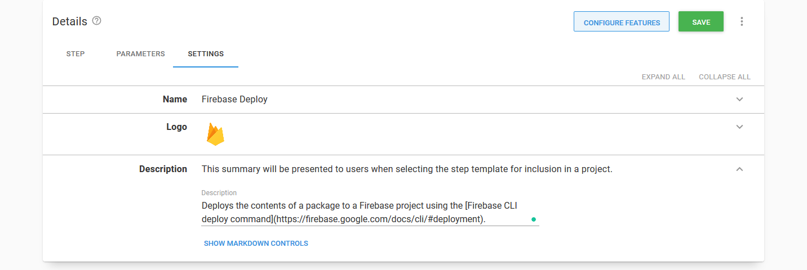
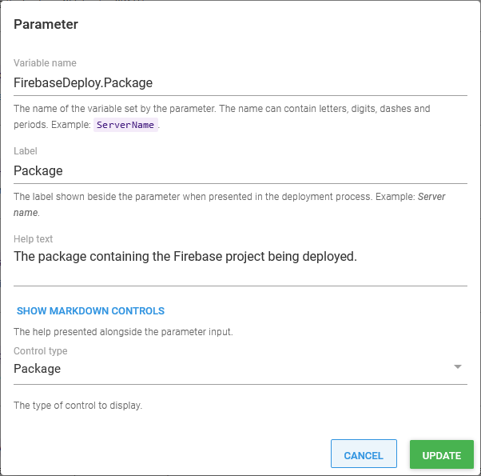
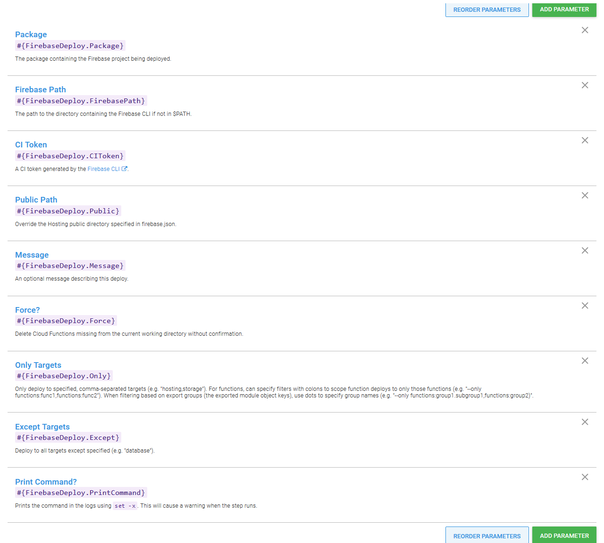
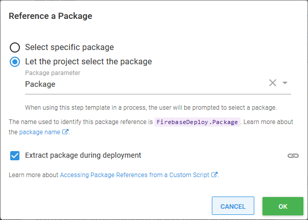
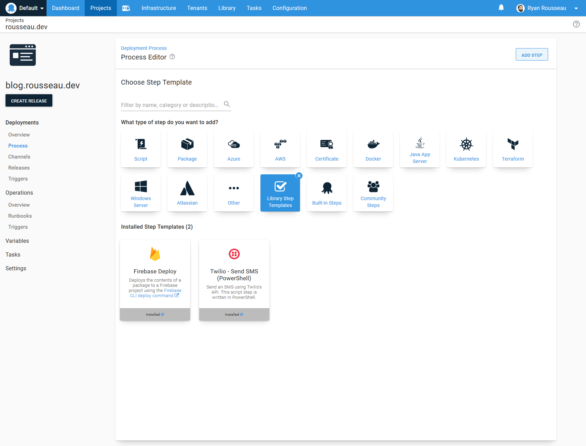
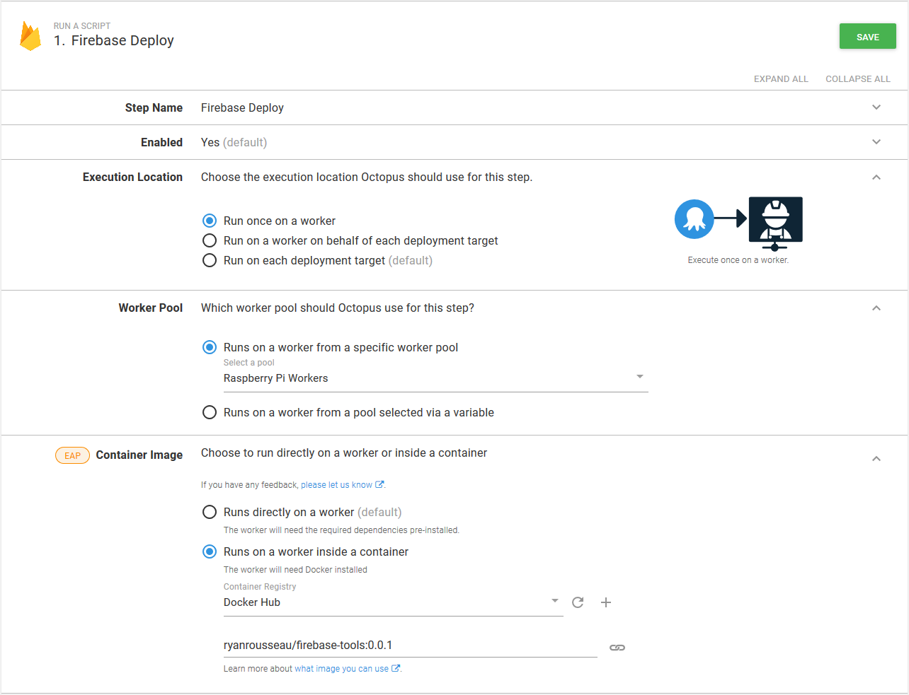
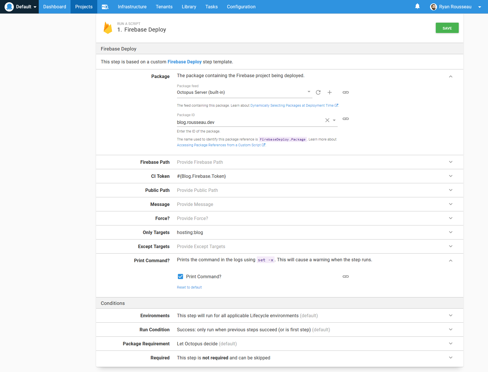
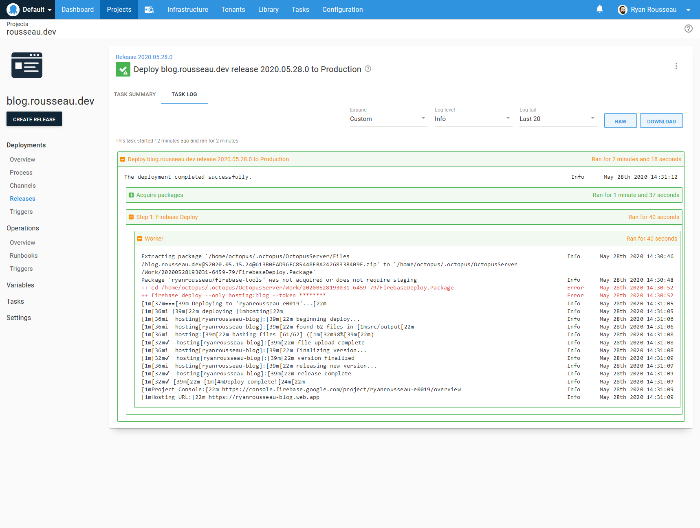

Today, I am going to create a [custom step template](https://octopus.com/docs/deployment-process/steps/custom-step-templates) in Octopus Deploy.

Custom step templates are useful for extending the functionality of Octopus. They can also standardize actions across your projects.

I host some projects on Firebase, so I have chosen to create a template for the [Firebase CLI deploy command](https://firebase.google.com/docs/cli/#deployment).

Let’s get started!

## Choosing a base template

The first decision I need to make is which of the existing step templates I am going to build on.

I am deploying the contents of a package to Firebase, so **Deploy a Package** looks like a reasonable choice. The **Deploy a Package** step is for deploying the contents of a package to the machine or PaaS target where it will run.

That is not the case for my Firebase deployment.

I only need to run the Firebase CLI against my files. The machine that the command runs on is not important. The **Run a Script** step is well-suited for this.

I click **Add** on the **Run a Script** template, and that takes me to the step template editor.

## Settings

Octopus launches me into the **Settings** tab. Here I can provide a name, logo, and description.

Choosing a good, descriptive step name is vital. The name came easy for my step. Since I am wrapping the Firebase deploy command, I called my step **Firebase Deploy**.

Next is the logo. The logo isn’t required, but I like to add them. Seeing the logo for the technology related to the tech provides a little flair for the step.

Finally, I give the step a description. The description field supports markdown. I take advantage of this to link back to the Firebase CLI docs:



## What to do next?

Should I add parameters to my step next, or should I add the step details and logic?

It depends. I usually start with the parameters that I know I will need. Then I start working on the step details and add newly discovered parameters as I go.

For this post, I describe all of the parameters before I move into the step details.

## Parameters

I add a parameter for the package containing my Firebase assets. Package parameters are a relatively new feature in Octopus Deploy. A package parameter lets consumers of my step, provide a package for the step to use.

When adding a parameter, I provide a name, label, help text, and the control type.

I name my package parameter `FirebaseDeploy.Package`. A prefix for the parameters will prevent name collisions with other Octopus variables.

I give it the label and control type `Package`. I set the help text to “The package containing the Firebase project being deployed.”

One parameter down:



The rest of the parameters will follow a similar naming convention and will only differ by type.

`Firebase Path`: The path to the directory containing the Firebase CLI, if not in $PATH.

`CI Token`: A CI token is required for Octopus to use the Firebase CI on my behalf. I make this parameter a sensitive parameter. Sensitive parameter values will be encrypted in the database and masked in the logs.

`Public Path`: Override the Hosting public directory specified in **firebase.json**.

`Message`: An optional message describing this deploy.

`Force?`: Delete Cloud Functions missing from the current working directory without confirmation. `Force?` is a checkbox parameter.

`Only Targets`: Only deploy to specified, comma-separated targets (e.g., `hosting,storage`).

`Except Targets`: Deploy to all targets except specified (e.g. `database`).

`Print Command?`: I added this parameter to use `set -x` to print the command when it runs. It comes in handy when debugging and testing the step.



## Step

With the parameters sorted, I switch to the **Step** tab. My script source will stay set to **Inline source code**. **Script file inside a package** is great if your team has standard scripts stored in a package. It is less suited to a template that you plan to make available to the general public (foreshadowing).

The **Step** tab has the **Inline Source Code** section next. I will skip ahead and create a referenced package because I need it for my script.

### Referenced packages

[Referenced packages](https://octopus.com/docs/deployment-examples/custom-scripts/run-a-script-step#referencing-packages) are extra packages that you can use in **Run a Script** steps.

In this step, the referenced package is the one that contains our Firebase assets. I will connect the package parameter to the script as a referenced package.

I have the option to select a package directly, but I change the setting to `Let the project select the package`. Then I choose my package parameter from the list. I can use this package in my script by using the parameter name `FirebaseDeploy.Package`.

I make sure that to check `Extract package during deployment`.



### The script

I chose to write my script in Bash, as I expect that most consumers will run it on a Linux Worker.

The first part of my script is getting the parameter values and storing them in variables.

The first variable is the path of the extracted package. The variable name is slightly different from the others. The `Octopus.Action.Package` variable is a collection. I use the name of the reference package as an index to access the package information:

```bash
packagePath=$(get_octopusvariable "Octopus.Action.Package[FirebaseDeploy.Package].ExtractedPath")
```

The rest of the variables are pretty standard, and I reference them by their names:

```bash
token=$(get_octopusvariable "FirebaseDeploy.CIToken")
public=$(get_octopusvariable "FirebaseDeploy.Public")
message=$(get_octopusvariable "FirebaseDeploy.Message")
force=$(get_octopusvariable "FirebaseDeploy.Force")
only=$(get_octopusvariable "FirebaseDeploy.Only")
except=$(get_octopusvariable "FirebaseDeploy.Except")
printCommand=$(get_octopusvariable "FirebaseDeploy.PrintCommand")
firebasePath=$(get_octopusvariable "FirebaseDeploy.FirebasePath")
```

If the step consumer provides a path for Firebase, I add it to the path variable:

```bash
if [ ! -z "$firebasePath" ] ; then
    PATH=$firebasePath:$PATH
fi
```

If `Force?` is checked, I set the value to true. If it is not, I unset it:

```bash
if [ "$force" = "True" ] ; then
    force=true
else
    force=
fi
```

If `Print Command?` is checked, I turn on command tracing:

```bash
if [ "$printCommand" = "True" ] ; then
    set -x
fi
```

Finally, I change into the package directory and call the Firebase deploy command:

```bash
cd $packagePath

firebase deploy ${public:+ -p "$public"} ${message:+ -m "$message"} ${force:+ -f} ${only:+ --only "$only"} ${except:+ --except "$except"} --token $token
```

I used a [trick](https://dev.to/octopus/til-about-shell-parameter-expansion-in-bash-3c5m) that I learned recently for the optional parameters.

In the following example, if `public` is null or unset, nothing is added to the command. If `public` is not null or unset, `-p "$public"` is added to the command.

```
${public:+ -p "$public"}
```

Voila, I have completed the script.

## Testing

With the step template saved in my library, I can add it to a deployment process. Custom step templates are in the _Library Step Template_ category:



I configure the step to run on my Worker and to run in a container with the Firebase CLI installed:



I set the parameters to the values I use in my deployments.

First, I chose the package from the built-in feed.

I set the CI token to a sensitive variable where I store my token.

I set **Only Targets** to `hosting:blog` based on my firebase.json settings.

Finally, I checked `Print Command?` so that I can see the command that the step constructed:



I create a release and deploy it to my environment. Everything looks good!



## Conclusion

[Custom step templates](https://octopus.com/docs/deployment-process/steps/custom-step-templates) are useful for extending the functionality of Octopus. They can also standardize actions across your projects.

I created a custom template for the Firebase CLI deploy command that I can use across any of my projects.

## Next time

I mentioned that I wanted this step to cover all the deploy parameters and be usable by others. Read my next post, [Contributing a step template to the Octopus Deploy Community Library](https://octopus.com/blog/contributing-a-step-template-to-the-octopus-deploy-community-library), to learn how I submit this step to the [Octopus Deploy Library](https://library.octopus.com).
