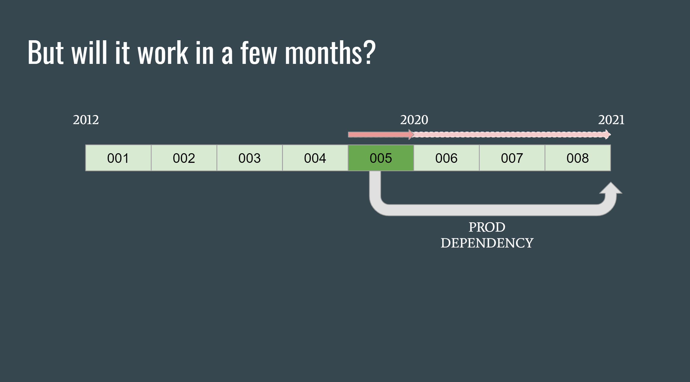

Database migrations, also known as database upgrade scripts, are a popular way to update application databases with a controlled and safer, or less risky, approach. Octopus Deploy has used  is a large application and ...

## What are database migrations?

Most applications will need to persist information about the state of the application, either in files or databases. The shape of the objects almost always evolve and change over time, which means some kind of migration code or script is required to keep the shape of the persisted data current. Without them, the application code would need to deal with all possible shapes of the documents from the beginning of time.

Most frameworks support this concept by providing a way for you to supply migration scripts to manipulate the database. Some even let you specify a rollback action. Typically they will keep track of the scripts that have been appliedin a table.

...

I'd mention how most create a table to track what is the current version. 

There are numerous options for almsot every platform. 

**NodeJS**

* 

**Python**

* Djago

**Ruby**

* Rails migrations

**.NET**

* [DbUp](https://github.com/dbup/dbup)
* [Entity Framework Code First](https://docs.microsoft.com/en-us/ef/core/managing-schemas/migrations/?tabs=dotnet-core-cli)

**Java**

* Flyway
* 

## Why

...

## Lessons Learned

### 1. Keep your migration scripts away from your normal production code.

As software developers, we've been trained to reuse and avoid duplicating code. This is the one time where we _want_ to duplicate code, since we want the behaviour of our migration script to be "snapshotted in time".

An example is described in the following illustrations. Each script (numbered 001 to 005) is responsible for changing the database state from **A** to **B**. If the script references a constant or class that is in production code, that script will still work as expected.

If the referenced code changes in a few months time (say the constant's value changes), then the script is actually taking a dependency on the future. This change in behaviour is subtle and hard to detect, _only surfacing when a customer upgrades directly from an old version before when the script was first introduced_.

(These are slides 6 & 7 from https://docs.google.com/presentation/d/14TbpXHvg9cLKyNJejfHyF4t4Dyy5WrQED8QnDyTE5es/edit#slide=id.g883dacea7e_0_103, feel free to edit the slides to make it prettier)

### 2. Keep it low-tech, don't deserialize

You might be tempted to deserialize the records so that you can work with classes with  Intellisense and/or type safety. In reality, you're exposing yourself to complexities around serialization and type converters. 

The upgrade script will be simpler if you work directly with the text or document model. If the document is `JSON`, work directly with `JObect` or `XElement` for `XML`.

### 3. Write tests to exercise each migration script individually

Having tests that exercise a single script greatly increases the confidence in the migration script. Migrations are a pain to test manually because you need to take a snapshot of the database and restore it after testing.

You might also want to run the complete migration over backups of a sample of old databases to catch any unexpected data or bad assumptions that won't be covered by the individual test.

### 4. Consider running long migrations online

Octopus Server runs its migration scripts synchronously during startup. This has the benefit of leaving the database in a known predictable state when the application starts. The downside of course is that running migrations over large tables would incur a long downtime, and this has resulted in us avoiding certain structure changes involving large tables.

We have started experimenting with running large migration jobs asynchronously in the background when the application is up and running. This introduces a new category of problems such as:
1. The application having to support the database in both the old and new state 
1. The upgrade job might be affected when you introduce subsequent changes to the same table. You will then need to either support the database in all three possible states or force the customer to upgrade to an intermediate version.

### 5. Consider versioning your documents

Although it's convenient to use migration scripts to update database schema changes as well as document properties, you will gain some flexibility if you separate the two concerns. For example, if you versioned your documents and upgraded the document structure separately, then you can reuse that same upgrade code for importing those same documents from a file.

## Conclusion

The crucial takeaway from these lessons is to isolate your upgrade scripts from the main production code so that its behaviour is "snapshotted in time".