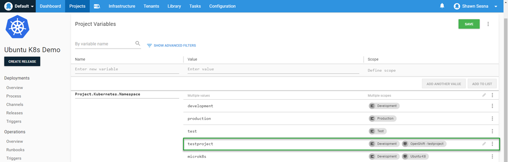

In a previous post, I spoke about using Octopus Deploy to deploy to Kubernetes (K8s) clusters that are managed by Rancher.  In this post, I will cover a similar topic, but deploy to RedHat OpenShift.

## RedHat OpenShift
Like Rancher, RedHat OpenShift is a K8s management platform.  However, that is where the similarity ends, the two products are vastly different.  The system requirements for running OpenShift are not unsubstantial.  There is a minumum of three master nodes, each with at least 4 vCPUs and 16 GB of RAM.  Worker nodes require a lesser amount of resrouces, 1 vCPU and 8 GB of RAM.  There is a stripped down version of OpenShift that is designed to run on a laptop for development and trial purposes called CodeReady Containers (CRC).  The CRC version is what I used for this post as my hypervisor didn't have enough remaining resources to host the full blown version.  While stripped down, the overall functionality is the same.

### Using CRC
This section is for providing some lessons learned when using CRC.  If you're not planning on using it, skip this section.  

To download CRC, you will first need to have a RedHat account.  CRC comes in three flavors
- Windows (Hyper-V)
- macOS (HyperKit)
- Linux (Libvirt)

For this post, I will be using the Windows Hyper-V variant.

#### Hyper-V Virtual Switches
The download for Windows CRC comes as a single .exe file.  This file takes care of creating and provisioning the VM to run OpenShift on our laptop.  One thing I discovered when using CRC is that it specifically used the Default virtual switch in Hyper-V.  Some time ago, Windows disabled the ability to edit the Default virtual switch so it's permanently stuck using Network Address Translation (NAT).  However, I did manage to find a not well publicized feature of CRC, if you create a virtual switch called `crc`, the provisioning of the VM will use that virtual switch instead.

#### CRC changes the DNS server to itself
The folks at RedHat have tried to make things as easy as possible by having an all encomposing solution so you can learn the OpenShift product.  This includes altering your network settings to change the DNS server to itself so you can resolve the built-in DNS entries.  I'll admit to not have paid enough attention to the messages as it was setting everything up and scratching my head for a while trying to figure out why my local DNS entries were no longer working.  Once I figured that out, it was easy enough to duplicate the DNS entries local to the laptop so that external machines could interact with the OpenShift cluster.

### OpenShift Perspectives
The interface to OpenShift comes with two modes called Perspectives:
- Administrator
- Developer

The options that are displayed change based on what Perspective you are using.  The Administrator Perspective shows options more related to Operations and Management, whereas the Developer Perspective shows only options that Developers would be concerned with.  

### Creating a project
To organize your resources for your application together, OpenShift uses the concept of Projects.  A Project will consist of all the components of your applicaiton and can be monitored from the Project screen.  To create a project, ensure that you are in the Administrator Perspective


Once the display has updated (if using CRC, this could take several seconds) to the Administrator Perspecive, click the blue **Create Project** button.  

Give your project a name then click **Create**


#### Create Service Account
In order to deploy to OpenShift, we need to provide Octopus Deploy some credentials to connect.  Each project within OpenShift has a section that you can define Service Accounts.  Once your project has been created

- Expand **User Management**
- Click **Service Accounts**
- Click **Create Service Account**

#### Create Role Binding
With the Service Account created, we need to give it a role so it can create resources on the cluster.

I had some difficulties getting the correct permissions using the UI, I found that using the command line `oc.exe` tool allowed me to give my service account the permissions I was looking for,

```
C:\Users\Shawn.Sesna\.kube>oc.exe policy add-role-to-user cluster-admin -z octopusdeploy
```


#### Service Account Token
OpenShift will automatically create a Token for your Service Account.  This Token will be how the Service Account authenticates to OpenShift from Octopus Deploy.  To retrieve the value of the token:

- Click Service Accounts
- Click octopusdeploy (or whatever you neamed yours)
- Scroll down to the Secrets section
- Click on the entry that has the `type` of `kubernetes.io/service-account-token`


Copy the Token value by clicking on the copy to clipboard icon on the right hand side


#### Getting the cluster URL
The final piece of information we need from OpenShift is the URL to the cluster.  Using the `oc.exe` command line tool, we can quickly get the URL we need with the `status` command
```
C:\Users\Shawn.Sesna\.kube>oc.exe status
In project testproject on server https://api.crc.testing:6443
```

## Connecting OpenShift to Octopus Deploy
Connecting OpenShift to Octopus Deploy is the same procedure you would use for any other K8s cluster.
- Create Account
- Add K8s cluster target

### Create Account
Before we can connect our OpenShift K8s target, we must first create an account to authenticate against it.  In the Octopus Web Portal, navigate to the **Infrastructure** tab and click **Accounts**.

1. Click **ADD ACCOUNT**.
1. Select token
1. Enter the values for the account, then click **SAVE**.

Now that we’ve created an account, we’re ready to create our Kubernetes targets.

### Add K8s cluster
With the account created, we can add our OpenShift K8s
1. Click **{{Infrastructure, Deployment Targets}}**.
1. Click **ADD DEPLOYMENT TARGET**.
1. Click the **KUBERNETES CLUSTER** category.
1. Then click **ADD** on the Kubernetes Cluster.


The two most important parts of the Kubernetes deployment target form are going to be:

- Authentication
- Kubernetes Details

#### Authentication

The authentication type that we will be using for our OpenShift cluster is Token

#### Kubernetes Details

This is where we use the URL we got from the `oc.exe status` command, https://api.crc.testing:6443.  My cluster is using a self-signed certificate, so I needed to select **Skip TLS verification**.  


Be sure to leave the namespace box empty.

Click **SAVE** and you're done.

Verify the connection by watching for the initial health check in the **Tasks** tab.

## Deploying to OpenShift
In the beginning of this post, we created the Project within OpenShift.  The Project Name is the K8s Namespace that we deploy to.  This is important because when creating the steps for our deployment, we need to make sure we specify which namespace we're deploying to.

Just like in the Rancher post, I'll be using the same deployment process from the [Beyond Hello World: Build a real-world Kubernetes CI/CD pipeline](https://octopus.com/blog/build-a-real-world-kubernetes-cicd-pipeline) post.  We'll add a value of `testproject` to the Project.Kubernetes.Namespace variable to scoping it specifically to our new target



This value will get used in our deployment steps


### Executing the deployment
I needed to make a minor change to the YAML for the Load Balancer resource.  OpenShift didn't like the use of External IPs
```
Forbidden: externalIPs have been disabled
```
Once that was commented out, I was able to successfully deploy,


Hopping over to OpenShift, we can see that all of our resources were indeed created


## Conclusion
In this post I demonstrated how you can integrate RedHat OpenShift with Octopus Deploy.  Happy Deployments!