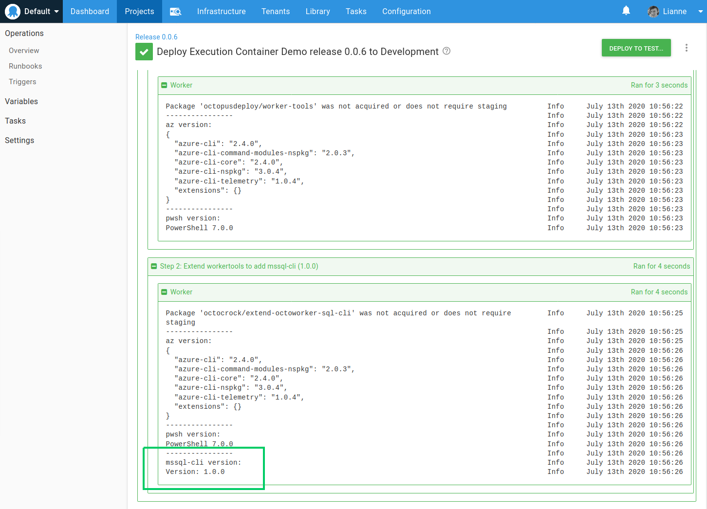
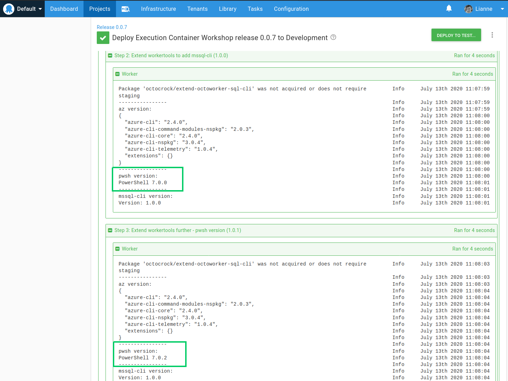
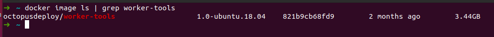
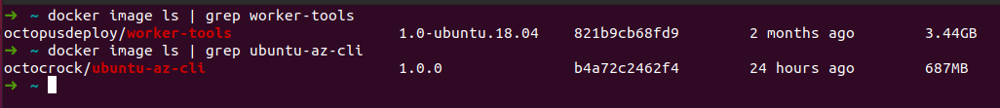

We recently released [Execution Containers for Workers](https://octopus.com/blog/execution-containers), and we think there are a good number of reasons to use this new functionality. If you’re not familiar with execution containers, Michael does a great job of introducing the concept in the post linked above, and you could also take a look at the [execution container documentation](https://g.octopushq.com/ExecutionContainersForWorkers).

In this post, I’m going to take a look at how you can extend the Octopus worker-tool image, and when you might want to use a different image entirely. 

Octopus provides a [Docker image](https://hub.docker.com/r/octopusdeploy/worker-tools) that can be used as the [execution container](https://g.octopushq.com/ExecutionContainersForWorkers) for a step to use in a deployment process or runbook.   The image has most of the tools that you’ll require for deployments already included.  However, what if you need a tool that’s not included in the image, or perhaps you require a different version of one of the tools that is included.  

## From `octopusdeploy/worker-tool`

Let’s take a look at an example where we need something in addition to the Octopus supplied Docker image.  Imagine I have a project step that needs to interact with a SQL Server database, there are no SQL tools included in the `worker-tool` image.  I’d like to use the [mssql-cli](https://github.com/dbcli/mssql-cli/).  This is one of the great things about Docker; we can take the `octopusdeploy/worker-tools` image and extend it to include the additional tools.

Here’s our Dockerfile:

```dockerfile
FROM octopusdeploy/worker-tools:1.0-ubuntu.18.04

ARG DEBIAN_FRONTEND=noninteractive

RUN  echo "deb [arch=amd64] https://packages.microsoft.com/debian/8/prod jessie main" | tee /etc/apt/sources.list.d/mssql-cli.list  && \
  apt-get -y update  && \
  apt-get -y install mssql-cli  && \
  # Install missing dependencies
  apt-get -y install -f

```

This file is based on the image `octopusdeploy/worker-tools` with tag `1.0-ubuntu.18.04`, and after the package manager is updated: `apt-get -y update` it installs the `mssql-cli` with `apt-get -y install mssql-cli`

Using it in a basic Octopus step that writes out the version, we can see `mssql-cli` is there and available:



By extending the `octopusdeploy/worker-tools` image and adding just a few lines, we can use all the tools available in the base image _and_ have the extra tooling we want.

### Select a specific version of PowerShell

The software versions specified in a Dockerfile are fixed at build time; when you use the Docker image, you can’t change them.  Let’s say that you need a later version of PowerShell because of a bug fix critical to your deployment process.  There are a couple of ways you can achieve this.

The first is to add the version update into our extended Dockerfile:

```dockerfile
FROM octopusdeploy/worker-tools:1.0-ubuntu.18.04

ARG DEBIAN_FRONTEND=noninteractive
ARG Powershell_Version=7.0.2\*    # UPDATED Powershell Version

RUN  echo "deb [arch=amd64] https://packages.microsoft.com/debian/8/prod jessie main" | tee /etc/apt/sources.list.d/mssql-cli.list  && \
  apt-get -y update  && \
  apt-get -y install mssql-cli  && \
  # Install specific version of Powershell
  apt-get install -y powershell=${Powershell_Version} && \
  # Install missing dependencies
  apt-get -y install -f

```

I’ve added this to my [octocrock/extend-octoworker-sql-cli](https://hub.docker.com/repository/docker/octocrock/extend-octoworker-sql-cli/general) Dockerfile and tagged the compiled image with a new version, 1.0.1, before pushing to Dockerhub.  There are now two tagged versions of the image:

- `1.0.0`: This was the first version of the image to extend the `octopusdeploy/worker-tools` image by adding `mssql-cli`.
- `1.0.1`: This version extended the image further to set a different version of PowerShell.

By using the image tagged with 1.0.1, we can see the different versions of PowerShell:



An alternative way to specify different versions is to take the [Dockerfile](https://github.com/OctopusDeploy/WorkerTools/blob/master/ubuntu.18.04/Dockerfile) from the [Octopus Worker Tools Github repository](https://github.com/OctopusDeploy/WorkerTools) and use it to create your own Dockerfile, setting the version number `ARG` values to those which suit your deployment process best:

```dockerfile
FROM ubuntu:18.04

ARG Powershell_Version=7.0.2\*      # UPDATED Powershell Version
ARG Octopus_Cli_Version=7.3.2
ARG Octopus_Client_Version=8.4.0
ARG Azure_Cli_Version=2.4.0\*
ARG Azure_Powershell_Version=2.2.0
ARG Helm_Version=v3.0.2
ARG Node_Version=12.16.3\*
ARG Kubectl_Version=1.11.1-00
ARG Terraform_Version=0.12.24
ARG Eks_Cli_Version=0.18.0
ARG Ecs_Cli_Version=1.18.1
ARG Aws_Iam_Authenticator_Version=1.16.8
ARG Umoci_Version=0.4.5
...
```

This way, you’re only getting PowerShell installed once, and you’re not adding bloat to the image, this is especially true should you want to specify different versions of other tools.

## Size considerations

The Octopus image covers many deployment scenarios, and it’s a solid choice as a starter image for your execution container.  Let’s take a look at the size of it:



It’s big, 3.44 GB.  And that’s the Linux flavor; the Windows image is larger, but in comparison to some images, it isn’t that big, and when you consider that you’re unlikely to use all the tools on that image, there’s a clear space saving to be made.

At the time of writing, the following is on the `octopusdeploy/worker-tools` image:

- PowerShell for 18.04
- Octopus CLI
- Octopus Client
- AZ PowerShell core modules
- Helm3
- .NET SDK 3.1
- JDK
- Common Java tools
- Azure CLI
- NodeJS
- Kubectl
- Terraform
- Google Cloud CLI
- python & groff
- AWS CLI
- EKS CLI
- ECS CLI
- AWS IAM Authenticator
- Istio CLI
- Linkerd CLI
- Tools for working with Docker images without the Docker daemon
- Common utilities for scripting

This is fantastic!  

You can use all of these tools without having to know how Dockerfiles are constructed, there’s no need to set up your own Docker repository, and there’s no need to install all of these dependencies on a Worker VM, you can just get started using execution containers.

However, I’m yet to see a single Octopus deployment step that interacts with infrastructure in AWS, GCP, and Azure, deploying .Net, Java, and NodeJS software.  I’m being facetious here, but I’m you can see my point, it’s unlikely that you’ll need everything on this image simultaneously. 

### Why is Docker image size a consideration?

After the Worker machine has downloaded the container image from the repository, it can re-use it every time an Octopus deployment process step requires it; it will not re-download it.  When there is a new version of the image, only the new [layers](https://docs.docker.com/storage/storagedriver/#images-and-layers) of it are downloaded, rather than the entire image.

The situation where the container image size really becomes noticeable is when you start to use multiple Workers and especially dynamic Workers.  If a Worker machine is acquired for a deployment step and that machine does not yet have the Docker image pulled from the repository, the step will take longer to execute the larger the image is.

::: hint

At the time of writing, Octopus Cloud dynamic Workers do not have Docker installed.  We are working on adding Docker to the dynamic machine images right now, so it will be available soon!

:::

### Stripping it back

Let’s take things in the other direction.  What if I have a deployment step that runs an Azure CLI bash script? 

The tools required on a Linux container here are minimal, essentially just the Ubuntu base and the Azure CLI.  I also need `wget`, `apt-utils`, and `software-properties-common`, the base utilities required to install the [Azure CLI](https://docs.microsoft.com/en-us/cli/azure/install-azure-cli-apt?view=azure-cli-latest).  With this in mind, I can take the Dockerfile down to very few lines:

```Dockerfile
FROM ubuntu:18.04

ARG DEBIAN_FRONTEND=noninteractive
ARG Azure_Cli_Version=2.4.0\*

# Install wget, apt-utils, and software-properties-common
RUN apt-get update && \ 
    apt-get install -y wget apt-utils && \
    apt-get install -y software-properties-common 

# Install the Azure CLI
RUN wget --quiet -O - https://packages.microsoft.com/keys/microsoft.asc | gpg --dearmor | tee /etc/apt/trusted.gpg.d/microsoft.asc.gpg > /dev/null && \
    echo "deb [arch=amd64] https://packages.microsoft.com/repos/azure-cli/ bionic main" | tee /etc/apt/sources.list.d/azure-cli.list && \
    apt-get update && \
    apt-get install -y azure-cli=${Azure_Cli_Version}

# Tidy up        
RUN apt-get clean
```

The size reduction is significant, the newly created `octocrock/minimumcli-az` image is 80% smaller than the worker-tools image at just 687 MB. :



Using this container we can execute an Azure script step and see the same result from `az version` as against the step that using the `octopusdeploy/worker-tools` image:


## Conclusion

This was my first time taking a look at the execution container functionality within Octopus, and I’ve got to say, I can see its benefits.  More than anything, it takes away the configuration of server software and means you can have a version-controlled way of specifying deployment software dependencies.  Sure, you could use a script to install the required software with a package manager of your choice, but by using containers you remove the risk of software installation conflicts, can use multiple versions of tools, and keep a _clean_ Worker with the [minimal installation requirements](https://help.octopus.com/t/what-do-i-need-to-be-installed-for-my-octopus-deployment-process-to-use-execution-containers/25388).  This has the potential to reduce the number of Worker machines you require and in turn costs.  

The `octopusdeploy/worker-tools` image means you can get started straight away, with most tools required for deployments available within it.  In addition to this, if you roll your own images, you can add further flexibility to your deployment process and have the potential to reduce deployment times. 

The Dockerfiles used in this article can be found in one of our sample repositories [here](https://github.com/OctopusSamples/ExecutionContainerImages).

Happy Deployments!
