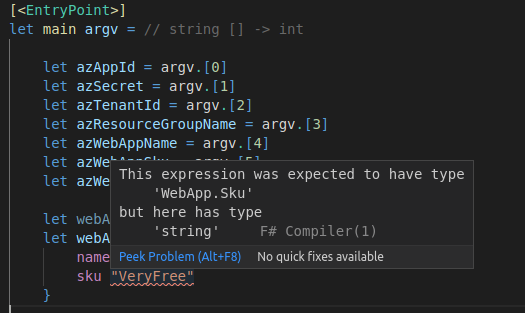
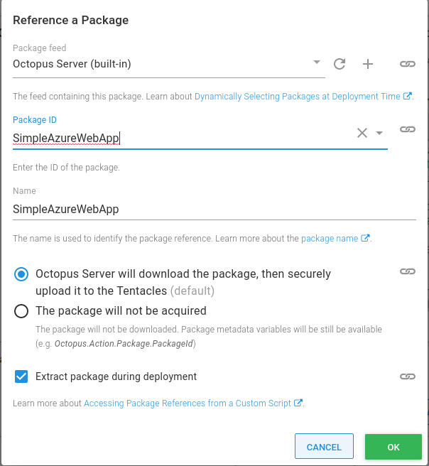
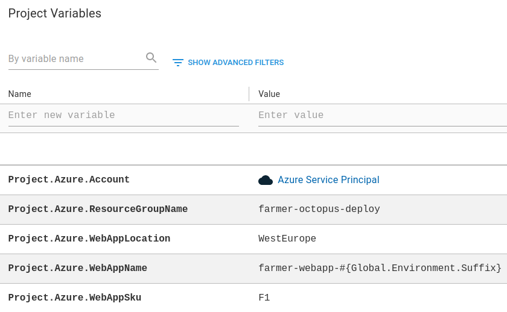
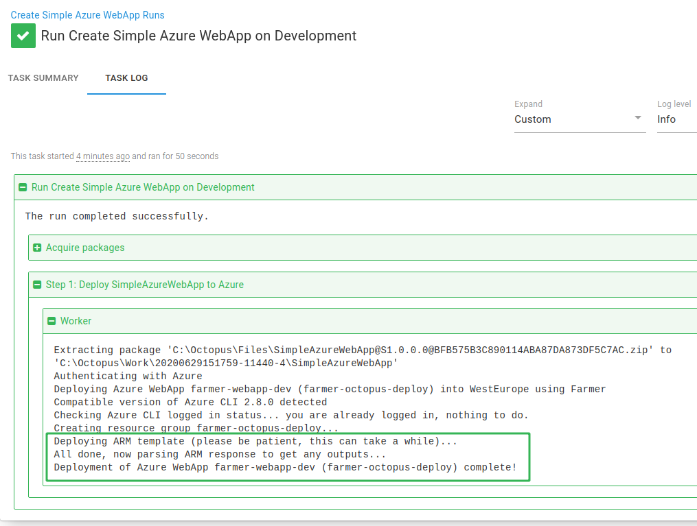
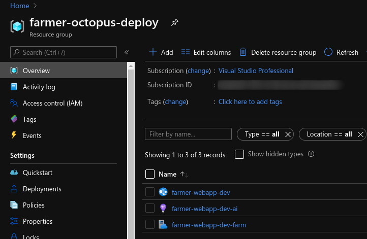

Having worked with Azure for around a year, it’s clear to see why [ARM templates](https://docs.microsoft.com/en-us/azure/azure-resource-manager/templates/overview) are popular. They provide a declarative model to generate entire environments at the touch of a button. 

However, if like me, you’ve ever tried to author an ARM template file, you might have come across one of my biggest gripes with them; they rely on strings and are prone to human error. There’s no compiler to help me out when I have a typo in a template (and there have been plenty of those!).

I’ve used C# as my primary development language since 2012, however, since then, its functional counterpart, F# has become increasingly popular. As I found out recently, it has some useful features that can help out with my ARM template dilemma. One area in particular where F# excels is its built-in [type-safety](https://fsharpforfunandprofit.com/posts/correctness-type-checking/).

In this post, I’ll demonstrate the type-safety in F# in action by using [Farmer](https://compositionalit.github.io/farmer/) to generate a simple Azure WebApp ARM template, and then I’ll walk through how you can use its deployment capabilities through Octopus to deploy different WebApps to Azure directly.

<h2>In this post</h2>

!toc

## What is Farmer?

The authors of Farmer [says](https://compositionalit.github.io/farmer/about/):

> Farmer is an open source, free to use .NET domain-specific-language (DSL) for rapidly generating non-complex Azure Resource Manager (ARM) templates.

To use Farmer, you create a [Farmer template](https://compositionalit.github.io/farmer/quickstarts/template/). These are .NET Core applications that reference Farmer via a [NuGet package](https://www.nuget.org/packages/Farmer/), and they define your Azure resources that you wish to create.

## Why is Farmer needed?

Rather than repeating what is already there, I encourage you to read the [About section](https://compositionalit.github.io/farmer/about/) of the Farmer documentation for more details about the motivations to create a DSL for ARM templates.

For me, the highlights are:

- It provides a set of types that you can use to create Azure resources, and it eliminates the chances of creating an invalid template as they are strongly-typed.
- It can generate simple ARM templates in a very concise manner and optionally, deploy them.

## Create the Farmer template

To create a Farmer template, we first need to create a .NET Core application. You can do this in your IDE of choice, or if you prefer the command-line, you can use the `dotnet new` command, passing the template of the type of application you require. 

It’s typical to use a console application for a Farmer template, and you can create one with the `dotnet new console` command: 

```bash
dotnet new console -lang "F#" -f "netcoreapp3.1" -n "SimpleAzureWebApp"
```

This creates a new F# .NET Core 3.1 application with the name **SimpleAzureWebApp**, using the `-n` parameter we supplied.

Next, we need to add Farmer to the project by running the `add package` command:

```bash
dotnet add package Farmer
```

Now we have our dependencies, we can go ahead and edit the `Program.fs` file which was auto-generated for us when we created the new console application.

**TL;DR**

If you want to see the complete program, skip straight to the [end](#complete-farmer-template) or view the [source code](https://github.com/OctopusSamples/farmertemplates/blob/main/src/SimpleAzureWebApp/Program.fs). If you’d like more details, read on!

### Template parameters

To make the Farmer template flexible, we’ll add some parameters to the application. This will allow us to supply different values and Farmer will create our resources in Azure based on those values.

The first three we need are related to authenticating with Azure. These values can be obtained by creating an [Azure Service Principal](https://docs.microsoft.com/en-us/azure/active-directory/develop/app-objects-and-service-principals).

- **AppID**: The application identifier used for the Service Principal.
- **Secret**: The password used for the Service Principal.
- **TenantID**: The ClientID used for the Service Principal.

:::warning
**Securing credentials:**
Store the credentials you use to log in to Azure in a secure location, such as a Password Manager, or your Octopus Deploy instance using, preferably, an [Azure account](https://octopus.com/docs/infrastructure/deployment-targets/azure#azure-service-principal) or [sensitive variables](https://octopus.com/docs/projects/variables/sensitive-variables). You should also avoid committing them into source control.
:::

To run the application, we’ll also supply:

- **Resource Group Name**: Which resource group to add the Azure WebApp to.
- **WebApp Name**: The name to give to the Azure WebApp.
- **WebApp SKU**: What type of [App Service plan](https://azure.microsoft.com/en-us/pricing/details/app-service/) to use for the WebApp.
- **WebApp Location**: The data center location where you’d like to host the Azure WebApp.

To add our required parameters, the code looks like this:

```fs
let azAppId = argv.[0]
let azSecret = argv.[1]
let azTenantId = argv.[2]
let azResourceGroupName = argv.[3]
let azWebAppName = argv.[4]
let azWebAppSku = argv.[5]
let azWebAppLocation = argv.[6]
```
This assigns the parameters from the argument collection supplied to the program when it runs, based on their position from the command-line.

:::hint
**Parameter validation:**
I don’t show parameter validation in this example, but you may want to consider adding it to your Farmer template to ensure they have acceptable values.
:::

### Define Azure Resources

After we have our parameter values, we can define our Azure WebApp in F#:

```fs
let webAppSku = WebApp.Sku.FromString(azWebAppSku)
let webApp = webApp {
    name azWebAppName
    sku webAppSku
}
```

Here we assign the WebApp SKU to a variable named `webAppSku`. This is done by a helper function to return a strongly typed `Sku`. Then we create our `webApp` variable using the Farmer [Web App builder](https://compositionalit.github.io/farmer/api-overview/resources/web-app/).

Next, we create our ARM deployment using the Farmer [ARM deployment builder](https://compositionalit.github.io/farmer/api-overview/resources/arm/), which in this example, consists of the location to deploy to, and the Azure WebApp as previously defined:

```fs
let deployLocation = Location.FromString(azWebAppLocation)
let deployment = arm {
    location deployLocation
    add_resource webApp
}
```

#### Built-in type safety 

In both of the previous code examples, the power of the F# type-system comes into its own. It’s not possible to create a value that is invalid according to its type.

Let’s see an example. Suppose I wanted to create our Azure WebApp with a `Sku` which had a value of `VeryFree`. If I try to create that in our application, the compiler will give me a warning, and it won’t build:



This is because the compiler knows the string value `VeryFree` is the wrong type, and instead should be a `Sku` type.

This is where Farmer really excels over crafting your own ARM template by hand. Its use of F# provides you with type safety to ensure you have valid templates from the outset.

:::hint
**Farmer and ARM:**
There is a more detailed comparison between Farmer and ARM templates [here](https://compositionalit.github.io/farmer/arm-vs-farmer/).
:::

### Generate ARM template

When you have your Azure resources modeled, Farmer supports different ways to [generate the ARM template](https://compositionalit.github.io/farmer/api-overview/template-generation/). One way is to write it out to a file directly:

```fs
deployment |> Writer.quickWrite "output"
```
You can then take this file and deploy to Azure using your preferred method.

### Deployment to Azure

In addition to generating the ARM template, you can also, optionally, have Farmer execute the deployment to Azure when the application runs.

:::warning
**Azure CLI required**

If you use the Integrated deployment to Azure feature, you will need the Azure CLI installed on the machine where you run your application.
:::

In our example **SimpleAzureWebApp** application, we’ll take advantage of this feature. 

Before we can execute the deployment, we need to authenticate with Azure. Farmer comes with a `Deploy.authenticate` command, and you call it by passing in the credentials you supplied to the application previously, like this:

```fs
Deploy.authenticate azAppId azSecret azTenantId
|> ignore
```
When the authenticate call finishes, it returns a list of the Azure subscriptions associated with the Service Principal. In this example, these results are piped to the `ignore` function.

If there are any errors authenticating with Azure, an error will be raised. If the login succeeds, we then need to get Farmer to execute our deployment, using the `Deploy.execute` command:

```fs
deployment
|> Deploy.execute azResourceGroupName Deploy.NoParameters
|> ignore
```

You can query the results of the ARM deployment, but as with the authenticate call, we ignore them. Similarly, any errors on deployment will be surfaced as an exception. 

### Complete Farmer template

And that’s all there is to our application. Here is the finished `Program.fs` file:

```fsharp
open Farmer
open Farmer.Builders
open SimpleAzureWebApp.SkuExtension

[<EntryPoint>]
let main argv =
    
    let azAppId = argv.[0]
    let azSecret = argv.[1]
    let azTenantId = argv.[2]
    let azResourceGroupName = argv.[3]
    let azWebAppName = argv.[4]
    let azWebAppSku = argv.[5]
    let azWebAppLocation = argv.[6]

    let webAppSku = WebApp.Sku.FromString(azWebAppSku)
    let webApp = webApp {
        name azWebAppName
        sku webAppSku
    }

    let deployLocation = Location.FromString(azWebAppLocation)
    let deployment = arm {
        location deployLocation
        add_resource webApp
    }

    printf "Authenticating with Azure\n"
    Deploy.authenticate azAppId azSecret azTenantId
    |> ignore

    printf "Deploying Azure WebApp %s (%s) into %s using Farmer\n" azWebAppName azResourceGroupName azWebAppLocation
    
    deployment
    |> Deploy.execute azResourceGroupName Deploy.NoParameters
    |> ignore

    printf "Deployment of Azure WebApp %s (%s) complete!\n" azWebAppName azResourceGroupName

    0 // return an integer exit code
```

## Package the Farmer template

Now we have the application written, the next step is to package it for use with Octopus. For sake of simplicity, I build and package the application using command-line tools, but I recommended automating this as part of a full CI/CD pipeline.

:::hint
If you are new to building .NET Core applications, we have a number of [guides](https://octopus.com/docs/guides?application=ASP.NET%20Core) that include step-by-step instructions to setup a CI/CD pipeline using various tools.
:::

To build the **SimpleAzureWebApp** application, we run a `dotnet publish` command in the application directory:

```bash
dotnet publish -o output
```

This builds and publishes the console application and places the binaries in the `output` folder, as specified by the use of the `-o` parameter.

Next, we need to package the application, and this time we use the Octopus CLI [pack](https://octopus.com/docs/octopus-rest-api/octopus-cli/pack) command:

```bash
octo pack --id SimpleAzureWebApp --format Zip --version 1.0.0.0 --basePath output 
```

This generates a file named `SimpleAzureWebApp.1.0.0.0.zip` which can either be uploaded to the Octopus [built-in repository](https://octopus.com/docs/packaging-applications/package-repositories/built-in-repository) or an external [package repository](https://octopus.com/docs/packaging-applications/package-repositories). 

You can push to the Octopus built-in repository using the Octopus CLI command, [push](https://octopus.com/docs/octopus-rest-api/octopus-cli/push):

```bash
octo push --package SimpleAzureWebApp.1.0.0.0.zip --server https://my.octopus.url --apiKey API-XXXXXXXXXXXXXXXX
```

After the package has been uploaded, we can set-up Octopus to run our application to deploy to Azure.

## Deploy the Farmer template

One of the cool things about Octopus is that you get to choose how to deploy. With the introduction of [Operations Runbooks](https://octopus.com/docs/operations-runbooks) last year, that flexibility has been extended even further to operations tasks, for example managing your infrastructure. 

### Create the runbook

To execute our Farmer template, we’ll create a runbook that deploys it to Azure. To do that:

1. Create a new project in Octopus.
1. Go to the runbook process from the {{Operations>Runbooks}} section. 
1. Click **ADD RUNBOOK**.
1. From the Overview, Click **DEFINE YOUR RUNBOOK PROCESS**.
1. Click **ADD STEP**.

On the step selection, choose the [Run a script](https://octopus.com/docs/deployment-examples/custom-scripts/run-a-script-step) step and give it a name. By using the script step, we can use the [reference package](https://octopus.com/docs/deployment-examples/custom-scripts/run-a-script-step#referencing-packages) feature to include our package as part of the script execution. 

To include our package, in the **Referenced Packages** section, click **ADD** and add the SimpleAzureWebApp package we uploaded earlier:



Keep all of the defaults and click **OK**.

#### Add the runbook script

Next, we need to add the inline script which will execute our Farmer template. We start by adding the required Azure credentials:

```ps
$appId = $OctopusParameters["Project.Azure.Account.Client"]
$secret = $OctopusParameters["Project.Azure.Account.Password"]
$tenantId = $OctopusParameters["Project.Azure.Account.TenantId"]
```

The script references a number of expanded [Azure account variable properties](https://octopus.com/docs/projects/variables/azure-account-variables#azure-account-variable-properties) such as `Client` and `TenantId` from the project variable named `Project.Azure.Account`. This is handy as we don’t need to specify separate variables for each property.

After we have the credentials, we want to specify the Azure WebApp parameters, including the Resource Group and WebApp name that will be passed to our SimpleAzureWebApp .NET Core application:

```ps
$resourceGroupName = $OctopusParameters["Project.Azure.ResourceGroupName"]
$webAppName = $OctopusParameters["Project.Azure.WebAppName"]
$webAppSku = $OctopusParameters["Project.Azure.WebAppSku"]
$webAppLocation = $OctopusParameters["Project.Azure.WebAppLocation"]
```

Lastly, we get the path of the extracted Farmer template package using a [package variable](https://octopus.com/docs/deployment-examples/custom-scripts/run-a-script-step#accessing-package-references-from-a-custom-script) called `Octopus.Action.Package[SimpleAzureWebApp].ExtractedPath` and then set the working directory to that path and call the `dotnet run` command passing in all of our parameters:

```ps
$farmerPackagePath = $OctopusParameters["Octopus.Action.Package[SimpleAzureWebApp].ExtractedPath"]
Set-Location $farmerPackagePath

dotnet SimpleAzureWebApp.dll $appId $secret $tenantId $resourceGroupName $webAppName $webAppSku $webAppLocation
```

:::warning
**.NET Core runtime pre-requisite**

In order for this script step to execute, it requires the .NET Core runtime to be installed on the deployment target or worker where the step is configured to execute.
:::

#### Add the variables

We also need to add the variables referenced in the script above:



The `Project.Azure.Account` variable is an [Azure account variable](https://octopus.com/docs/projects/variables/azure-account-variables), and the rest are text variables.

### Run the runbook

If you’ve got this far, the last part is to bring it all together and run our runbook in Octopus and deploy the Farmer template to Azure.

You can see an example runbook run to development creating the Azure WebApp called `farmer-webapp-dev`:



After the runbook has run to completion, you can check your WebApp has been created using the [Azure portal](https://portal.azure.com). Here is the corresponding WebApp that was created in Azure as a result of the runbook run to development:



## Conclusion

The great thing about this technique of using Farmer to generate and deploy your resources to Azure is that you can version control your templates. The code that defines your infrastructure can live alongside the code that runs on it. Plus, no more hassle manually editing JSON files, and who doesn’t want that! 

Until next time, Happy Deployments!

## Learn more
- [Octopus Azure deployment examples](https://octopus.com/docs/deployment-examples/azure-deployments)
- [Octopus CI/CD guides](https://octopus.com/docs/guides)
