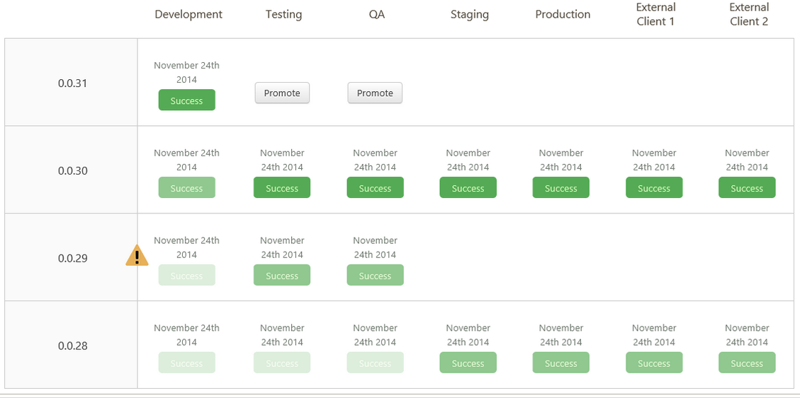

One of the biggest challenges software development teams face in 2020 is the need to deliver code to production faster. To do this seamlessly, we need a completely automated deployment process, and it must be repeatable through multiple environments. Also, to confidently deploy to production without service interruption, we must have successful tests pass in each layer of the testing pyramid.

Defining this process can be challenging, and visualizing it can be even more difficult; thankfully, Octopus Deploy makes both easy for us! In this post, I define a _pre-approved_ production-ready [deployment pipeline](https://octopus.com/devops/continuous-delivery/what-is-a-deployment-pipeline/) as well as discuss the details of each step involved.

## The automated testing pyramid

Before digging into our scenario, let’s start by defining our test pyramid. A complete test pyramid has four blocks. The lower blocks have a higher quantity of tests, and the higher blocks have a higher quality of tests. A complete test pyramid provides a high degree of confidence in our deployment success rate:


Source: https://blog.octo.com/wp-content/uploads/2018/10/integration-tests-1024x634.png

As you can see from the diagram, the four layers of tests are:

- **Unit tests**: These need to be successful during the Continuous Integration stages of our pipeline.
- **Component tests**: These need to be successful during the Continuous Integration stages of our pipeline.
- **Integration tests**: These need to be successful during the Continuous Delivery stages of our pipeline.
- **End-to-end tests**: These need to be successful during the Continuous Delivery stages of our pipeline.

## Scenario

We have a `/hello/world` microservice running in production that currently returns a JSON field `message` with the value `hello world!` We want to add another response field called `status` with the value `200` when it returns successfully:

```JSON
{
    "message":"Hello World!",
    "status":200
}
```

## Environments


Organizational policy dictates that any code promoted to production must be deployed in the following environments:

- Development
- Test
- QA
- Pre-production
- Production

Each of these environments are _static integration_ environments, meaning that all components of our application live in each of these environments. We want to ensure we do not have configuration drift. In a later blog post, I’ll discuss how to make _static integration_ environments and _ephemeral dynamic environments_ co-exist within our CI/CD pipeline. For now, we’ll keep it simple.

## Continuous Integration stages

Our goal with any code promotion is to build once, deploy everywhere. Building the deployable object is obviously the first step before we can even begin to think about deploying it. At build time, we have several stages that must occur:

1. Pre-build: Code linting/formatting
2. Pre-build: Unit tests
3. Pre-build: Component tests
4. Pre-build: Static code analysis
5. Pre-build: Third-party library security analysis
6. Build: Binary builds and packaging
7. Post-build: Push binary to an artifact repository

These are the smallest definable units or stages that must happen during our pre-approved deployment pipeline. Each stage must pass successfully based upon pre-defined rules configured by our tooling administrators, information security, and software architects. After the Continuous Integration stages pass successfully, we are ready for the Continuous Delivery stages.

## Continuous Delivery


First, let’s define the [difference between Continuous Delivery and Continuous Deployment](https://octopus.com/devops/continuous-delivery/what-is-continuous-deployment/). From [Digestible DevOps: The 7 DevOps Practices](https://levelup.gitconnected.com/digestible-devops-the-7-devops-practices-8bd8b34e1418):

> Delivery: “The practice of making every change to source code ready for a production release as soon as automated testing validates it. This includes automatically building, testing and deploying.”

> Deployment: “Continuous Deployment is the practice that strives to automate production deployment end to end.”

For Continuous Delivery, we want to get our deployable binary to our lowest integration environment to ensure the binary:

1. Executes as desired.
2. Run our minimal required phase three and four automated tests, and they pass successfully.
3. Stage for code promotion (or auto-promote).

Often the Continuous Delivery aspect of our pipeline executes as a secondary phase of the Continuous Integration pipeline. This is the aspect most often confused and difficult to troubleshoot for developers because this is where traditionally _operations_ folks step into the picture. Unlike the Continuous Integration piece of the pipeline, we introduce many new points of failure here, including:

- Network connectivity.
- Namespace collision.
- Event driven/event triggered steps not completing.
- Mixing deployment issues with automated testing issues.
- Integrating multiple tools and troubleshooting those integrations.

One of the great things about Octopus Deploy is that it has a built-in artifact repository, so we don’t have to introduce another potential point of failure by storing our artifacts in a third-party location or tool. This means we can be confident that new artifact events do, in fact, trigger our Continuous Delivery steps in our pipeline. We should clearly define the difference between our Continuous Delivery automation and our integration/end-to-end testing stages to make it clear where in our pipeline something might have failed. Those steps can be defined as:

- CD binary deploy.
- CD binary validate.
- CD at integration testing.
- CD at end-to-end testing.

It’s important to have the CD binary validate stage to ensure we not only get the binary where it needs to go, but that it actually executed as intended. In that case, if we had a bad binary (due to corruption or bad code logic, etc.), we could save a lot of time in our pipeline by failing early and getting that feedback back to the developer quickly.

## Which tests when?

One of the conflicting aspects of code promotion is trying to ensure code is deployed in every environment the same way while only running the necessary tests to ensure a new deployment works as intended. An example of this is running a _load test_ in our QA environment but not in other environments. Running a load test in every environment would be time consuming and extend the time to deploy (which is the opposite of the goal we are trying to achieve). In addition, we probably wouldn’t run load tests in production as we don’t want to take unnecessary risks with our service reliability for live services. 

This begs the question, which tests need to run, when do they need to run, how to differentiate the tests that run, and in which environments should they run?

Those are excellent questions and can be broken down by framing them into one of two categories:

- Pre-approved CI/CD pipeline.
- Extensive CI/CD pipeline.

## What changes can be run through the pre-approved pipeline?

Not every code change needs to go through hours of regression testing and load testing. In fact, most code changes shouldn’t need to if you follow lean/agile development methodologies. If a change is simple and it isn’t pulling new data from a database or doing any advanced calculations, the change can probably be deployed to production without the full suite of testing as the risk is low and confidence is high.

All pipeline events should be triggered from source control. To ensure changes will run through the pre-approved CI/CD pipeline, I will create a new Git branch with a naming convention similar to the following:

`feature-pa-eado-4287-add_status_response`

- `feature`: This means the new branch is adding new functionality to the codebase.
- `pa`: This is a pre-approved change and will run through the fast-tracked pipeline.
- `eado`: This is my JIRA project.
- `<number>`: This is for a JIRA ticket from my project.
- `add_status_response`: This is a quick description of the change.

By default, all changes will run through the complete CI/CD pipeline. This ensures developers put enough thought into their change to determine if it can be _fast-tracked_ for deployment into production.

In a later blog post, we will discuss how non-pre-approved changes will run through our complete CI/CD pipeline.

## The complete pre-approved CI/CD pipeline



1. Pre-deployment steps (GitHub/Jira):
    1. A developer is assigned JIRA ticket EADO-4287. Based upon the requirements, determines it is a small change and creates a feature branch `feature-pa-eado-4287-add_status_response`.
    2. Writes unit tests that satisfies the acceptance criteria.
    3. Writes code that satisfies the unit test.
    4. Validates tests pass successfully locally, `git push` to source control.
2. Continuous Integration (Jenkins):
    1. Pre-build: Code linting/formatting.
    2. Pre-build: Unit tests.
    3. Pre-build: Component tests.
    4. Pre-build: Static code analysis.
    5. Pre-build: Third-party library security analysis.
    6. Pre-build: Pull request opened, paused for approval.
    7. Pre-build: Pull request approved, merge, tag master branch (`rc-<version>`,`pa`).
    8. Build: Binary builds and is packaged.
    9. Post-Build: Push binary to the artifact repository (Octopus Deploy).
3. Development environment (Octopus Deploy):
    1. CD binary deploy: Copies and unzips package to the web server.
    2. CD binary validate: Validates the web server returns 200 response.
    3. CD at integration testing: Validates 200 response from load balanced URI.
    4. CD at end-to-end testing: Validates frontend making API call returns successful response.
    5. CD post git tag: `dev_success`.
4. Test environment:
    1. Git tag `dev_success` triggers CD binary deploy: Copies and unzips package to the web server.
    2. CD binary validate: Validates the web server returns 200 response.
    3. CD at integration testing: Validates 200 response from load balanced URI.
    4. CD at end-to-end testing: Validates frontend making API call returns successful response.
    5. CD post git tag: `test_success`.
5. QA environment:
    1. Git tag `test_success` triggers CD binary deploy. Copies and unzips package to the web server.
    2. CD binary validate: Validates the web server returns 200 response.
    3. CD at integration testing: Validates 200 response from load balanced URI.
    4. CD at end-to-end testing: Validates frontend making API call returns successful response.
    5. CD post git tag: `qa_success`.
6. Pre-production environment:
    1. Git tag `qa_success` triggers CD binary deploy: Copies and unzips package to the web server.
    2. CD binary validate: Validates the web server returns 200 response.
    3. CD at integration testing: Validates 200 response from load balanced URI.
    4. CD at end-to-end testing: Validates frontend making API call returns successful response.
    5. CD post git tag: `preprod_success`.
7. Production environment:
    1. Git tag `preprod_success` triggers CD binary deploy: Copies and unzips package to the web server.
    2. CD binary validate: Validates the web server returns 200 response.
    3. CD at integration testing: Validates 200 response from load balanced URI.
    4. CD at end-to-end testing: Validates frontend making API call returns successful response.
    5. CD post git tag: `v<version>`.
    6. CD post git remove tags:
        1. `rc-<version>`
        2. `dev_success`
        3. `test_success`
        4. `qa_success`
        5. `preprod_success`

## Conclusion

Deploying code to production quickly is the greatest challenge facing development teams. Code promotion and deployment is all about having confidence. In order to have that confidence, our CI/CD pipeline must contain the four layers of the testing pyramid. Determining when each layer of the testing pyramid is executed in which deployment environment becomes the next challenge, but defining a pre-approved deployment pipeline for small, low-risk changes helps balance speed with quality, and using Git branches and tags to trigger your pre-approved pipeline helps give deployment responsibility to those who know the code best, the developers.

Explore the [DevOps engineer's handbook](https://octopus.com/devops/) to learn more about DevOps, CI/CD, and the role of software testing in Continuous Delivery.
