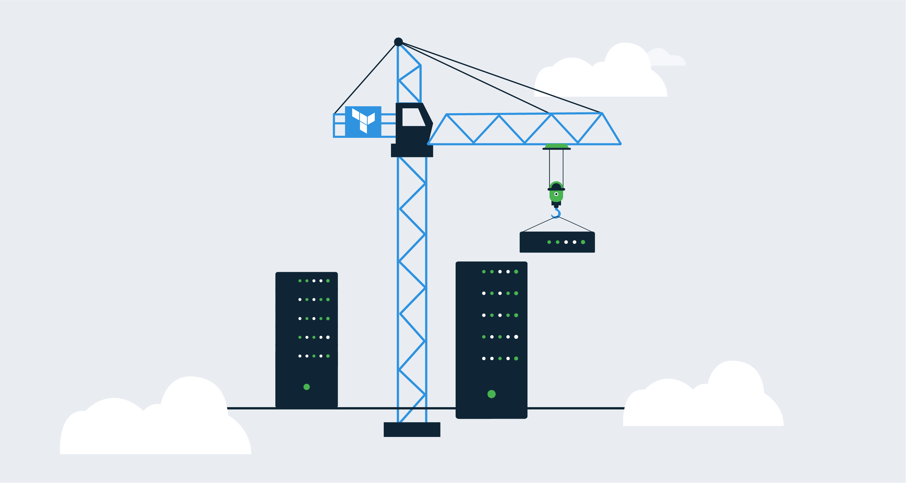
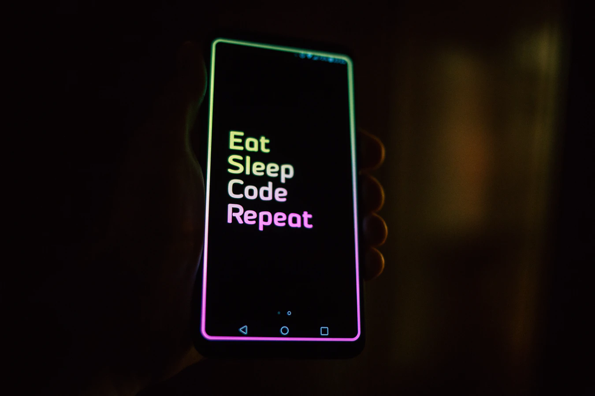
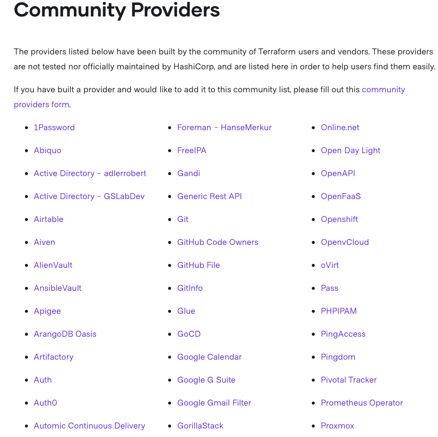
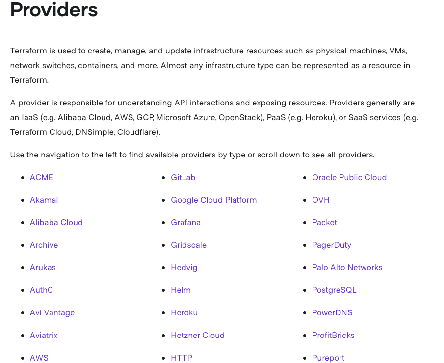

When you think of infrastructure as code or software-defined infrastructure, the first thing that typically comes to mind is *DevOps* or *The Infrastructure Team*, but that’s not the case with Terraform. Terraform is written in Hashicorp Configuration Language ([HCL](https://github.com/hashicorp/hcl)), which is a fully functional and immutable based programming language.

Loops, if statements, variables, and much of the logic you would find in any programming language exists in Terraform. Terraform is a *one size fits all* that’s great for infrastructure, development teams, and DevOps professionals alike. In this blog post, you’re going to learn the top five reasons why infrastructure as code is useful for developers.

## Prerequisites

To follow along with this blog post, you should have the following:

- An understanding of development topics.
- Have written code in at least one programming language.

## Infrastructure for developers

Not too long ago, maybe 10-15 years, there were a few issues between development and operations. Developers would write code, but they didn’t have any infrastructure to test it on. There were even cases where they would have to wait *months* to test their code, not knowing if it actually worked or not (and in some cases, it didn’t). There were a few reasons for this:

1. Infrastructure wasn’t available.
2. Developers didn’t know how to deploy infrastructure.
3. There were no automated solutions that developers could interact with to deploy the infrastructure.

Let’s go over each bullet point to see where the issues started and how they were figured out.

1. Infrastructure wasn’t available.

This was a bit difficult. The infrastructure simply wasn’t available. Virtualization, as we know it today, was just taking off, and cloud technologies were in their infancy. Developers simply had to wait for operations to get the infrastructure ready, and in most cases, it wasn’t ops fault. Servers had to be delivered, racked and stacked, configured, and then finally made available. This didn’t leave much wiggle room for development to help out. Luckily, that era is far behind us, and we now have platforms like Azure, AWS, and virtualization tools like [ESXi](https://www.vmware.com/products/esxi-and-esx.html).

2. Developers didn’t know how to deploy infrastructure.

This is where the ability for developers to start diving into infrastructure started to become a reality. The virtualization and cloud technologies were there, so deploying infrastructure was much more efficient. The only issue here was that there still wasn’t a *speaking the developer’s language* solution. How could developers deploy infrastructure in a way they understand and that suited their strengths?

3. There were no automated solutions that developers could interact with to deploy the infrastructure.

This is where a tool like Terraform comes into play. Now that infrastructure as code and software-defined infrastructure exists, it is much easier for developers to deploy a testing environment that helps them test their code.



Source: [https://unsplash.com/photos/vXInUOv1n84](https://unsplash.com/photos/vXInUOv1n84)

All engineers alike, including developers, have a way to define infrastructure that makes sense to them, which is with code.

## A language that’s repeatable

Developers already have enough code to worry about. They are building solutions for applications, bug fixes, feature requests, and cleaning up technical debt. With Terraform, developers don’t have to worry about creating hundreds of infrastructure as code environments. Instead, they can use the same code to deploy multiple environments.

For example, let’s say you work with multiple clients. Maybe you have multiple Azure subscriptions or AWS accounts, depending on what cloud you are working with. If you have to deploy containers on Azure for each client, say ten per client, that’s a lot of code you have to write for each client. Instead of doing that, you can have the same repeatable code and simply change the variables, which exist in a separate file.

Let’s look at an example.

The below code creates an Azure Container Instance, which is a way to run Docker containers in Azure without using Kubernetes. Don’t get too caught up on the syntax, but instead, look at that `var.` keywords. Using variables, you can have a variable file for each client and use this same exact configuration across any Azure environment. The idea behind Terraform is to be as repeatable as possible and only hard-code the values that won’t change:

```
resource "azurerm_container_group" "example" {
  name                = "var.name"
  location            = var.location
  resource_group_name = var.resourceGroup
  ip_address_type     = "public"
  os_type             = "Linux"

  container {
    name   = "nginx-web-app"
    image  = "Nginx:latest"
    cpu    = "0.5"
    memory = "1.5"

    ports {
      port     = 443
      protocol = "TCP"
    }
  }
```

## Automation testing

When you write code, the first thing that should come to mind is how you’ll test the code. In fact, there is a development practice called Test-Driven Development ([TTD](http://agiledata.org/essays/tdd.html)) that revolves around the fact that code tests are written first, and then you define the code for the application based on the test.

At the time of writing this post, Terraform has two primary tools to write tests:

- Terratest
- kitchen-terraform

Terratest is a mock testing framework that is written in Golang. Because it’s written in Go, you need to know a bit of Go to use it.

I personally don’t write code in Go, but I got a decent working Terratest test going. There are a ton of examples online, and if you’ve written in another programming language before, the same rules apply in Go (methods, functions, libraries, variables, etc.).

Below is a Terratest example that creates a Terraform environment and deletes it afterward, like a standard mock test. The package name is called `test` and it imports two libraries, the Terratest Terraform module and the `testing` Golang library. The function then initiates and creates (applies) a Terraform environment and destroys it after. `defer` is used to run that section of code at the end:

```go
package test

import (
  "github.com/gruntwork-io/terratest/modules/terraform"
  "testing"
)

func vnet_test(t *testing.T) {

    terraformOptions := &terraform.Options{
    }

    defer terraform.Destroy(t, terraformOptions)

    terraform.InitAndApply(t, terraformOptions)

}
```

Kitchen-terraform is a framework that is written in Ruby. Originally, the kitchen testing suite was used primarily with Chef, which is another infrastructure as code language but has since extended out to other tools. Because Ruby is a fairly popular programming language and one of the programming languages that is considered easier to use, kitchen-terraform is gaining popularity.

Below is an example of using kitchen-terraform. The code is looking through `/etc/os-release` to confirm that the Linux distribution is Ubuntu:

```ruby
control "operating_system" do
  describe "the operating system" do
    subject do
      command("cat /etc/os-release").stdout
    end

    it "is Ubuntu" do
      is_expected.to match /Ubuntu/
    end
  end
end
```

## Terraform Provider Development Program

Using Terraform is one thing, but many developers want to create their own way of working with Terraform. For example, maybe in other programming languages you want to create your own module for work or for the community to use. Terraform gives you the ability to do that with the Terraform Provider Development Program. The program allows vendors to build Terraform providers, and when the provider is built, HashiCorp will personally test it, validate it, and put it up on the official Provider site.

If you don’t want to go the official route and have the provider tested by Terraform, there are also community-based Terraform providers that are open source and available to the world. It’s a great way to not only give back to the community but build your own work of art.

Below is a small list of community providers. As you can see, there are several providers ranging from DNS to password authentication to git:



Source: [https://www.terraform.io/docs/providers/type/community-index.html](https://www.terraform.io/docs/providers/type/community-index.html)

When it comes to the official providers, you will see providers for platforms like Azure, AWS, VMWare, and many others:



Source: [https://www.terraform.io/docs/providers/index.html](https://www.terraform.io/docs/providers/index.html)

## Dev and Ops speaking the same language

Now that you’ve learned some of the key technical aspects of Terraform, let’s talk about the cultural aspect. Culture in any organization is the key to success. It doesn’t matter how good the code is, how popular the application is, or how awesome the snacks are at the office. If the culture doesn’t work, the entire thing crumbles. For an application to get out to the world, it needs a place to be hosted. For operations to host an application, they need an application to host. Essentially, developers and operations need to work together.

Writing infrastructure as code and software-defined infrastructure gives developers and operations a way to speak the same language. Infrastructure is infrastructure and code is code. Whatever it’s creating or hosting is one thing, but the truth remains the same that infrastructure and code exist. To do both properly, a solution like Terraform is the path forward.

Another great thing from a cultural perspective is everyone on the operations and development teams get to learn something new. If the operations team aren’t big coders, they get to learn coding, and that’s another tool on their belt. Not only learn, but they get to work with development and ask them questions. That brings the bond closer together. The same rules apply for developers writing infrastructure as code. If they’re trying to deploy a virtual machine with code and they don’t know certain aspects of the network, they get to sit and work with the operations team.

## Conclusion

In this post, I covered:

- Why Terraform is important for developers from a technical perspective and cultural perspective.
- Infrastructure for developers and why it can be used for different stages, including deployment.
- HCL is repeatable, and how to use the same configuration for any environment.
- Testing with Terraform by implementing unit tests and mock tests.
- The different Terraform providers that can not only be used but are created by the community, for the community.

For a challenge, try it out! Write some Terraform code to create a container in a cloud platform of your choice. Then deploy the application to the container using Octopus Deploy or one of your favorite CICD platforms.

## Resources

[Terratest Example](https://github.com/AdminTurnedDevOps/CBTNuggets-Code/blob/master/DevOps-Path/Infrastructure-as-Code-in-Azure/Testing-Terraform-Code-with-TerraTest/vnet_test.go)

[Kitchen-terraform example](https://github.com/newcontext-oss/kitchen-terraform)
