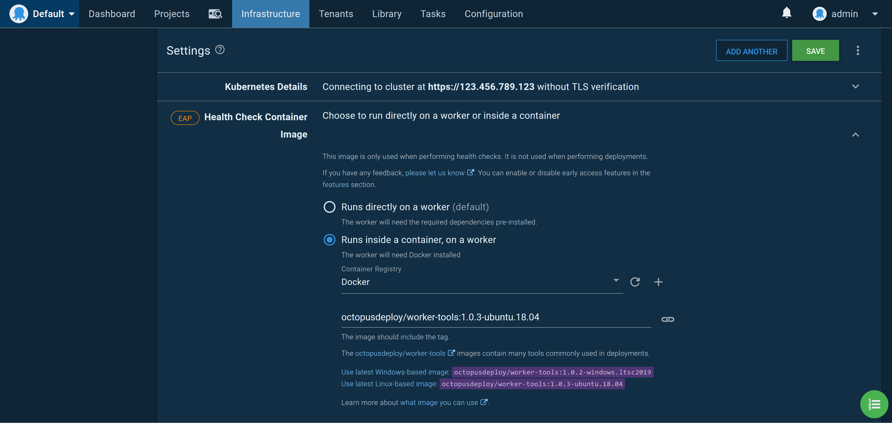

While Octopus started life as a Windows application, it became clear that migrating to Linux was a cornerstone of our plans to provides a scalable and cost effective hosted solution. After recently completing a migration from the V1 of our hosted platform, all our hosted instances are running Octopus in Linux containers inside Kubernetes, with great results.

Today I would like to announce early access the Octopus Server Linux Docker image. Based on the same code that powers our hosted solution, these images allow Linux users to host Octopus natively on their operating system of choice.

## Getting started

The easiest way to get started is with the following Docker Compose template, which configures Microsoft SQL server and Octopus with a single command.

Here is the `docker-compose.yml` file:

```yaml
version: '3'
services:
   db:
    image: ${SQL_IMAGE}
    environment:
      SA_PASSWORD: ${SA_PASSWORD}
      ACCEPT_EULA: ${ACCEPT_EULA}
    ports:
      - 1401:1433
    healthcheck:
      test: [ "CMD", "/opt/mssql-tools/bin/sqlcmd", "-U", "sa", "-P", "${SA_PASSWORD}", "-Q", "select 1"]
      interval: 10s
      retries: 10
   octopus-server:
    image: octopusdeploy/octopusdeploy:${OCTOPUS_SERVER_TAG}
    privileged: true
    environment:
      ACCEPT_EULA: ${ACCEPT_OCTOPUS_EULA}
      OCTOPUS_SERVER_NODE_NAME: ${OCTOPUS_SERVER_NODE_NAME}
      DB_CONNECTION_STRING: ${DB_CONNECTION_STRING}
      ADMIN_USERNAME: ${ADMIN_USERNAME}
      ADMIN_PASSWORD: ${ADMIN_PASSWORD}
      ADMIN_EMAIL: ${ADMIN_EMAIL}
      OCTOPUS_SERVER_BASE64_LICENSE: ${OCTOPUS_SERVER_BASE64_LICENSE}
      MASTER_KEY: ${MASTER_KEY}
      ADMIN_API_KEY: ${ADMIN_API_KEY}
    ports:
      - 8080:8080
    depends_on:
      - db
```

Here is the `.env` file, which defines the environment variables used by Docker Compose:

:::hint
Be sure to change the `ACCEPT_EULA` and `ACCEPT_OCTOPUS_EULA` values!
:::

```
# It is highly recommended this value is changed as it's the password used for the database user.
SA_PASSWORD=N0tS3cr3t!

# Tag for the Octopus Server image. See https://hub.docker.com/repository/docker/octopusdeploy/octopusdeploy for the tags.
OCTOPUS_SERVER_TAG=2020.3.0

# Sql Server image. Set this variable to the version you wish to use. Default is to use the latest.
SQL_IMAGE=mcr.microsoft.com/mssql/server

# The default created user username for login to the Octopus Server
ADMIN_USERNAME=admin

# It is highly recommended this value is changed as it's the default user password for login to the Octopus Server
ADMIN_PASSWORD=Passw0rd123

# Email associated with the default created user. If empty will default to octopus@example.local
ADMIN_EMAIL=

# Accept the Microsoft Sql Server Eula found here: https://hub.docker.com/r/microsoft/mssql-server-windows-express/
ACCEPT_EULA=N

# Use of this Image means you must accept the Octopus Deploy Eula found here: https://octopus.com/company/legal
ACCEPT_OCTOPUS_EULA=N

# Unique Server Node Name - If left empty will default to the machine Name
OCTOPUS_SERVER_NODE_NAME=

# Database Connection String. If using database in sql server container, it is highly recommended to change the password.
DB_CONNECTION_STRING=Server=db,1433;Database=OctopusDeploy;User=sa;Password=N0tS3cr3t!

# Your License key for Octopus Deploy. If left empty, it will try and create a free license key for you
OCTOPUS_SERVER_BASE64_LICENSE=

# Octopus Deploy uses a Master Key for encryption of your database. If you're using an external database that's already been setup for Octopus Deploy, you can supply the Master Key to use it. If left blank, a new Master Key will be generated with the database creation.
MASTER_KEY=

# The API Key to set for the administrator. If this is set and no password is provided then a service account user will be created. If this is set and a password is also set then a standard user will be created.
ADMIN_API_KEY=
```

Create the containers with the command:

```
docker-compose up
```

Once the images have booted, Octopus is accessible on http://localhost:8080.

## Tips and tricks

If you had a keen eye, you may have noticed that we launched the Octopus container with the `privileged` flag set to `true`. This is required to support the Docker-in-Docker feature which is enabled by default in the container. Docker-in-Docker allows Octopus to make use of [execution containers for workers](https://octopus.com/docs/deployment-process/execution-containers-for-workers).

One of the challenges we faced as Octopus grew was the number, combination and versions of the supporting tooling required to interact with cloud services and platforms like Kubernetes. To address this, deployments and the health checks for targets like Kubernetes can be executed inside a Docker container. Octopus supplies [images for Windows and Linux](https://hub.docker.com/r/octopusdeploy/worker-tools) with a wide range of common tools, and end users can create their own images too.

To run these images from the container hosting Octopus, the Docker daemon is run in the background, which requires the `privileged` flag. This allows full access to the execution containers, meaning Linux users have out of the box support to deploy to cloud services and Kubernetes (although Service Fabric still requires a Windows worker for deployments).

:::hint
To disable Docker-in-Docker, set the `DISABLE_DIND` environment variable to `Y`.
:::

The end result is that end users no longer need to manage separate workers with tools like `kubectl`, and can instead leverage the provided worker tools images:



*Kubernetes health checks require kubectl, which is provided by the worker tools image.*

## Adding deployment targets

In additional to cloud deployments, on-premises deployments are support through the [Linux versions of Tentacle](https://octopus.com/docs/infrastructure/deployment-targets/linux/tentacle). Both DEB and RPM packages are provided, or you can download Tentacle as a standalone archive. 

## Where to go from here

The Linux Docker images have been released as part of our Early Access Program (EAP), so we do expect a few bugs or rough edges, and do not support this version for production deployments. However, if you encounter any issues we'd love to hear about them through our [support channels](https://octopus.com/support) so we can iron out the bugs.