In the previous blog post we used Octopus to build a Kubernetes in AWS with the EKS service and then deployed the Docker image created by Jenkins as a Kubernetes deployment and service.

However, we still don't have a complete CI/CD solution, as Jenkins is not integrated with Octopus, leaving us to manually coordinate builds and deployments.

In this blog post we'll extend our Jenkins build to call Octopus and initiate a deployment once our Docker image has been pushed to Docker Hub.

## Installing the Jenkins plugins

Octopus provides a plugin for Jenkins that exposes integration steps both in freestyle projects and in pipeline scripts. This plugin can be installed via {{ Manage Jenkins, Manage Plugins }}:


The Octopus plugin uses the Octopus CLI to execute the actions. We can install the CLI manually on the agent, but for this example we'll use the **Custom Tools** plugin to download the Octopus CLI and push it to the agent:

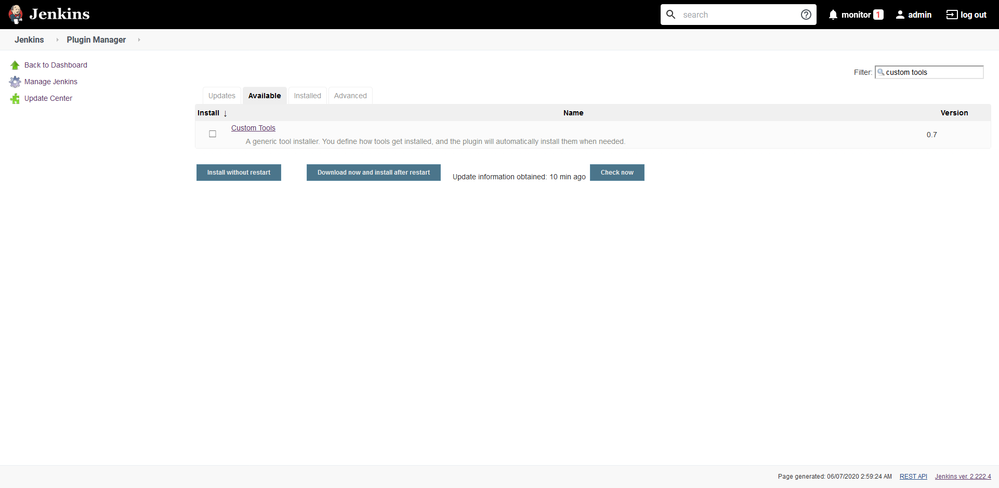

## Configuring the Octopus server and tools

The details of the Octopus server that our pipeline will connect to is defined under {{ Manage Jenkins, Configure System }}:

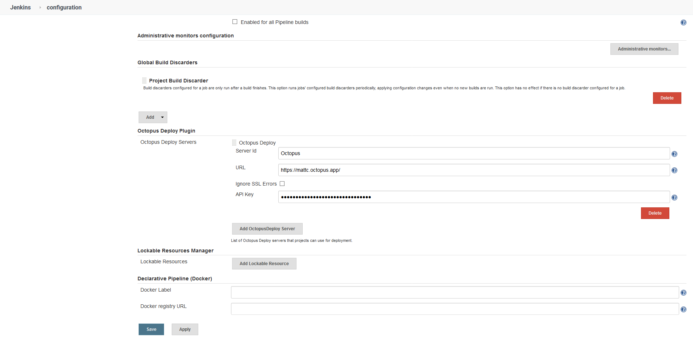

We then need to define a custom tool under {{ Manage Jenkins, Global Tool Configuration }}. The custom tool has the name of **OctoCLI**, and because in my case the agent is running on Windows, the Octopus CLI will be downloaded from https://download.octopusdeploy.com/octopus-tools/7.4.1/OctopusTools.7.4.1.win-x64.zip:

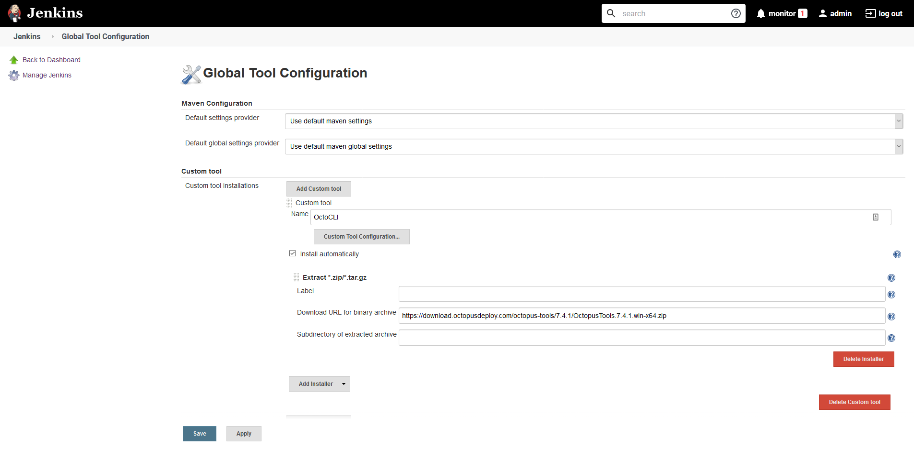

Further down in the **Global Tool Configuration** page is where we define the path to the Octopus CLI. The custom tools plugin install the Octopus CLI to the directory `<jenkins home>/tools/com.cloudbees.jenkins.plugins.customtools.CustomTool/OctoCLI`, where `<jenkins home>` is the home directory of the Jenkins server or the agent performing the build. In my case, the agent home directory is `C:\JenkinsAgent`, so the Octopus CLI will be available from `C:\JenkinsAgent\tools\com.cloudbees.jenkins.plugins.customtools.CustomTool\OctoCLI\octo`. The name of the tool is left as **Default**:

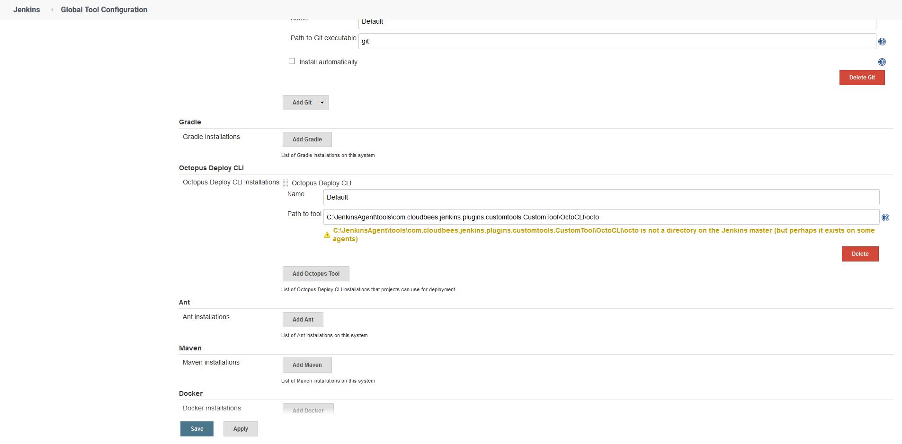

With these tools configured we can update the pipeline script to initiate a deployment in Octopus once the Docker image has been pushed to Docker Hub.

## Updating the Jenkins pipeline

Our existing pipeline was configured to build and push the Docker image to Docker Hub. We will retain those steps, and add some additional steps to install the Octopus CLI as a custom tool and then create and deploy a release in Octopus once the Docker image has been pushed. Let's look at the complete pipeline:

```groovy
pipeline {
    agent {
        label 'docker'
    }
    parameters {
        string(defaultValue: 'Spaces-1', description: '', name: 'SpaceId', trim: true)
        string(defaultValue: 'Petclinic', description: '', name: 'ProjectName', trim: true)
        string(defaultValue: 'Dev', description: '', name: 'EnvironmentName', trim: true)
        string(defaultValue: 'Octopus', description: '', name: 'ServerId', trim: true)
    }
    stages {
        stage ('Add tools') {
            steps {
                tool('OctoCLI')
            }
        }
        stage('Building our image') {
            steps {
                script {
                    dockerImage = docker.build "mcasperson/petclinic:$BUILD_NUMBER"
                }
            }
        }
        stage('Deploy our image') {
            steps {
                script {
                    // Assume the Docker Hub registry by passing an empty string as the first parameter
                    docker.withRegistry('' , 'dockerhub') {
                        dockerImage.push()
                    }
                }
            }
        }
        stage('deploy') {
            steps {                                
                octopusCreateRelease deployThisRelease: true, environment: "${EnvironmentName}", project: "${ProjectName}", releaseVersion: "1.0.${BUILD_NUMBER}", serverId: "${ServerId}", spaceId: "${SpaceId}", toolId: 'Default', waitForDeployment: true                
            }
        }
    }
}
```

This pipeline has some new settings to support integration with Octopus.

We start by defining some parameters. These parameters will be referenced when we create and deploy a release in Octopus, and provide a nice way to decouple the Octopus details from any specific instance, while also providing sensible default values:

```groovy
    parameters {
        string(defaultValue: 'Spaces-1', description: '', name: 'SpaceId', trim: true)
        string(defaultValue: 'Petclinic', description: '', name: 'ProjectName', trim: true)
        string(defaultValue: 'Dev', description: '', name: 'EnvironmentName', trim: true)
        string(defaultValue: 'Octopus', description: '', name: 'ServerId', trim: true)
    }
```

In order for the custom tools plugin to extract the Octopus CLI in the agent's home directory, we need to call `tool('OctoCLI)`:

```
        stage ('Add tools') {
            steps {
                tool('OctoCLI')
            }
        }
```

The final stage makes a call to `octopusCreateRelease` to both create a release and deploy it to the first environment in Octopus. By default, Octopus will create the deployment with the latest version of the packages referenced in the deployment steps, which means that we will deploy the Docker image that Jenkins uploaded to Docker Hub in the previous stage:

```
        stage('deploy') {
            steps {                                
                octopusCreateRelease deployThisRelease: true, environment: "${EnvironmentName}", project: "${ProjectName}", releaseVersion: "1.0.${BUILD_NUMBER}", serverId: "${ServerId}", spaceId: "${SpaceId}", toolId: 'Default', waitForDeployment: true                
            }
        }
```

With these changes to the pipeline we rerun the project in Jenkins, and from the console logs we can see that Jenkins has successfully triggered a deployment in Octopus:

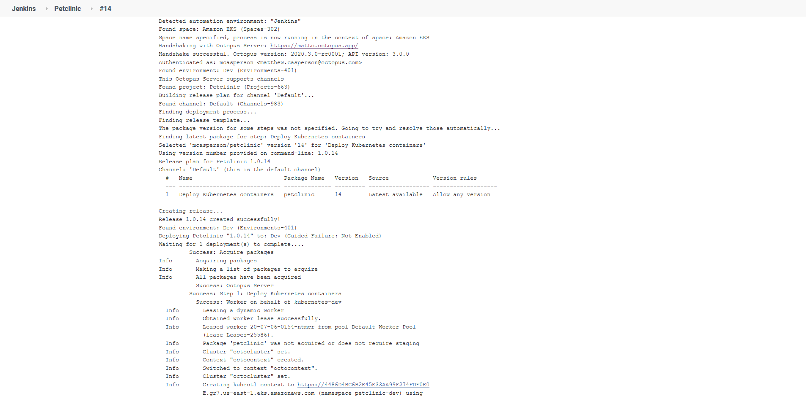

Here is the corresponding deployment in Octopus:

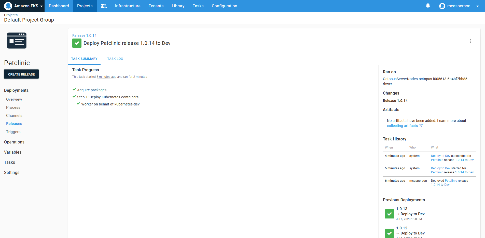

## Adding new environments

We only have the one environment in Octopus called **Dev**. However a typical workflow will promote a deployment through multiple environments on the way to production. To implement this, we need to create some more environments in Octopus which we will call **Test** and **Prod**:

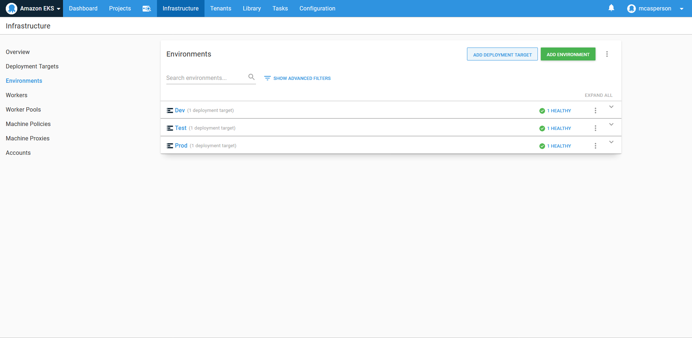

We need to ensure our Kubernetes target is placed within these new environments as well:

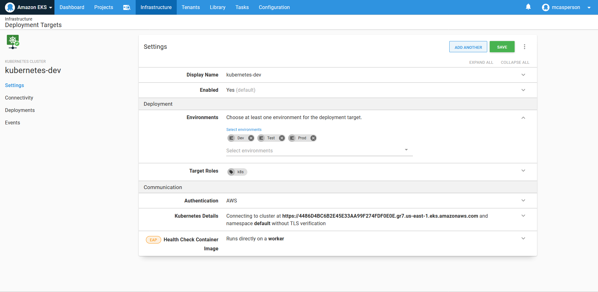

We now have the ability to promote deployments from the **Dev** environment to the **Test** environment:

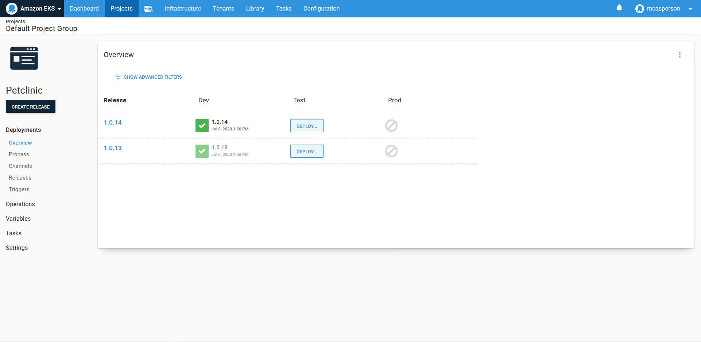

Promoting the deployment to the **Test** environment, we can see our Kubernetes resources being created in the **petclinic-test** namespace. If you recall from the previous blog post, we configured our Kubernetes steps to deploy to a namespace called **petclinic-#{Octopus.Environment.Name | ToLower}**, which is why deployments to a new environment have been placed in a new namespace:

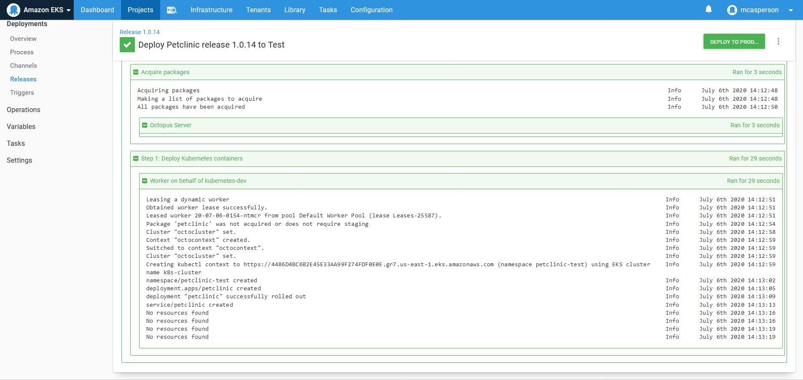

To prove this we can rerun the runbook **Get Service** in the **Test** environment. We can see that a new load balancer host name has been created for the new service resource:

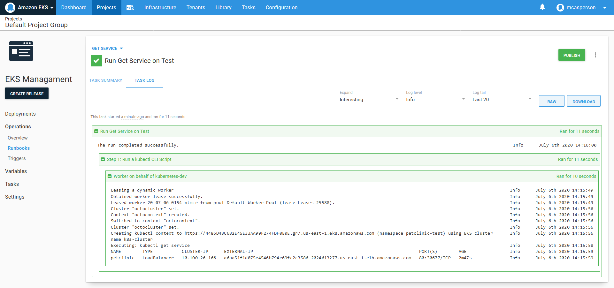

And with that, we have a complete CI/CD pipeline.

## Conclusion

In this post we triggering a deployment in Octopus once Jenkins finishes building and pushing the Docker image. This means we have implemented Continuous Integration with Jenkins testing, building, and publishing the Docker image, and Continuous Delivery with Octopus providing automatic deployment to a development environment, with an automated process ready to be manually triggered in other environments.

We now have the ability to promote a change from the application source code to production with a few simple button clicks. Those performing the deployments need no special tools other than a web browser, and each build and deployment is tracked, audited, and summarized in the Jenkins and Octopus dashboards. This is CI/CD in action.

But those that have seen their code put in customer's hands know that nothing inspires more confidence than the first 10 minutes of a production deployment - it is the following hours and days that are hard. Database backups need to be managed, operating system updates need to be scheduled, logs need to be collected to diagnose support issues, and some good, old fashioned turning-it-off-and-on-again will need to be performed.

In the next blog post we'll show examples of these maintenance processes implemented in runbooks to complete the final stage of our pipeline: Continuous Operations.