In the previous blog post we configured a CI server with Jenkins that provided a central location from which to build and publish our Docker image. The image is now publicly available from Docker Hub, and the next step is to create infrastructure that can host our Docker container.

In this post we'll create an Elastic Kubernetes Service (EKS) instance in AWS from Octopus.

## Getting an Octopus Cloud instance

We'll use Octopus to script the creation of the EKS cluster. The easiest way to get an Octopus instance is to sign up for a [free cloud instance](https://octopus.com/). It only takes a few minutes to get an instance up and running.

The first step is to create an AWS account in Octopus that will be used to create and then connect to the EKS cluster. AWS accounts consist of an account key and a secret key:

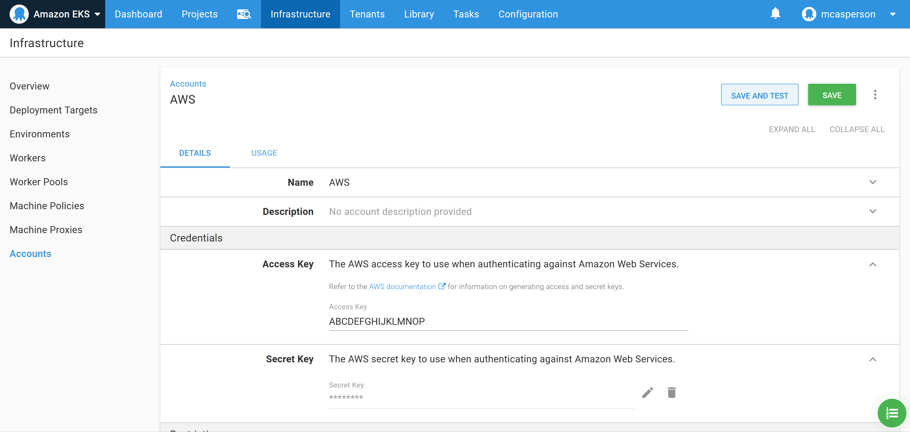
*An example AWS account.*

The community step called **eksctl - Create Cluster (bash)** can be added to a runbook to quickly create an EKS cluster and the associated Kubernetes target in Octopus. This script executes the [EKS CLI tool](https://aws.amazon.com/blogs/opensource/eksctl-eks-cli/) to create a EKS cluster.

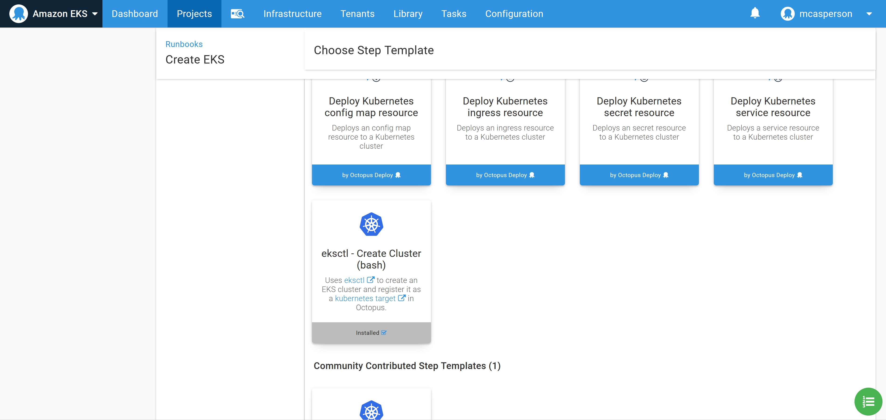
*The community step to create an EKS cluster.*

To make it easy to use the **ekscli** tool, Octopus supported running a step inside a Docker container based on an image, and Octopus [provides images](https://hub.docker.com/r/octopusdeploy/worker-tools) with a wide selection of common cloud tools, including **ekscli**.

TODO: screenshot when we have linux dynamic workers

Populate the step with the details of the EKS cluster to create. For this example the following **eksctl config** YAML creates a cluster with 2 t3a.small nodes:

```YAML
apiVersion: eksctl.io/v1alpha5
kind: ClusterConfig

metadata:
  name: k8s-cluster
  region: us-east-1

nodeGroups:
  - name: ng-1
    instanceType: t3a.small
    desiredCapacity: 2
    volumeSize: 80
```

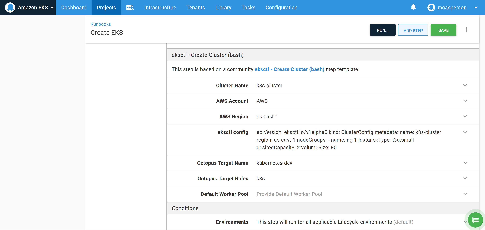
*The populated step.*

Before the runbook is executed, we need to allow dynamically created targets to be placed in the destination environment, called *Dev* in this example. Enabling this setting allows script steps, like the community step template we just configured, to create Octopus targets:

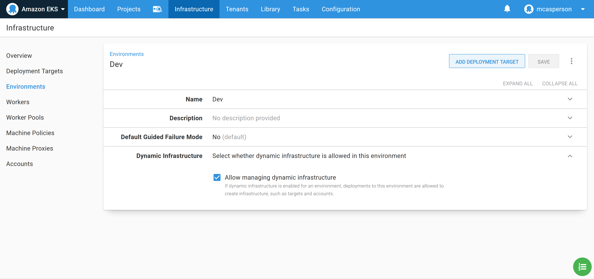
*Enabling dyanmic infrastrucutre in the Dev environment.*

No execute the runbook. Once the runbook has completed, a new Kubernetes target is created that we can start deploying to:

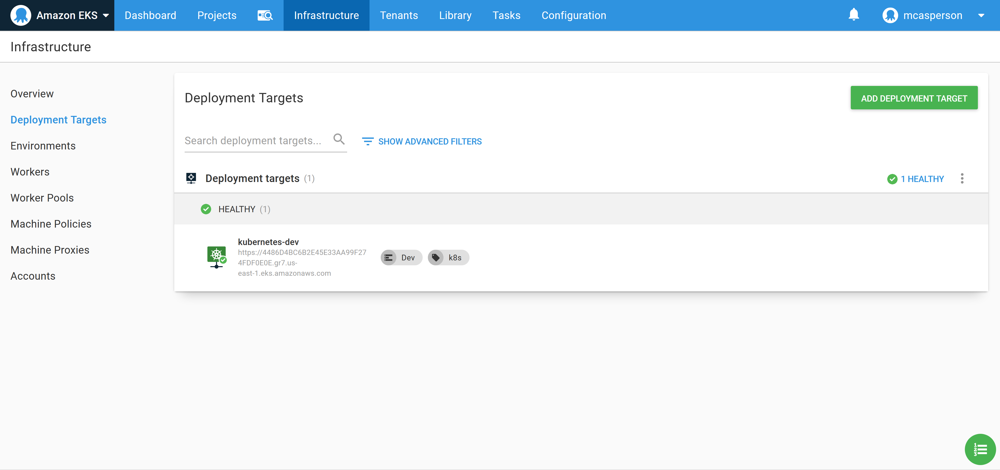
*The Octopus Kubernetes target.*

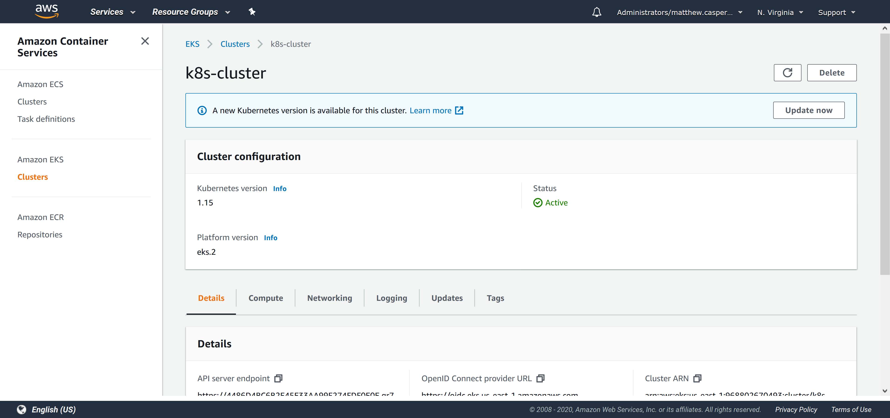
*The EKS cluster.*

## Creating the Docker feed

In order to consume DOcker images, we need to create a Docker feed in Octopus. This feed points to https://index.docker.io, which is the URL of the Docker Hub registry:

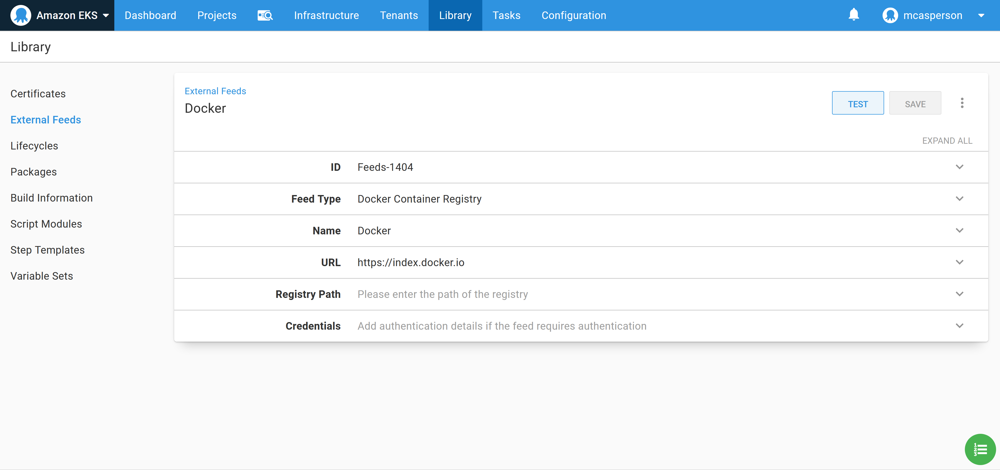
*The Docker Hub feed in Octopus.*

We can then test the feed to ensure that Octopus can find our **Petclinic** image:

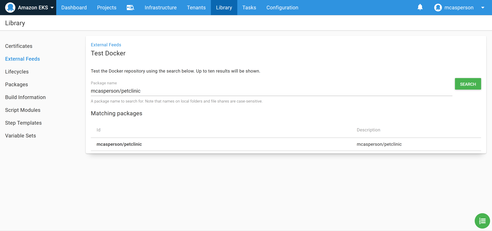
*Testing the Docker feed.*

## Deploying the image to Kubernetes

We now have all the configuration in place to deploy to the Kubernetes cluster. We'll use the **Deploy Kubernetes containers** step to configure a Kubernetes deployment resource and expose it through a load balancer service:

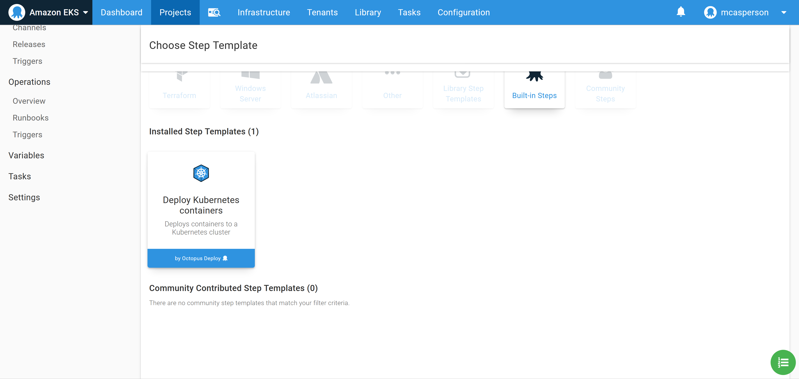

You can interact with this step in two ways.

The first way is to use the UI to build up the Kubernetes deployment. This is convenient when you are not intimately familiar with Kubernetes YAML properties as you can build out the resource via the dedicated form fields.

The second way to use the step is to edit the values via the YAML representation that is shown when you click the **EDIT YAML** button:

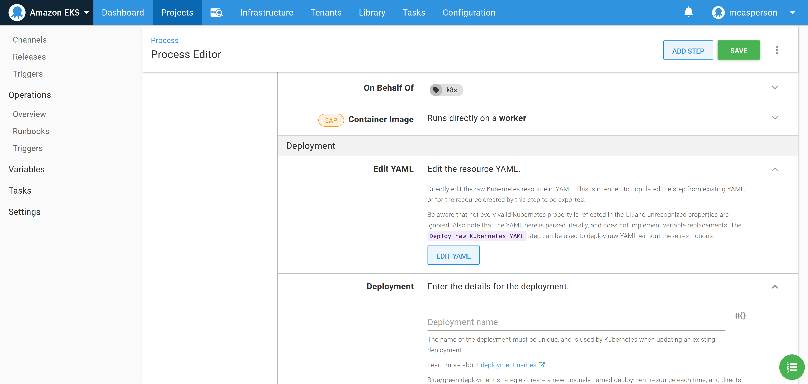

We can then edit the deployment resources directly as YAML, which is convenient as copying and pasting exiting YAML populates the step in one operation. By pasting the YAML below into the text box, we create a deployment referencing our Docker image:

```YAML
apiVersion: apps/v1
kind: Deployment
metadata:
  name: petclinic
spec:
  selector:
    matchLabels:
      octopusexport: OctopusExport
  replicas: 1
  strategy:
    type: RollingUpdate
    rollingUpdate: {}
  template:
    metadata:
      labels:
        octopusexport: OctopusExport
    spec:
      containers:
        - name: petclinic
          image: mcasperson/petclinic
          ports:
            - name: web
              containerPort: 8080
```

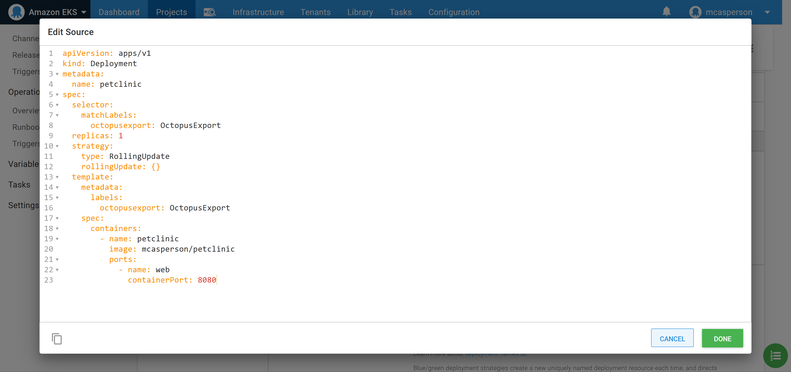
*Editing the step via YAML.*


*The step is now configured with the YAML properties.*