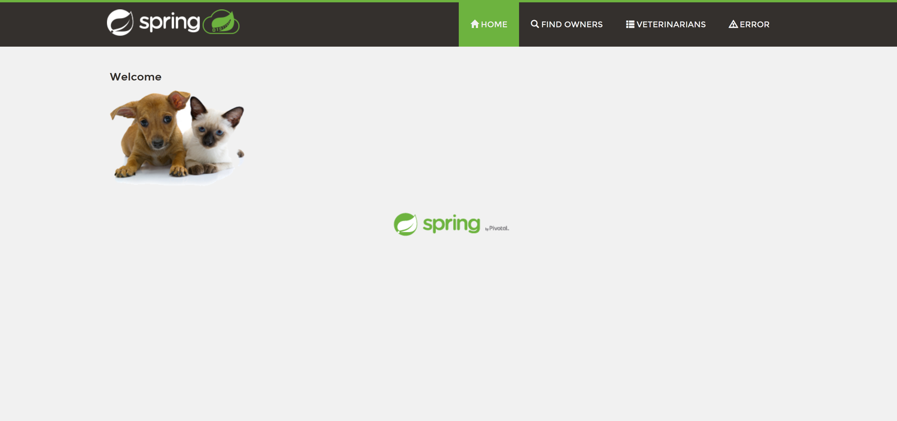

There is perhaps no public project that better captures a long lived Java application than the [Spring Petclinic](https://projects.spring.io/spring-petclinic/) sample application. It started life way back in the early 2000s, and despite being based on an old release of Spring Boot, is still proudly featured on the Spring website.

Our journey from local builds and manual deployments through to a complete Continuous Integration (CI), Continuous Deployment (CD), and Continuous Operation (CO), or CI/CD/CO, lifecycle starts with a local build of Petclinic on a local workstation. At the end of this blog post we'll have containerized this application with Docker to provide a repeatable build and execution.

## Starting with a local build

To get started, we clone the Petclinic GIT repository and used the Maven wrapper checked in alongside the application source code to build and run a local JAR file:

```
git clone https://github.com/spring-projects/spring-petclinic.git
cd spring-petclinic
./mvnw spring-boot:run
```

This initial build will take some time as Maven downloads the various Spring libraries that make up the application. Thankfully these libraries are cached, so any subsequent builds will complete much faster.

To view the application, open http://localhost:8080:



To create a distributable JAR file, run:

```
./mvnw package
```

This runs the unit tests and then creates a single, self contained JAR file under the `target` directory called something like `petclinic.2.3.1.BUILD-SNAPSHOT.jar`. We can run this file with the command:

```
java -jar .\target\petclinic.2.3.1.BUILD-SNAPSHOT.jar
```

This process of testing, build and running locally is were every application starts. 

To be fair, PetClinic implements a number of features to make these builds repeatable and the results easily distributable. The `mvnw` script is the [Maven Wrapper](https://github.com/takari/maven-wrapper) which provides cross platform scripts designed to be checked into source control that download the appropriate version of Maven if the local machine does not have it installed. Spring boot then creates self contained JAR files which are easy to version, copy and deploy.

However, you still need the Java Developer Kit (JDK) to build the application, and either the JDK or Java Runtime Environment (JRE) to run it. Petclinic relies on a now quite old version of Java, but given that a new version of Java now released every 6 months, it is not hard to imagine developers having to juggle Java installations to perform a local build.

To provide a truly self-contained build and execution environment, we'll migrate this application to Docker.

## Self contained builds and execution with Docker

One of the main features of Docker is it's ability to bundle an entire execution environment in a self contained image, and run that image in an isolated environment. 