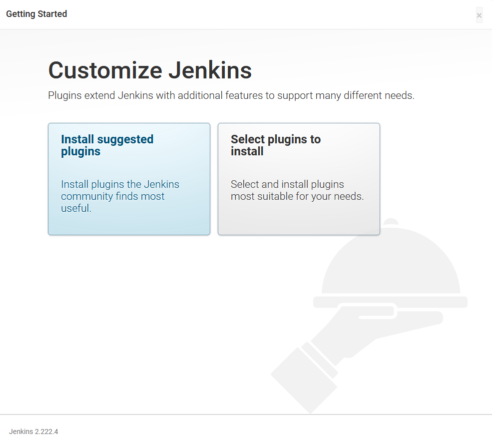
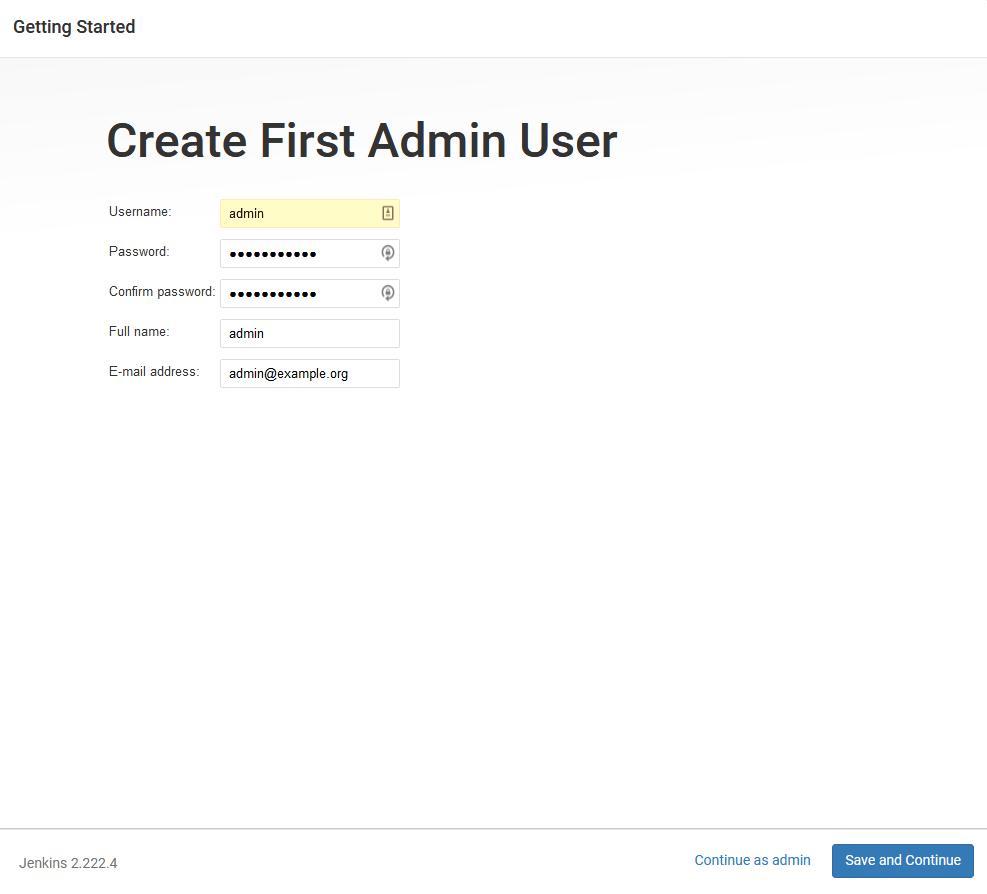
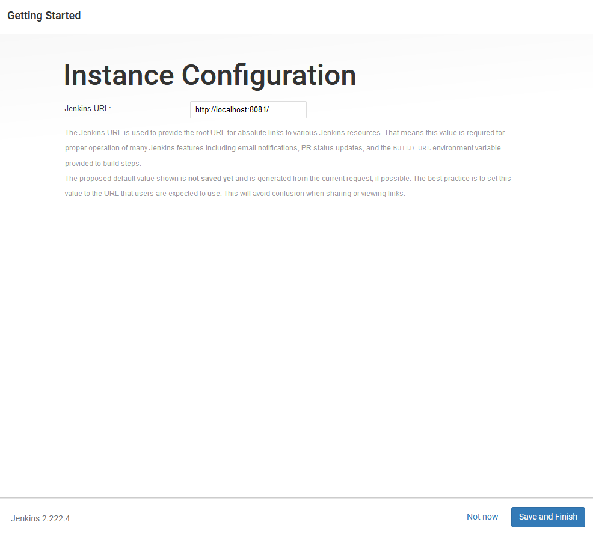
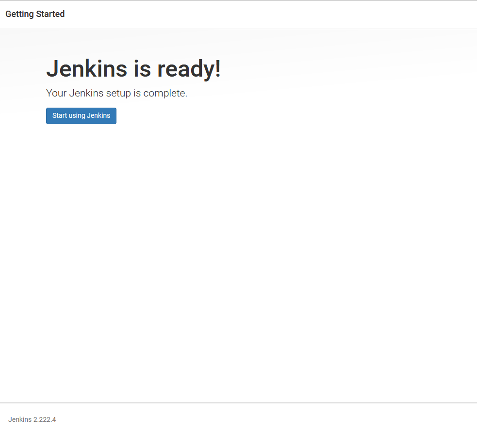
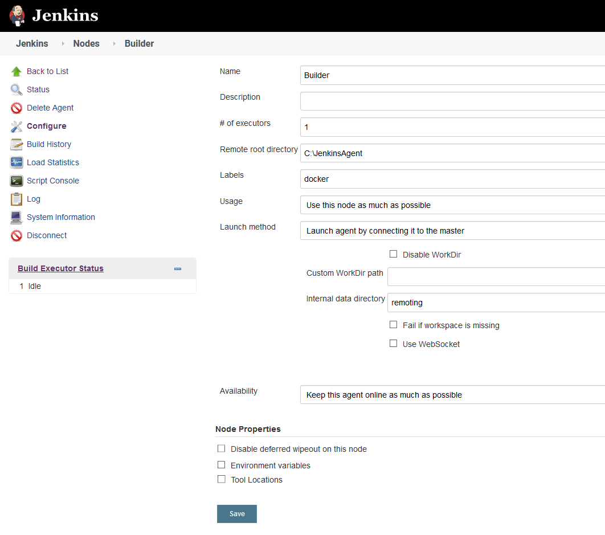

In the previous post we took a typical Java application and created a `Dockerfile` that took care of building the code and running the resulting JAR file. By leveraging the existing Docker images provided by tools like Maven and Java itself we created repeatable and self contained build process, with the resulting Docker image that can be executed by anyone with only Docker installed.

This is a solid foundation for our build process. However, as more developers start working on a shared code base, testing requirements expand, and the resulting packages grow in size, teams require a central, shared server to manage builds. This is the role of a Continuous Integration (CI) server.

There are many CI servers available. One of the most popular is Jenkins, which is free and open source. In this blog post we'll learn how to configure Jenkins to build and publish our Docker image.

## Getting started with Jenkins

The easiest way to get started with Jenkins is to use their [Docker image](https://hub.docker.com/r/jenkins/jenkins/). Just as we created a self contained image for our own application in the previous blog post, the Jenkins Docker image provides us with the ability to launch Jenkins in a preconfigured and self contained environment with just a few commands.

To start we download the latest long term release (LTS) version of the Jenkins DOcker image with the command:

```
docker pull jenkins/jenkins:lts
```

We then launch Jenkins with the command:

```
docker run -p 8081:8080 -p 50000:50000 -v jenkins_home:/var/jenkins_home jenkins/jenkins:lts
```

The `-p` argument binds a port from the local workstation to a port exposed by the image. Here we use the argument `-p 8081:8080` to bind local port 8081 to the container port 8080. Note that because our own application also listens to port 8080 by default, we have chosen the next available port of 8081 for Jenkins. It is entirely up to you which local port is mapped to the container port. The argument `-p 50000:50000` exposes a port used by Jenkins agents, which we will set up to perform our build.

The `-v` argument mounts a [Docker volume](https://docs.docker.com/storage/volumes/) to a path in the container. While a Docker container can modify data while it runs, it is best to assume that you will not be able to retain those changes. For example, each time you call `docker run` (which you may do to use an updated version of the Jenkins Docker image), a new container is created without any of the data that was modified by a previous container. Docker volumes allow us to retain modified data by exposing a persistent file system that can be shared between containers. In this example we have created a volume called `jenkins_home` and mounted it to the directory `/var/jenkins_home`. This means that all of the Jenkins data is captured in a persistent volume.

When the Docker image is run you will be presented with the log output. As part of the initial boot, Jenkins generates a random password and displays it in the logs like this:

```
*************************************************************
*************************************************************
*************************************************************

Jenkins initial setup is required. An admin user has been created and a password generated.
Please use the following password to proceed to installation:

4b9e47bcd9ea469687dc39f23b0adb08

This may also be found at: /var/jenkins_home/secrets/initialAdminPassword

*************************************************************
*************************************************************
*************************************************************
```

When you open http://localhost:8081 you will be prompted to enter this password to unlock Jenkins:


Jenkins will prompt you to either install a list of common plugins or just those that you select. The **Install suggested plugins** option contains most of the plugins we'll need:



It will take a minute or so for the plugins to download:


The Jenkins administrator is configured:



Finally the Jenkins URL is defined:



Jenkins is now configured and ready for use:



## Creating an agent

An issue we need to address is the fact that we are running Jenkins in a Docker container, while also wanting Jenkins to itself use Docker to build a Docker image. This created a scenario where we want to use Docker in Docker.

Running [Docker in Docker](https://hub.docker.com/_/docker) is possible, but is not supported out of the box with the Jenkins image we have run. A number of third party tools have been created, like [Kaniko](https://github.com/GoogleContainerTools/kaniko) and [Buildah](https://github.com/containers/buildah), that support building Docker images without relying on the Docker daemon. These solutions are reasonably advanced though.

An easier solution is to run a Jenkins agent outside of the Jenkins docker container. This agent will run on the host operating system and have access to the Docker daemon to create Docker images.

To create an agent, click {{ Manage Jenkins, Manage Nodes and Clouds }}:


Click the **New Node** link:


Give the new node a name and click **Ok**:


Enter a path for the **Remote root directory**. Because I am running the node on Windows, the path is something like `C:\JenkinsAgent`. Then enter `docker` as the node label and click **Save**:



The node is now configured in Jenkins, but since there is no node running it is shown as disconnected:


Clicking the new node provides a screen with details on how to run the agent. Click the **agent** link to download the `agent.jar` file and run the command shown on the screen to connect the agent to Jenkins:


Once the node is connected, it will be displayed without the error icon:


## Installing the Docker Pipeline plugin

The initial configuration of Jenkins installed a number of common plugins. However, to build Docker images we need one more plugin called **Docker Pipeline**. This is done via {{ Manage Jenkins, Manage Plugins }} and serching for the plugin in the **Available** tab:


The plugin will take a few seconds to download and install:


## Adding the DockerHub credentials

To allow our project to publish the DOcker image to Docker Hub, we need to define the Docker Hub credentials in Jenkins. This is done through the credentials section accessed via {{ Manage Jenkins, Manage Credentials }}:


Click the **Jenkins** link:


Click the **Global credentials** link:


Click the **Add Credentials** link:


Enter the Docker Hub credentials, set the **ID** to **dockerhub**, and click the **OK** button:


We now have everything we need to build Docker images in Jenkins. The next step is to define the Jenkins project.

## Defining the Jenkins project

At a high level, Jenkins provides two types of projects. 

The first format, known as a FreeStyle project, is defined in the Jenkins UI. While it is possible to export and share a FreeStyle project, it is tricky to do as the underlying data format is not designed to be edited by hand.

The second format, known as a pipeline, is essentially a script that is designed to be created and managed much like the code in your applications. The pipeline can be saved alongside your project code in a file called `Jenkinsfile`, which keeps your application code and the build definition in the same place.

We'll create a `Jenkinsfile` for our project to build and publish our Docker image.

```
pipeline {
    agent {
        label 'docker'
    }
    stages {
        stage('Building our image') {
            steps {
                script {
                    dockerImage = docker.build "mcasperson/petclinic:$BUILD_NUMBER"
                }
            }
        }
        stage('Deploy our image') {
            steps {
                script {
                    // Assume the Docker Hub registry by passing an empty string as the first parameter
                    docker.withRegistry('' , 'dockerhub') {
                        dockerImage.push()
                    }
                }
            }
        }
    }
}

```