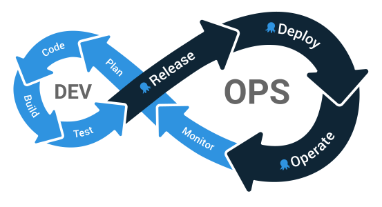

DevOps is a popular, high level term used to describe practices relating to how applications and their infrastructure are created and maintained. But how does the DevOps lifecycle relate to the day to day tools your teams use?

In this blog series we walk through how to configure Jenkins, Octopus and Kubernetes to build, release, deploy and maintain a legacy Java application. Each blog takes you one step further through the DevOps lifecycle, with practical examples, real world advice and example code you can use in your own projects.

* [From JAR to Docker](/blog/2020-07/java-ci-cd-co/from-jar-to-docker/index.md)
* [From local builds to Continuous Integration](/blog/2020-07/java-ci-cd-co/from-local-to-ci/index.md)
* [From Continuous Integration to Kubernetes](/blog/2020-07/java-ci-cd-co/from-ci-to-cloud/index.md)
* [From Continuous Integration to Release Management](/blog/2020-07/java-ci-cd-co/from-ci-to-cd/index.md)
* [From Release Management to Operations](/blog/2020-07/java-ci-cd-co/from-cd-to-co/index.md)

