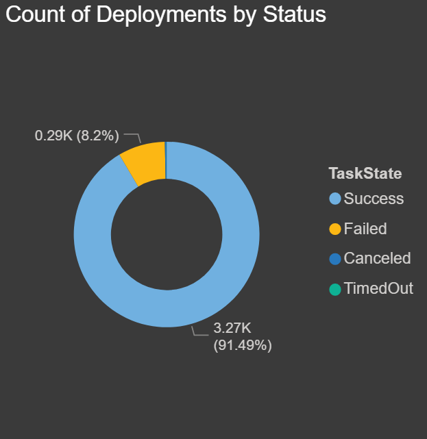

I recently performed an analysis of some data I pulled from my Octopus Deploy database using PowerBI Desktop. The reports I created, highlight how much time and money automation has saved my company, and the reports helped me spot potential development issues that slow down deployments; such as how many times releases have been skipped due to bugs not being found in lower-level environments.

At the end of this post, I share the templates I created so you don’t have to start from scratch (the templates work with both Octopus Cloud and self-hosted Octopus). Hopefully, they’ll point you in the right direction to help you highlight how much time and money automation can save you, and perhaps even justify the need for automation and testing resources.

In this post, I preview what I put together. I also go over how you can create a connection and pull data from your instance of Octopus Deploy.

This post is broken up into the following sections:

1. [Prerequisites](#prerequisites)
2. [Deployment history charts](#deployment-history-charts)
3. [Runbooks history charts](#runbooks-history-charts)
4. [Reports](#reports)
5. [ROI](#roi)
6. [Conclusion](#conclusion)

## Prerequisites

There are a couple of prerequisites you need to have in place:

- [Install PowerBI Desktop](https://blog.reviewmydb.com/2020/06/how-to-install-powerbi-desktop.html).
- [Connect to a local instance of Octopus Deploy](https://blog.reviewmydb.com/2020/06/how-to-connect-to-octopus-deploy-local.html).
- [Find your Octopus Cloud API key and connect to your cloud instance of Octopus Deploy](https://blog.reviewmydb.com/2020/06/how-to-connect-to-your-octopus-deploy.html).

## Deployment history charts {#deployment-history-charts}

Deployment history yields some very interesting patterns and results. From raw deployment counts with different groupings (project, environment, etc.), to deployment execution time and success and failure rates.

**Count of Deployments By Date and Project**: This is the first chart I put together, and I was shocked to see how many deployments we’ve done each year over the last five years. This report breaks down each year and stacks the projects. In this chart, you can drill down to see the count of deployments by quarters, month, and day. You drill down by clicking the _double down arrow_ and then click on the _up arrow_ to go back:

**Count of Deployments By Environment and Project**: The chart below shows how many deployments we have done in each environment split by project:

**Total Deployments**: This is a count of all records in the Deployment History table, which is all of the deployments.

**Succeeded Deployments**: This is the count of all deployments, filtered by `TaskState` `Succeeded`.

**Failed Deployments**: This is the count of all deployments, filtered by `TaskState` `Failed`.

**Total Runtime Hours**: This is a measure that tells us the total time of all the deployments in hours. Duration is stored in seconds so I divided it to arrive at the total number of hours.

**Total Runtime Minutes**: This is a measure that tells us the total time of all the deployments in minutes. Duration is stored in seconds so again, I divided it to arrive at the total number of minutes.

**Total Runtime Seconds**: This is a sum of the total duration for all deployments.

**Count of Deployments by Status**: The chart below displays a summary and count of all deployments by task statuses:

**Average Runtime Seconds by Project**: The chart below shows how long each deployment takes for each project on average. This is for all environments:

**Total Deployments by Environment**: The chart below shows how many total deployments have occurred in each environment:

**Percentage of Issues by Project and Environment Based on Number of Deployments**: With the chart below, I wanted to show the ratio of deployments, or redeployments, we have done to each environment by project. This may not be an exact representation, but if the percentage of deployments to the lower environments (Dev and QA) are higher, this could mean issues were discovered and the deployments were fixed and then re-deployed. If we had an even percentage of deployments in each environment, it could mean that no bugs/issues were found and the deployment went through to Production.

If you notice in this chart that the _Store Website_ in both QA and Prod almost have the same percentage of deployments. To me, this means that instead of testing and finding issues in QA, the bugs are found in Production. I think this means there’s a code quality issue that needs to be addressed.

Compare the _Store Website_ to the _Website_, and you can see that the percentage difference is much higher in Dev and then QA compared to Production. I think this means the developers are finding bugs in Dev, and then the ones they miss are caught in QA. Over the past 5 years, we have released 16 major stable versions of the website.

While this may not be 100% accurate, you could pull in some data and create a relationship from your ticket system to make this more precise with supporting data.

**Percentage of Planned vs. Actual**: The chart below compares the releases from Development and Production. The goal was to see how many project releases were meant to go to Production, but due to either code issues or bugs they had to be re-released before making it to Production:

**Applications with the most Canceled/Timed Out Deployments**: The chart below shows which project has had the most canceled or timed out deployments. This could be an indication of a script or process taking too long if it timed out. This might be a large database change script or perhaps large file transfers:

**Applications with the most Failed Deployments**: The chart below shows which project/application has had the most failed deployments. This could be for any number of reasons, such as misconfigured variables, changed servers, third-party component changes or upgrades, servers being down, failed scripts, etc. If there is a high number, this may be something to look into:

**Applications with the Most Deployments**: The chart below shows which project/application has had the most successful deployments.

**Max Duration of Seconds by Project and Environment**: The chart below shows the max duration in seconds for each environment for each project. This allows you to compare how long it takes to deploy your code for each project:

**Average Days from Dev to Prod by Project**: The chart below shows the average duration in days from the time a release has been deployed to Dev to when it is promoted to Production:

**Minimum Days to Release to Prod**: The chart below shows the minimum time in days for a release to make it from Dev to Production. In our case, we have deployed releases from Dev to Production on the same day:

**Maximum Days to Release to Prod**: The chart below shows the maximum time in days for a release to make it from Dev to Production:

## Runbooks history charts {#runbooks-history-charts}

Runbooks were introduced in late 2019, and I’ve recently started using them for some basic operations tasks. These charts summarize runbook execution by date, execution time, and successes vs failures.

:::warning
These reports are currently only available for on-premises instances of Octopus Deploy because there is no `RunbookHistory` API call on Octopus Cloud instances.
:::

**Frequency of Runbooks by Date**: The chart below shows the frequency of executions by date. Since we have only recently started using runbooks, I drilled down to the day to see how many we have run this month:

**Runbook Executions**: This is a count of all records in the runbooks history table, which is all of the executions of all runbooks.

**Succeeded Runs**: This is the count of all runs, filtered by `TaskState` `Succeeded`.

**Failed Runs**: This is the count of all runs, filtered by `TaskState` `Failed`.

**Total Runtime Hours**: This is a measure that tells us the total time of all the runbook execution in hours. Duration is stored in seconds so I divided it to arrive at the total number of hours.

**Total Runtime Minutes**: This is a measure that tells us the total time of all the runbook execution in minutes. Duration is stored in seconds so I divided it to arrive at the total number of minutes.

**Total Runtime Seconds**: This is a sum of the entire duration for all runbook executions.

**Runbook Success Rates**: The chart below shows the count of runbook executions based on their task status, filtered by `IsPublished` `true`. We had some failures when we were testing, but we only want to know if these failed after they have been published and used by our end users:

**Users Executing Runbooks**: The chart below shows which users are executing the runbooks and how many times each user has initiated an execution:

**Average Duration in Seconds by Runbook**: The chart below shows the number of times each runbook has been executed. This chart is also filtered by `IsPublished` `true`:

## Reports

It might seem like a lot of work to create these reports, and it is. But I have a treat for you! I have copied my PowerBI reports and created a template for both the SQL Server and Octopus Cloud instances. Below are links to each template and links to my blog, which covers setting up the connection string, API URL, and API key so that you can access your data.

- [SQL Server template: OctopusDeploySQLServer.pbt](octopus-deploy-sqlserver-report.pbit) ([Instructions](https://blog.reviewmydb.com/2020/06/how-to-configure-sql-server-powerbi.html)).
- [The Cloud template: OctopusDeployCloud.pbt](octopus-deploy-reporting-from-cloud-app.pbit) ([Instructions](https://blog.reviewmydb.com/2020/06/how-to-configure-powerbi-template-for.html)).

Now that we have our data, we can view all of the charts we created. I have organized the charts into four pages with a ton of useful information:

1. Deployments
2. Issues
3. Durations
4. Runbooks

---

The first page is called **Deployments**. Here is a screenshot with a sample of the data from my local instance of Octopus Deploy for the last five years:

*Local instance: Deployments page*

The second page is **Issues**. This is a screenshot of my report with all of the charts relating to potential issues:

*Local instance: Issues page*

The third page is called **Durations** and contains all charts relating to execution duration:

*Local instance: Durations page*

The final page is called **Runbooks**, this is currently only an option for on-premises instances of Octopus Deploy because there is no `RunbookHistory` API call on Octopus Cloud instance.

*On-premises instance: Runbooks page*

## ROI

So how much has Octopus Deploy saved my company? Let’s look at the data I collected.

Over the past five years, Octopus Deploy has executed 3,572 deployments. Let’s say that on a typical manual deployment, each deployment takes one hour to deploy to multiple servers. In my case, we have at least one website, one API, and two databases. Our other environments have more web servers (which are in web farms) and more APIs.

At a bare minimum, that’s 3,572 hours, and we know for sure it would have taken more time for the larger environments. Manual execution of 3,572 hours, but Octopus Deploy’s automated executions took only 53.5 hours.

If we had a person handling the deployments, this would take approximately one-third of their time each month just to perform deployments at about sixty hours out of a typical 168 hour work month.

If their hourly rate was $80 an hour, it would have cost us over $57,000 each year for five years for a total of $285,760.

Now, if I could convince my company to give me a small bonus out of the $267,360 I saved them, that would be awesome.

## Conclusion

Now that you can see your data, I hope you find some of these reports and charts useful, and perhaps you will even think up of new reports and charts to add to this. If you do, comment and share your ideas, and perhaps I can incorporate them into my next version.
