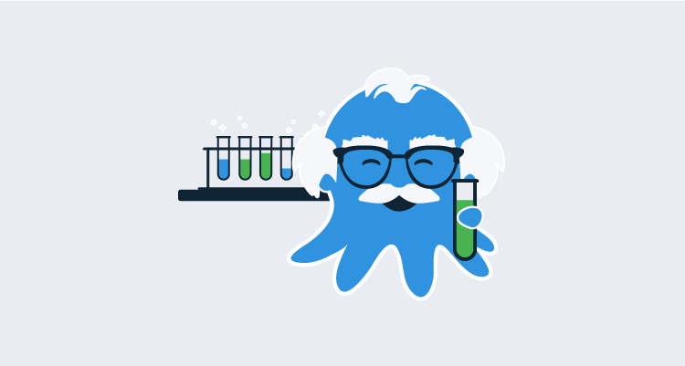
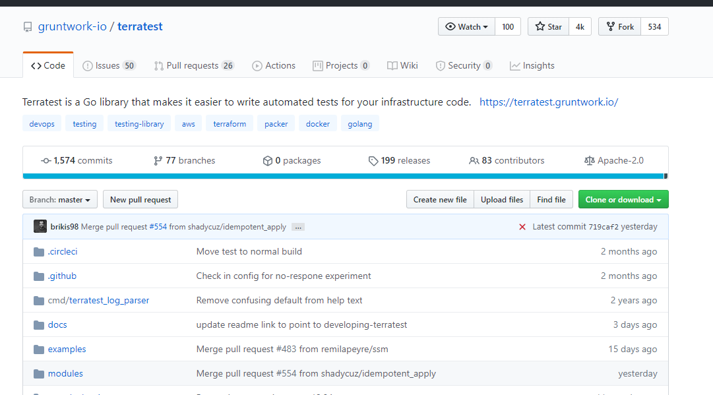
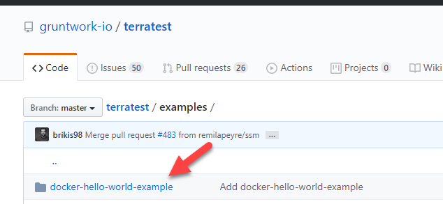
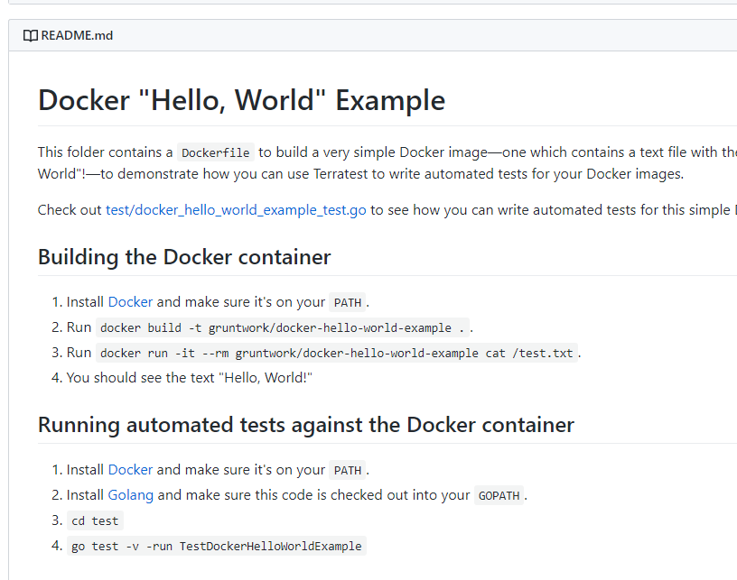

Testing code is one of the more important things a developer can do. In fact, there is a coding practice called Test-Driven Development ([TDD](http://agiledata.org/essays/tdd.html)) that is based around writing tests first and then writing code based on the test. Even if you don't follow test-driven development, it is still extremely important to think about implementing unit tests and mock tests into the code. Without testing, you are essentially deploying code and hoping it will work the way you think it should. Even if the code deploys just fine that one time if the code is changed, you'll have zero ideas about what the outcome will be.

In this post, you will focus on testing Terraform code with a [Golang](https://golang.org/) framework called Terratest. Terratest is one of the most popular Terraform testing frameworks and comes feature-rich with many different sets of tools.

## Prerequisites

To follow along with this post, you should have the following:

- An understanding of programming. Although you will not go into the basics of Golang, if you have programmed in the past, you should see familiar concepts (methods, functions, etc.).
- An intermediate-level knowledge of Terraform.
- An Azure subscription. If you don't have one, you can sign up for a [30-day free trial](https://azure.microsoft.com/en-us/free/).
- A text editor. For the purposes of this post, you will be using Visual Studio Code ([VS Code](https://code.visualstudio.com/download)).
- Golang installed. Depending on the operating system, you can find the [installation instructions](https://golang.org/doc/install).

## Unit tests and mock tests

Before jumping into the testing portion, let's review what testing actually is. The two primary tests that you will typically use are:

- Unit tests
- Mock tests

### Unit tests

Unit tests are a software testing methodology for testing specific units of code. For example, let's say you have a class that's called `Car` and a method inside of that class called `Ford`. The `Ford` method returns a few values; what color the Ford is, what model the Ford is, and what year the Ford is. You can run that code to see if the results are correct, but what if you don't want to create anything specific and you just want to see how the code builds? This is where a unit test comes in. The unit test can do tests on what the values should be. 

Let's say the following values should be the result:

- Year = 2020
- Model = F150 Lariat
- Color = Platnium.

When the unit test runs, if those values came back as true, the unit test passes. If the results came back as false, the unit test fails, and it lets you know where it failed.

### Mock test

Mock tests are another software testing methodology that can either fake the creation of a resource or actually create the resource. Let's say you have some C# code that you want to test for a frontend web application. A unit test is great to confirm the methods actually work inside the C# code, but what if you want to test the actual deployment? Instead of manually deploying the test over and over again, or creating a continuous delivery pipeline to test the code, you can implement a mock test. The mock test will deploy the code, confirm that the code works, and either leave the deployment as-is or delete the deployment. In typical mock tests, the resource is deleted right after the mock runs successfully.

## Writing the Terraform code to test

In the previous section, you learned what unit tests and mock tests are. In this section, you'll create a Terraform module that will deploy a Virtual Network in Azure. The code that you write will be the code that's used for testing purposes.

Let's go over each portion of the Terraform code to confirm what is being deployed. To follow along with this section, you should have a text editor, like Visual Studio Code, open.

### The main.tf configuration

The first section will be the `azurerm` provider. The `azurerm` provider is what makes an API call to Azure for the resource creation:

```
provider "azurerm" {
    version = "2.0.0"
    subscription_id = var.subscriptionID
}
```

The second section is the first resource. The first resource creates a Network Security Group (NSG) in Azure. An NSG is very similar to a firewall:

```
resource "azurerm_network_security_group" "OctopusSG" {
  name                = "OctopusSG"
  location            = "eastus"
  resource_group_name = var.resourceGroupName
}
```

The third section will create the first network security rule. Think of a network security rule as being like a port rule on a firewall. The first port rule is port 80 is open to the world:

```
resource "azurerm_network_security_rule" "Port80" {
  name                        = "Allow80"
  priority                    = 102
  direction                   = "Inbound"
  access                      = "Allow"
  protocol                    = "Tcp"
  source_port_range           = "*"
  destination_port_range      = "80"
  source_address_prefix       = "*"
  destination_address_prefix  = "*"
  resource_group_name         = azurerm_network_security_group.OctopusSG.resource_group_name
  network_security_group_name = azurerm_network_security_group.OctopusSG.name
}
```

The second network security rule is for port 22, which will allow Secure Shell (SSH) connectivity to any virtual machine that is part of the network security group:

```
resource "azurerm_network_security_rule" "Port22" {
  name                        = "Allow22"
  priority                    = 100
  direction                   = "Inbound"
  access                      = "Allow"
  protocol                    = "Tcp"
  source_port_range           = "*"
  destination_port_range      = "443"
  source_address_prefix       = "*"
  destination_address_prefix  = "*"
  resource_group_name         = azurerm_network_security_group.OctopusSG.resource_group_name
  network_security_group_name = azurerm_network_security_group.OctopusSG.name
}
```

The fourth resource being created is the Azure Virtual Network itself. The virtual network will have an address space (CIDR range) of `10.0.0.0/16` and two DNS servers, `8.8.8.8` and `8.8.4.4`:

```
resource "azurerm_virtual_network" "octopus-vnet" {
  name                = "octopus-vnet"
  location            = var.location
  resource_group_name = var.resourceGroupName
  address_space       = ["10.0.0.0/16"]
  dns_servers         = ["8.8.8.8", "8.8.4.4"]
}
```

The fifth and final resource being created is for the subnet inside the virtual network. The subnet will have an address prefix (subnet range) of `10.0.1.0/24`:

```
resource "azurerm_subnet" "octopus-sub" {
  name                 = "testsubnet"
  resource_group_name  = azurerm_network_security_group.OctopusSG.resource_group_name
  virtual_network_name = azurerm_virtual_network.octopus-vnet.name
  address_prefix = "10.0.1.0/24"
}
```

### The variable configuration

The variables will consist of three values:

- subscriptionID
- resourceGroupName
- Location

Below is the variable configuration without any default values. This makes the code reusable, and it is easier to implement in most environments:

```
variable "subscriptionID" {
    type = string
    description = "Variable for our resource group"
}

variable "resourceGroupName" {
    type = string
    description = "name of resource group"
}

variable "location" {
    type = string
    description = "location of your resource group"
}
```

### The Tfvars configuration

To pass in variables at runtime, you will use a `terraform.tfvars` configuration to keep the code as reusable as possible.

Below is the `tfvars` configuration that will be used:

```
subscriptionID = value_here
resourceGroupName = "OctopusRG"
location = value_here
```

With the `main.tf`, `variables.tf`, and `terraform.tfvars`, you are ready to start looking at Terratest to test the code you've written.

## First look at TerraTest

In the previous section, you wrote the code that will be tested with Terratest. In this section, you will look at Terratest how it can be used with Terraform.

The Terratest framework can be found at [GitHub](https://github.com/newcontext-oss/kitchen-terraform).


Terratest is a Go library that helps you implement Infrastructure-as-code testing. Terratest was created and is maintained by Gruntwork, a platform that provides DevOps-as-a-Service. You can learn more about [Gruntwork](https://gruntwork.io/).

Under the examples directory on the Terratest GitHub, you can see a few different examples. Let's take a look at the **docker-hello-world-example**:



As you can see from the screenshot below, a Docker image can be built the standard way by running the `build` and `run` commands. 

When the Docker container is running, you can use the Golang command-line to run the test. The command-line tool you use is `go test`:



After the test is run, you will see an output that tells you whether or not the test completed successfully.

## Writing the test in Terratest

Now that you have an understanding of what code will be tested and the Terratest framework, it's time to create a new test using Golang.

For this section, you should have Visual Studio Code open and create a new file in the same directory as the Terraform code. The new file can be named whatever you like, for example, `terraform-test.go`.

Let's first set up the `package` and call it **test**:

```go
package test

}
```

Next, you need to specify a few different Golang libraries. The two Golang libraries that will be used are:

- [github.com/gruntwork-io/terratest/modules/terraform](http://github.com/gruntwork-io/terratest/modules/terraform)
- testing

```go
package test

import (
  "github.com/gruntwork-io/terratest/modules/terraform"
  "testing"
)
```

After the libraries are in the import block, set up the new function. The function can be named anything you'd like, but for the purposes of this post, we'll call it `vnet_test`. The `testing` library is used by calling it inside the newly created function:

```go
package test

import (
  "github.com/gruntwork-io/terratest/modules/terraform"
  "testing"
)

func vnet_test(t *testing.T) {
	}
}
```

Finally, you need to add the tests themselves. First, a variable will be created called `terraformOptions` that utilizes `terraform.Options()`. The code then uses a statement called `defer` that destroys the virtual network right after it's tested and created. After the defer statement, you will see the `.InitAndApply` method that initializes and creates the virtual network with Terraform:

```go
package test

import (
  "github.com/gruntwork-io/terratest/modules/terraform"
  "testing"
)

func vnet_test(t *testing.T) {

    terraformOptions := &terraform.Options{
    }

    defer terraform.Destroy(t, terraformOptions)

    terraform.InitAndApply(t, terraformOptions)

}
```

When you have the code inside the `terraform-test.go` file, run the following on the command-line:

```go
go test -v terraform-test.go
```

Congratulations! You have successfully created a Terraform test using Terratest.

## Conclusion

In this post, you learned the key concepts of testing and why it's so important to implement in any code. Whether it is backend code, frontend code, or infrastructure code. You first learned about the two key types of testing, unit tests, and mock tests. You then wrote some Terraform code to start testing that creates an Azure Virtual Network. After that, you took a first look at the Terratest framework and what it has to offer. Finally, you wrote a Terratest to test the creation of the Azure Virtual Network and destroy it after the creation was successful.

For your next challenge, although not explained in this post, take a look at [kitchen-terraform](https://github.com/newcontext-oss/kitchen-terraform). Kitchen-terraform is another testing framework that is upcoming and gaining popularity.