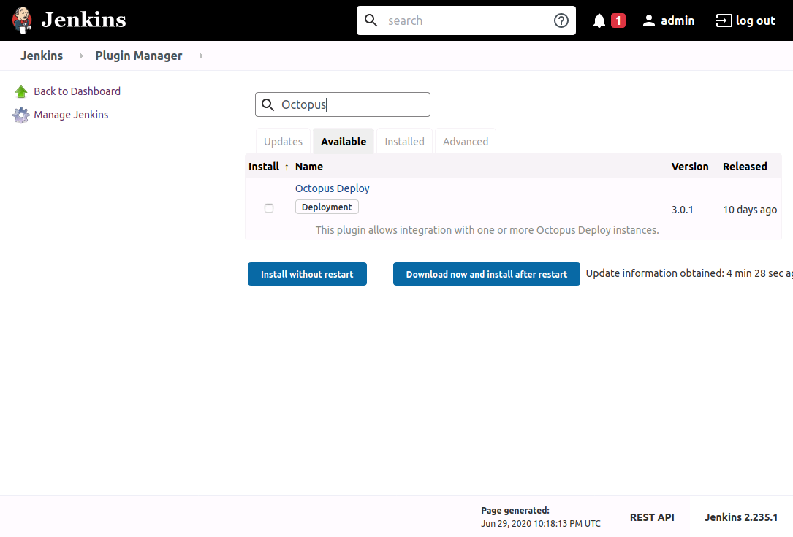
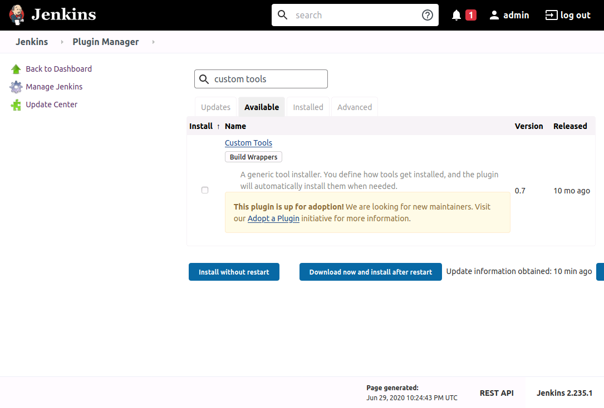
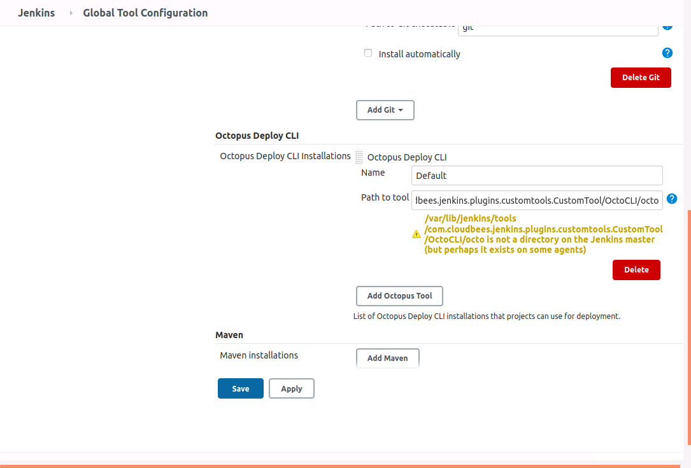
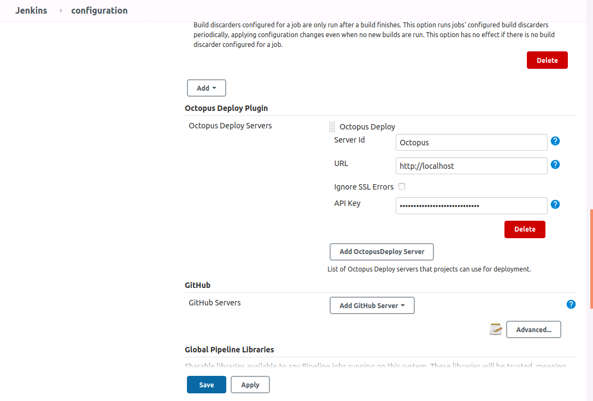
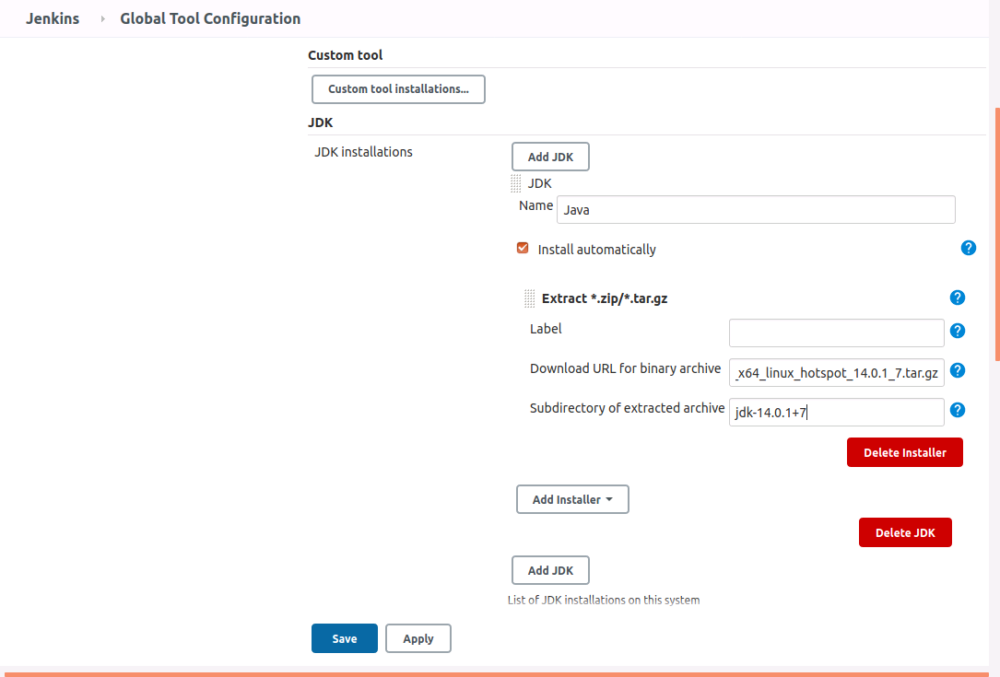

A recent update to the Octopus Jenkins plugin has added support for pipelines, allowing packages to be created, pushed to Octopus, releases to be created and deployed, and metadata like commit messages to be associated with packages.

In this post we'll run through the process of creating a simple Jenkins pipeline to deploy a sample Java application.

## Installing and configuring the plugin

The Octopus plugin is available through the Jenkins Plugin Manager:

This plugin works by calling the Octopus CLI. This can be installed separately, but for this example we'll have Jenkins download and install the CLI through the Custom Tools plugin:

Once the Octopus and Custom Tools plugins have been installed, open the Jenkins **Global Tools Configuration** page and click the **Add Custom tool** button. Give the new tool a name of **OctoCLI**, and supply the [Octo CLI download path](https://octopus.com/downloads/octopuscli#linux) for the **Download URL for binary archive** field, which will be a URL like https://download.octopusdeploy.com/octopus-tools/7.4.0/OctopusTools.7.4.0.linux-x64.tar.gz (visit the [download page](https://octopus.com/downloads/octopuscli#linux) for the latest version):

When we reference a custom tool in a pipeline, Jenkins will download, extract and copy the archive contents ot the tool to a directory like `/var/lib/jenkins/tools/com.cloudbees.jenkins.plugins.customtools.CustomTool` (`/var/lib/jenkins` may change from agent to agent depending on the Jenkins home directory). In this example, Jenkins will extract the Octopus CLI executable to `/var/lib/jenkins/tools/com.cloudbees.jenkins.plugins.customtools.CustomTool/OctoCLI/octo`.

Knowing this path in advance we can define the Octopus CLI tool in Jenkins. Under the **Octopus Deploy CLI** section, set the path of the **Default** tool to `/var/lib/jenkins/tools/com.cloudbees.jenkins.plugins.customtools.CustomTool/OctoCLI/octo`. The warning can be ignored, as this path will be available once we run our pipeline referencing the custom tool defined previously:

To connect to the Octopus server we need to create an API key:

The Octopus URL and API key is then configured in the Jenkins **Configure System** screen:

We have now configured the required settings to support the Octopus plugin. However the sample Java application we will build requires two additional tools: Maven and a JDK. These are configured back in the Jenkins **Global Tools Configuration** page.

In days gone past the easiest way to obtain a JDK was to download it from Oracle. These days though the licensing has changed, meaning most developers will work with an OpenJDK build. A number of companies provide OpenJDK builds, and for this example we'll use the one provided by [AdoptOpenJDK](https://adoptopenjdk.net).

We'll configure a JDK tool called **Java** downloading the archive from https://github.com/AdoptOpenJDK/openjdk14-binaries/releases/download/jdk-14.0.1%2B7/OpenJDK14U-jdk_x64_linux_hotspot_14.0.1_7.tar.gz and extracting the subdirectory **jdk-14.0.1+7** (which is just how AdoptOpenJDK packages formats paths in the archive):

A new Maven tool called **Maven 3** is then created, downloading the latest release:

With those settings in place, we are ready to create our first pipeline.