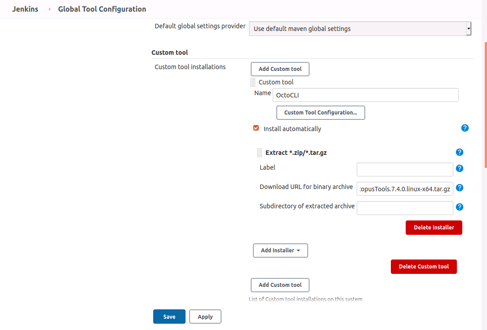
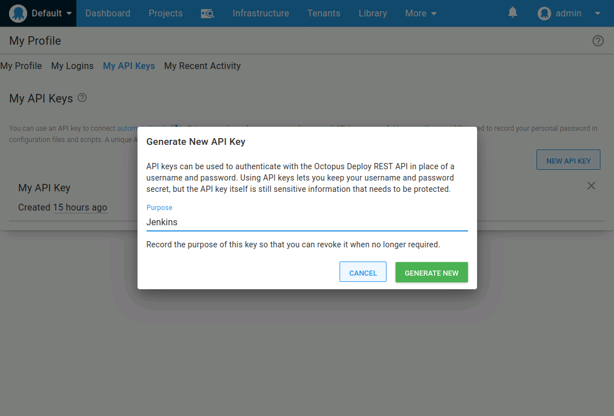
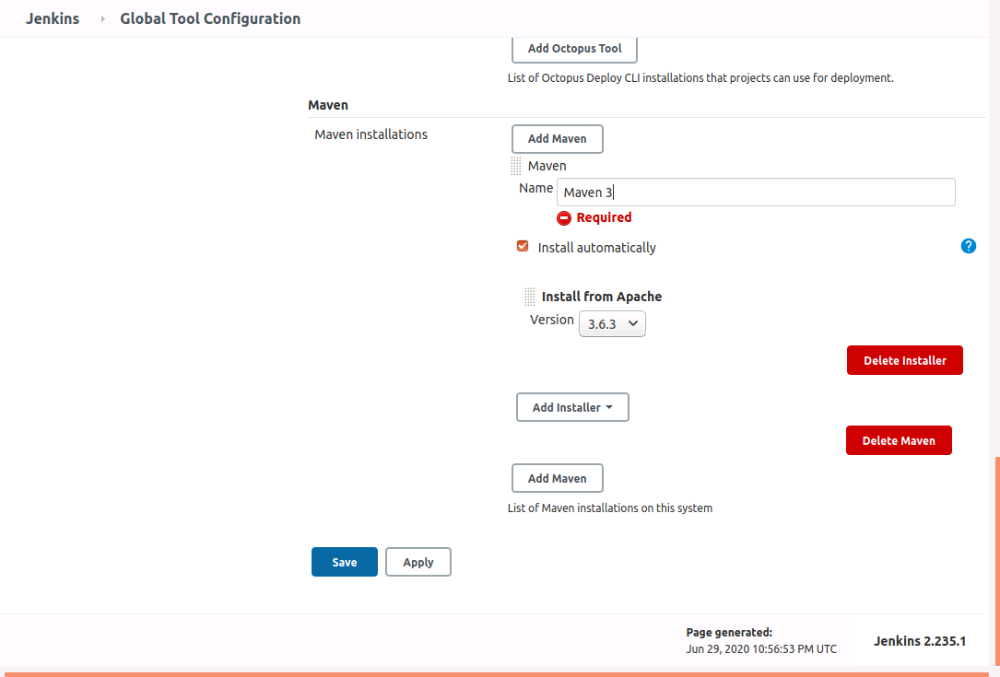
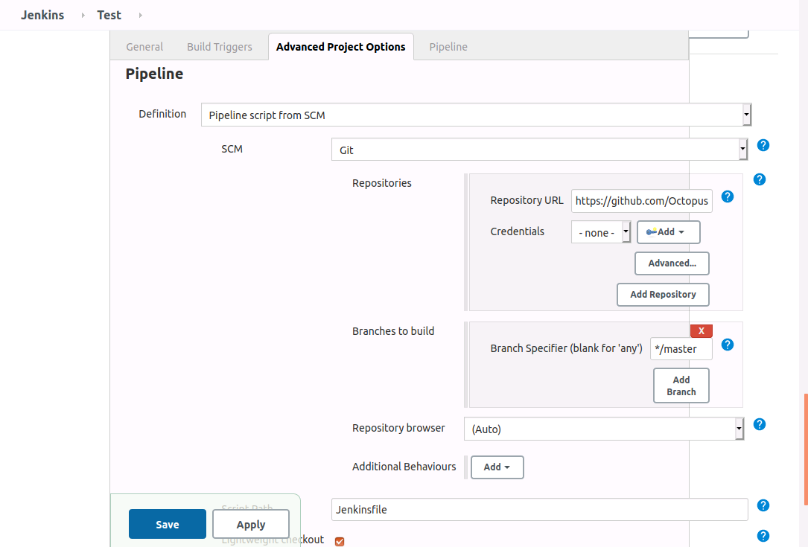
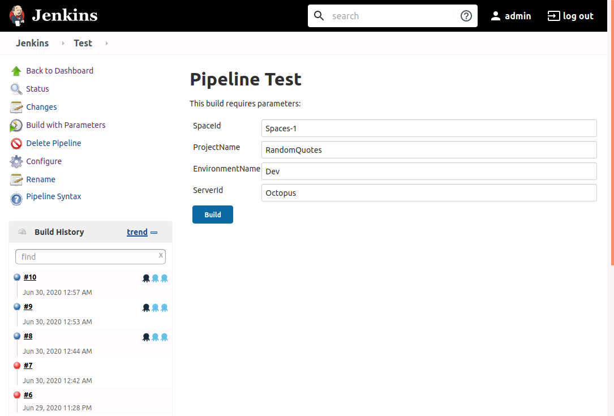
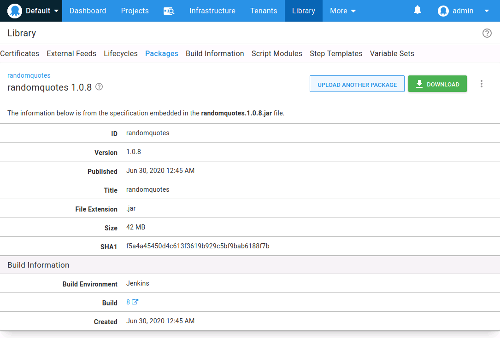
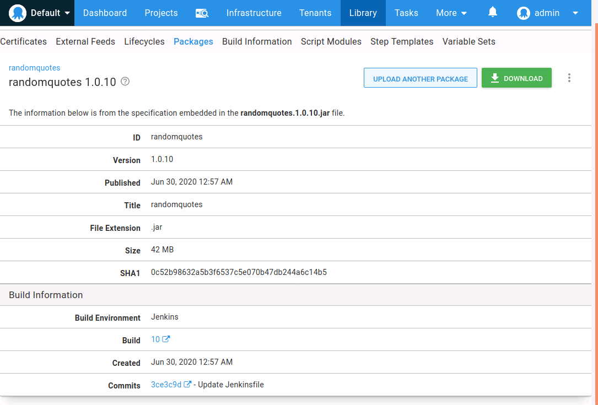
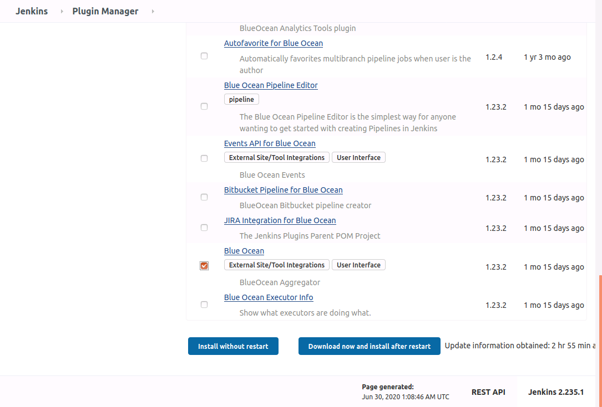
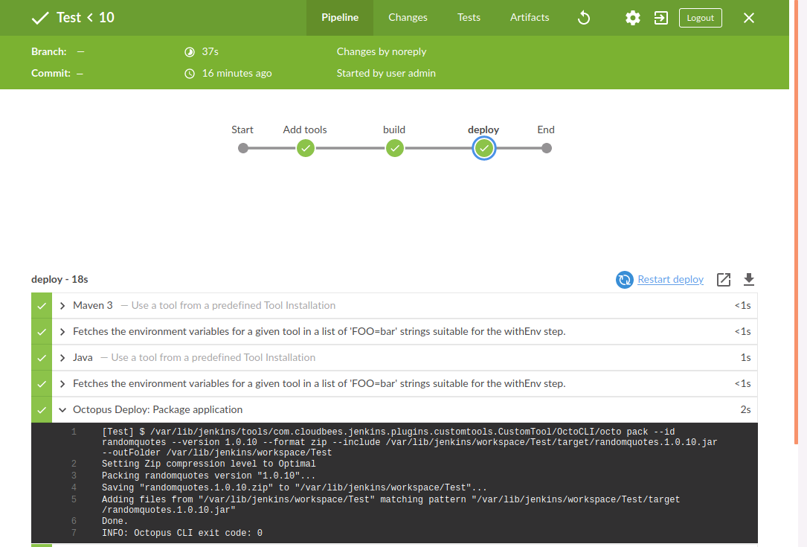

A recent update to the Octopus Jenkins plugin has added support for pipelines, allowing packages to be created and pushed to Octopus, releases to be created and deployed, and metadata like commit messages to be associated with packages.

In this post, we’ll run through the process of creating a simple Jenkins pipeline to deploy a sample Java application.

## Install and configure the plugin

The Octopus plugin is available through the Jenkins Plugin Manager:


This plugin works by calling the Octopus CLI. The CLI can be installed separately, but for this example, we’ll have Jenkins download and install the CLI through the Custom Tools plugin:


After the Octopus and Custom Tools plugins have been installed, open the Jenkins **Global Tools Configuration** page and click the **Add Custom tool** button.

Give the new tool a name of **OctoCLI**, and supply the [Octopus CLI download path](https://octopus.com/downloads/octopuscli#linux) for the **Download URL for binary archive** field, which will be a URL like https://download.octopusdeploy.com/octopus-tools/7.4.0/OctopusTools.7.4.0.linux-x64.tar.gz (visit the [download page](https://octopus.com/downloads/octopuscli#linux) for the latest version):



When we reference a custom tool in a pipeline, Jenkins will download, extract, and copy the archive contents to the tool to a directory like `/var/lib/jenkins/tools/com.cloudbees.jenkins.plugins.customtools.CustomTool` (`/var/lib/jenkins` may change from agent to agent depending on the Jenkins home directory). In this example, Jenkins will extract the Octopus CLI executable to `/var/lib/jenkins/tools/com.cloudbees.jenkins.plugins.customtools.CustomTool/OctoCLI/octo`.

Knowing this path in advance, we can define the Octopus CLI tool in Jenkins. Under the **Octopus Deploy CLI** section, set the path of the **Default** tool to `/var/lib/jenkins/tools/com.cloudbees.jenkins.plugins.customtools.CustomTool/OctoCLI/octo`. The warning can be ignored, as this path will be available when we run our pipeline referencing the custom tool defined previously:


To connect to the Octopus Server we need to create an API key:



The Octopus URL and API key are then configured in the Jenkins **Configure System** screen:


We have now configured the required settings to support the Octopus plugin. However, the sample Java application we will build requires two additional tools: Maven and a JDK. These are configured back in the Jenkins **Global Tools Configuration** page.

In days gone past, the easiest way to obtain a JDK was to download it from Oracle. These days though, the licensing has changed, meaning most developers will work with an OpenJDK build. A number of companies provide OpenJDK builds, and for this example, we’ll use the one provided by [AdoptOpenJDK](https://adoptopenjdk.net).

We’ll configure a JDK tool called **Java** and download the archive from https://github.com/AdoptOpenJDK/openjdk14-binaries/releases/download/jdk-14.0.1%2B7/OpenJDK14U-jdk_x64_linux_hotspot_14.0.1_7.tar.gz. Extract the subdirectory **jdk-14.0.1+7** (which is just how AdoptOpenJDK packages paths in the archive):


A new Maven tool called **Maven 3** is then created, which downloads the latest release:



With those settings in place, we are ready to create our first pipeline.

## An example pipeline

Jenkins has two types of pipelines: [scripted](https://www.jenkins.io/doc/book/pipeline/syntax/#scripted-pipeline) and [declarative](https://www.jenkins.io/doc/book/pipeline/syntax/#declarative-pipeline). Declarative pipelines are typically recommended, and this is the format we’ll use for our example pipeline.

We’ll build a sample application called Random Quotes, which can be found on [GitHub](https://github.com/OctopusSamples/RandomQuotes-Java). The pipeline is defined in a file called [Jenkinsfile](https://github.com/OctopusSamples/RandomQuotes-Java/blob/master/Jenkinsfile). A copy of the Jenkinsfile is shown below:

```groovy
pipeline {
    //  parameters here provide the shared values used with each of the Octopus pipeline steps.
    parameters {
        // The space ID that we will be working with. The default space is typically Spaces-1.
        string(defaultValue: 'Spaces-1', description: '', name: 'SpaceId', trim: true)
        // The Octopus project we will be deploying.
        string(defaultValue: 'RandomQuotes', description: '', name: 'ProjectName', trim: true)
        // The environment we will be deploying to.
        string(defaultValue: 'Dev', description: '', name: 'EnvironmentName', trim: true)
        // The name of the Octopus instance in Jenkins that we will be working with. This is set in:
        // Manage Jenkins -> Configure System -> Octopus Deploy Plugin
        string(defaultValue: 'Octopus', description: '', name: 'ServerId', trim: true)
    }
    /*
        These are the tools we need for this pipeline. They are defined in Manage Jenkins -> Global Tools Configuration.
    */
    tools {
        maven 'Maven 3'
        jdk 'Java'
    }
    agent any
    stages {
        /*
            The OctoCLI tool has been defined with the Custom Tools plugin: https://plugins.jenkins.io/custom-tools-plugin/
            This is a convenient way to have a tool placed on an agent, especially when using the Jenkins Docker image.
            This plugin will extract a .tar.gz file (for example https://download.octopusdeploy.com/octopus-tools/7.3.7/OctopusTools.7.3.7.linux-x64.tar.gz)
            to a directory like /var/jenkins_home/tools/com.cloudbees.jenkins.plugins.customtools.CustomTool/OctoCLI/Octo.
            This directory is then specified as the default location of the Octo CLI in Jenkins under
            Manage Jenkins -> Global Tools Configuration -> Octopus Deploy CLI.
        */
        stage ('Add tools') {
            steps {
                sh "echo \"OctoCLI: ${tool('OctoCLI')}\""
            }
        }
        stage('build') {
            steps {
                // Update the Maven project version to match the current build
                sh(script: "mvn versions:set -DnewVersion=1.0.${BUILD_NUMBER}", returnStdout: true)
                // Package the code
                sh(script: "mvn package", returnStdout: true)
            }
        }
        stage('deploy') {
            steps {                
                octopusPack additionalArgs: '', includePaths: "${env.WORKSPACE}/target/randomquotes.1.0.${BUILD_NUMBER}.jar", outputPath: "${env.WORKSPACE}", overwriteExisting: false, packageFormat: 'zip', packageId: 'randomquotes', packageVersion: "1.0.${BUILD_NUMBER}", sourcePath: '', toolId: 'Default', verboseLogging: false
                octopusPushPackage additionalArgs: '', overwriteMode: 'FailIfExists', packagePaths: "${env.WORKSPACE}/target/randomquotes.1.0.${BUILD_NUMBER}.jar", serverId: "${ServerId}", spaceId: "${SpaceId}", toolId: 'Default'
                /*
                    Note that the gitUrl param is passed manually from the environment variable populated when this Jenkinsfile is downloaded from Git.
                    This is from the Jenkins "Global Variable Reference" documentation:
                    SCM-specific variables such as GIT_COMMIT are not automatically defined as environment variables; rather you can use the return value of the checkout step.
                    This means if this pipeline checks out its own code, the checkout method is used to return the details of the commit. For example:
                    stage('Checkout') {
                        steps {
                            script {
                                def checkoutVars = checkout([$class: 'GitSCM', userRemoteConfigs: [[url: 'https://github.com/OctopusSamples/RandomQuotes-Java.git']]])
                                env.GIT_URL = checkoutVars.GIT_URL
                                env.GIT_COMMIT = checkoutVars.GIT_COMMIT
                            }
                            octopusPushBuildInformation additionalArgs: '', commentParser: 'GitHub', overwriteMode: 'FailIfExists', packageId: 'randomquotes', packageVersion: "1.0.${BUILD_NUMBER}", serverId: "${ServerId}", spaceId: "${SpaceId}", toolId: 'Default', verboseLogging: false, gitUrl: "${GIT_URL}", gitCommit: "${GIT_COMMIT}"
                        }
                    }
                */
                octopusPushBuildInformation additionalArgs: '', commentParser: 'GitHub', overwriteMode: 'FailIfExists', packageId: 'randomquotes', packageVersion: "1.0.${BUILD_NUMBER}", serverId: "${ServerId}", spaceId: "${SpaceId}", toolId: 'Default', verboseLogging: false, gitUrl: "${GIT_URL}", gitCommit: "${GIT_COMMIT}"
                octopusCreateRelease additionalArgs: '', cancelOnTimeout: false, channel: '', defaultPackageVersion: '', deployThisRelease: false, deploymentTimeout: '', environment: "${EnvironmentName}", jenkinsUrlLinkback: false, project: "${ProjectName}", releaseNotes: false, releaseNotesFile: '', releaseVersion: "1.0.${BUILD_NUMBER}", serverId: "${ServerId}", spaceId: "${SpaceId}", tenant: '', tenantTag: '', toolId: 'Default', verboseLogging: false, waitForDeployment: false
                octopusDeployRelease cancelOnTimeout: false, deploymentTimeout: '', environment: "${EnvironmentName}", project: "${ProjectName}", releaseVersion: "1.0.${BUILD_NUMBER}", serverId: "${ServerId}", spaceId: "${SpaceId}", tenant: '', tenantTag: '', toolId: 'Default', variables: '', verboseLogging: false, waitForDeployment: true
            }
        }
    }
}
```

Let’s break this file down.

All declarative pipelines start with `pipeline`:

```
pipeline {
```

To make our Jenkinsfile generic, we expose all the Octopus specific variables as parameters. The first time Jenkins executes this pipeline, the default values will be used. Running the pipeline then adds these properties to the Jenkins project, meaning you will be prompted for them via the web UI when manually triggering the build a second time:

```
    //  parameters here provide the shared values used with each of the Octopus pipeline steps.
    parameters {
        // The space ID that we will be working with. The default space is typically Spaces-1.
        string(defaultValue: 'Spaces-1', description: '', name: 'SpaceId', trim: true)
        // The Octopus project we will be deploying.
        string(defaultValue: 'RandomQuotes', description: '', name: 'ProjectName', trim: true)
        // The environment we will be deploying to.
        string(defaultValue: 'Dev', description: '', name: 'EnvironmentName', trim: true)
        // The name of the Octopus instance in Jenkins that we will be working with. This is set in:
        // Manage Jenkins -> Configure System -> Octopus Deploy Plugin
        string(defaultValue: 'Octopus', description: '', name: 'ServerId', trim: true)
    }
```

The Maven and Java tools we configured in the previous section are included in this pipeline through the `tools` section:

```
    tools {
        maven 'Maven 3'
        jdk 'Java'
    }
```

This build will run on any agent, which is indicated with the `agent` setting:

```
    agent any
```

We then define the `stages` that the pipeline will move through:

```
    stages {
```

The first stage echoes the location of the custom tool called **OctoCLI**. Interestingly, the custom tools plugin is not defined in the `tools` section. This [Jenkins issue](https://issues.jenkins-ci.org/browse/JENKINS-30680) has details about this limitation. But by calling `tool('OctoCLI')`, the custom tool is installed as part of the pipeline:

```
        stage ('Add tools') {
            steps {
                sh "echo \"OctoCLI: ${tool('OctoCLI')}\""
            }
        }
```

The build stage calls the Maven CLI, which is now on the `PATH` thanks to the Maven tool referenced previously, to set the version of the project and package it up:

```
        stage('build') {
            steps {
                // Update the Maven project version to match the current build
                sh(script: "mvn versions:set -DnewVersion=1.0.${BUILD_NUMBER}", returnStdout: true)
                // Package the code
                sh(script: "mvn package", returnStdout: true)
            }
        }
```

The final stage is where the package is deployed with Octopus:

```
        stage('deploy') {
            steps {
```

We start by packing up the JAR file into a ZIP file. We won’t use the resulting ZIP file as Java deployments typically use JAR or WAR files directly, and nesting these files in a second ZIP archive is redundant. But the step is included here as an example of using the `octopusPack` step:

```
                octopusPack additionalArgs: '', includePaths: "${env.WORKSPACE}/target/randomquotes.1.0.${BUILD_NUMBER}.jar", outputPath: "${env.WORKSPACE}", overwriteExisting: false, packageFormat: 'zip', packageId: 'randomquotes', packageVersion: "1.0.${BUILD_NUMBER}", sourcePath: '', toolId: 'Default', verboseLogging: false
```

The `octopusPushPackage` step pushes the JAR file to the Octopus built-in feed. Note how we have referenced the parameters defined earlier as `${ServerId}` and `${SpaceId}`:

```
                octopusPushPackage additionalArgs: '', overwriteMode: 'FailIfExists', packagePaths: "${env.WORKSPACE}/target/randomquotes.1.0.${BUILD_NUMBER}.jar", serverId: "${ServerId}", spaceId: "${SpaceId}", toolId: 'Default'
```

In addition to the application package, we will also push a metadata package using the `octopusPushBuildInformation` step, which includes GIT commit messages and links. We’ll see this information displayed in Octopus later in the post:

```
                octopusPushBuildInformation additionalArgs: '', commentParser: 'GitHub', overwriteMode: 'FailIfExists', packageId: 'randomquotes', packageVersion: "1.0.${BUILD_NUMBER}", serverId: "${ServerId}", spaceId: "${SpaceId}", toolId: 'Default', verboseLogging: false, gitUrl: "${GIT_URL}", gitCommit: "${GIT_COMMIT}"
```

:::hint
One thing to note here is that the `GIT_URL` and `GIT_COMMIT` environment variables are only available if Jenkins is pulling the project containing the Jenkinsfile from GIT. If a pipeline is entered directly into a Jenkins project, you are responsible for checking out the code from GIT with the `checkout` step and creating the `GIT_URL` and `GIT_COMMIT` environment variables from the properties in the returned object:

```
                script {
                    def checkoutVars = checkout([$class: 'GitSCM', userRemoteConfigs: [[url: 'https://github.com/OctopusSamples/RandomQuotes-Java.git']]])
                    env.GIT_URL = checkoutVars.GIT_URL
                    env.GIT_COMMIT = checkoutVars.GIT_COMMIT
                }
```
:::

A release is created in Octopus with the `octopusCreateRelease` step. Again we have referenced parameters like `${EnvironmentName}`, `${ProjectName}`, `${ServerId}`, and `${SpaceId}`:

```
                octopusCreateRelease additionalArgs: '', cancelOnTimeout: false, channel: '', defaultPackageVersion: '', deployThisRelease: true, deploymentTimeout: '', environment: "${EnvironmentName}", jenkinsUrlLinkback: false, project: "${ProjectName}", releaseNotes: false, releaseNotesFile: '', releaseVersion: "1.0.${BUILD_NUMBER}", serverId: "${ServerId}", spaceId: "${SpaceId}", tenant: '', tenantTag: '', toolId: 'Default', verboseLogging: false, waitForDeployment: false
```

Finally, we deploy the release with the `octopusDeployRelease` step:

```
                octopusDeployRelease cancelOnTimeout: false, deploymentTimeout: '', environment: "${EnvironmentName}", project: "${ProjectName}", releaseVersion: "1.0.${BUILD_NUMBER}", serverId: "${ServerId}", spaceId: "${SpaceId}", tenant: '', tenantTag: '', toolId: 'Default', variables: '', verboseLogging: false, waitForDeployment: true
            }
        }
    }
}
```

## Create the Jenkins project

Building a pipeline sourced from a GIT repository is quite easy in Jenkins. Create a new **Pipeline** project, select the option **Pipeline script from SCM**, and set the **Repository URL** to https://github.com/OctopusSamples/RandomQuotes-Java.git:



You can then trigger a build. Note the first time the build is run, you will not be prompted for any parameters. The parameters are added to the project by the pipeline, and so the pipeline needs to be run once first. After the first, run you will have an option to **Build with Parameters**, and a prompt is displayed for the pipeline parameters:



## Viewing the build information

The pipeline above pushed two packages to Octopus. The first was the JAR file created by Maven. The second, pushed with the call to `octopusPushBuildInformation`, created and pushed a build information package. This package contains metadata about a package, including a link back to the Jenkins build and GIT commit information.

If we look at the JAR package that was pushed to the built-in feed, we see that it has a **Build Information** section noting that the package was built by Jenkins and a link back to the Jenkins build:



Note though, there was no information about the GIT commits. You will only see information about the commits made between builds, and because nothing changed in the GIT repository between the Jenkins builds, no commits have been documented. To demonstrate the commit history being packaged with the metadata we’ll make a commit and rebuild the project in Jenkins. Now the build information contains links to commits made between Jenkins builds:



You can find more information on build information in [our documentation](https://octopus.com/docs/packaging-applications/build-servers#viewing-build-information).

## Pipelines in Blue Ocean

[Blue Ocean](https://www.jenkins.io/projects/blueocean/) is a re-imagining of the Jenkins build experience. It is installed as a plugin:



The Blue Ocean interface visualizes pipelines through an intuitive and interactive user interface. While the old freestyle Jenkins projects can be viewed in Blue Ocean, the experience has been heavily optimized for pipelines:



## Conclusion

Jenkins pipelines are a powerful tool to create and share repeatable application builds. They are useful in their own right, and when combined with Jenkins plugins like [Blue Ocean](https://www.jenkins.io/projects/blueocean/), provide the foundation of a modern build experience. With the new functionality in the Octopus Jenkins plugin, deployments can be managed from Jenkins pipelines with the same combination of steps that were available in freestyle projects.

If you are looking for a way to quickly test Jenkins and Octopus, check out [Project TestDrive](https://octopus.com/testdrive?utm_campaign=nav&utm_content=resources-testdrive), which provides a number of virtual machines through Vagrant with Jenkins and Octopus pre-installed.
