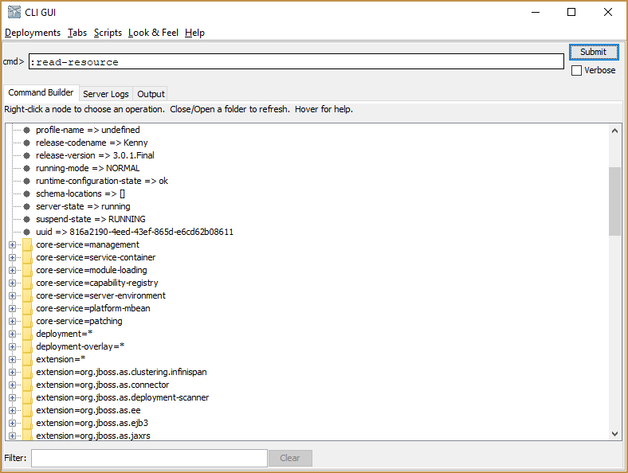

The WildFly CLI is a powerful administration tool that exposes both an interactive console and scripting capabilities. The CLI can be used to query and configure all aspects of the WildFly application server, and in this post, I take a high level look at how to use the CLI.

## Logging in

Download WildFly 11, extract it, and run `bin/standalone.sh` or `bin\standalone.bat`. This will start WildFly with the default configuration, which is to bind the management interface to localhost on port 9990.

In another console run `bin/jboss-cli.sh` or `bin\jboss-cli.bat` with the `--connect` argument. You will be logged into the CLI:

```
$ ./jboss-cli.sh --connect
WARNING: An illegal reflective access operation has occurred
WARNING: Illegal reflective access by org.wildfly.security.manager.GetAccessibleDeclaredFieldAction (jar:file:/Users/matthewcasperson/Downloads/wildfly-11.0.0.Final/modules/system/layers/base/org/wildfly/security/elytron-private/main/wildfly-elytron-1.1.6.Final.jar!/) to field java.security.AccessControlContext.context
WARNING: Please consider reporting this to the maintainers of org.wildfly.security.manager.GetAccessibleDeclaredFieldAction
WARNING: Use --illegal-access=warn to enable warnings of further illegal reflective access operations
WARNING: All illegal access operations will be denied in a future release
[standalone@localhost:9990 /]
```

From the example output above, we can see three important things have happened.

First, Java 9 has reported some *Illegal reflective access* warnings. This sounds dire, but it's because of some intentional changes introduced with the Java 9 module system (known as [Jigsaw](http://www.baeldung.com/project-jigsaw-java-modularity)). I expect that over time these warnings will be resolved, but for now they can be ignored.

Second, we have connected to the default host (localhost) and port (9990) using the default protocol (remote+http). These could be specified manually with the `--controller` option:

```
./jboss-cli.sh --connect --controller=remote+http://localhost:9990
```

:::hint
The CLI accepts a number of different protocols. By default, `remote+http` or `http-remoting` can be used. If the management interface is protected with SSL, then the protocols `remote+https` or `https-remoting` can be used.

Older versions of WildFly exposed a native management port on `9999` by default, which required the protocol `remoting`. WildFly 11 does not expose the native management port by default.
:::

Third, we managed to log in without supplying any credentials. This is courtesy of a feature called [silent authentication](https://access.redhat.com/documentation/en-us/red_hat_jboss_enterprise_application_platform/7.0/html-single/how_to_configure_server_security/#silent_authentication).

Silent authentication relies on access to the `standalone/tmp/auth` or `domain/tmp/auth` directory. The idea is that if a user has access to this directory, they probably have access to create new users, and so silent authentication gives you access.

If you deny write access to the `auth` directory, silent authentication will fail, and you will be prompted for credentials.

:::hint
See [Configuring Admin Users](https://octopus.com/blog/installing-wildfly-from-scratch#configuring-admin-users) for details on creating an admin user that can be used to log into the CLI.
:::

## Looking around

The CLI is structured like a file system, and can be navigated with the same commands you would use in a shell like Bash.

The `ls` command will list the contents of the current directory:

```
[standalone@localhost:9990 /] ls
core-service                               subsystem                                  namespaces=[]                              release-version=3.0.8.Final                
deployment                                 system-property                            organization=undefined                     running-mode=NORMAL                        
deployment-overlay                         launch-type=STANDALONE                     process-type=Server                        runtime-configuration-state=ok             
extension                                  management-major-version=5                 product-name=WildFly Full                  schema-locations=[]                        
interface                                  management-micro-version=0                 product-version=11.0.0.Final               server-state=running                       
path                                       management-minor-version=0                 profile-name=undefined                     suspend-state=RUNNING                      
socket-binding-group                       name=matthews-mbp                          release-codename=Kenny                     uuid=ca421018-3df9-43e1-8b3f-ff843ebd38ee  
```

The `pwd` command shows the current working directory:

```
[standalone@localhost:9990 /] pwd
/
```

The `cd` command will change the current directory. Often the directory will be a category like `subsystem` and an instance like `undertow` with an equals character in between:

```
[standalone@localhost:9990 /] cd subsystem=undertow
[standalone@localhost:9990 subsystem=undertow] ls
application-security-domain        server                             default-server=default-server      instance-id=${jboss.node.name}     
buffer-cache                       servlet-container                  default-servlet-container=default  statistics-enabled=false           
configuration                      default-security-domain=other      default-virtual-host=default-host  
```

The `help` command shows a list of the available commands:

```
[standalone@localhost:9990 subsystem=undertow] help
Usage:

  jboss-cli.sh/jboss-cli.bat [--help] [--version]
                     [--bind=client_bind_address]
                     [--controller=(controller_alias | [protocol://][host][:port])]
                     [--connect] [--file=file_path]
                     [--commands=command_or_operation(,command_or_operation)*]
                     [--command=command_or_operation]
                     [--user=username --password=password]
                     [--properties=file_path]
                     [--no-local-auth]
                     [--error-on-interact]
                     [--timeout=timeout]
                     [--echo-command]
                     [--command-timeout=timeout]

 --help (-h)     - prints (this) basic description of the command line utility.
 ...
```

The `quit` command will exit the CLI.

## Tab completion

These commands also have a number of options. The easiest way to see these options is to use tab complete. Here I typed `ls ` (the space on the end is important) and pressed tab to see what additional options are available:

```
[standalone@localhost:9990 subsystem=undertow] ls
--headers                    --resolve-expressions        application-security-domain  configuration                servlet-container            
--help                       -l                           buffer-cache                 server             
```

## Performing operations

In any given directory there are a number of operations that can be performed. Operations start with the `:` character. Using tab completion we can see the list of available operations:

```
[standalone@localhost:9990 http-listener=default] :
add                         map-clear                   read-attribute              read-children-types         remove                      
list-add                    map-get                     read-attribute-group        read-operation-description  reset-statistics            
list-clear                  map-put                     read-attribute-group-names  read-operation-names        undefine-attribute          
list-get                    map-remove                  read-children-names         read-resource               whoami                      
list-remove                 query                       read-children-resources     read-resource-description   write-attribute   
```

The `:read-operation-names` operation shows the same list as the tab completion:

```
[standalone@localhost:9990 http-listener=default] :read-operation-names
{
    "outcome" => "success",
    "result" => [
        "add",
        "list-add",
        "list-clear",
        "list-get",
        "list-remove",
        "map-clear",
        "map-get",
        "map-put",
        "map-remove",
        "query",
        "read-attribute",
        "read-attribute-group",
        "read-attribute-group-names",
        "read-children-names",
        "read-children-resources",
        "read-children-types",
        "read-operation-description",
        "read-operation-names",
        "read-resource",
        "read-resource-description",
        "remove",
        "reset-statistics",
        "undefine-attribute",
        "whoami",
        "write-attribute"
    ]
}
```

:::hint
Operations can be performed in the current directory (as we have done in the example above), or on a specific directory with a command like `/:read-operation-names` or `/subsystem=undertow:read-operation-names`.
:::

The `:read-resource` operation is a common way to list the details of the current directory.

:::hint
WildFly represents objects using the [Dynamic Model Representation (DMR)](http://ksoong.org/jboss/2015/04/01/jboss-dmr/) format.
:::

```
[standalone@localhost:9990 http-listener=default] :read-resource
{
    "outcome" => "success",
    "result" => {
        "allow-encoded-slash" => false,
        "allow-equals-in-cookie-value" => false,
        "always-set-keep-alive" => true,
        "buffer-pipelined-data" => false,
        "buffer-pool" => "default",
        "certificate-forwarding" => false,
        "decode-url" => true,
        "disallowed-methods" => ["TRACE"],
        "enable-http2" => true,
        "enabled" => true,
        "http2-enable-push" => true,
        "http2-header-table-size" => 4096,
        "http2-initial-window-size" => 65535,
        "http2-max-concurrent-streams" => undefined,
        "http2-max-frame-size" => 16384,
        "http2-max-header-list-size" => undefined,
        "max-buffered-request-size" => 16384,
        "max-connections" => undefined,
        "max-cookies" => 200,
        "max-header-size" => 1048576,
        "max-headers" => 200,
        "max-parameters" => 1000,
        "max-post-size" => 10485760L,
        "no-request-timeout" => 60000,
        "proxy-address-forwarding" => false,
        "read-timeout" => undefined,
        "receive-buffer" => undefined,
        "record-request-start-time" => false,
        "redirect-socket" => "https",
        "request-parse-timeout" => undefined,
        "require-host-http11" => false,
        "resolve-peer-address" => false,
        "rfc6265-cookie-validation" => false,
        "secure" => false,
        "send-buffer" => undefined,
        "socket-binding" => "http",
        "tcp-backlog" => 10000,
        "tcp-keep-alive" => undefined,
        "url-charset" => "UTF-8",
        "worker" => "default",
        "write-timeout" => undefined
    }
}
```

Individual attributes can be read using the `:read-attribute` operation:

```
[standalone@localhost:9990 http-listener=default] :read-attribute(name=enabled)
{
    "outcome" => "success",
    "result" => true
}
```

Attributes can be written with the `:write-attribute` operation:

```
[standalone@localhost:9990 http-listener=default] :write-attribute(name=enabled, value=false)
{"outcome" => "success"}
```

Attributes can be undefined with the `:undefine-attribute` operation:

```
[standalone@localhost:9990 http-listener=default] :undefine-attribute(name=write-timeout)
{"outcome" => "success"}
```

## Special characters

To define a value with a space, wrap the string up in quotes:

```
[standalone@localhost:9990 /] /system-property=test:write-attribute(name=value, value="value with space")
{"outcome" => "success"}
[standalone@localhost:9990 /] /system-property=test:read-attribute(name=value)
{
    "outcome" => "success",
    "result" => "value with space"
}
```

To use quotes, escape them with a backslash:

```
[standalone@localhost:9990 /] /system-property=test:write-attribute(name=value, value="\"quoted value with space\"")
{"outcome" => "success"}
[standalone@localhost:9990 /] /system-property=test:read-attribute(name=value)
{
    "outcome" => "success",
    "result" => "\"quoted value with space\""
}
```

Backslashes are themselves escaped with a backslash:

```
[standalone@localhost:9990 /] /system-property=test:write-attribute(name=value, value="\"quoted value with space and a backslash \\\"")
{"outcome" => "success"}
[standalone@localhost:9990 /] /system-property=test:read-attribute(name=value)
{
    "outcome" => "success",
    "result" => "\"quoted value with space and a backslash \\\""
}
```

## Reloading the server

Changing some settings requires the server to be reloaded. You can check the state of the server by reading the `server-state` attribute in the root directory. In this example, we have some settings that require a reload:

```
[standalone@localhost:9990 /] :read-attribute(name=server-state)
{
    "outcome" => "success",
    "result" => "reload-required",
    "response-headers" => {"process-state" => "reload-required"}
}
```

The `:reload` operation will reload the server:

```
[standalone@localhost:9990 /] :reload
{
    "outcome" => "success",
    "result" => undefined
}
```

## Batching operations

Some operations in WildFly need to be run as an atomic unit, or you may want all commands to succeed or fail as one. The `batch` and `run-batch` commands provide this functionality.

:::hint
When in batch mode, a `#` character will appear in the prompt.
:::

```
[standalone@localhost:9990 /] batch
[standalone@localhost:9990 / #] /subsystem=undertow/server=default-server/http-listener=default:undefine-attribute(name=write-timeout)
[standalone@localhost:9990 / #] /subsystem=undertow/server=default-server/http-listener=default:write-attribute(name=enabled, value=false)
[standalone@localhost:9990 / #] run-batch
The batch executed successfully
```

The `discard-batch` command will discard any batched commands and exit the batch mode:

```
[standalone@localhost:9990 /] batch
[standalone@localhost:9990 / #] /subsystem=undertow/server=default-server/http-listener=default:write-attribute(name=enabled, value=false)
[standalone@localhost:9990 / #] discard-batch
[standalone@localhost:9990 /]
```

The `list-batch` command will show the pending batched commands, and the `clear-batch` command will clear any batched commands but leave you in batched mode:

```
[standalone@localhost:9990 /] batch
[standalone@localhost:9990 / #] /subsystem=undertow/server=default-server/http-listener=default:write-attribute(name=enabled, value=false)
[standalone@localhost:9990 / #] list-batch
#1 /subsystem=undertow/server=default-server/http-listener=default:write-attribute(name=enabled, value=false)
[standalone@localhost:9990 / #] clear-batch
[standalone@localhost:9990 / #] list-batch
The batch is empty.
[standalone@localhost:9990 / #] discard-batch
```

For more information on using batches in WildFly, see [CLI Batch Mode](https://developer.jboss.org/wiki/CLIBatchMode).

## Backing up the configuration

You may wish to backup the current configuration before making any changes. This can as be done with the `:take-snapshot` operation.

The result of this operation tells you where the backup was saved:

```
[standalone@localhost:9990 /] :take-snapshot
{
    "outcome" => "success",
    "result" => "C:\\Users\\matth\\Downloads\\wildfly-11.0.0.Final\\wildfly-11.0.0.Final\\standalone\\configuration\\standalone_xml_history\\snapshot\\20171108-082107378standalone.xml"
}
```

## Running CLI scripts

CLI commands can be added to a script file and run non-interactively.

For example, save this script to a file called `test.cli`:

```
connect
batch
/subsystem=undertow/server=default-server/http-listener=default:undefine-attribute(name=write-timeout)
/subsystem=undertow/server=default-server/http-listener=default:write-attribute(name=enabled, value=false)
run-batch
```

It can then be run using the `--file` command line option:

```
./jboss-cli.sh --file=test.cli
```

:::hint
In this test script, we have connected to the WildFly instance from inside the script with the `connect` command instead of passing the `--connect` command line option.
:::

To disable the `Press any key to continue ...` prompt when you run the `jboss-cli.bat` file in Windows, set the `NOPAUSE` environment variable to `true`:

```
PS C:\Users\matth\Downloads\wildfly-11.0.0.Final\bin> $env:NOPAUSE="true"
PS C:\Users\matth\Downloads\wildfly-11.0.0.Final\bin> .\jboss-cli.bat --connect
[standalone@localhost:9990 /] quit
PS C:\Users\matth\Downloads\wildfly-11.0.0.Final\bin>
```

## Flow control statements

CLI supports flow control statements like if/else and try/catch/finally.

For example, you can add the following code to a CLI script, and it will set the system property `test` to `true` if it has not been defined:

```
if (outcome != success) of /system-property=test:read-resource
    /system-property=test:add(value=true)
end-if
```

You can run the same commands in an interactive mode as well:

```
[standalone@localhost:9990 /] if (outcome != success) of /system-property=test:read-resource
[standalone@localhost:9990 /] /system-property=test:add(value=true)
[standalone@localhost:9990 /] end-if
{"outcome" => "success"}
```

The try/catch/finally flow control works much the same as in Java. The following will attempt to add a data source and will remove and add the data source if there was an exception. Finally, the data source is enabled:

```
try
  /subsystem=datasources/data-source=myds:add(connection-url=xxx,jndi-name=java:/myds,driver-name=h2)
catch
  /subsystem=datasources/data-source=myds:remove
  /subsystem=datasources/data-source=myds:add(connection-url=xxx,jndi-name=java:/myds,driver-name=h2)
finally
  /subsystem=datasources/data-source=myds:enable
end-try
```

## Multiline commands

Commands can be split over multiple lines by ending each line with a `\` character:

```
[standalone@localhost:9990 /] /subsystem=datasources/data-source=myds:add( \
>   connection-url=xxx, \
>   jndi-name=java:/myds, \
>   driver-name=h2)
{"outcome" => "success"}
```

## Running the CLI GUI

The CLI has a GUI mode which provides a file browser like interface for navigating around the WildFly settings directory structure:

```
./jboss-cli.sh --gui
```



## Conclusion

In this post, we took a high level look at how the CLI works and what you can do with it. You can find more resources on the [JBoss Wiki](https://developer.jboss.org/wiki/CommandLineInterface) which goes into more detail and provides examples of administrative tasks.

If you are interested in automating the deployment of your Java applications, try the free started edition of [Octopus Deploy](https://octopus.com/free), and take a look at [our documentation](https://octopus.com/docs/deploying-applications/deploy-java-applications).
